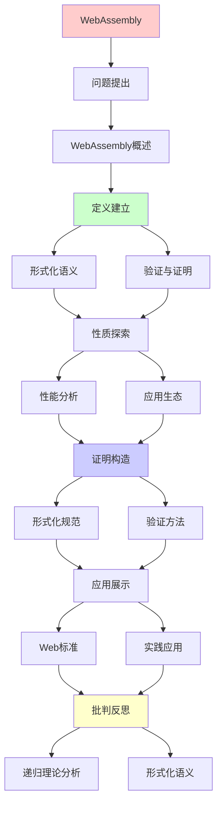
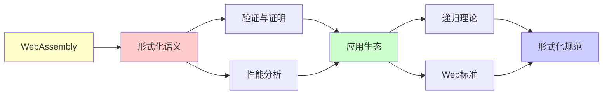

# WebAssembly的形式化语义

> **主题**: Wasm的形式化规范与验证
> **创建日期**: 2025-12-02
> **难度**: ⭐⭐⭐⭐
> **前置知识**: 编译器、虚拟机、形式化语义

---

## 📋 目录

- [WebAssembly的形式化语义](#webassembly的形式化语义)
  - [📋 目录](#-目录)
  - [1. WebAssembly概述](#1-webassembly概述)
    - [1.1 设计目标](#11-设计目标)
    - [1.2 核心特性](#12-核心特性)
  - [2. 形式化语义](#2-形式化语义)
    - [2.1 指令集](#21-指令集)
    - [2.2 类型系统](#22-类型系统)
    - [2.3 操作语义](#23-操作语义)
  - [3. 验证与证明](#3-验证与证明)
    - [3.1 类型安全](#31-类型安全)
    - [3.2 内存安全](#32-内存安全)
  - [4. 性能分析](#4-性能分析)
    - [4.1 vs JavaScript](#41-vs-javascript)
    - [4.2 vs Native](#42-vs-native)
  - [5. 应用生态](#5-应用生态)
    - [5.1 浏览器](#51-浏览器)
    - [5.2 服务端](#52-服务端)
  - [6. 递归理论分析](#6-递归理论分析)
  - [7. 主题-子主题论证逻辑关系图](#7-主题-子主题论证逻辑关系图)
    - [7.1 论证依赖关系](#71-论证依赖关系)
    - [7.2 概念依赖关系](#72-概念依赖关系)
  - [8. 参考资源](#8-参考资源)
    - [8.1 经典论文](#81-经典论文)
    - [8.2 教材](#82-教材)
    - [8.3 在线资源](#83-在线资源)

---

## 1. WebAssembly概述

### 1.1 设计目标

**Wasm动机 (2015)**:

```text
问题:
JavaScript性能瓶颈
动态类型开销
→ 需要更快 ⚠️

目标:
✓ 接近原生速度
✓ 安全沙箱
✓ 语言中立
✓ 可移植
→ 浏览器汇编语言 ⭐

vs asm.js:
asm.js: JS子集 (文本)
Wasm: 二进制格式 ✓
→ 更快加载/执行 ⭐

标准化:
2017: W3C标准 ✓
2019: 所有浏览器支持 ✓
→ Web标准 ⭐⭐⭐⭐⭐
```

---

### 1.2 核心特性

```text
栈机器:
基于栈的虚拟机
简单设计 ✓

结构化控制流:
block, loop, if
→ 非goto ✓
→ 可验证 ⭐

线性内存:
字节数组
load/store访问
边界检查 ✓

表:
函数指针表
间接调用 ✓

递归性质:
✓ 栈递归增长
✓ 函数递归调用
✓ 控制流递归嵌套
```

---

## 2. 形式化语义

### 2.1 指令集

**指令分类**:

```text
算术:
i32.add, f64.mul, ...

控制流:
block, loop, br, br_if, call

内存:
i32.load, i32.store

局部变量:
local.get, local.set

形式化 (PLT Redex):
指令 ::= const | add | block | ...

执行:
配置 → 指令 → 配置'
→ 小步语义 ✓

递归:
✓ 指令递归解释
✓ 块递归嵌套
```

---

### 2.2 类型系统

**栈多态类型**:

```text
类型:
valtype ::= i32 | i64 | f32 | f64

函数类型:
[t1*] → [t2*]
输入类型 → 输出类型

指令类型:
i32.add : [i32 i32] → [i32]
block t* : [t1*] → [t2*]

类型检查:
栈类型推导
线性时间 O(n) ✓

保证:
✓ 类型安全
✓ 栈不溢出/下溢
✓ 控制流正确
→ 静态保证 ⭐⭐⭐⭐⭐

递归理论:
✓ 类型检查可递归 O(n)
✓ Wasm ∈ P ⊂ RE
```

---

### 2.3 操作语义

**执行模型**:

```text
配置:
S = (stack, locals, memory, ...)

小步规则:
S, (i32.const 5) → S', 5
S, (stack: [5, 3]), i32.add → S', 8

块执行:
block t*
  instr*
end
→ 结构化递归 ✓

形式化 (Coq):
Inductive step : config -> config -> Prop :=
  | step_const : ...
  | step_add : ...
  | step_block : ...

证明:
类型保持 (Preservation)
进展 (Progress)
→ 类型安全 ⭐

递归:
✓ 执行递归步进
✓ 块递归进入/退出
```

---

## 3. 验证与证明

### 3.1 类型安全

**定理**: Wasm类型安全

```text
类型保持:
Γ ⊢ S : τ, S →* S'
→ Γ ⊢ S' : τ

进展:
Γ ⊢ S : τ
→ S是值 或 ∃S': S → S'

证明:
Coq机械化 (2017) ✓
Isabelle/HOL (2018) ✓
→ 形式化验证 ⭐⭐⭐⭐⭐

意义:
✓ 数学保证安全
✓ 无未定义行为
✓ 沙箱保证
→ 比JavaScript安全 ⭐

递归理论:
✓ 类型安全递归证明
✓ 归纳基础+归纳步骤
→ 递归论证 ⭐
```

---

### 3.2 内存安全

**边界检查**:

```text
内存访问:
i32.load offset align

检查:
address = base + offset
if address + size > memory.length:
  trap ✗
else:
  load ✓

保证:
✓ 无越界访问
✓ 无缓冲区溢出
✓ 内存隔离
→ 安全沙箱 ⭐

vs Native:
Native: UB (未定义行为) ⚠️
Wasm: Trap (可预测) ✓
→ 更安全 ⭐

递归:
✓ 边界递归检查
✓ 每次访问验证
```

---

## 4. 性能分析

### 4.1 vs JavaScript

```text
基准测试:

计算密集:
Wasm: 1.0×
JS: 2-5× 慢 ⚠️
→ Wasm胜 ⭐

内存操作:
Wasm: 1.0×
JS: 10-20× 慢 ⚠️⚠️
→ Wasm大胜 ⭐⭐⭐

DOM操作:
Wasm: 需要JS桥接 ⚠️
JS: 原生 ✓
→ JS胜

适用场景:
✓ 游戏 (Unity, Unreal)
✓ 图像/视频处理
✓ 科学计算
✓ 加密货币挖矿
→ 计算密集型 ⭐
```

---

### 4.2 vs Native

```text
性能:
Wasm: 1.0×
Native: 0.7-0.9× ⭐
→ 接近原生 ✓

开销来源:
- 边界检查 (~5%)
- 间接调用 (~5%)
- 沙箱 (~10%)
→ 安全代价可接受 ✓

优化:
JIT编译 (TurboFan)
SIMD指令
多线程
→ 持续优化 ⭐

递归:
✓ Wasm可递归执行
✓ JIT递归优化
→ 接近Native性能 ✓
```

---

## 5. 应用生态

### 5.1 浏览器

**Web应用**:

```text
成功案例:
- Figma (设计工具)
- Google Earth (地图)
- AutoCAD Web
- Photoshop Web (2021)
→ 桌面级应用 ⭐⭐⭐⭐⭐

编译目标:
C/C++ → Wasm (Emscripten)
Rust → Wasm ✓
Go → Wasm ✓
AssemblyScript (TS→Wasm)
→ 多语言支持 ⭐

递归:
✓ 多语言递归编译
✓ Wasm递归执行
```

---

### 5.2 服务端

**WASI (2019)**:

```text
WebAssembly System Interface:
Wasm在服务端 ✓

能力:
- 文件系统访问
- 网络
- 环境变量
→ 系统调用接口 ✓

应用:
- Serverless (Fastly, Cloudflare)
- 插件系统 (沙箱)
- 边缘计算
→ 通用可移植二进制 ⭐

vs Docker:
Docker: 容器 (MB级)
Wasm: 模块 (KB级) ✓
→ 轻量级 ⭐

递归:
✓ WASI递归扩展
✓ 能力递归组合
```

---

## 6. 递归理论分析

```text
Wasm ∈ RE?

答案: ✓是的

证明:
- Wasm图灵完备 ✓
- 可递归解释
- 可递归编译
→ Wasm ∈ RE ✓

形式化:
✓ 类型系统可递归检查 O(n)
✓ 执行语义可递归定义
✓ 安全性可递归证明
→ 形式化完备 ⭐⭐⭐⭐⭐

vs JVM/CLR:
JVM: 复杂 (OOP, GC)
Wasm: 简单 (栈机器) ✓
→ Wasm更易形式化 ⭐

递归性质:
✓ 函数递归调用
✓ 块递归嵌套
✓ 栈递归增长
✓ 模块递归导入
→ 多层递归 ⭐

历史地位:
2017: 标准发布
2024: 普及浏览器+服务端
→ Web第四语言 ⭐⭐⭐⭐⭐
(HTML, CSS, JS, Wasm)

理论vs工程:
理论: 形式化规范 ✓
工程: 4个独立实现一致 ✓
→ 规范驱动开发成功 ⭐

未来:
GC提案 (2024+)
异常处理
尾调用优化
→ 持续演化 ⭐

递归范式:
✓ Wasm = 形式化递归虚拟机
✓ 规范 = 递归语义
✓ 验证 = 递归证明
→ 形式化工程的典范 ⭐⭐⭐⭐⭐
```

---

## 7. 主题-子主题论证逻辑关系图

### 7.1 论证依赖关系



### 7.2 概念依赖关系



**论证逻辑链条**：

1. **问题提出** (1节)：
   - WebAssembly概述

2. **定义建立** (2节)：
   - 形式化语义

3. **性质探索** (3-5节)：
   - 验证与证明（3节）
   - 性能分析（4节）
   - 应用生态（5节）

4. **证明构造** (2-3节)：
   - 形式化规范和验证方法

5. **应用展示** (5节)：
   - 应用生态

6. **批判反思** (6节)：
   - 递归理论分析

---

## 8. 参考资源

### 8.1 经典论文

1. **Haas, A., et al.** (2017). "Bringing the Web up to Speed with WebAssembly"
   - _PLDI 2017_. Proceedings of the 38th ACM SIGPLAN Conference on Programming Language Design and Implementation
   - WebAssembly论文 ⭐⭐⭐⭐⭐

2. **Watt, C.** (2018). "Mechanising and Verifying the WebAssembly Specification"
   - _CPP 2018_. Proceedings of the 7th ACM SIGPLAN International Conference on Certified Programs and Proofs
   - WebAssembly形式化验证

3. **Rossberg, A.** (2016). "WebAssembly Core Specification"
   - W3C Working Draft
   - WebAssembly形式化规范 ⭐⭐⭐⭐⭐

### 8.2 教材

1. **Haas, A., et al.** (2017)
   - "Bringing the Web up to Speed with WebAssembly"
   - _PLDI 2017_
   - WebAssembly技术论文

2. **WebAssembly Specification**
   - https://webassembly.github.io/spec/
   - WebAssembly官方规范

### 8.3 在线资源

1. **WebAssembly**
   - https://webassembly.org/
   - WebAssembly官方网站

2. **WebAssembly Specification**
   - https://webassembly.github.io/spec/
   - WebAssembly形式化规范

3. **Wikipedia - WebAssembly**
   - https://en.wikipedia.org/wiki/WebAssembly
   - WebAssembly基本概念

---

**最后更新**: 2025-12-04
**Tier**: 1-2 (理论+工程)
**重要性**: Web标准 ⭐⭐⭐⭐⭐
**形式化**: 完整规范 ✓
**状态**: ✅ 已添加主题-子主题论证逻辑关系图和参考资源章节
