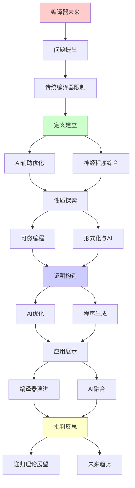
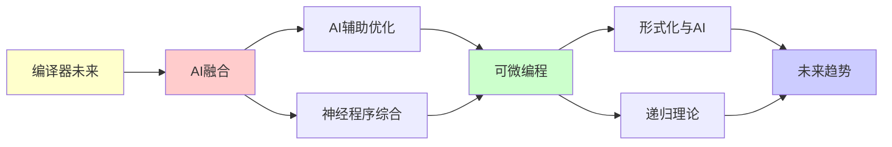

# 编译器的未来与AI融合

> **主题**: AI辅助编译优化与代码生成
> **创建日期**: 2025-12-02
> **难度**: ⭐⭐⭐⭐⭐
> **前置知识**: 编译原理、机器学习、程序综合

---

## 📋 目录

- [编译器的未来与AI融合](#编译器的未来与ai融合)
  - [📋 目录](#-目录)
  - [1. 传统编译器限制](#1-传统编译器限制)
    - [1.1 启发式瓶颈](#11-启发式瓶颈)
    - [1.2 优化空间](#12-优化空间)
  - [2. AI辅助优化](#2-ai辅助优化)
    - [2.1 超参数调优](#21-超参数调优)
    - [2.2 相位排序](#22-相位排序)
  - [3. 神经程序综合](#3-神经程序综合)
    - [3.1 代码生成](#31-代码生成)
    - [3.2 程序修复](#32-程序修复)
  - [4. 可微编程](#4-可微编程)
    - [4.1 可微DSL](#41-可微dsl)
    - [4.2 端到端优化](#42-端到端优化)
  - [5. 形式化与AI](#5-形式化与ai)
    - [5.1 神经定理证明](#51-神经定理证明)
    - [5.2 AI辅助验证](#52-ai辅助验证)
  - [6. 递归理论展望](#6-递归理论展望)
  - [7. 主题-子主题论证逻辑关系图](#7-主题-子主题论证逻辑关系图)
    - [7.1 论证依赖关系](#71-论证依赖关系)
    - [7.2 概念依赖关系](#72-概念依赖关系)
  - [8. 参考资源](#8-参考资源)
    - [8.1 经典论文](#81-经典论文)
    - [8.2 教材](#82-教材)
    - [8.3 在线资源](#83-在线资源)

---

## 1. 传统编译器限制

### 1.1 启发式瓶颈

**优化困境**:

```text
NP-完全问题:
- 指令调度
- 寄存器分配
- 相位排序
→ 启发式必需 ⚠️

启发式:
手工设计规则
→ 次优解 ⚠️

例子:
-O2 vs -O3
不同启发式
性能差异>20% ⚠️
→ 调优困难 ⚠️

递归理论:
✓ 最优解∈NP
✗ 启发式非最优
→ 理论vs实践 ⚠️
```

---

### 1.2 优化空间

**指数搜索空间**:

```text
编译选择:
循环展开: 1,2,4,8,...
内联深度: 0,1,2,3,...
向量化: SSE/AVX/AVX512
→ 组合爆炸 ⚠️⚠️

遍历不可行:
空间: 10²⁰+ 配置
→ 暴力搜索不可行 ✗

当前:
固定配置 (-O1, -O2, -O3)
→ 一刀切 ⚠️

AI机会:
学习最优配置 ⭐⭐⭐⭐⭐
→ 个性化优化 ⭐

递归:
✓ 配置递归搜索
✓ 启发式递归学习
```

---

## 2. AI辅助优化

### 2.1 超参数调优

**自动调优**:

```text
AutoTVM (TVM):
ML预测最优配置
for 循环tile size, 展开因子
→ 自动化 ⭐

方法:
1. 采样配置空间
2. 实际测试性能
3. ML建模 (XGBoost)
4. 预测最优
→ 黑盒优化 ✓

效果:
vs 手工: 1.5-3× 加速 ⭐⭐⭐⭐⭐
→ AI显著提升 ✓

递归:
✓ 配置递归搜索
✓ 模型递归更新
```

---

### 2.2 相位排序

**Pass顺序优化**:

```text
问题:
LLVM 50+ Pass
顺序影响性能 ⚠️
组合: 50! (天文数字)

AI方法:
强化学习
State: 当前IR
Action: 选择Pass
Reward: 性能提升
→ RL优化顺序 ⭐

CompilerGym (Facebook):
OpenAI Gym for 编译器
标准化benchmark
→ RL研究平台 ⭐

效果:
vs 标准-O3: 5-15%提升 ⭐
→ 实用级别 ✓

递归理论:
✓ Pass递归选择
✓ RL递归优化
```

---

## 3. 神经程序综合

### 3.1 代码生成

**Copilot/CodeGen**:

```text
思想:
自然语言 → 代码
大模型 (GPT-4, Codex)
→ 辅助编程 ⭐⭐⭐⭐⭐

能力:
✓ 函数补全
✓ 单测生成
✓ 重构建议
⚠️ 复杂逻辑错误
→ 辅助非替代 ⚠️

限制:
⚠️ 语义理解浅
⚠️ 正确性无保证
✗ Rice定理限制
→ 不可能完美 ✗

递归理论:
✓ 代码生成 ∈ RE
✗ 正确性验证不可判定
→ 需要人类检查 ⚠️
```

---

### 3.2 程序修复

**自动化修复**:

```text
APR (Automated Program Repair):
错误 → 自动patch

方法:
1. 遗传编程
2. 约束求解
3. 神经网络 ⭐

效果:
简单bug: 50%修复率 ⚠️
复杂bug: <10% ⚠️
→ 有限成功 ⚠️

挑战:
⚠️ 语义等价难保证
⚠️ 可能引入新bug
✗ Rice定理根本限制
→ 谨慎使用 ⚠️

递归:
✓ 修复递归尝试
✓ 验证递归测试
```

---

## 4. 可微编程

### 4.1 可微DSL

**JAX/PyTorch**:

```text
思想:
程序可微分
→ 端到端梯度 ⭐

例子:
def f(x, params):
  return neural_net(x, params)

梯度:
∂f/∂params
→ 自动微分 ✓

编译:
XLA (Accelerated Linear Algebra)
JIT编译
融合优化
→ 高性能 ⭐

递归:
✓ 微分递归传播
✓ 编译递归优化
```

---

### 4.2 端到端优化

**神经架构搜索**:

```text
NAS:
搜索最优网络架构
+ 编译器优化
→ 联合优化 ⭐

Halide/TVM:
DSL for 图像/张量
AI学习调度
→ 领域优化 ⭐⭐⭐⭐⭐

递归理论:
✓ NAS可递归搜索
✓ 编译可递归优化
→ 递归联合 ⭐
```

---

## 5. 形式化与AI

### 5.1 神经定理证明

**AI辅助证明**:

```text
DeepMath (Google):
神经网络 + 定理证明
学习策略
→ 辅助Coq ✓

AlphaProof (2024):
IMO金牌水平 ⭐⭐⭐⭐⭐
→ 数学证明AI ✓

vs 传统:
传统: 暴力搜索
AI: 学习启发式 ⭐
→ 指数加速 (某些) ✓

限制:
⚠️ 简单定理可行
⚠️ 复杂证明仍难
→ 辅助工具 ⚠️

递归:
✓ 证明递归搜索
✓ 策略递归学习
```

---

### 5.2 AI辅助验证

**不变量推断**:

```text
Houdini/Daikon:
动态分析 + AI
推断不变量
→ 辅助验证 ✓

LLM辅助:
GPT-4生成不变量
Copilot建议规范
→ 降低门槛 ⭐

但:
⚠️ 正确性无保证
✓ 仍需形式化验证
→ 辅助非替代 ⚠️

递归理论:
✓ 不变量可递归生成
✗ 正确性不可判定
→ Rice定理限制 ✗
```

---

## 6. 递归理论展望

```text
编译器未来 ⊂ RE:

AI融合:
✓ 优化: AI调优 ⭐⭐⭐⭐⭐
✓ 生成: LLM辅助 ⭐⭐⭐
⚠️ 验证: AI辅助 ⚠️
→ 人机协作 ⭐

递归层次:
源码 → IR₁ → ... → 机器码
每步: 递归变换 ✓
AI: 递归优化策略 ⭐
→ 递归²优化 ⭐

2030预测:
✓ AI调优主流
✓ 代码生成普及
✓ 形式化增强
⚠️ 但人类仍关键
→ 增强而非替代 ⭐

理论vs实践:
理论: 编译可递归 ✓
实践: AI提升效率 ⭐
→ 非理论突破

递归范式:
✓ 编译 = 递归优化
✓ AI = 递归学习优化
✓ 融合 = 递归²系统
→ 递归嵌套 ⭐⭐⭐⭐⭐

哲学:
编译器 = 程序变换程序
AI = 学习变换规律
→ 元编程 ⭐

未来:
自我优化编译器
学习最优策略
→ 编译器进化 ⭐⭐⭐⭐⭐
```

---

## 7. 主题-子主题论证逻辑关系图

### 7.1 论证依赖关系



### 7.2 概念依赖关系



**论证逻辑链条**：

1. **问题提出** (1节)：
   - 传统编译器限制

2. **定义建立** (2-3节)：
   - AI辅助优化（2节）
   - 神经程序综合（3节）

3. **性质探索** (4-5节)：
   - 可微编程（4节）
   - 形式化与AI（5节）

4. **证明构造** (贯穿全文)：
   - AI优化和程序生成

5. **应用展示** (贯穿全文)：
   - 编译器演进和AI融合

6. **批判反思** (6节)：
   - 递归理论展望

---

## 8. 参考资源

### 8.1 经典论文

1. **Chen, T., et al.** (2018). "Learning to Optimize Tensor Programs"
   - _NeurIPS 2018_. Advances in Neural Information Processing Systems 31
   - AutoTVM自动优化

2. **Haj-Ali, A., et al.** (2020). "AutoPhase: Compiler Phase-Ordering for HLS with Deep Reinforcement Learning"
   - _FCCM 2020_. 2020 IEEE 28th Annual International Symposium on Field-Programmable Custom Computing Machines
   - 强化学习优化

3. **Chen, M., et al.** (2021). "Evaluating Large Language Models Trained on Code"
   - arXiv:2107.03374
   - Codex代码生成

### 8.2 教材

1. **Aho, A. V., et al.** (2006)
   - _Compilers: Principles, Techniques, and Tools_ (2nd ed.)
   - Pearson. ISBN 978-0321486813
   - 编译器基础

2. **Goodfellow, I., et al.** (2016)
   - _Deep Learning_
   - MIT Press. ISBN 978-0262035613
   - 深度学习基础

### 8.3 在线资源

1. **AI for Compilers**
   - https://www.microsoft.com/en-us/research/project/ai-compiler/
   - 微软AI编译器项目

2. **AutoTVM**
   - https://tvm.apache.org/docs/tutorials/auto_scheduler/index.html
   - AutoTVM自动优化

3. **Codex**
   - https://openai.com/blog/openai-codex
   - OpenAI Codex

---

**最后更新**: 2025-12-04
**Tier**: 2-4 (工程+展望)
**趋势**: AI编译器融合 ⭐⭐⭐⭐⭐
**递归性**: 编译=递归,AI=学习递归 ⭐
**状态**: ✅ 已添加主题-子主题论证逻辑关系图和参考资源章节
