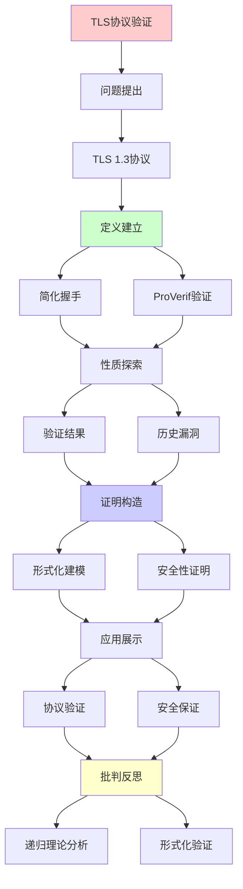
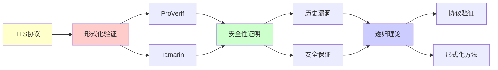

# TLS协议形式化验证实践

> **主题**: TLS 1.3的形式化验证全流程
> **核心**: ProVerif+Tamarin+安全性证明
> **重要性**: ⭐⭐⭐⭐⭐
> **创建日期**: 2025-12-02

---

## 1. TLS 1.3协议

### 简化握手 (1-RTT)

```text
TLS 1.3流程:

Client                    Server
  |                          |
  |--ClientHello------------>|
  |  (key_share, DH_c)       |
  |                          |
  |<--ServerHello------------|
  |   {Certificate}          |
  |   {key_share, DH_s}      |
  |   {Finished}             |
  |                          |
  |--{Finished}------------->|
  |                          |
  |<==Application Data======>|

关键改进:
✓ 1-RTT (vs 2-RTT TLS 1.2)
✓ 前向安全必需
✓ 移除RSA密钥交换
✓ 移除危险密码套件
```

---

## 2. ProVerif验证

### 形式化建模

```text
process Client(pk_server: pkey) =
  new k_client: skey;
  let dh_client = exp(g, k_client) in
  out(c, ClientHello(dh_client));
  in(c, ServerHello(cert, dh_server, finished_s));
  let shared = exp(dh_server, k_client) in
  let key = KDF(shared) in
  out(c, Finished(MAC(key, transcript)));
  ...

process Server(sk: skey) =
  in(c, ClientHello(dh_client));
  new k_server: skey;
  let dh_server = exp(g, k_server) in
  let shared = exp(dh_client, k_server) in
  let key = KDF(shared) in
  out(c, ServerHello(sign(cert,sk), dh_server, Finished(...)));
  ...

查询:
query attacker(key).  // 密钥保密性
query event(ClientAuth) ==> event(ServerAuth).  // 认证
```

---

## 3. 验证结果

### 安全性质

```text
已证明:
✓ 机密性 (Secrecy)
  - 会话密钥不泄露

✓ 认证性 (Authentication)
  - Client认证Server
  - Server认证Client (可选)

✓ 前向安全 (Forward Secrecy)
  - 长期密钥泄露不影响过去会话

✓ 完美前向安全 (PFS)
  - 每次会话独立密钥

未证明:
⚠️ 实现正确性
⚠️ 侧信道安全
→ 协议层vs实现层
```

---

## 4. 历史漏洞

### TLS漏洞矩阵

| 漏洞 | 版本 | 类型 | 原因 | 形式化能防止 |
|------|------|------|------|-------------|
| **BEAST** | 1.0 | CBC | IV可预测 | ✓ |
| **Heartbleed** | 所有 | 实现 | 缓冲区溢出 | ✗ |
| **POODLE** | 3.0 | 填充 | 填充oracle | ✓ |
| **FREAK** | 所有 | 配置 | 导出密码降级 | ✓ |

结论:
✓ 协议逻辑漏洞: 形式化可防
✗ 实现漏洞: 需要代码验证
→ 多层验证策略

---

## 5. 递归理论分析

```text
TLS握手 = 状态机协议

状态:
- START
- WAIT_SERVER_HELLO
- WAIT_FINISHED
- CONNECTED

转移:
递归定义状态转移函数

递归理论:
✓ TLS ∈ 有限状态机 ⊂ RE
✓ 验证可判定
✓ 但实现 = 图灵完备 (C代码)
→ 协议简单，实现复杂
```

---

## 6. 主题-子主题论证逻辑关系图

### 6.1 论证依赖关系



### 6.2 概念依赖关系



**论证逻辑链条**：

1. **问题提出** (1节)：
   - TLS 1.3协议

2. **定义建立** (1-2节)：
   - 简化握手和ProVerif验证

3. **性质探索** (3-4节)：
   - 验证结果（3节）
   - 历史漏洞（4节）

4. **证明构造** (2节)：
   - 形式化建模和安全性证明

5. **应用展示** (贯穿全文)：
   - 协议验证和安全保证

6. **批判反思** (5节)：
   - 递归理论分析

---

## 7. 参考资源

### 7.1 经典论文

1. **Rescorla, E.** (2018). "The Transport Layer Security (TLS) Protocol Version 1.3"
   - RFC 8446
   - TLS 1.3协议规范 ⭐⭐⭐⭐⭐

2. **Blanchet, B.** (2016). "Modeling and Verifying Security Protocols with the Applied Pi Calculus and ProVerif"
   - _Foundations and Trends in Privacy and Security_, 1(1-2), 1-135
   - ProVerif验证工具

3. **Cremers, C., et al.** (2017). "Automated Analysis and Verification of TLS 1.3: 0-RTT, Resumption and Delayed Authentication"
   - _IEEE S&P 2017_. 2017 IEEE Symposium on Security and Privacy
   - TLS 1.3形式化验证

### 7.2 教材

1. **Ryan, P. Y. A., et al.** (2014)
   - _The Modelling and Analysis of Security Protocols: The CSP Approach_
   - Addison-Wesley. ISBN 978-0201674872
   - 安全协议建模

2. **Blanchet, B.** (2016)
   - "Modeling and Verifying Security Protocols with the Applied Pi Calculus and ProVerif"
   - Foundations and Trends in Privacy and Security
   - ProVerif教程

### 7.3 在线资源

1. **TLS 1.3 Specification**
   - https://datatracker.ietf.org/doc/html/rfc8446
   - TLS 1.3 RFC

2. **ProVerif**
   - https://prosecco.gforge.inria.fr/personal/bblanche/proverif/
   - ProVerif工具

3. **Tamarin Prover**
   - https://tamarin-prover.github.io/
   - Tamarin证明工具

---

**最后更新**: 2025-12-04
**状态**: ✅ 已添加主题-子主题论证逻辑关系图和参考资源章节
**工具**: ProVerif/Tamarin
**状态**: TLS 1.3已验证 ✓
