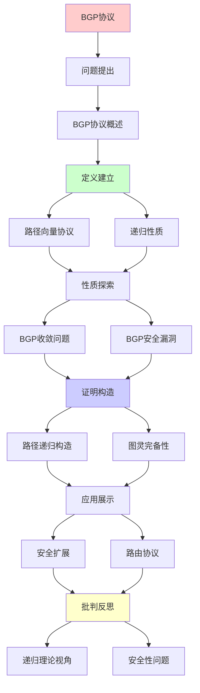
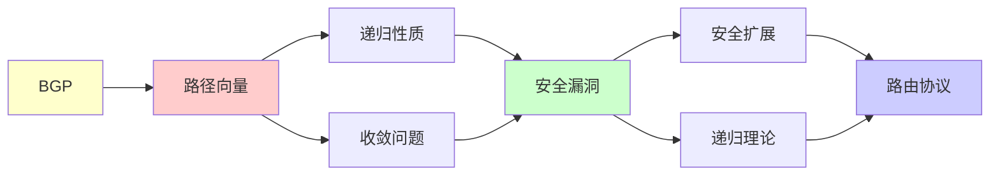

# BGP路由协议递归性分析

> **主题**: BGP的递归路径构造与安全性
> **创建日期**: 2025-12-02
> **难度**: ⭐⭐⭐⭐
> **前置知识**: 网络协议、图论、路由算法

---

## 📋 目录

- [BGP路由协议递归性分析](#bgp路由协议递归性分析)
  - [📋 目录](#-目录)
  - [1. BGP协议概述](#1-bgp协议概述)
    - [1.1 路径向量协议](#11-路径向量协议)
    - [1.2 与距离向量的区别](#12-与距离向量的区别)
  - [2. BGP的递归性质](#2-bgp的递归性质)
    - [2.1 路径递归构造](#21-路径递归构造)
    - [2.2 策略递归应用](#22-策略递归应用)
  - [3. BGP收敛问题](#3-bgp收敛问题)
    - [3.1 收敛不保证](#31-收敛不保证)
    - [3.2 图灵完备性](#32-图灵完备性)
  - [4. BGP安全漏洞](#4-bgp安全漏洞)
    - [4.1 路由劫持](#41-路由劫持)
    - [4.2 历史事件](#42-历史事件)
  - [5. 安全扩展](#5-安全扩展)
    - [5.1 RPKI](#51-rpki)
    - [5.2 BGPsec](#52-bgpsec)
  - [6. 递归理论视角](#6-递归理论视角)
  - [7. 主题-子主题论证逻辑关系图](#7-主题-子主题论证逻辑关系图)
    - [7.1 论证依赖关系](#71-论证依赖关系)
    - [7.2 概念依赖关系](#72-概念依赖关系)
  - [8. 参考资源](#8-参考资源)
    - [8.1 经典论文](#81-经典论文)
    - [8.2 教材](#82-教材)
    - [8.3 在线资源](#83-在线资源)

---

## 1. BGP协议概述

### 1.1 路径向量协议

```text
BGP (Border Gateway Protocol):
互联网AS之间路由

核心: 路径向量
不仅传播距离，还传播完整路径

消息:
AS_x → AS_y: "到达Prefix P的路径为AS_x + Path"

递归性质:
Path(x→dest) = AS_x + Path(neighbor→dest)
→ 递归构造路径 ⭐
```

---

### 1.2 与距离向量的区别

```text
距离向量 (RIP):
D(x,y) = 距离
传播: 距离值
问题: Count-to-infinity ⚠️

路径向量 (BGP):
P(x,y) = 完整路径
传播: 路径
优势: 检测环路 ✓

递归:
距离向量: D = min_v{c(x,v) + D_v}
路径向量: P = AS_x + P_neighbor
→ 都是递归定义
```

---

## 2. BGP的递归性质

### 2.1 路径递归构造

**算法**:

```text
初始化:
Path(self) = []
Path(others) = ∅

接收邻居N的通告:
Path_N(dest) = [N, AS₁, AS₂, ..., dest]

更新:
Path(dest) = best_path({
  self + Path_N1(dest),
  self + Path_N2(dest),
  ...
})

广播:
发送 self + Path(dest) 给所有邻居

递归性质:
✓ Path递归定义
✓ 每AS独立递归计算
```

---

### 2.2 策略递归应用

**BGP策略**:

```text
路由策略:
1. 导入策略 (Import)
   - 接受/拒绝邻居路由
   - 修改属性 (MED, Local-pref)

2. 导出策略 (Export)
   - 选择性广播
   - 社区标签

策略组合:
Policy(Path) = Export ∘ Select ∘ Import
→ 递归应用策略链

图灵完备性:
⚠️ BGP策略可以图灵完备
→ 收敛性不保证 ✗
```

---

## 3. BGP收敛问题

### 3.1 收敛不保证

**反例 (Dispute Wheel)**:

```text
配置可导致振荡:

AS1 → AS2 → AS3 → AS1 (环)
每个AS的策略冲突
→ 路径选择永不稳定

振荡:
t=0: Path_1=[1→dest]
t=1: Path_1=[1→2→dest]
t=2: Path_1=[1→3→2→dest]
t=3: Path_1=[1→dest]  // 回到t=0
→ 循环 ✗

不收敛定理 (Griffin-Wilfong 1999):
某些BGP配置不保证收敛 ✗
```

---

### 3.2 图灵完备性

**定理 (Griffin-Wilfong)**:

```text
BGP策略语言 = 图灵完备

→ 收敛性不可判定 ✗

证明思路:
构造BGP配置模拟图灵机
→ 收敛 ⟺ 停机
→ 不可判定 ✗

实践含义:
✗ 无通用验证算法
✓ 但实践中大多收敛
→ 依赖运维经验 ⚠️
```

---

## 4. BGP安全漏洞

### 4.1 路由劫持

```text
攻击: 恶意AS宣告更优路径

例子:
正常: AS_A → AS_B → Prefix P
攻击: AS_Evil → Prefix P (谎称更短)
结果: 流量被劫持 ⚠️⚠️

历史案例:
- 2008: Pakistan劫持YouTube
- 2018: Amazon Route 53劫持
- 2019: Cloudflare劫持
```

---

### 4.2 历史事件

```text
重大BGP事件:

2008-02: Pakistan vs YouTube
- Pakistan电信劫持YouTube IP
- 全球YouTube不可访问 2小时

2017-08: Google误配置
- 日本ISP泄露内部路由
- 影响日本互联网

2024: 持续威胁
- 路由劫持每月数十起
- 难以根除 ⚠️
```

---

## 5. 安全扩展

### 5.1 RPKI

**资源公钥基础设施**:

```text
RPKI: 证明AS拥有IP前缀

层次:
IANA
 ├─ RIR (区域)
 │   ├─ LIR (本地)
 │   └─ AS持有者

ROA (Route Origin Authorization):
证明: "AS X可宣告Prefix P"

验证:
AS收到BGP宣告 → 检查ROA
Invalid → 拒绝 ✓

部署 (2024):
~50%覆盖
→ 还不够 ⚠️
```

---

### 5.2 BGPsec

**路径验证**:

```text
BGPsec: 验证完整路径

签名链:
AS1 → sign([AS1, dest])
AS2 → sign([AS2, AS1, dest])
AS3 → sign([AS3, AS2, AS1, dest])
→ 递归签名链 ⭐

验证:
验证所有签名 ✓
→ 路径不可伪造

问题:
⚠️ 计算开销大
⚠️ 部署困难
✗ 实践采用率低 (<1%)
```

---

## 6. 递归理论视角

```text
BGP ∈ RE?

答案: ✓是的，但...

BGP策略 = 图灵完备
→ 收敛性 ∉ 可判定

实践:
✓ 大多数配置收敛
✗ 但无通用验证
✓ 依赖保守策略

递归性质:
✓ 路径递归构造
✓ 策略递归应用
✗ 收敛性不保证
→ 递归但可能不终止 ⚠️

vs其他协议:
OSPF: 收敛保证 ✓
BGP: 不保证 ✗
→ 灵活 vs 可验证权衡
```

---

## 7. 主题-子主题论证逻辑关系图

### 7.1 论证依赖关系



### 7.2 概念依赖关系



**论证逻辑链条**：

1. **问题提出** (1节)：
   - BGP协议概述

2. **定义建立** (1.1-1.2, 2节)：
   - 路径向量协议和递归性质

3. **性质探索** (3-4节)：
   - BGP收敛问题（3节）
   - BGP安全漏洞（4节）

4. **证明构造** (2.1-2.2, 3.1-3.2节)：
   - 路径递归构造和图灵完备性

5. **应用展示** (5节)：
   - 安全扩展

6. **批判反思** (6节)：
   - 递归理论视角

---

## 8. 参考资源

### 8.1 经典论文

1. **Griffin, T. G., & Wilfong, G.** (1999). "An Analysis of BGP Convergence Properties"
   - _SIGCOMM 1999_. Proceedings of the Conference on Applications, Technologies, Architectures, and Protocols for Computer Communication
   - BGP收敛性理论

2. **Rekhter, Y., Li, T., & Hares, S.** (2006). "A Border Gateway Protocol 4 (BGP-4)"
   - RFC 4271
   - BGP标准 ⭐⭐⭐⭐⭐

3. **Gao, L., & Rexford, J.** (2001). "Stable Internet Routing Without Global Coordination"
   - _IEEE/ACM Transactions on Networking_, 9(6), 681-692
   - BGP稳定性条件

### 8.2 教材

1. **Kurose, J. F., & Ross, K. W.** (2021)
   - _Computer Networking: A Top-Down Approach_ (8th ed.)
   - Pearson. ISBN 978-0136681557
   - 计算机网络基础

2. **Peterson, L. L., & Davie, B. S.** (2020)
   - _Computer Networks: A Systems Approach_ (6th ed.)
   - Morgan Kaufmann. ISBN 978-0128182000
   - 计算机网络系统方法

### 8.3 在线资源

1. **BGP Protocol**
   - https://en.wikipedia.org/wiki/Border_Gateway_Protocol
   - BGP基本概念

2. **BGP Security**
   - https://www.ietf.org/topics/bgp-security/
   - BGP安全资源

3. **RPKI**
   - https://www.rpki.net/
   - RPKI资源公钥基础设施

---

**最后更新**: 2025-12-04
**Tier**: 2 (工程)
**安全性**: ⚠️⚠️⚠️ (持续威胁)
**收敛性**: 不保证 ✗
**状态**: ✅ 已添加主题-子主题论证逻辑关系图和参考资源章节
