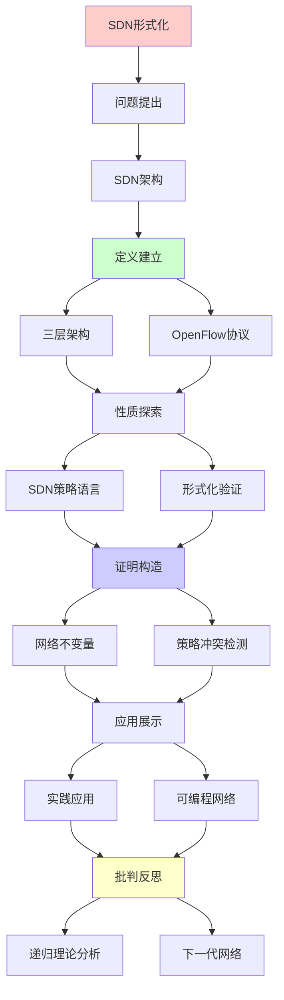
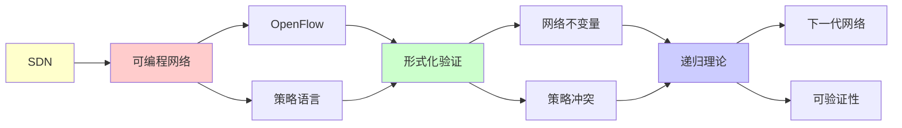

# SDN可编程网络形式化

> **主题**: 软件定义网络的形式化验证
> **创建日期**: 2025-12-02
> **难度**: ⭐⭐⭐⭐
> **前置知识**: 网络协议、SDN架构、形式化方法

---

## 📋 目录

- [SDN可编程网络形式化](#sdn可编程网络形式化)
  - [📋 目录](#-目录)
  - [1. SDN架构](#1-sdn架构)
    - [1.1 三层架构](#11-三层架构)
    - [1.2 OpenFlow协议](#12-openflow协议)
  - [2. SDN策略语言](#2-sdn策略语言)
    - [2.1 Frenetic](#21-frenetic)
    - [2.2 Pyretic](#22-pyretic)
  - [3. 形式化验证](#3-形式化验证)
    - [3.1 网络不变量](#31-网络不变量)
    - [3.2 VeriFlow](#32-veriflow)
    - [3.3 NetKAT](#33-netkat)
  - [4. 策略冲突检测](#4-策略冲突检测)
  - [5. 实践应用](#5-实践应用)
    - [5.1 数据中心网络](#51-数据中心网络)
    - [5.2 5G网络切片](#52-5g网络切片)
  - [6. 递归理论分析](#6-递归理论分析)
  - [7. 主题-子主题论证逻辑关系图](#7-主题-子主题论证逻辑关系图)
    - [7.1 论证依赖关系](#71-论证依赖关系)
    - [7.2 概念依赖关系](#72-概念依赖关系)
  - [8. 参考资源](#8-参考资源)
    - [8.1 经典论文](#81-经典论文)
    - [8.2 教材](#82-教材)
    - [8.3 在线资源](#83-在线资源)

---

## 1. SDN架构

### 1.1 三层架构

```text
SDN三层:

应用层 (Application)
  └─ 流量工程、负载均衡、安全策略

控制层 (Control Plane)
  └─ 控制器 (Controller)
      ├─ 全局视图
      ├─ 策略编译
      └─ 流表下发

数据层 (Data Plane)
  └─ 交换机 (Switch)
      └─ 转发流表

关键: 控制与数据分离 ⭐⭐⭐⭐⭐
```

---

### 1.2 OpenFlow协议

```text
OpenFlow:
控制器 ⇄ 交换机通信协议

流表 (Flow Table):
Match | Action | Priority | Counter
────────────────────────────────────
srcIP=A | forward(p1) | 100 | 1523
dstIP=B | drop | 90 | 42
* | forward(controller) | 0 | 8

匹配规则:
递归匹配 (优先级高→低)
→ 第一个匹配执行 ✓

递归性质:
✓ 流表递归匹配
✓ 策略递归组合
```

---

## 2. SDN策略语言

### 2.1 Frenetic

**高层策略语言**:

```text
Frenetic语法:
Policy ::= Filter | Modify | Sequence | Choice

例子:
(srcIP = 10.0.0.1 → fwd(1))
  | (srcIP = 10.0.0.2 → fwd(2))
  | (drop)

组合子:
- Sequential: p1 >> p2
- Parallel: p1 | p2
- Negation: ~p

编译:
高层策略 → OpenFlow流表
递归编译 ✓
```

---

### 2.2 Pyretic

**Python嵌入式DSL**:

```text
Pyretic策略:
@dynamic
def firewall():
  return (
    (match(srcip='10.0.0.1') >> fwd(1)) |
    (match(srcip='10.0.0.2') >> fwd(2)) |
    drop
  )

动态策略:
@dynamic装饰器
→ 运行时策略更新 ✓

递归定义:
策略可递归组合
→ 模块化网络编程 ⭐
```

---

## 3. 形式化验证

### 3.1 网络不变量

**关键属性**:

```text
可达性 (Reachability):
∀数据包p: 从A可达B

隔离性 (Isolation):
租户1流量 ∩ 租户2流量 = ∅

无环路 (Loop-free):
∀数据包p: 不会永久循环

带宽保证:
∀流f: bandwidth(f) ≥ threshold

形式化:
时序逻辑 (LTL/CTL)
□(A → ◇B)  // 总能从A到B
```

---

### 3.2 VeriFlow

**实时验证**:

```text
VeriFlow (2013):
增量验证系统

工作流:
控制器 → 新流规则
  ↓ 拦截
VeriFlow验证
  ├─ 违反不变量? → 拒绝 ✗
  └─ 安全? → 允许 ✓
  ↓
交换机更新

验证算法:
等价类分组 (Trie结构)
复杂度: O(log n)
→ 毫秒级验证 ✓

递归性质:
✓ 增量验证递归更新
✓ Trie递归查询
```

---

### 3.3 NetKAT

**网络Kleene代数**:

```text
NetKAT (2014):
网络策略的代数理论

语法:
p ::= f=v | p1 + p2 | p1 ; p2 | p* | ...

语义:
集合语义 (数据包变换集合)

等价性:
p ≡ q ⟺ [[p]] = [[q]]

定理:
NetKAT等价性可判定 ✓
复杂度: PSPACE-完全

递归理论:
✓ Kleene闭包 = 递归定义
✓ 网络路径 = 正则语言
→ 递归枚举可计算 ✓
```

---

## 4. 策略冲突检测

**冲突类型**:

```text
1. 遮蔽 (Shadowing):
规则1: srcIP=A → fwd(1) (优先级100)
规则2: srcIP=A → fwd(2) (优先级90)
→ 规则2永不执行 ⚠️

2. 冗余 (Redundancy):
规则1: srcIP=A → fwd(1)
规则2: srcIP=A → fwd(1)
→ 规则2多余

3. 相关性 (Correlation):
规则交叉影响
→ 难以推理 ⚠️

检测算法:
二分决策图 (BDD)
交集测试
复杂度: O(n²) ~ O(2^n)
→ 指数最坏情况 ⚠️

递归理论:
✓ 冲突检测可递归
✗ 但NP完全 (一般情况)
✓ 实践可行 (启发式)
```

---

## 5. 实践应用

### 5.1 数据中心网络

**Google B4**:

```text
B4: Google全球WAN SDN

规模:
- 数百个站点
- Tbps级带宽
- SDN管理 ✓

优势:
✓ 流量工程优化
✓ 链路利用率 >95%
✓ 快速故障切换

vs 传统:
传统: ~30%利用率
SDN: >95% ⭐⭐⭐⭐⭐
→ 3×改进
```

---

### 5.2 5G网络切片

**网络虚拟化**:

```text
5G切片:
物理网络 → 多个虚拟网络

例子:
- 切片1: eMBB (高带宽)
- 切片2: URLLC (低延迟)
- 切片3: mMTC (海量连接)

SDN作用:
✓ 动态资源分配
✓ 隔离保证
✓ QoS保证

形式化验证:
✓ 切片隔离证明
✓ 资源保证验证
→ 关键安全保证 ⭐
```

---

## 6. 递归理论分析

```text
SDN ∈ RE?

答案: ✓是的

证明:
- 流表可递归表示
- 策略可递归编译
- 转发可递归模拟
→ SDN ∈ RE ✓

验证复杂度:
可达性: PSPACE-完全
等价性: PSPACE-完全 (NetKAT)
冲突检测: NP-完全

但:
✓ 实践规模可验证
✓ 增量验证快速 (VeriFlow)
✓ 特殊结构可优化

递归性质:
✓ 策略递归组合
✓ 流表递归匹配
✓ 验证递归分解

vs 传统网络:
传统: 分布式难验证 ✗
SDN: 集中式可验证 ✓
→ 形式化可行性提升 ⭐

开放问题:
? 分布式SDN控制器验证
? 大规模网络实时验证
? 策略更新原子性保证
```

---

## 7. 主题-子主题论证逻辑关系图

### 7.1 论证依赖关系



### 7.2 概念依赖关系



**论证逻辑链条**：

1. **问题提出** (1节)：
   - SDN架构

2. **定义建立** (1.1-1.2节)：
   - 三层架构和OpenFlow协议

3. **性质探索** (2-3节)：
   - SDN策略语言（2节）
   - 形式化验证（3节）

4. **证明构造** (3.1-3.3, 4节)：
   - 网络不变量和策略冲突检测

5. **应用展示** (5节)：
   - 实践应用

6. **批判反思** (6节)：
   - 递归理论分析

---

## 8. 参考资源

### 8.1 经典论文

1. **McKeown, N., et al.** (2008). "OpenFlow: Enabling Innovation in Campus Networks"
   - _ACM SIGCOMM Computer Communication Review_, 38(2), 69-74
   - OpenFlow协议 ⭐⭐⭐⭐⭐

2. **Khurshid, A., et al.** (2013). "VeriFlow: Verifying Network-Wide Invariants in Real Time"
   - _NSDI 2013_. 10th USENIX Symposium on Networked Systems Design and Implementation
   - 实时网络验证

3. **Anderson, C. J., et al.** (2014). "NetKAT: Semantic Foundations for Networks"
   - _POPL 2014_. Proceedings of the 41st ACM SIGPLAN-SIGACT Symposium on Principles of Programming Languages
   - NetKAT理论 ⭐⭐⭐⭐⭐

4. **Foster, N., et al.** (2011). "Frenetic: A Network Programming Language"
   - _ICFP 2011_. Proceedings of the 16th ACM SIGPLAN International Conference on Functional Programming
   - SDN策略语言

### 8.2 教材

1. **Kurose, J. F., & Ross, K. W.** (2021)
   - _Computer Networking: A Top-Down Approach_ (8th ed.)
   - Pearson. ISBN 978-0136681557
   - 计算机网络基础

2. **Kreutz, D., et al.** (2014). "Software-Defined Networking: A Comprehensive Survey"
   - _Proceedings of the IEEE_, 103(1), 14-76
   - SDN综述

### 8.3 在线资源

1. **OpenFlow**
   - https://opennetworking.org/software-defined-networking/
   - OpenFlow标准

2. **NetKAT**
   - https://github.com/NetKAT-Project/netkat
   - NetKAT项目

3. **SDN**
   - https://en.wikipedia.org/wiki/Software-defined_networking
   - SDN基本概念

---

**最后更新**: 2025-12-04
**Tier**: 2-3 (工程+理论)
**重要性**: 下一代网络核心 ⭐⭐⭐⭐⭐
**可验证性**: 显著提升 vs 传统网络 ✓
**状态**: ✅ 已添加主题-子主题论证逻辑关系图和参考资源章节
