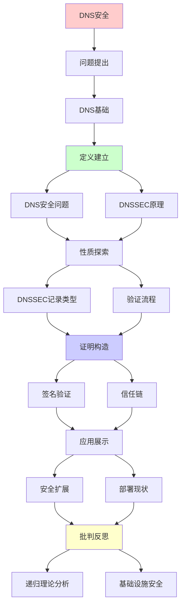
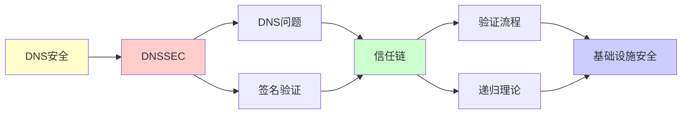

# DNS安全与DNSSEC验证

> **主题**: DNS协议的安全扩展与形式化验证
> **创建日期**: 2025-12-02
> **难度**: ⭐⭐⭐⭐
> **前置知识**: DNS协议、公钥密码学、网络安全

---

## 📋 目录

- [DNS安全与DNSSEC验证](#dns安全与dnssec验证)
  - [📋 目录](#-目录)
  - [1. DNS基础](#1-dns基础)
    - [1.1 DNS层次结构](#11-dns层次结构)
    - [1.2 递归查询](#12-递归查询)
  - [2. DNS安全问题](#2-dns安全问题)
    - [2.1 缓存投毒](#21-缓存投毒)
    - [2.2 历史攻击](#22-历史攻击)
  - [3. DNSSEC原理](#3-dnssec原理)
    - [3.1 信任链](#31-信任链)
    - [3.2 资源记录签名](#32-资源记录签名)
  - [4. DNSSEC记录类型](#4-dnssec记录类型)
    - [4.1 DNSKEY/RRSIG](#41-dnskeyrrsig)
    - [4.2 DS委托](#42-ds委托)
  - [5. 验证流程](#5-验证流程)
    - [5.1 递归验证](#51-递归验证)
    - [5.2 负响应验证](#52-负响应验证)
  - [6. 递归理论分析](#6-递归理论分析)
  - [7. 主题-子主题论证逻辑关系图](#7-主题-子主题论证逻辑关系图)
    - [7.1 论证依赖关系](#71-论证依赖关系)
    - [7.2 概念依赖关系](#72-概念依赖关系)
  - [8. 参考资源](#8-参考资源)
    - [8.1 经典论文](#81-经典论文)
    - [8.2 教材](#82-教材)
    - [8.3 在线资源](#83-在线资源)

---

## 1. DNS基础

### 1.1 DNS层次结构

**域名树**:

```text
DNS树结构:
            . (根)
           / | \
         com org net ...
         /     \
      google  example
       /         \
     www         mail

递归命名:
www.google.com
= www.google.com.
  (最后的.是根)

层次:
根服务器 (13个集群)
  ↓
TLD服务器 (.com, .org)
  ↓
权威服务器 (google.com)
  ↓
记录 (www → IP)

递归性质:
✓ 树状递归结构
✓ 查询递归委托
```

---

### 1.2 递归查询

**解析流程**:

```text
递归解析器 (Recursive Resolver):
客户端查询 www.google.com

1. 查缓存 → 未命中
2. 问根服务器 → 返回.com服务器
3. 问.com服务器 → 返回google.com服务器
4. 问google.com → 返回IP ✓
5. 返回客户端 + 缓存

迭代vs递归:
递归: 解析器完成所有查询
迭代: 客户端自己逐层查询
→ 递归常用 ✓

递归性质:
✓ 查询递归委托
✓ 域名递归分解
✓ 缓存递归查找
```

---

## 2. DNS安全问题

### 2.1 缓存投毒

**Kaminsky攻击 (2008)**:

```text
原理:
攻击者伪造DNS响应
欺骗解析器缓存错误记录
→ 用户访问恶意网站 ⚠️⚠️⚠️

攻击流程:
1. 攻击者: 查询random.google.com
2. 解析器 → 权威服务器
3. 攻击者: 洪水伪造响应
   - google.com → 恶意IP
   - 猜测查询ID
4. 如果猜对 → 缓存投毒 ✗

成功率:
查询ID: 16位 (65536种)
TTL内尝试: ~10秒
→ 实践可行 ⚠️

防御:
✓ 源端口随机化 (+16位熵)
✓ DNSSEC (根本解决) ⭐
```

---

### 2.2 历史攻击

**重大事件**:

```text
2008: Kaminsky缓存投毒
→ 全球DNS软件紧急补丁

2016: Dyn DDoS
Mirai僵尸网络
→ 美国东海岸互联网瘫痪

2020: DNS劫持
国家级攻击
→ 多个国家机构受影响

根本问题:
DNS设计无安全性 (1983)
→ DNSSEC补救 (1997设计, 2010+部署)
```

---

## 3. DNSSEC原理

### 3.1 信任链

**签名链**:

```text
根信任锚:
. (根) 公钥 (预装在解析器)
  ↓ 签名
com 公钥
  ↓ 签名
google.com 公钥
  ↓ 签名
www.google.com → IP

验证:
从根递归验证签名链 ✓
→ 数学保证真实性 ⭐

vs HTTPS:
HTTPS: PKI (CA证书)
DNSSEC: 层次委托 (父签子)
→ 更自然 ✓

递归性质:
✓ 信任递归传递
✓ 签名递归验证
✓ 委托递归授权
```

---

### 3.2 资源记录签名

**RRSIG**:

```text
签名内容:
RRSet (Resource Record Set)
= 同名同类型的所有记录

例子:
www.google.com A 142.250.185.78
www.google.com A 142.250.185.110
→ 作为整体签名 ✓

签名算法:
RSA-SHA256 (8)
ECDSA P-256 (13)
EdDSA (15) ← 推荐 ✓

签名有效期:
Inception: 签名开始时间
Expiration: 签名过期时间
→ 需要定期重签 (通常30天)
```

---

## 4. DNSSEC记录类型

### 4.1 DNSKEY/RRSIG

**记录结构**:

```text
DNSKEY:
- KSK (Key Signing Key): 签名密钥
- ZSK (Zone Signing Key): 签名记录
→ 分离管理 ✓

KSK: 长期保留 (年)
ZSK: 定期轮换 (月)
→ 安全性 ✓

RRSIG:
Type Covered: A
Algorithm: 13 (ECDSA)
Signature: <base64>
→ 数字签名

验证:
RRSIG → DNSKEY公钥验证
→ O(1)验证 ✓
```

---

### 4.2 DS委托

**父子委托**:

```text
DS (Delegation Signer):
父区域签名子区域密钥哈希

例子:
com区域:
DS google.com SHA256(KSK_google)
签名: RRSIG(DS)

google.com区域:
DNSKEY KSK_google
→ 匹配 ✓

递归验证:
com验证 → google.com验证 → www验证
→ 完整信任链 ⭐

递归性质:
✓ 委托递归传递
✓ 哈希递归链接
```

---

## 5. 验证流程

### 5.1 递归验证

**完整流程**:

```text
查询 www.google.com A:

1. 获取根DNSKEY (信任锚)
2. 查询com DS
3. 验证RRSIG(DS) 用根DNSKEY ✓
4. 查询google.com DNSKEY
5. 验证DS(google) 匹配 ✓
6. 查询www A记录
7. 验证RRSIG(A) 用google DNSKEY ✓
8. 返回IP (已验证) ✓

复杂度:
每层: 2次额外查询 (DNSKEY, RRSIG)
总计: O(深度) = O(log n)
→ 可接受 ✓

递归:
✓ 逐层递归验证
✓ 签名链递归追溯
```

---

### 5.2 负响应验证

**NSEC/NSEC3**:

```text
问题: 如何证明"不存在"？

NSEC (下一个安全):
example.com → next.example.com
→ 中间没有其他名字 ✓

NSEC3 (哈希):
Hash(name) → Hash(next_name)
→ 防止区域枚举 ✓

验证:
查询xyz.example.com (不存在)
返回: NSEC example.com → next.com
验证: xyz ∈ (example, next) ✓
→ 证明不存在 ⭐

递归理论:
✓ 区间递归划分
✓ 哈希递归保护
```

---

## 6. 递归理论分析

```text
DNSSEC ∈ RE?

答案: ✓是的

证明:
- 签名验证可递归
- 信任链可递归构建
- 查询可递归解析
→ DNSSEC ∈ P ⊂ RE ✓

复杂度:
验证单个签名: O(1) (ECDSA)
验证链: O(深度) = O(log n)
总计: O(log n) 优秀 ✓

递归性质:
✓ DNS层次递归
✓ 信任链递归
✓ 验证递归传播
✓ 委托递归授权
→ 多重递归 ⭐⭐⭐⭐⭐

部署现状 (2024):
根: 100% ✓
TLD: ~95% ✓
二级域: ~30% ⚠️
验证器: ~40%

挑战:
⚠️ 配置复杂
⚠️ 密钥管理困难
⚠️ 部署慢

vs 其他安全:
HTTPS: 端到端 ✓
DNSSEC: 端到递归器 ⚠️
→ 最后一跳未保护

未来:
DoH (DNS over HTTPS) ✓
DoT (DNS over TLS) ✓
→ 端到端加密

理论vs实践:
理论: 完美防护
实践: 部署不足 ⚠️
→ 工程挑战 > 理论挑战

递归范式:
✓ DNS递归查询
✓ DNSSEC递归验证
✓ 信任递归传递
→ 递归的递归 ⭐
```

---

## 7. 主题-子主题论证逻辑关系图

### 7.1 论证依赖关系



### 7.2 概念依赖关系



**论证逻辑链条**：

1. **问题提出** (1节)：
   - DNS基础

2. **定义建立** (2-3节)：
   - DNS安全问题（2节）
   - DNSSEC原理（3节）

3. **性质探索** (4-5节)：
   - DNSSEC记录类型（4节）
   - 验证流程（5节）

4. **证明构造** (贯穿全文)：
   - 签名验证和信任链

5. **应用展示** (贯穿全文)：
   - 安全扩展和部署现状

6. **批判反思** (6节)：
   - 递归理论分析

---

## 8. 参考资源

### 8.1 经典论文

1. **Arends, R., et al.** (2005). "DNS Security Introduction and Requirements"
   - RFC 4033
   - DNSSEC标准 ⭐⭐⭐⭐⭐

2. **Kaminsky, D.** (2008). "It's The End Of The Cache As We Know It"
   - Black Hat USA 2008
   - DNS缓存投毒攻击

3. **Herzberg, A., & Shulman, H.** (2013). "Fragmentation Considered Poisonous"
   - _IEEE CNS 2013_. 2013 IEEE Conference on Communications and Network Security
   - DNS安全分析

### 8.2 教材

1. **Kurose, J. F., & Ross, K. W.** (2021)
   - _Computer Networking: A Top-Down Approach_ (8th ed.)
   - Pearson. ISBN 978-0136681557
   - 计算机网络基础

2. **Liu, C., & Albitz, P.** (2006)
   - _DNS and BIND_ (5th ed.)
   - O'Reilly. ISBN 978-0596100575
   - DNS实践指南

### 8.3 在线资源

1. **DNSSEC**
   - https://www.dnssec.net/
   - DNSSEC资源

2. **DNS Security**
   - https://en.wikipedia.org/wiki/DNS_Security_Extensions
   - DNSSEC基本概念

3. **ICANN DNSSEC**
   - https://www.icann.org/resources/pages/dnssec-what-is-it-why-important-2019-03-05-en
   - ICANN DNSSEC资源

---

**最后更新**: 2025-12-04
**Tier**: 2-3 (工程+安全)
**部署率**: ~30% (2024) ⚠️
**重要性**: 互联网基础设施安全 ⭐⭐⭐⭐⭐
**状态**: ✅ 已添加主题-子主题论证逻辑关系图和参考资源章节
