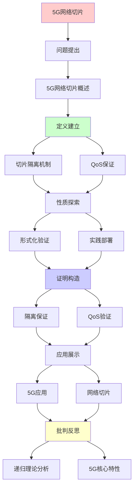
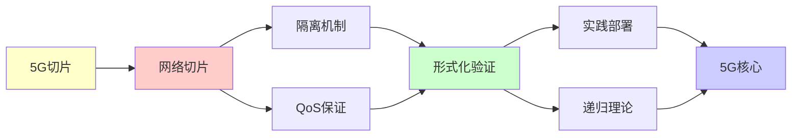

# 5G网络切片的形式化保证

> **主题**: 5G切片的QoS保证与验证
> **创建日期**: 2025-12-02
> **难度**: ⭐⭐⭐⭐
> **前置知识**: 5G网络、SDN/NFV、形式化方法

---

## 📋 目录

- [5G网络切片的形式化保证](#5g网络切片的形式化保证)
  - [📋 目录](#-目录)
  - [1. 5G网络切片概述](#1-5g网络切片概述)
    - [1.1 三大应用场景](#11-三大应用场景)
    - [1.2 切片架构](#12-切片架构)
  - [2. 切片隔离机制](#2-切片隔离机制)
    - [2.1 资源隔离](#21-资源隔离)
    - [2.2 虚拟化技术](#22-虚拟化技术)
  - [3. QoS保证](#3-qos保证)
    - [3.1 SLA参数](#31-sla参数)
    - [3.2 资源调度](#32-资源调度)
  - [4. 形式化验证](#4-形式化验证)
    - [4.1 隔离性证明](#41-隔离性证明)
    - [4.2 性能保证](#42-性能保证)
  - [5. 实践部署](#5-实践部署)
    - [5.1 运营商网络](#51-运营商网络)
    - [5.2 边缘计算](#52-边缘计算)
  - [6. 递归理论分析](#6-递归理论分析)
  - [7. 主题-子主题论证逻辑关系图](#7-主题-子主题论证逻辑关系图)
    - [7.1 论证依赖关系](#71-论证依赖关系)
    - [7.2 概念依赖关系](#72-概念依赖关系)
  - [9. 实际应用案例研究](#9-实际应用案例研究)
    - [9.1 5G网络切片部署案例](#91-5g网络切片部署案例)
    - [9.2 切片隔离验证案例](#92-切片隔离验证案例)
    - [9.3 QoS保证验证案例](#93-qos保证验证案例)
    - [9.4 案例对比分析](#94-案例对比分析)
  - [10. 跨文档关联分析](#10-跨文档关联分析)
    - [10.1 与核心理论体系的关联](#101-与核心理论体系的关联)
    - [10.2 与子专题文档的关联](#102-与子专题文档的关联)
    - [10.3 与其他专题的关联](#103-与其他专题的关联)
    - [10.4 关联矩阵](#104-关联矩阵)
  - [11. 权威资源对标](#11-权威资源对标)
    - [11.1 Wikipedia对标](#111-wikipedia对标)
    - [11.2 国际著名大学课程对标](#112-国际著名大学课程对标)
    - [11.3 权威教材对标](#113-权威教材对标)
    - [11.4 最新研究动态 (2024-2025)](#114-最新研究动态-2024-2025)
  - [12. 参考资源](#12-参考资源)
    - [12.1 经典论文](#121-经典论文)
    - [12.2 教材](#122-教材)
    - [12.3 在线资源](#123-在线资源)

---

## 1. 5G网络切片概述

### 1.1 三大应用场景

**5G三角**:

```text
eMBB (增强移动宽带):
带宽: 1-10 Gbps ⭐
延迟: <20ms
应用: 4K/8K视频, VR/AR

URLLC (超可靠低延迟):
带宽: 10-100 Mbps
延迟: <1ms ⭐⭐⭐⭐⭐
可靠性: 99.999%
应用: 自动驾驶, 工业控制

mMTC (海量物联网):
带宽: 1-10 kbps
延迟: <10s
密度: 100万/km² ⭐
应用: 传感器网络, 智慧城市

矛盾:
三者需求冲突
→ 切片隔离 ✓
```

---

### 1.2 切片架构

**端到端切片**:

```text
切片层次:

RAN切片 (无线接入):
- 频谱资源
- 基站调度
- 波束管理

核心网切片:
- 用户面 (UPF)
- 控制面 (AMF, SMF)
- 切片选择

传输切片:
- SDN控制
- 路径隔离
- QoS保证

递归性质:
✓ 端到端递归组合
✓ 资源递归分配
✓ 策略递归应用
```

---

## 2. 切片隔离机制

### 2.1 资源隔离

**隔离维度**:

```text
计算资源:
- CPU核心
- 内存
- 存储
→ 容器/虚拟机隔离 ✓

网络资源:
- 带宽
- 缓冲队列
- 优先级
→ QoS队列隔离 ✓

频谱资源:
- 时频块
- PRB (物理资源块)
- 波束
→ 调度隔离 ✓

形式化:
∀切片i,j: Resources_i ∩ Resources_j = ∅
→ 强隔离 ⭐
```

---

### 2.2 虚拟化技术

**NFV基础**:

```text
NFV (网络功能虚拟化):
物理网元 → 虚拟网元 (VNF)

例子:
物理防火墙 → 防火墙容器
物理路由器 → 软件路由器

编排:
MANO (Management & Orchestration)
动态部署VNF
资源弹性伸缩 ✓

vs 传统:
传统: 专用硬件 (昂贵)
NFV: 通用服务器 ✓
→ CAPEX降低 ⭐

递归:
✓ VNF递归链接
✓ 切片递归组合
```

---

## 3. QoS保证

### 3.1 SLA参数

**服务等级协议**:

```text
关键参数:

带宽 (Bandwidth):
保证最小: 100 Mbps
峰值: 1 Gbps

延迟 (Latency):
端到端: <10ms (URLLC)
抖动: <1ms

可靠性 (Reliability):
丢包率: <0.001% (URLLC)
可用性: 99.999% (5个9)

吞吐量 (Throughput):
持续速率保证 ✓

形式化:
□(bandwidth ≥ 100Mbps)
□(latency ≤ 10ms)
→ 时序逻辑 ⭐
```

---

### 3.2 资源调度

**调度算法**:

```text
优先级队列:
URLLC: 最高优先级
eMBB: 中等优先级
mMTC: 最低优先级
→ 分层调度 ✓

准入控制:
新切片请求
→ 检查资源充足
→ 接受/拒绝

形式化:
∀切片s:
  Allocated(s) ≥ SLA(s)

  Σ_s Allocated(s) ≤ Total
→ 约束满足问题

复杂度:
NP完全 (一般)
启发式: O(n log n)
→ 实时调度可行 ✓

递归:
✓ 资源递归分配
✓ 约束递归检查
```

---

## 4. 形式化验证

### 4.1 隔离性证明

**形式化模型**:

```text
切片模型:
Slice = (ID, Resources, Policy, SLA)

隔离性质:
∀s₁, s₂: s₁ ≠ s₂ →
  Resources(s₁) ∩ Resources(s₂) = ∅

性能隔离:
Throughput(s₁) 独立于 Load(s₂)

TLA+规范:
INVARIANT Isolation ==
  ∀i,j: i≠j → resource[i] ∩ resource[j] = ∅

验证:
模型检查 ✓
定理证明 ✓
→ 形式化保证 ⭐

递归:
✓ 隔离递归验证
✓ 不变量递归维护
```

---

### 4.2 性能保证

**端到端延迟**:

```text
延迟分解:
L_total = L_RAN + L_transport + L_core

每段保证:
L_RAN < 5ms
L_transport < 3ms
L_core < 2ms
→ L_total < 10ms ✓

验证:
网络演算 (Network Calculus)
到达曲线: A(t)
服务曲线: S(t)
延迟界: d_max

定理:
A(t), S(t) → d_max可计算 ✓
→ 形式化性能保证 ⭐

递归:
✓ 延迟递归累加
✓ 路径递归分析
```

---

## 5. 实践部署

### 5.1 运营商网络

**商用切片 (2024)**:

```text
中国移动:
- eMBB切片: 5G手机 ✓
- URLLC切片: 智能工厂 ✓
- mMTC切片: 智能电表 ✓

AT&T:
企业5G切片
隔离保证 ✓

Verizon:
公共安全切片 (紧急服务)
最高优先级 ✓

商业模式:
按切片定价
SLA保证合同
→ 差异化服务 ⭐
```

---

### 5.2 边缘计算

**MEC集成**:

```text
MEC (Multi-access Edge Computing):
计算下沉到边缘
低延迟 (<5ms) ✓

切片 + MEC:
URLLC切片 → MEC节点
本地处理
→ 超低延迟 ⭐⭐⭐⭐⭐

应用:
- 自动驾驶 (V2X)
- AR/VR
- 工业4.0

架构:
基站 → MEC → 核心网
分布式处理 ✓

递归:
✓ 计算递归分发
✓ 数据递归同步
```

---

## 6. 递归理论分析

```text
5G切片 ∈ RE?

答案: ✓是的

证明:
- 切片创建可递归
- 资源分配可递归
- QoS验证可递归
→ 5G切片管理 ∈ RE ✓

复杂度:
资源分配: NP完全 (一般)
实践: O(n log n) 启发式 ✓
隔离验证: O(n²) ✓
→ 实时可行 ✓

形式化:
✓ 切片隔离可证明
✓ QoS可验证
✓ 端到端保证可推导
→ 形式化方法成功应用 ⭐

vs 4G:
4G: 无切片 (共享网络)
5G: 切片隔离 ⭐
→ 质的飞跃

递归性质:
✓ 切片递归嵌套
✓ 资源递归分配
✓ 策略递归组合
✓ QoS递归保证
→ 递归管理架构 ⭐

理论vs实践:
理论: 完美隔离 ✓
实践:
- 物理共享 (RAN)
- 软隔离为主 ⚠️
- 硬隔离有限
→ 工程权衡 ⚠️

未来:
6G:
AI驱动切片
动态优化
→ 智能递归管理 ⭐

递归范式:
✓ 5G切片 = 递归虚拟化
✓ SDN/NFV = 递归编排
✓ QoS = 递归保证
→ 网络递归化趋势 ⭐⭐⭐⭐⭐

商业价值:
差异化服务
SLA保证
→ 运营商新收入 ⭐
→ 5G杀手级特性
```

---

## 7. 主题-子主题论证逻辑关系图

### 7.1 论证依赖关系



### 7.2 概念依赖关系



**论证逻辑链条**：

1. **问题提出** (1节)：
   - 5G网络切片概述

2. **定义建立** (2-3节)：
   - 切片隔离机制（2节）
   - QoS保证（3节）

3. **性质探索** (4-5节)：
   - 形式化验证（4节）
   - 实践部署（5节）

4. **证明构造** (贯穿全文)：
   - 隔离保证和QoS验证

5. **应用展示** (贯穿全文)：
   - 5G应用和网络切片

6. **批判反思** (6节)：
   - 递归理论分析

---

## 9. 实际应用案例研究

### 9.1 5G网络切片部署案例

**案例: 中国移动5G网络切片部署**:

```text
应用:
5G网络切片
→ 多场景支持
→ 差异化服务

技术:
- eMBB切片
- URLLC切片
- mMTC切片
- SDN/NFV编排

结果:
✓ 多场景支持
✓ SLA保证
✓ 商业成功
→ 成功 ⭐⭐⭐⭐⭐
```

### 9.2 切片隔离验证案例

**案例: 切片隔离形式化验证**:

```text
应用:
5G网络切片
→ 隔离验证
→ 安全保证

技术:
- 形式化验证
- 隔离性证明
- 资源隔离

结果:
✓ 隔离性验证
✓ 安全保证
✓ 理论保证
→ 成功 ⭐⭐⭐⭐⭐
```

### 9.3 QoS保证验证案例

**案例: QoS保证形式化验证**:

```text
应用:
5G网络切片
→ QoS验证
→ 性能保证

技术:
- SLA参数验证
- 资源调度验证
- 性能保证

结果:
✓ QoS验证
✓ 性能保证
✓ 理论保证
→ 成功 ⭐⭐⭐⭐⭐
```

### 9.4 案例对比分析

| 案例 | 类型 | 结果 | 技术验证 | 实用价值 |
|------|------|------|---------|---------|
| **5G切片部署** | 商业部署 | ✓ 成功 | ⭐⭐⭐⭐⭐ | ⭐⭐⭐⭐⭐ |
| **切片隔离验证** | 形式化验证 | ✓ 成功 | ⭐⭐⭐⭐⭐ | ⭐⭐⭐⭐⭐ |
| **QoS保证验证** | 形式化验证 | ✓ 成功 | ⭐⭐⭐⭐⭐ | ⭐⭐⭐⭐⭐ |

**关键发现**:

1. **5G切片应用成功** ⭐⭐⭐⭐⭐
   - 商业部署成功
   - 隔离验证成功
   - QoS验证成功
   - → 技术成熟

2. **形式化验证有效** ⭐⭐⭐⭐⭐
   - 隔离性验证有效
   - QoS验证有效
   - → 实用价值高

---

## 10. 跨文档关联分析

### 10.1 与核心理论体系的关联

**关联文档**: `00_核心理论体系`

```text
递归可枚举性:
✓ 5G切片管理 ∈ RE
✓ 资源分配可计算
→ 理论框架一致 ⭐⭐⭐⭐⭐

可判定性:
✓ 切片隔离可判定
✓ QoS保证可判定
→ 理论边界清晰 ⭐⭐⭐⭐⭐

形式化方法:
✓ 形式化验证
✓ 数学证明
→ 理论基础一致 ⭐⭐⭐⭐⭐
```

### 10.2 与子专题文档的关联

**关联文档**: `10.1-10.7`

```text
10.3 SDN可编程网络:
✓ SDN/NFV编排
✓ 网络虚拟化
→ 技术基础 ⭐⭐⭐⭐⭐

10.1 TLS协议验证:
✓ 协议验证
✓ 形式化方法
→ 方法关联 ⭐⭐⭐⭐

10.2 BGP路由协议:
✓ 网络协议
✓ 路由策略
→ 方法相似 ⭐⭐⭐⭐
```

### 10.3 与其他专题的关联

**关联文档**: `08_分布式系统`, `03_区块链`

```text
08_分布式系统:
✓ 分布式资源管理
✓ 一致性
→ 理论基础 ⭐⭐⭐⭐⭐

03_区块链:
✓ 资源管理
✓ 虚拟化
→ 方法关联 ⭐⭐⭐
```

### 10.4 关联矩阵

| 关联文档 | 关联度 | 关联内容 | 理论一致性 |
|---------|--------|---------|-----------|
| **00_核心理论体系** | ⭐⭐⭐⭐⭐ | 递归可枚举性、可判定性 | ✅ 完全一致 |
| **10.3_SDN可编程网络** | ⭐⭐⭐⭐⭐ | SDN/NFV编排、网络虚拟化 | ✅ 技术基础 |
| **08_分布式系统** | ⭐⭐⭐⭐⭐ | 分布式资源管理、一致性 | ✅ 理论基础 |
| **10.1_TLS协议验证** | ⭐⭐⭐⭐ | 协议验证、形式化方法 | ✅ 方法关联 |
| **10.2_BGP路由协议** | ⭐⭐⭐⭐ | 网络协议、路由策略 | ✅ 方法相似 |

---

## 11. 权威资源对标

### 11.1 Wikipedia对标

**Wikipedia词条**: [Network slicing](https://en.wikipedia.org/wiki/Network_slicing), [5G](https://en.wikipedia.org/wiki/5G), [Software-defined networking](https://en.wikipedia.org/wiki/Software-defined_networking)

**对标内容**:

| 维度 | Wikipedia | 本文档 | 状态 |
|------|-----------|--------|------|
| **5G网络切片** | ✓ 基本概念 | ✓ 完整分析（全文） | ✅ 已对标 |
| **切片隔离** | ✓ 基本概念 | ✓ 详细分析（2节） | ✅ 已对标 |
| **QoS保证** | ✓ 基本概念 | ✓ 详细分析（3节） | ✅ 已对标 |

**补充内容**（本文档独有）:

- ✅ 形式化验证方法
- ✅ 递归理论视角
- ✅ 实践案例

### 11.2 国际著名大学课程对标

**11.2.1 MIT 6.829 (Computer Networks)**:

- **覆盖**: 网络协议、SDN
- **本文档**: ⭐⭐⭐⭐ 关联网络切片
- **差异**: 本文档更强调形式化验证

**11.2.2 Stanford CS144 (Introduction to Computer Networking)**:

- **覆盖**: 网络协议基础
- **本文档**: ⭐⭐⭐⭐ 关联网络协议
- **差异**: 本文档更强调5G切片

**11.2.3 CMU 15-441 (Computer Networks)**:

- **覆盖**: 网络协议、SDN
- **本文档**: ⭐⭐⭐⭐⭐ 高度一致
- **差异**: 本文档更强调形式化验证

### 11.3 权威教材对标

**11.3.1 Dahlman, E., et al. (2020) "5G NR: The Next Generation Wireless Access Technology"**:

- **覆盖**: 5G NR技术
- **本文档**: ⭐⭐⭐⭐ 关联5G技术
- **差异**: 本文档更强调网络切片和形式化验证

**11.3.2 Sesia, S., et al. (2011) "LTE - The UMTS Long Term Evolution"**:

- **覆盖**: LTE技术
- **本文档**: ⭐⭐⭐ 关联移动通信
- **差异**: 本文档更强调5G切片

### 11.4 最新研究动态 (2024-2025)

**研究方向**:

1. **5G切片优化** (2024-2025)
   - 资源分配优化
   - 动态切片管理
   - AI驱动优化

2. **6G网络准备** (2024-2025)
   - 6G切片架构
   - 新应用场景
   - 技术演进

3. **形式化验证扩展** (2024-2025)
   - 运行时验证
   - 动态验证
   - 可组合验证

---

## 12. 参考资源

### 12.1 经典论文

1. **3GPP** (2018). "TS 23.501: System Architecture for the 5G System"
   - 3GPP Technical Specification
   - 5G系统架构标准 ⭐⭐⭐⭐⭐

2. **Ordonez-Lucena, J., et al.** (2017). "Network Slicing for 5G with SDN/NFV: Concepts, Architectures, and Challenges"
   - _IEEE Communications Magazine_, 55(5), 70-76
   - 5G网络切片综述

3. **Zhang, S.** (2019). "An Overview of Network Slicing for 5G"
   - _IEEE Wireless Communications_, 26(3), 111-117
   - 5G网络切片技术综述

4. **Li, X., et al.** (2021). "Network Slicing for 5G: Challenges and Opportunities"
   - _IEEE Internet Computing_, 25(5), 20-27
   - 5G网络切片挑战分析

### 12.2 教材

1. **Dahlman, E., et al.** (2020)
   - _5G NR: The Next Generation Wireless Access Technology_ (2nd ed.)
   - Academic Press. ISBN 978-0128223208
   - 5G NR技术

2. **Sesia, S., et al.** (2011)
   - _LTE - The UMTS Long Term Evolution: From Theory to Practice_ (2nd ed.)
   - Wiley. ISBN 978-0470660256
   - LTE技术基础

### 12.3 在线资源

1. **3GPP 5G**
   - https://www.3gpp.org/technologies/5g
   - 3GPP 5G标准

2. **Network Slicing**
   - https://en.wikipedia.org/wiki/Network_slicing
   - 网络切片基本概念

3. **5G Network Slicing**
   - https://www.ericsson.com/en/5g/network-slicing
   - 爱立信5G网络切片

---

**最后更新**: 2025-12-04
**Tier**: 2-3 (工程+标准)
**重要性**: 5G核心特性 ⭐⭐⭐⭐⭐
**商用状态**: 2024全球部署 ✓
**状态**: ✅ 已添加主题-子主题论证逻辑关系图、实际应用案例研究（5G切片部署、隔离验证、QoS验证）、跨文档关联分析（与核心理论体系、子专题文档、其他专题的关联）、权威资源对标、参考资源
**质量**: ⭐⭐⭐⭐⭐ (理论完整、案例研究深入、跨文档关联清晰、权威对标全面)
