# HTTP/3与QUIC协议创新

> **主题**: QUIC的形式化设计与验证
> **创建日期**: 2025-12-02
> **难度**: ⭐⭐⭐⭐
> **前置知识**: 网络协议、TLS、形式化验证

---

## 📋 目录

- [HTTP/3与QUIC协议创新](#http3与quic协议创新)
  - [📋 目录](#-目录)
  - [1. HTTP演化](#1-http演化)
    - [1.1 HTTP/1.1问题](#11-http11问题)
    - [1.2 HTTP/2改进](#12-http2改进)
    - [1.3 HTTP/3革命](#13-http3革命)
  - [2. QUIC协议](#2-quic协议)
    - [2.1 UDP之上](#21-udp之上)
    - [2.2 核心特性](#22-核心特性)
  - [3. 0-RTT连接](#3-0-rtt连接)
    - [3.1 快速握手](#31-快速握手)
    - [3.2 重放攻击](#32-重放攻击)
  - [4. 多路复用](#4-多路复用)
    - [4.1 流独立性](#41-流独立性)
    - [4.2 队头阻塞消除](#42-队头阻塞消除)
  - [5. 形式化验证](#5-形式化验证)
    - [5.1 协议验证](#51-协议验证)
    - [5.2 Ivy证明](#52-ivy证明)
  - [6. 递归理论分析](#6-递归理论分析)
  - [7. 主题-子主题论证逻辑关系图](#7-主题-子主题论证逻辑关系图)
    - [7.1 论证依赖关系](#71-论证依赖关系)
    - [7.2 概念依赖关系](#72-概念依赖关系)
  - [8. 参考资源](#8-参考资源)
    - [8.1 经典论文](#81-经典论文)
    - [8.2 教材](#82-教材)
    - [8.3 在线资源](#83-在线资源)

---

## 1. HTTP演化

### 1.1 HTTP/1.1问题

**队头阻塞 (HOL)**:

```text
HTTP/1.1:
单TCP连接 → 串行请求
请求1阻塞 → 后续等待 ⚠️

解决:
并发连接 (6-8个)
→ 但开销大 ⚠️

Keep-Alive:
连接复用
但仍串行 ⚠️

问题:
✗ 队头阻塞
✗ 头部冗余
✗ 优先级缺失
→ 性能瓶颈 ⚠️⚠️

递归:
✓ 请求递归排队
⚠️ 阻塞递归累积
```

---

### 1.2 HTTP/2改进

**二进制分帧 (2015)**:

```text
创新:
✓ 二进制协议
✓ 多路复用 (单TCP)
✓ 服务端推送
✓ 头部压缩 (HPACK)

多路复用:
多个流共享连接
流独立传输 ✓

性能:
✓ 减少连接
✓ 并行传输
✓ 头部压缩~85%
→ 2-3×加速 ⭐

残留问题:
⚠️ TCP队头阻塞 (丢包→阻塞所有流)
→ HTTP/3解决 ⭐

递归:
✓ 流递归复用
✓ 帧递归传输
```

---

### 1.3 HTTP/3革命

**QUIC基础 (2018)**:

```text
突破:
放弃TCP
基于UDP ⭐⭐⭐⭐⭐

原因:
TCP内核实现
无法快速迭代 ⚠️
UDP用户空间
可快速演化 ✓

HTTP/3:
HTTP语义 + QUIC传输
→ 彻底重写 ⭐

标准化:
2022: RFC 9000 ✓
→ IETF标准

采用:
Google (25%流量)
Cloudflare ✓
Facebook ✓
→ 快速普及 ⭐

递归:
✓ 协议递归演化
✓ 层次递归重构
```

---

## 2. QUIC协议

### 2.1 UDP之上

**为什么UDP**:

```text
TCP问题:
✗ 内核实现 (难更新)
✗ 中间盒干扰 (NAT, 防火墙)
✗ 队头阻塞

UDP优势:
✓ 用户空间实现 ⭐
✓ 快速迭代
✓ 穿透性好

QUIC构建:
UDP (不可靠)
+ 可靠传输 (QUIC层)
+ TLS 1.3 (加密)
+ HTTP/3 (应用)
→ 完整栈 ⭐

递归构建:
✓ 层次递归堆叠
✓ 功能递归组合
```

---

### 2.2 核心特性

**关键创新**:

```text
1. 流多路复用:
   独立流无队头阻塞 ⭐⭐⭐⭐⭐

2. 连接迁移:
   IP变化 → 连接保持 ✓
   (手机WiFi↔4G)

3. 0-RTT:
   缓存参数 → 零往返 ✓

4. 内置加密:
   TLS 1.3集成
   → 默认加密 ⭐

5. 拥塞控制:
   改进算法 (BBR)
   → 更好性能 ✓

递归:
✓ 流递归独立
✓ 状态递归迁移
```

---

## 3. 0-RTT连接

### 3.1 快速握手

**1-RTT vs 0-RTT**:

```text
TCP + TLS 1.2:
3 RTT (TCP 握手 + TLS)
→ 延迟高 ⚠️

QUIC 1-RTT:
合并握手
ClientHello + Key → 1 RTT ✓

QUIC 0-RTT:
缓存参数 (PSK)
立即发送数据 ⭐⭐⭐⭐⭐
→ 零延迟连接

性能:
移动网络 (200ms RTT):
TCP+TLS: 600ms
QUIC 1-RTT: 200ms
QUIC 0-RTT: 0ms ⭐
→ 移动优势巨大 ⭐

递归:
✓ 握手递归简化
✓ 参数递归缓存
```

---

### 3.2 重放攻击

**0-RTT安全性**:

```text
问题:
0-RTT数据无前向保密
可重放 ⚠️⚠️

攻击:
重放0-RTT数据
→ 重复执行 ✗

防御:
1. 幂等性:
   GET请求 ✓ (安全)
   POST请求 ✗ (危险)

2. 重放检测:
   服务器记录nonce
   → 拒绝重复 ✓

3. 时间窗口:
   限制有效期
   → 减少风险 ✓

权衡:
0-RTT: 快速 ✓, 安全弱 ⚠️
1-RTT: 安全 ✓, 延迟高 ⚠️
→ 场景选择 ⚠️

递归理论:
✓ 重放可递归检测
✓ Nonce递归验证
```

---

## 4. 多路复用

### 4.1 流独立性

**无队头阻塞**:

```text
HTTP/2 (TCP):
流1丢包 → 所有流阻塞 ⚠️⚠️
(TCP层序阻塞)

HTTP/3 (QUIC):
流1丢包 → 仅流1阻塞 ✓✓
其他流继续 ⭐⭐⭐⭐⭐

机制:
QUIC管理流
每流独立序列号
丢包 → 单流重传 ✓

性能提升:
丢包1% → HTTP/2降30%
         → HTTP/3降5% ✓
→ 抗丢包能力 ⭐

递归:
✓ 流递归独立
✓ 重传递归局部化
```

---

### 4.2 队头阻塞消除

**形式化分析**:

```text
定义:
HOL = 一个流阻塞他流

HTTP/2:
TCP保序 → ∀流被阻 ✗

HTTP/3:
QUIC流独立 → HOL=0 ✓

数学:
延迟_total = Σ 延迟_i (HTTP/3)
延迟_total = max 延迟_i (HTTP/2 if 丢包)
→ HTTP/3优势 ⭐

递归理论:
✓ 流递归处理
✓ 阻塞递归消除
→ 并行递归优化 ⭐
```

---

## 5. 形式化验证

### 5.1 协议验证

**Everest项目**:

```text
微软研究院:
QUIC完整形式化 ✓

工具:
F* (依赖类型)
验证实现正确性

结果:
✓ 类型安全
✓ 内存安全
✓ 协议正确
→ 可证明安全 ⭐⭐⭐⭐⭐

vs 传统:
TCP: 无形式化 (1981)
TLS: 部分验证 ⚠️
QUIC: 完整验证 ✓
→ 现代标准 ⭐

递归:
✓ 协议递归验证
✓ 性质递归证明
```

---

### 5.2 Ivy证明

**协议逻辑验证**:

```text
Ivy工具:
时序逻辑验证
不变量证明 ✓

QUIC验证:
- 连接建立正确性
- 流控正确性
- 拥塞控制安全性
→ 形式化保证 ⭐

定理:
QUIC满足规范
无死锁/活锁
→ 证明完成 ✓

意义:
✓ 部署前验证
✓ 减少漏洞
✓ 标准质量提升
→ 形式化方法价值 ⭐

递归理论:
✓ 不变量递归维护
✓ 状态机递归转换
```

---

## 6. 递归理论分析

```text
QUIC ∈ RE?

答案: ✓是的

证明:
- 协议可递归执行
- 状态机可递归转换
- 流可递归处理
→ QUIC ∈ RE ✓

复杂度:
握手: O(1) RTT
传输: O(n) 数据
→ 最优 ✓

形式化:
✓ F*完整实现验证
✓ Ivy协议逻辑证明
✓ Coq语义形式化
→ 多工具验证 ⭐⭐⭐⭐⭐

vs TCP:
TCP: 1981设计 (无形式化)
QUIC: 2018设计 (完整形式化) ✓
→ 40年进步 ⭐

递归性质:
✓ 流递归多路复用
✓ 连接递归迁移
✓ 参数递归缓存 (0-RTT)
✓ 重传递归局部化
→ 递归优化设计 ⭐

理论vs实践:
理论: 形式化规范 ✓
工程: Google/Cloudflare实现 ✓
验证: 形式化证明 ✓
→ 三位一体成功 ⭐⭐⭐⭐⭐

性能提升:
移动网络:
TCP+TLS1.2: 600ms 握手
QUIC 0-RTT: 0ms ⭐⭐⭐⭐⭐
→ 移动Web革命

丢包抗性:
1%丢包:
HTTP/2: 30%性能损失 ⚠️
HTTP/3: 5%性能损失 ✓
→ 20×改进 ⭐

2024采用率:
全球: ~30% HTTP/3
Google: 75%
Cloudflare: 支持 ✓
→ 快速普及 ⭐

未来:
HTTP/4?
可能基于QUIC继续演化
→ QUIC = 传输层基础 ⭐

递归范式:
✓ HTTP演化 = 递归优化
✓ QUIC = 递归重构协议栈
✓ 验证 = 递归形式化
→ 网络协议递归进化 ⭐⭐⭐⭐⭐

哲学:
协议演化 = 递归改进
TCP → QUIC
= 30年递归积累
→ 渐进革命 ⭐

形式化价值:
✓ 设计时验证 (非部署后)
✓ 规范即证明
✓ 实现可证
→ 形式化方法主流化 ⭐⭐⭐⭐⭐

递归理论贡献:
✓ 明确协议语义
✓ 证明安全性质
✓ 指导实现优化
→ 理论指导工程 ⭐
```

---

## 7. 主题-子主题论证逻辑关系图

### 7.1 论证依赖关系

```mermaid
graph TD
    A[HTTP3与QUIC] --> B[问题提出]
    B --> C[HTTP演化]

    C --> D[定义建立]
    D --> D1[QUIC协议]
    D --> D2[0-RTT连接]

    D1 --> E[性质探索]
    D2 --> E
    E --> E1[多路复用]
    E --> E2[形式化验证]

    E1 --> F[证明构造]
    E2 --> F
    F --> F1[协议创新]
    F --> F2[安全性证明]

    F1 --> G[应用展示]
    F2 --> G
    G --> G1[HTTP3应用]
    G --> G2[Web基础]

    G1 --> H[批判反思]
    G2 --> H
    H --> H1[递归理论分析]
    H --> H2[下一代Web]

    style A fill:#ffcccc
    style D fill:#ccffcc
    style F fill:#ccccff
    style H fill:#ffffcc
```



### 7.2 概念依赖关系

```mermaid
graph LR
    A[HTTP3] --> B[QUIC]

    B --> C[0-RTT]
    B --> D[多路复用]

    C --> E[形式化验证]
    D --> E

    E --> F[协议创新]
    E --> G[递归理论]

    F --> H[下一代Web]
    G --> H

    style A fill:#ffffcc
    style B fill:#ffcccc
    style E fill:#ccffcc
    style H fill:#ccccff
```



**论证逻辑链条**：

1. **问题提出** (1节)：
   - HTTP演化

2. **定义建立** (2-3节)：
   - QUIC协议（2节）
   - 0-RTT连接（3节）

3. **性质探索** (4-5节)：
   - 多路复用（4节）
   - 形式化验证（5节）

4. **证明构造** (贯穿全文)：
   - 协议创新和安全性证明

5. **应用展示** (贯穿全文)：
   - HTTP3应用和Web基础

6. **批判反思** (6节)：
   - 递归理论分析

---

## 8. 参考资源

### 8.1 经典论文

1. **Iyengar, J., & Thomson, M.** (2021). "QUIC: A UDP-Based Multiplexed and Secure Transport"
   - RFC 9000
   - QUIC标准 ⭐⭐⭐⭐⭐

2. **Bishop, M.** (2022). "HTTP/3"
   - RFC 9114
   - HTTP/3标准

3. **Jero, S., et al.** (2018). "Automated Attack Discovery in TCP Congestion Control Using a Model-guided Approach"
   - _NDSS 2018_. Network and Distributed System Security Symposium
   - 协议验证

4. **Protzenko, J., et al.** (2017). "Verified Low-Level Programming Embedded in F*"
   - _ICFP 2017_. Proceedings of the 22nd ACM SIGPLAN International Conference on Functional Programming
   - Everest QUIC验证

### 8.2 教材

1. **Kurose, J. F., & Ross, K. W.** (2021)
   - _Computer Networking: A Top-Down Approach_ (8th ed.)
   - Pearson. ISBN 978-0136681557
   - 计算机网络基础

2. **Stevens, W. R.** (1994)
   - _TCP/IP Illustrated, Volume 1: The Protocols_ (2nd ed.)
   - Addison-Wesley. ISBN 978-0201633467
   - TCP/IP详解

### 8.3 在线资源

1. **QUIC Protocol**
   - https://quicwg.org/
   - QUIC工作组

2. **HTTP/3**
   - https://http3.net/
   - HTTP/3资源

3. **Wikipedia - QUIC**
   - https://en.wikipedia.org/wiki/QUIC
   - QUIC基本概念

---

**最后更新**: 2025-12-04
**Tier**: 1-2 (理论+工程)
**重要性**: 下一代Web基础 ⭐⭐⭐⭐⭐
**形式化**: 完整验证 ✓
**状态**: ✅ 已添加主题-子主题论证逻辑关系图和参考资源章节
