# 1. 微积分的合法性：哲学与科学视角的深化

## 目录

- [1. 微积分的合法性：哲学与科学视角的深化](#1-微积分的合法性哲学与科学视角的深化)
  - [目录](#目录)
  - [1.1 微积分合法性的四维框架](#11-微积分合法性的四维框架)
    - [1.1.1 四维框架概述](#111-四维框架概述)
  - [1.2 微积分合法性的综合论证](#12-微积分合法性的综合论证)
    - [1.2.1 四维框架的内在联系](#121-四维框架的内在联系)
      - [1.2.1.1 存在关系与人为建构的辩证统一](#1211-存在关系与人为建构的辩证统一)
      - [1.2.1.2 实践效用与逻辑严密的相互验证](#1212-实践效用与逻辑严密的相互验证)
    - [1.2.2 微积分合法性的哲学意义](#122-微积分合法性的哲学意义)
      - [1.2.2.1 数学哲学视角](#1221-数学哲学视角)
      - [1.2.2.2 跨学科视角](#1222-跨学科视角)
    - [1.2.3 微积分合法性的历史发展](#123-微积分合法性的历史发展)
      - [1.2.3.1 从直觉到严格化](#1231-从直觉到严格化)
      - [1.2.3.2 从应用到理论](#1232-从应用到理论)
    - [1.2.4 微积分合法性的未来展望](#124-微积分合法性的未来展望)
      - [1.2.4.1 理论创新](#1241-理论创新)
      - [1.2.4.2 应用拓展](#1242-应用拓展)
      - [1.2.4.3 教育创新](#1243-教育创新)
  - [1.3 思维导图](#13-思维导图)
  - [1.4 持续更新建议](#14-持续更新建议)
    - [1.4.1 理论深化](#141-理论深化)
      - [1.4.1.1 数学哲学新进展](#1411-数学哲学新进展)
      - [1.4.1.2 科学方法论研究](#1412-科学方法论研究)
      - [1.4.1.3 跨文化比较](#1413-跨文化比较)
      - [1.4.1.4 数学社会学视角](#1414-数学社会学视角)
      - [1.4.1.5 认知科学最新发现](#1415-认知科学最新发现)
    - [1.4.2 应用拓展](#142-应用拓展)
      - [1.4.2.1 量子计算应用](#1421-量子计算应用)
      - [1.4.2.2 生物数学进展](#1422-生物数学进展)
      - [1.4.2.3 AI时代影响](#1423-ai时代影响)
      - [1.4.2.4 金融数学的哲学基础](#1424-金融数学的哲学基础)
      - [1.4.2.5 气候模型中的微积分应用](#1425-气候模型中的微积分应用)
    - [1.4.3 教育创新](#143-教育创新)
      - [1.4.3.1 教学方法创新](#1431-教学方法创新)
      - [1.4.3.2 认知过程研究](#1432-认知过程研究)
      - [1.4.3.3 课程设计优化](#1433-课程设计优化)
      - [1.4.3.4 数字技术应用](#1434-数字技术应用)
      - [1.4.3.5 跨学科教学模式](#1435-跨学科教学模式)
    - [1.4.4 批判性研究](#144-批判性研究)
      - [1.4.4.1 理论局限](#1441-理论局限)
      - [1.4.4.2 应用边界](#1442-应用边界)
      - [1.4.4.3 未来方向](#1443-未来方向)
      - [1.4.4.4 社会建构分析](#1444-社会建构分析)
      - [1.4.4.5 后现代主义视角](#1445-后现代主义视角)

## 1.1 微积分合法性的四维框架

微积分的法则是**源于存在的关系，成于人为的建构，证于实践的效用，立于逻辑的严密**。
本文基于这一四维框架，从哲学与科学视角深化对微积分合法性的论证。

### 1.1.1 四维框架概述

1. **源于存在的关系**：微积分作为数学体系，其合法性首先源于对客观存在关系的刻画与表达。自然界中的连续变化、极限过程、累积效应等现象，为微积分提供了本体论基础。

2. **成于人为的建构**：微积分的合法性不仅源于对存在关系的刻画，更在于人类通过数学语言与符号系统对其进行的建构。数学直觉、形式化证明、公理化方法等，构成了微积分的认识论基础。

3. **证于实践的效用**：微积分的合法性需要通过其在科学、工程与技术中的实际应用来验证。物理学、生物学、工程学等领域的成功应用，证明了微积分的实践价值。

4. **立于逻辑的严密**：微积分的合法性最终建立在严格的逻辑基础之上。公理化体系、形式化证明、逻辑一致性等，确保了微积分的理论可靠性。

这四个维度相互支撑、相互验证，共同构成了微积分合法性的完整论证。
本文将从这四个维度出发，全面探讨微积分的哲学基础、科学应用、历史发展及未来展望。

## 1.2 微积分合法性的综合论证

微积分的合法性建立在"源于存在的关系，成于人为的建构，证于实践的效用，立于逻辑的严密"这一四维框架之上。
这四个维度相互支撑、相互验证，共同构成了微积分合法性的完整论证。
本节将深入探讨这四个维度的内在联系、哲学意义、历史发展及未来展望。

### 1.2.1 四维框架的内在联系

#### 1.2.1.1 存在关系与人为建构的辩证统一

- **本体论与认识论的统一**
  - **客观存在与主观认知的互动**
    - 微积分既反映客观世界的连续变化，又通过人类思维进行形式化表达
    - 数学直觉与形式化证明的互补性：直觉引导形式化，形式化验证直觉
    - 几何直观与代数运算的统一：不同数学语言表达同一数学对象
  - **数学实在论与建构主义的调和**
    - 微积分既具有客观性（反映自然规律），又具有建构性（人为创造）
    - 数学真理的发现与发明：部分规律是发现的，部分结构是发明的
    - 形式系统与直觉理解的平衡：严格性与可理解性的统一
  - **跨文化数学传统的融合**
    - 不同文化背景下的微积分发展：希腊、印度、阿拉伯、欧洲传统
    - 数学思想的传播与演变：符号系统、证明方法、应用领域
    - 现代微积分的多元文化基础：吸收各文化传统的精华

- **数学语言与自然语言的对应**
  - **符号系统的自然基础**
    - 微积分符号反映自然现象：导数表示变化率，积分表示累积
    - 数学语言的自然性：符号选择基于直观理解
    - 形式化表达的自然对应：严格定义与直观理解的统一
  - **数学直觉的形式化过程**
    - 从几何直观到严格定义：如极限的ε-δ定义
    - 从物理直觉到数学理论：如变分原理
    - 从算法思想到形式证明：如构造性数学
  - **数学美学的统一性**
    - 简洁性与深刻性的统一：如微积分基本定理
    - 对称性与普遍性的结合：如诺特定理
    - 抽象性与具体性的平衡：如微分流形理论

#### 1.2.1.2 实践效用与逻辑严密的相互验证

- **理论指导实践，实践验证理论**
  - **物理学中的应用验证**
    - 牛顿力学：微积分成功描述运动规律
    - 电磁理论：麦克斯韦方程组的微分形式
    - 量子力学：薛定谔方程的数学基础
  - **工程技术的实际应用**
    - 控制系统：状态空间方法的理论基础
    - 信号处理：傅里叶分析的广泛应用
    - 优化设计：变分法的工程应用
  - **生物学与医学的交叉应用**
    - 神经动力学：Hodgkin-Huxley模型的微分方程
    - 种群生态学：微分方程描述生态系统
    - 医学成像：积分几何在CT扫描中的应用

- **逻辑严密保证应用可靠**
  - **公理化体系的基础作用**
    - 实数系的完备性保证极限运算的合法性
    - 微积分基本定理的严格证明确保积分计算的可靠性
    - 一致收敛性理论保证级数运算的合法性
  - **形式化证明的实践意义**
    - 数值方法的误差估计：基于泰勒展开的严格证明
    - 微分方程解的存在唯一性：保证物理模型的可靠性
    - 变分问题的解的存在性：确保优化问题的可解性
  - **逻辑一致性的应用价值**
    - 非标准分析在简化证明中的应用
    - 构造性数学在算法设计中的应用
    - 形式化方法在计算机辅助证明中的应用

### 1.2.2 微积分合法性的哲学意义

#### 1.2.2.1 数学哲学视角

- **数学实在论与建构主义的调和**
  - **微积分的双重性质**
    - 客观性：反映自然界的连续变化规律
    - 建构性：人类思维的形式化创造
    - 统一性：客观规律与主观建构的辩证统一
  - **数学真理的本质**
    - 发现与发明的统一：部分规律是发现的，部分结构是发明的
    - 必然性与偶然性的结合：数学结构的必然性与历史发展的偶然性
    - 绝对性与相对性的辩证：数学真理的绝对性与表达方式的相对性
  - **数学知识的认识论**
    - 直觉与逻辑的统一：数学直觉与形式化证明的互补
    - 经验与理性的结合：数学经验与理性推理的互动
    - 个体与社会的互动：个人创造与社会共识的辩证

- **科学方法论中的微积分**
  - **模型化方法的数学基础**
    - 连续模型的数学表达：微分方程描述动态系统
    - 离散模型的极限过渡：差分方程到微分方程的转化
    - 随机模型的确定性基础：概率论中的微积分方法
  - **实验验证的理论框架**
    - 测量误差的数学处理：泰勒展开与误差估计
    - 实验数据的理论拟合：最小二乘法的微积分基础
    - 模型验证的数学方法：参数估计与假设检验
  - **科学预测的数学工具**
    - 确定性预测：微分方程的初值问题
    - 概率性预测：随机微分方程
    - 混沌系统预测：动力系统理论

#### 1.2.2.2 跨学科视角

- **数学与其他学科的互动**
  - **物理学中的微积分**
    - 经典力学：牛顿运动定律的微分方程
    - 电磁理论：麦克斯韦方程组的微分形式
    - 量子力学：波函数的微分方程
  - **生物学中的微积分**
    - 神经科学：神经元动力学的微分方程
    - 生态学：种群动力学的微分方程
    - 生物化学：酶动力学的微分方程
  - **工程学中的微积分**
    - 控制系统：状态空间方法
    - 信号处理：傅里叶分析
    - 优化设计：变分法

- **微积分的文化意义**
  - **跨文化数学传统**
    - 不同文化背景下的微积分发展
    - 数学思想的传播与演变
    - 现代微积分的多元文化基础
  - **数学教育的社会影响**
    - 微积分在科学教育中的核心地位
    - 数学思维对科学素养的影响
    - 微积分对创新能力的培养
  - **数学与人类文明**
    - 微积分在科学革命中的作用
    - 数学语言对科学交流的促进
    - 数学思维对现代文明的影响

### 1.2.3 微积分合法性的历史发展

#### 1.2.3.1 从直觉到严格化

- **早期微积分的直观方法**
  - **古希腊的萌芽**
    - 阿基米德的穷竭法
    - 欧多克索斯的比例理论
    - 芝诺悖论的哲学思考
  - **印度与阿拉伯的贡献**
    - 印度数学家的无穷小思想
    - 阿拉伯数学家的代数方法
    - 跨文化数学交流
  - **欧洲的早期发展**
    - 费马的切线方法
    - 卡瓦列里的不可分量法
    - 巴罗的几何方法

- **19世纪的严格化运动**
  - **柯西的贡献**
    - 极限的严格定义
    - 连续性的ε-δ语言
    - 积分的严格构造
  - **魏尔斯特拉斯的工作**
    - 一致收敛性理论
    - 解析函数的严格理论
    - 反例的构造
  - **戴德金与康托尔的贡献**
    - 实数的严格构造
    - 集合论的基础
    - 无穷的严格处理

- **现代公理化体系**
  - **实数系的公理化**
    - 域公理、序公理、完备性公理
    - 戴德金分割与康托尔序列
    - 实数的唯一性
  - **微积分的公理化**
    - 极限理论的公理化
    - 微分学的公理化
    - 积分学的公理化
  - **现代数学基础**
    - 集合论基础
    - 范畴论视角
    - 非标准分析

#### 1.2.3.2 从应用到理论

- **物理学驱动的微积分发展**
  - **牛顿的贡献**
    - 流数法的创立
    - 运动定律的微分方程
    - 万有引力理论
  - **欧拉的工作**
    - 变分法的系统化
    - 微分方程理论
    - 复变函数论
  - **拉格朗日与哈密顿**
    - 分析力学
    - 变分原理
    - 正则方程

- **纯数学对微积分的抽象**
  - **函数论的发展**
    - 复变函数论
    - 实变函数论
    - 泛函分析
  - **微分几何的兴起**
    - 曲线与曲面论
    - 黎曼几何
    - 现代微分几何
  - **拓扑学的应用**
    - 同伦论
    - 微分拓扑
    - 代数拓扑

- **应用数学的新方向**
  - **数值分析**
    - 数值积分
    - 微分方程数值解
    - 有限元方法
  - **概率论与随机过程**
    - 随机微分方程
    - 随机分析
    - 金融数学
  - **动力系统理论**
    - 混沌理论
    - 分形几何
    - 复杂系统

### 1.2.4 微积分合法性的未来展望

#### 1.2.4.1 理论创新

- **非标准分析的发展**
  - **超实数理论的深化**
    - 非标准模型的新构造
    - 超实数域的代数结构
    - 非标准拓扑
  - **非标准微积分的应用**
    - 简化证明的新方法
    - 直观理解的新途径
    - 新定理的发现
  - **非标准分析的教育价值**
    - 教学方法的创新
    - 直观理解的促进
    - 严格思维的培养

- **几何分析的新进展**
  - **微分几何的现代发展**
    - 黎曼几何的新结果
    - 复几何的进展
    - 辛几何的应用
  - **偏微分方程理论**
    - 非线性方程的新方法
    - 几何流理论
    - 变分问题的新进展
  - **几何与分析的融合**
    - 几何测度论
    - 几何群论
    - 几何拓扑

- **代数几何的融合**
  - **代数几何的新方法**
    - 概形理论
    - 模空间理论
    - 代数簇的几何
  - **代数与分析的结合**
    - 代数分析
    - 代数动力系统
    - 代数拓扑
  - **现代数学的统一性**
    - 范畴论视角
    - 同调代数
    - 代数几何

#### 1.2.4.2 应用拓展

- **人工智能中的微积分**
  - **深度学习理论**
    - 神经网络的微分方程
    - 优化算法的理论基础
    - 梯度下降的收敛性
  - **机器学习中的微积分**
    - 概率模型的微分方法
    - 信息几何
    - 流形学习
  - **人工智能的数学基础**
    - 算法复杂性理论
    - 学习理论
    - 优化理论

- **量子计算的应用**
  - **量子算法的微积分基础**
    - 量子傅里叶变换
    - 量子模拟
    - 量子优化
  - **量子信息理论**
    - 量子概率
    - 量子测量理论
    - 量子纠错
  - **量子计算的教育**
    - 量子计算的教学方法
    - 量子算法的直观理解
    - 量子编程的教育

- **生物数学的发展**
  - **系统生物学**
    - 基因调控网络
    - 代谢网络
    - 信号转导
  - **神经科学**
    - 神经元动力学
    - 神经网络理论
    - 认知模型
  - **生态学与进化**
    - 种群动力学
    - 进化动力学
    - 生态系统模型

#### 1.2.4.3 教育创新

- **教学方法的发展**
  - **直观理解与严格证明的结合**
    - 几何直观的教学
    - 形式化证明的训练
    - 应用实例的引入
  - **技术辅助教学**
    - 计算机代数系统
    - 动态几何软件
    - 数值计算工具
  - **跨学科教学**
    - 物理应用
    - 工程应用
    - 生物应用

- **课程设计的优化**
  - **基础与应用的平衡**
    - 理论基础的强化
    - 应用实例的丰富
    - 计算技能的培养
  - **不同层次的课程**
    - 入门课程
    - 提高课程
    - 专业课程
  - **评估方法的创新**
    - 概念理解
    - 问题解决
    - 应用能力

- **数学思维培养**
  - **抽象思维**
    - 概念形成
    - 模式识别
    - 一般化能力
  - **逻辑思维**
    - 证明方法
    - 推理能力
    - 批判性思维
  - **应用思维**
    - 建模能力
    - 问题转化
    - 解决方案

## 1.3 思维导图

```mermaid
graph TD
    A[微积分合法性] --> B[源于存在的关系]
    A --> C[成于人为的建构]
    A --> D[证于实践的效用]
    A --> E[立于逻辑的严密]

    %% 源于存在的关系
    B --> B1[连续性与变化]
    B --> B2[无穷小与极限]
    B --> B3[存在关系的数学表征]

    B1 --> B11[实数系的完备性]
    B1 --> B12[函数连续性]
    B1 --> B13[变化率的表达]

    B2 --> B21[非标准分析]
    B2 --> B22[极限理论]
    B2 --> B23[无穷级数]

    B3 --> B31[拓扑空间]
    B3 --> B32[微分流形]
    B3 --> B33[测度论]

    %% 成于人为的建构
    C --> C1[数学语言与符号]
    C --> C2[数学直觉与形式化]
    C --> C3[人为建构的认识论]

    C1 --> C11[莱布尼茨符号]
    C1 --> C12[牛顿流数法]
    C1 --> C13[现代符号系统]

    C2 --> C21[几何直观]
    C2 --> C22[形式化证明]
    C2 --> C23[公理化方法]

    C3 --> C31[数学实在论]
    C3 --> C32[建构主义]
    C3 --> C33[跨文化传统]

    %% 证于实践的效用
    D --> D1[物理学应用]
    D --> D2[生物学应用]
    D --> D3[工程应用]

    D1 --> D11[经典力学]
    D1 --> D12[电磁理论]
    D1 --> D13[量子力学]

    D2 --> D21[神经动力学]
    D2 --> D22[种群生态学]
    D2 --> D23[生物化学]

    D3 --> D31[控制系统]
    D3 --> D32[信号处理]
    D3 --> D33[优化设计]

    %% 立于逻辑的严密
    E --> E1[公理化体系]
    E --> E2[逻辑结构]
    E --> E3[逻辑一致性]

    E1 --> E11[实数公理]
    E1 --> E12[微积分公理]
    E1 --> E13[集合论基础]

    E2 --> E21[极限理论]
    E2 --> E22[微分学]
    E2 --> E23[积分学]

    E3 --> E31[非标准分析]
    E3 --> E32[构造主义]
    E3 --> E33[形式化方法]

    %% 内在联系
    F[四维框架的辩证统一] --> F1[存在与建构]
    F --> F2[效用与严密]
    F --> F3[历史发展]
    F --> F4[未来展望]

    F1 --> F11[本体论与认识论]
    F1 --> F12[数学语言与自然]
    F1 --> F13[直觉与形式化]

    F2 --> F21[理论指导实践]
    F2 --> F22[实践验证理论]
    F2 --> F23[逻辑保证应用]

    F3 --> F31[从直觉到严格]
    F3 --> F32[从应用到理论]
    F3 --> F33[现代发展]

    F4 --> F41[理论创新]
    F4 --> F42[应用拓展]
    F4 --> F43[教育创新]

    %% 哲学意义
    G[数学哲学视角] --> G1[实在论与建构主义]
    G --> G2[科学方法论]
    G --> G3[数学真理观]

    G1 --> G11[客观性与建构性]
    G1 --> G12[发现与发明]
    G1 --> G13[形式与直觉]

    G2 --> G21[模型化方法]
    G2 --> G22[实验验证]
    G2 --> G23[科学预测]

    G3 --> G31[数学真理本质]
    G3 --> G32[必然与偶然]
    G3 --> G33[绝对与相对]

    %% 跨学科视角
    H[跨学科视角] --> H1[物理应用]
    H --> H2[生物应用]
    H --> H3[工程应用]

    H1 --> H11[经典力学]
    H1 --> H12[电磁理论]
    H1 --> H13[量子力学]

    H2 --> H21[神经科学]
    H2 --> H22[生态学]
    H2 --> H23[生物化学]

    H3 --> H31[控制系统]
    H3 --> H32[信号处理]
    H3 --> H33[优化设计]

    %% 文化意义
    I[文化意义] --> I1[跨文化传统]
    I --> I2[教育影响]
    I --> I3[文明贡献]

    I1 --> I11[希腊传统]
    I1 --> I12[印度传统]
    I1 --> I13[阿拉伯传统]

    I2 --> I21[科学教育]
    I2 --> I22[数学思维]
    I2 --> I23[创新能力]

    I3 --> I31[科学革命]
    I3 --> I32[科学交流]
    I3 --> I33[现代文明]

    %% 未来展望
    J[未来展望] --> J1[理论创新]
    J --> J2[应用拓展]
    J --> J3[教育创新]

    J1 --> J11[非标准分析]
    J1 --> J12[几何分析]
    J1 --> J13[代数几何]

    J2 --> J21[人工智能]
    J2 --> J22[量子计算]
    J2 --> J23[生物数学]

    J3 --> J31[教学方法]
    J3 --> J32[课程设计]
    J3 --> J33[思维培养]

    %% 样式定义
    classDef default fill:#f9f,stroke:#333,stroke-width:2px;
    classDef dimension fill:#bbf,stroke:#333,stroke-width:2px;
    classDef subdimension fill:#ddf,stroke:#333,stroke-width:2px;
    classDef detail fill:#fff,stroke:#333,stroke-width:1px;

    class A dimension;
    class B,C,D,E dimension;
    class B1,B2,B3,C1,C2,C3,D1,D2,D3,E1,E2,E3 subdimension;
    class B11,B12,B13,B21,B22,B23,B31,B32,B33,C11,C12,C13,C21,C22,C23,C31,C32,C33,D11,D12,D13,D21,D22,D23,D31,D32,D33,E11,E12,E13,E21,E22,E23,E31,E32,E33 detail;
    class F,G,H,I,J dimension;
    class F1,F2,F3,F4,G1,G2,G3,H1,H2,H3,I1,I2,I3,J1,J2,J3 subdimension;
    class F11,F12,F13,F21,F22,F23,F31,F32,F33,F41,F42,F43,G11,G12,G13,G21,G22,G23,G31,G32,G33,H11,H12,H13,H21,H22,H23,H31,H32,H33,I11,I12,I13,I21,I22,I23,I31,I32,I33,J11,J12,J13,J21,J22,J23,J31,J32,J33 detail;
```

## 1.4 持续更新建议

### 1.4.1 理论深化

#### 1.4.1.1 数学哲学新进展

- **数学基础理论**
  - 范畴论视角下的微积分
  - 同伦类型论的发展
  - 构造性数学的新进展
- **数学实在论与建构主义**
  - 数学对象的本质
  - 数学真理的认识论
  - 数学实践的社会维度
- **跨文化数学哲学**
  - 不同文化传统中的数学思想
  - 数学思想的传播与演变
  - 现代数学的多元文化基础

#### 1.4.1.2 科学方法论研究

- **模型化方法**
  - 数学模型的哲学基础
  - 模型与实在的关系
  - 模型验证的方法论
- **实验与理论的关系**
  - 数学在实验设计中的作用
  - 实验数据的数学处理
  - 理论预测的验证方法
- **科学发现的逻辑**
  - 数学直觉的作用
  - 形式化证明的意义
  - 科学创新的机制

#### 1.4.1.3 跨文化比较

- **数学传统比较**
  - 希腊数学传统
  - 印度数学传统
  - 阿拉伯数学传统
  - 中国数学传统
- **数学教育比较**
  - 不同文化背景下的教学方法
  - 数学思维培养的差异
  - 教育效果的比较研究
- **现代数学的多元发展**
  - 不同文化传统的影响
  - 数学思想的融合
  - 未来发展的多元性

#### 1.4.1.4 数学社会学视角

- **数学实践的社会维度**
  - 数学共同体的形成
  - 数学知识的社会建构
  - 数学权威的建立
- **数学教育的社会影响**
  - 数学能力的社会分布
  - 数学教育的社会功能
  - 数学素养的社会意义
- **数学与现代社会**
  - 数学在决策中的作用
  - 数学与技术进步
  - 数学与社会发展

#### 1.4.1.5 认知科学最新发现

- **数学思维的认知机制**
  - 数学直觉的神经基础
  - 抽象思维的认知过程
  - 数学学习的认知规律
- **数学教育心理学**
  - 数学概念的形成
  - 数学问题解决的心理过程
  - 数学焦虑的研究
- **数学能力的发展**
  - 数学天赋的认知基础
  - 数学能力的发展阶段
  - 数学创造力的培养

### 1.4.2 应用拓展

#### 1.4.2.1 量子计算应用

- **量子算法理论**
  - 量子傅里叶变换
  - 量子模拟算法
  - 量子优化算法
- **量子信息处理**
  - 量子纠错码
  - 量子密码学
  - 量子通信
- **量子计算教育**
  - 量子计算的教学方法
  - 量子算法的直观理解
  - 量子编程的教育

#### 1.4.2.2 生物数学进展

- **系统生物学**
  - 基因调控网络
  - 代谢网络分析
  - 信号转导系统
- **神经科学**
  - 神经元动力学
  - 神经网络理论
  - 认知模型
- **生态学与进化**
  - 种群动力学
  - 进化动力学
  - 生态系统模型

#### 1.4.2.3 AI时代影响

- **深度学习理论**
  - 神经网络的微分方程
  - 优化算法的理论基础
  - 梯度下降的收敛性
- **机器学习中的微积分**
  - 概率模型的微分方法
  - 信息几何
  - 流形学习
- **AI的数学基础**
  - 算法复杂性理论
  - 学习理论
  - 优化理论

#### 1.4.2.4 金融数学的哲学基础

- **随机分析**
  - 随机微分方程
  - 随机过程理论
  - 金融数学基础
- **风险管理**
  - 风险度量理论
  - 投资组合优化
  - 金融衍生品定价
- **金融市场的数学模型**
  - 市场微观结构
  - 行为金融学
  - 金融时间序列

#### 1.4.2.5 气候模型中的微积分应用

- **大气动力学**
  - 流体力学方程
  - 热力学方程
  - 辐射传输
- **海洋动力学**
  - 海洋环流模型
  - 海气相互作用
  - 海洋生态系统
- **气候系统模拟**
  - 气候模式
  - 参数化方案
  - 不确定性分析

### 1.4.3 教育创新

#### 1.4.3.1 教学方法创新

- **直观理解与严格证明**
  - 几何直观的教学
  - 形式化证明的训练
  - 应用实例的引入
- **技术辅助教学**
  - 计算机代数系统
  - 动态几何软件
  - 数值计算工具
- **跨学科教学**
  - 物理应用
  - 工程应用
  - 生物应用

#### 1.4.3.2 认知过程研究

- **概念形成**
  - 数学概念的发展
  - 概念理解的层次
  - 概念迁移
- **问题解决**
  - 解题策略
  - 元认知能力
  - 创造性思维
- **数学思维**
  - 抽象思维
  - 逻辑思维
  - 空间思维

#### 1.4.3.3 课程设计优化

- **基础与应用的平衡**
  - 理论基础的强化
  - 应用实例的丰富
  - 计算技能的培养
- **不同层次的课程**
  - 入门课程
  - 提高课程
  - 专业课程
- **评估方法创新**
  - 概念理解
  - 问题解决
  - 应用能力

#### 1.4.3.4 数字技术应用

- **在线教育平台**
  - 交互式学习
  - 自适应学习
  - 协作学习
- **虚拟实验室**
  - 数学实验
  - 物理模拟
  - 工程应用
- **智能辅导系统**
  - 个性化学习
  - 实时反馈
  - 学习分析

#### 1.4.3.5 跨学科教学模式

- **STEM教育**
  - 科学整合
  - 技术应用
  - 工程实践
- **问题导向学习**
  - 真实问题
  - 项目学习
  - 团队合作
- **研究型学习**
  - 数学建模
  - 实验研究
  - 创新实践

### 1.4.4 批判性研究

#### 1.4.4.1 理论局限

- **数学基础问题**
  - 集合论悖论
  - 连续统假设
  - 选择公理
- **形式化局限**
  - 哥德尔不完备定理
  - 计算复杂性
  - 算法不可解性
- **应用边界**
  - 模型简化
  - 参数不确定性
  - 预测局限

#### 1.4.4.2 应用边界

- **物理模型局限**
  - 量子效应
  - 混沌现象
  - 非线性系统
- **生物模型局限**
  - 系统复杂性
  - 个体差异
  - 环境因素
- **工程应用局限**
  - 实际约束
  - 成本效益
  - 技术限制

#### 1.4.4.3 未来方向

- **理论发展**
  - 非标准分析
  - 几何分析
  - 代数几何
- **应用拓展**
  - 人工智能
  - 量子计算
  - 生物数学
- **教育创新**
  - 教学方法
  - 课程设计
  - 评估方法

#### 1.4.4.4 社会建构分析

- **数学知识的社会性**
  - 知识生产
  - 权威建立
  - 共识形成
- **数学实践的文化性**
  - 文化背景
  - 价值观念
  - 社会需求
- **数学教育的社会功能**
  - 社会分层
  - 职业发展
  - 社会流动

#### 1.4.4.5 后现代主义视角

- **确定性的质疑**
  - 数学真理观
  - 客观性
  - 普遍性
- **多元性视角**
  - 文化多元
  - 方法多元
  - 价值多元
- **批判性思维**
  - 反思性
  - 开放性
  - 创造性

这个持续更新建议框架提供了微积分合法性研究的全面视角，包括理论深化、应用拓展、教育创新和批判性研究四个主要方向。
每个方向都包含多个具体的研究领域，为未来的研究和发展提供了清晰的路线图。
建议根据实际教学和研究需求，选择相关方向进行深入探讨。
