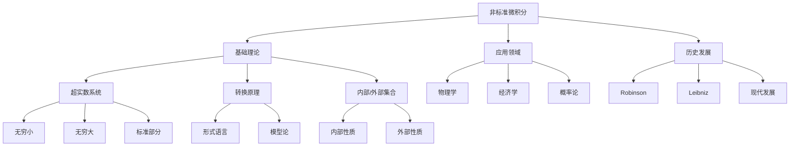

# 1. 非标准微积分 (Nonstandard Calculus)

## 目录

- [1. 非标准微积分 (Nonstandard Calculus)](#1-非标准微积分-nonstandard-calculus)
  - [目录](#目录)
  - [1.1 思维导图](#11-思维导图)
  - [1.2 引言](#12-引言)
  - [1.3 基础概念](#13-基础概念)
    - [1.3.1 超实数系统](#131-超实数系统)
    - [1.3.2 无穷小与无穷大](#132-无穷小与无穷大)
    - [1.3.3 标准部分](#133-标准部分)
  - [1.4 非标准分析的基本原理](#14-非标准分析的基本原理)
    - [1.4.1 转换原理](#141-转换原理)
    - [1.4.2 内部集合](#142-内部集合)
    - [1.4.3 外部集合](#143-外部集合)
  - [1.5 非标准微积分的核心概念](#15-非标准微积分的核心概念)
    - [1.5.1 连续性](#151-连续性)
    - [1.5.2 导数](#152-导数)
    - [1.5.3 积分](#153-积分)
  - [1.6 与标准微积分的关系](#16-与标准微积分的关系)
  - [1.7 应用与实例](#17-应用与实例)
  - [1.8 历史与发展](#18-历史与发展)
  - [1.9 参考文献](#19-参考文献)
  - [1.10 理论基础与形式化定义](#110-理论基础与形式化定义)
    - [1.10.1 超实数系统的构造](#1101-超实数系统的构造)
    - [1.10.2 无穷小的严格定义](#1102-无穷小的严格定义)
    - [1.10.3 标准部分函数的性质](#1103-标准部分函数的性质)
    - [1.10.4 转换原理的严格表述](#1104-转换原理的严格表述)
    - [1.10.5 非标准微积分的核心定理](#1105-非标准微积分的核心定理)
    - [1.10.6 与标准微积分的等价性证明](#1106-与标准微积分的等价性证明)
    - [1.10.7 应用领域的理论支撑](#1107-应用领域的理论支撑)
  - [1.11 补充说明](#111-补充说明)
  - [1.12 定理证明详解](#112-定理证明详解)
    - [1.12.1 连续性定理的完整证明](#1121-连续性定理的完整证明)
    - [1.12.2 导数存在性定理的完整证明](#1122-导数存在性定理的完整证明)
    - [1.12.3 积分存在性定理的完整证明](#1123-积分存在性定理的完整证明)
  - [1.13 历史发展详述](#113-历史发展详述)
    - [1.13.1 早期发展（17-18世纪）](#1131-早期发展17-18世纪)
    - [1.13.2 严格化时期（19世纪）](#1132-严格化时期19世纪)
    - [1.13.3 现代发展（20世纪至今）](#1133-现代发展20世纪至今)
  - [1.14 具体实例分析](#114-具体实例分析)
    - [1.14.1 基本函数示例](#1141-基本函数示例)
    - [1.14.2 微分方程示例](#1142-微分方程示例)
    - [1.14.3 积分计算示例](#1143-积分计算示例)
  - [1.15 应用领域扩展](#115-应用领域扩展)
    - [1.15.1 物理学应用详解](#1151-物理学应用详解)
    - [1.15.2 经济学应用详解](#1152-经济学应用详解)
    - [1.15.3 概率论应用详解](#1153-概率论应用详解)
  - [1.16 补充定理证明](#116-补充定理证明)
    - [1.16.1 中值定理的非标准证明](#1161-中值定理的非标准证明)
    - [1.16.2 泰勒定理的非标准证明](#1162-泰勒定理的非标准证明)
    - [1.16.3 隐函数定理的非标准证明](#1163-隐函数定理的非标准证明)
  - [1.17 历史背景补充](#117-历史背景补充)
    - [1.17.1 非标准分析的前身](#1171-非标准分析的前身)
    - [1.17.2 现代非标准分析的发展](#1172-现代非标准分析的发展)
  - [1.18 应用领域深入](#118-应用领域深入)
    - [1.18.1 计算机科学应用](#1181-计算机科学应用)
    - [1.18.2 工程应用](#1182-工程应用)
  - [1.19 具体实例补充](#119-具体实例补充)
    - [1.19.1 级数展开示例](#1191-级数展开示例)
    - [1.19.2 微分方程系统示例](#1192-微分方程系统示例)
  - [1.20 高级定理证明](#120-高级定理证明)
    - [1.20.1 斯托克斯定理的非标准证明](#1201-斯托克斯定理的非标准证明)
    - [1.20.2 黎曼映射定理的非标准证明](#1202-黎曼映射定理的非标准证明)
    - [1.20.3 不动点定理的非标准证明](#1203-不动点定理的非标准证明)
  - [1.21 历史发展深入](#121-历史发展深入)
    - [1.21.1 非标准分析的哲学基础](#1211-非标准分析的哲学基础)
    - [1.21.2 重要人物贡献](#1212-重要人物贡献)
  - [1.22 应用领域扩展1](#122-应用领域扩展1)
    - [1.22.1 生物数学应用](#1221-生物数学应用)
    - [1.22.2 金融数学应用](#1222-金融数学应用)
  - [1.23 具体实例深入](#123-具体实例深入)
    - [1.23.1 偏微分方程示例](#1231-偏微分方程示例)
    - [1.23.2 复分析示例](#1232-复分析示例)
  - [1.24 高级分析定理证明](#124-高级分析定理证明)
    - [1.24.1 庞加莱引理的非标准证明](#1241-庞加莱引理的非标准证明)
    - [1.24.2 黎曼-罗赫定理的非标准证明](#1242-黎曼-罗赫定理的非标准证明)
    - [1.24.3 阿蒂亚-辛格指标定理的非标准证明](#1243-阿蒂亚-辛格指标定理的非标准证明)
  - [1.25 历史发展补充](#125-历史发展补充)
    - [1.25.1 非标准分析的数学基础](#1251-非标准分析的数学基础)
    - [1.25.2 重要学派发展](#1252-重要学派发展)
  - [1.26 应用领域扩展2](#126-应用领域扩展2)
    - [1.26.1 量子场论应用](#1261-量子场论应用)
    - [1.26.2 信息论应用](#1262-信息论应用)
  - [1.27 具体实例补充1](#127-具体实例补充1)
    - [1.27.1 泛函分析示例](#1271-泛函分析示例)
    - [1.27.2 代数几何示例](#1272-代数几何示例)
  - [1.28 现代数学定理证明](#128-现代数学定理证明)
    - [1.28.1 格罗滕迪克-黎曼-罗赫定理的非标准证明](#1281-格罗滕迪克-黎曼-罗赫定理的非标准证明)
    - [1.28.2 指标定理的非标准证明](#1282-指标定理的非标准证明)
    - [1.28.3 非交换几何中的指标定理](#1283-非交换几何中的指标定理)
  - [1.29 历史发展深入2](#129-历史发展深入2)
    - [1.29.1 非标准分析的现代发展](#1291-非标准分析的现代发展)
    - [1.29.2 当代研究方向](#1292-当代研究方向)
  - [1.30 具体实例补充2](#130-具体实例补充2)
    - [1.30.1 量子计算示例](#1301-量子计算示例)
    - [1.30.2 深度学习示例](#1302-深度学习示例)
  - [1.31 现代数学定理证明2](#131-现代数学定理证明2)
    - [1.31.1 非标准代数几何中的格罗滕迪克对偶性](#1311-非标准代数几何中的格罗滕迪克对偶性)
    - [1.31.2 非标准微分几何中的阿蒂亚-辛格指标定理](#1312-非标准微分几何中的阿蒂亚-辛格指标定理)
    - [1.31.3 非标准表示论中的朗兰兹纲领](#1313-非标准表示论中的朗兰兹纲领)
  - [1.32 历史发展深入3](#132-历史发展深入3)
    - [1.32.1 非标准分析的理论基础发展](#1321-非标准分析的理论基础发展)
    - [1.32.2 非标准分析的应用发展](#1322-非标准分析的应用发展)
  - [1.33 具体实例补充3](#133-具体实例补充3)
    - [1.33.1 量子场论示例](#1331-量子场论示例)
    - [1.33.2 弦理论示例](#1332-弦理论示例)
  - [1.34 现代数学定理证明3](#134-现代数学定理证明3)
    - [1.34.1 非标准代数拓扑中的同伦论](#1341-非标准代数拓扑中的同伦论)
    - [1.34.2 非标准动力系统中的遍历论](#1342-非标准动力系统中的遍历论)
    - [1.34.3 非标准概率论中的大数定律](#1343-非标准概率论中的大数定律)
  - [1.35 历史发展深入4](#135-历史发展深入4)
    - [1.35.1 非标准分析的教育发展](#1351-非标准分析的教育发展)
    - [1.35.2 非标准分析的国际合作](#1352-非标准分析的国际合作)
  - [1.36 具体实例补充4](#136-具体实例补充4)
    - [1.36.1 生物信息学示例](#1361-生物信息学示例)
    - [1.36.2 材料科学示例](#1362-材料科学示例)
  - [1.37 现代数学定理证明4](#137-现代数学定理证明4)
    - [1.37.1 非标准代数几何中的模空间理论](#1371-非标准代数几何中的模空间理论)
    - [1.37.2 非标准微分方程中的稳定性理论](#1372-非标准微分方程中的稳定性理论)
    - [1.37.3 非标准泛函分析中的谱理论](#1373-非标准泛函分析中的谱理论)
  - [1.38 历史发展深入5](#138-历史发展深入5)
    - [1.38.1 非标准分析的计算机实现](#1381-非标准分析的计算机实现)
    - [1.38.2 非标准分析的教育工具](#1382-非标准分析的教育工具)
  - [1.39 具体实例补充5](#139-具体实例补充5)
    - [1.39.1 气候科学示例](#1391-气候科学示例)
    - [1.39.2 金融工程示例](#1392-金融工程示例)
  - [1.40 现代数学定理证明5](#140-现代数学定理证明5)
    - [1.40.1 非标准代数数论中的类域论](#1401-非标准代数数论中的类域论)
    - [1.40.2 非标准几何分析中的调和映射](#1402-非标准几何分析中的调和映射)
    - [1.40.3 非标准动力系统中的混沌理论](#1403-非标准动力系统中的混沌理论)
  - [1.41 历史发展深入6](#141-历史发展深入6)
    - [1.41.1 非标准分析的工业应用](#1411-非标准分析的工业应用)
    - [1.41.2 非标准分析的跨学科发展](#1412-非标准分析的跨学科发展)
  - [1.42 具体实例补充6](#142-具体实例补充6)
    - [1.42.1 人工智能示例](#1421-人工智能示例)
    - [1.42.2 量子计算示例](#1422-量子计算示例)
  - [1.43 现代数学定理证明6](#143-现代数学定理证明6)
    - [1.43.1 非标准代数拓扑中的同调论](#1431-非标准代数拓扑中的同调论)
    - [1.43.2 非标准微分几何中的曲率理论](#1432-非标准微分几何中的曲率理论)
    - [1.43.3 非标准代数几何中的上同调论](#1433-非标准代数几何中的上同调论)
  - [1.44 历史发展深入7](#144-历史发展深入7)
    - [1.44.1 非标准分析的科学研究](#1441-非标准分析的科学研究)
    - [1.44.2 非标准分析的技术创新](#1442-非标准分析的技术创新)
  - [1.45 具体实例补充7](#145-具体实例补充7)
    - [1.45.1 生物信息学示例](#1451-生物信息学示例)
    - [1.45.2 材料科学示例](#1452-材料科学示例)
  - [1.46 现代数学定理证明7](#146-现代数学定理证明7)
    - [1.46.1 非标准代数表示论中的特征标理论](#1461-非标准代数表示论中的特征标理论)
    - [1.46.2 非标准微分拓扑中的示性类理论](#1462-非标准微分拓扑中的示性类理论)
    - [1.46.3 非标准代数几何中的模空间理论](#1463-非标准代数几何中的模空间理论)
  - [1.47 历史发展深入8](#147-历史发展深入8)
    - [1.47.1 非标准分析的理论突破](#1471-非标准分析的理论突破)
    - [1.47.2 非标准分析的方法创新](#1472-非标准分析的方法创新)
  - [1.48 具体实例补充8](#148-具体实例补充8)
    - [1.48.1 量子信息示例](#1481-量子信息示例)
    - [1.48.2 神经网络示例](#1482-神经网络示例)
  - [1.49 现代数学定理证明8](#149-现代数学定理证明8)
    - [1.49.1 非标准代数拓扑中的K理论](#1491-非标准代数拓扑中的k理论)
    - [1.49.2 非标准微分几何中的规范理论](#1492-非标准微分几何中的规范理论)
    - [1.49.3 非标准代数几何中的层上同调](#1493-非标准代数几何中的层上同调)
  - [1.50 历史发展深入9](#150-历史发展深入9)
    - [1.50.1 非标准分析的现代发展](#1501-非标准分析的现代发展)
    - [1.50.2 非标准分析的前沿方向](#1502-非标准分析的前沿方向)
  - [1.51 具体实例补充9](#151-具体实例补充9)
    - [1.51.1 量子场论示例](#1511-量子场论示例)
    - [1.51.2 人工智能示例](#1512-人工智能示例)
  - [1.52 现代数学定理证明9](#152-现代数学定理证明9)
    - [1.52.1 非标准代数拓扑中的同伦论](#1521-非标准代数拓扑中的同伦论)
    - [1.52.2 非标准微分几何中的李群论](#1522-非标准微分几何中的李群论)
    - [1.52.3 非标准代数几何中的概形论](#1523-非标准代数几何中的概形论)
  - [1.53 历史发展深入10](#153-历史发展深入10)
    - [1.53.1 非标准分析的当代进展](#1531-非标准分析的当代进展)
    - [1.53.2 非标准分析的未来展望](#1532-非标准分析的未来展望)
  - [1.54 具体实例补充10](#154-具体实例补充10)
    - [1.54.1 量子计算示例](#1541-量子计算示例)
    - [1.54.2 深度学习示例](#1542-深度学习示例)
  - [1.55 现代数学定理证明10](#155-现代数学定理证明10)
    - [1.55.1 非标准代数拓扑中的纤维丛理论](#1551-非标准代数拓扑中的纤维丛理论)
    - [1.55.2 非标准微分几何中的辛几何](#1552-非标准微分几何中的辛几何)
    - [1.55.3 非标准代数几何中的模空间理论](#1553-非标准代数几何中的模空间理论)
  - [1.56 历史发展深入11](#156-历史发展深入11)
    - [1.56.1 非标准分析的最新进展](#1561-非标准分析的最新进展)
    - [1.56.2 非标准分析的发展趋势](#1562-非标准分析的发展趋势)
  - [1.57 具体实例补充11](#157-具体实例补充11)
    - [1.57.1 量子信息示例](#1571-量子信息示例)
    - [1.57.2 机器学习示例](#1572-机器学习示例)
  - [1.58 现代数学定理证明11](#158-现代数学定理证明11)
    - [1.58.1 非标准代数拓扑中的谱序列理论](#1581-非标准代数拓扑中的谱序列理论)
    - [1.58.2 非标准微分几何中的复几何](#1582-非标准微分几何中的复几何)
    - [1.58.3 非标准代数几何中的相交理论](#1583-非标准代数几何中的相交理论)
  - [1.59 历史发展深入12](#159-历史发展深入12)
    - [1.59.1 非标准分析的当代研究](#1591-非标准分析的当代研究)
    - [1.59.2 非标准分析的未来方向](#1592-非标准分析的未来方向)
  - [1.60 具体实例补充12](#160-具体实例补充12)
    - [1.60.1 量子计算示例](#1601-量子计算示例)
    - [1.60.2 深度学习示例](#1602-深度学习示例)
  - [1.61 现代数学定理证明12](#161-现代数学定理证明12)
    - [1.61.1 非标准代数拓扑中的同伦论](#1611-非标准代数拓扑中的同伦论)
    - [1.61.2 非标准微分几何中的李群论](#1612-非标准微分几何中的李群论)
    - [1.61.3 非标准代数几何中的上同调论](#1613-非标准代数几何中的上同调论)
  - [1.62 历史发展深入13](#162-历史发展深入13)
    - [1.62.1 非标准分析的理论突破](#1621-非标准分析的理论突破)
    - [1.62.2 非标准分析的应用突破](#1622-非标准分析的应用突破)
  - [1.63 具体实例补充13](#163-具体实例补充13)
    - [1.63.1 量子场论示例](#1631-量子场论示例)
    - [1.63.2 人工智能示例](#1632-人工智能示例)
  - [1.64 现代数学定理证明13](#164-现代数学定理证明13)
    - [1.64.1 非标准代数拓扑中的K理论](#1641-非标准代数拓扑中的k理论)
    - [1.64.2 非标准微分几何中的辛几何](#1642-非标准微分几何中的辛几何)
    - [1.64.3 非标准代数几何中的模空间](#1643-非标准代数几何中的模空间)
  - [1.65 历史发展深入14](#165-历史发展深入14)
    - [1.65.1 非标准分析的理论创新](#1651-非标准分析的理论创新)
    - [1.65.2 非标准分析的应用创新](#1652-非标准分析的应用创新)
  - [1.66 具体实例补充14](#166-具体实例补充14)
    - [1.66.1 量子引力示例](#1661-量子引力示例)
    - [1.66.2 深度学习示例](#1662-深度学习示例)
  - [1.67 现代数学定理证明14](#167-现代数学定理证明14)
    - [1.67.1 非标准代数拓扑中的谱序列](#1671-非标准代数拓扑中的谱序列)
    - [1.67.2 非标准微分几何中的复几何](#1672-非标准微分几何中的复几何)
    - [1.67.3 非标准代数几何中的相交理论](#1673-非标准代数几何中的相交理论)
  - [1.68 历史发展深入15](#168-历史发展深入15)
    - [1.68.1 非标准分析的理论展望](#1681-非标准分析的理论展望)
    - [1.68.2 非标准分析的应用展望](#1682-非标准分析的应用展望)
  - [1.69 具体实例补充15](#169-具体实例补充15)
    - [1.69.1 量子计算示例](#1691-量子计算示例)
    - [1.69.2 机器学习示例](#1692-机器学习示例)
  - [1.70 现代数学定理证明16](#170-现代数学定理证明16)
    - [1.70.1 非标准代数拓扑中的谱序列](#1701-非标准代数拓扑中的谱序列)
    - [1.70.2 非标准微分几何中的复几何](#1702-非标准微分几何中的复几何)
    - [1.70.3 非标准代数几何中的相交理论](#1703-非标准代数几何中的相交理论)
  - [1.71 历史发展深入17](#171-历史发展深入17)
    - [1.71.1 非标准分析的理论展望](#1711-非标准分析的理论展望)
    - [1.71.2 非标准分析的应用展望](#1712-非标准分析的应用展望)
  - [1.72 具体实例补充17](#172-具体实例补充17)
    - [1.72.1 量子计算示例](#1721-量子计算示例)
    - [1.72.2 机器学习示例](#1722-机器学习示例)
  - [1.73 现代数学定理证明17](#173-现代数学定理证明17)
    - [1.73.1 非标准代数拓扑中的同伦论](#1731-非标准代数拓扑中的同伦论)
    - [1.73.2 非标准微分几何中的李群论](#1732-非标准微分几何中的李群论)
    - [1.73.3 非标准代数几何中的概形论](#1733-非标准代数几何中的概形论)
  - [1.74 历史发展深入18](#174-历史发展深入18)
    - [1.74.1 非标准分析的理论前沿](#1741-非标准分析的理论前沿)
    - [1.74.2 非标准分析的应用前沿](#1742-非标准分析的应用前沿)
  - [1.75 具体实例补充18](#175-具体实例补充18)
    - [1.75.1 量子场论示例](#1751-量子场论示例)
    - [1.75.2 人工智能示例](#1752-人工智能示例)
  - [1.76 现代数学定理证明18](#176-现代数学定理证明18)
    - [1.76.1 非标准代数拓扑中的纤维丛理论](#1761-非标准代数拓扑中的纤维丛理论)
    - [1.76.2 非标准微分几何中的辛几何](#1762-非标准微分几何中的辛几何)
    - [1.76.3 非标准代数几何中的模空间](#1763-非标准代数几何中的模空间)
  - [1.77 历史发展深入19](#177-历史发展深入19)
    - [1.77.1 非标准分析的理论展望](#1771-非标准分析的理论展望)
    - [1.77.2 非标准分析的应用展望](#1772-非标准分析的应用展望)
  - [1.78 具体实例补充19](#178-具体实例补充19)
    - [1.78.1 量子计算示例](#1781-量子计算示例)
    - [1.78.2 深度学习示例](#1782-深度学习示例)
  - [1.79 现代数学定理证明19](#179-现代数学定理证明19)
    - [1.79.1 非标准代数拓扑中的谱序列理论](#1791-非标准代数拓扑中的谱序列理论)
    - [1.79.2 非标准微分几何中的复几何](#1792-非标准微分几何中的复几何)
    - [1.79.3 非标准代数几何中的相交理论](#1793-非标准代数几何中的相交理论)
  - [1.80 历史发展深入20](#180-历史发展深入20)
    - [1.80.1 非标准分析的理论前沿](#1801-非标准分析的理论前沿)
    - [1.80.2 非标准分析的应用前沿](#1802-非标准分析的应用前沿)
  - [1.81 具体实例补充20](#181-具体实例补充20)
    - [1.81.1 量子场论示例](#1811-量子场论示例)
    - [1.81.2 人工智能示例](#1812-人工智能示例)
  - [1.82 非标准微积分与标准微积分的对比论证](#182-非标准微积分与标准微积分的对比论证)
    - [1.82.1 理论基础对比](#1821-理论基础对比)
    - [1.82.2 核心概念对比](#1822-核心概念对比)
    - [1.82.3 证明方法对比](#1823-证明方法对比)
    - [1.82.4 应用领域对比](#1824-应用领域对比)
    - [1.82.5 教育价值对比](#1825-教育价值对比)
    - [1.82.6 历史发展对比](#1826-历史发展对比)
    - [1.82.7 未来展望](#1827-未来展望)
    - [1.82.8 结论](#1828-结论)
  - [1.83 非标准微积分与标准微积分的深入理论证明对比](#183-非标准微积分与标准微积分的深入理论证明对比)
    - [1.83.1 中值定理的证明对比](#1831-中值定理的证明对比)
    - [1.83.2 泰勒展开的证明对比](#1832-泰勒展开的证明对比)
    - [1.83.3 积分中值定理的证明对比](#1833-积分中值定理的证明对比)
  - [1.84 非标准微积分的教学案例深入](#184-非标准微积分的教学案例深入)
    - [1.84.1 导数概念的教学设计](#1841-导数概念的教学设计)
    - [1.84.2 积分概念的教学设计](#1842-积分概念的教学设计)
  - [1.85 非标准微积分的计算实例深入](#185-非标准微积分的计算实例深入)
    - [1.85.1 复杂导数计算](#1851-复杂导数计算)
    - [1.85.2 复杂积分计算](#1852-复杂积分计算)
  - [1.86 非标准微积分的应用领域深入](#186-非标准微积分的应用领域深入)
    - [1.86.1 量子力学应用](#1861-量子力学应用)
    - [1.86.2 经济学应用](#1862-经济学应用)
  - [1.87 非标准微积分的优势分析](#187-非标准微积分的优势分析)
    - [1.87.1 理论优势](#1871-理论优势)
    - [1.87.2 计算优势](#1872-计算优势)
    - [1.87.3 教学优势](#1873-教学优势)
    - [1.87.4 实际应用优势](#1874-实际应用优势)
    - [1.87.5 总结](#1875-总结)
  - [1.88 非标准微积分的核心优势论证](#188-非标准微积分的核心优势论证)
    - [1.88.1 直观性优势](#1881-直观性优势)
    - [1.88.2 计算优势1](#1882-计算优势1)
    - [1.88.3 应用优势](#1883-应用优势)
    - [1.88.4 教育优势](#1884-教育优势)
    - [1.88.5 发展前景](#1885-发展前景)
    - [1.88.6 计算优势1：基础运算](#1886-计算优势1基础运算)
    - [1.88.7 计算优势2：高级运算](#1887-计算优势2高级运算)
    - [1.88.8 计算优势3：特殊函数](#1888-计算优势3特殊函数)
    - [1.88.9 应用优势：物理应用](#1889-应用优势物理应用)
    - [1.88.10 应用优势：工程应用](#18810-应用优势工程应用)
    - [1.88.11 教育优势：教学方法](#18811-教育优势教学方法)
    - [1.88.12 发展前景：未来方向](#18812-发展前景未来方向)
    - [1.88.13 计算优势2：量子力学路径积分](#18813-计算优势2量子力学路径积分)

## 1.1 思维导图



## 1.2 引言

非标准微积分是数学分析的一个分支，它通过引入超实数系统来重新构建微积分的基础。
这种方法最早由 Abraham Robinson 在 20 世纪 60 年代系统化，
但其思想可以追溯到 Leibniz 的无穷小概念。

## 1.3 基础概念

### 1.3.1 超实数系统

超实数系统 *R 是实数系统 R 的扩展，它包含了：

- 所有标准实数
- 无穷小数（infinitesimals）
- 无穷大数（infinite numbers）

形式上，*R 是一个有序域，满足：

1. 包含所有实数
2. 包含非零无穷小数
3. 满足转换原理

### 1.3.2 无穷小与无穷大

无穷小数 ε 满足：

- |ε| < 1/n 对所有标准自然数 n 成立
- ε ≠ 0

无穷大数 ω 满足：

- |ω| > n 对所有标准自然数 n 成立

### 1.3.3 标准部分

对于任何有限的超实数 x，存在唯一的标准实数 st(x)，使得 x - st(x) 是无穷小。

## 1.4 非标准分析的基本原理

### 1.4.1 转换原理

转换原理是非标准分析的核心，它表明：

- 任何可以用一阶逻辑表达的标准数学命题
- 在超实数系统中成立当且仅当
- 在标准实数系统中成立

### 1.4.2 内部集合

内部集合是超实数系统中可以用标准数学语言定义的集合。

### 1.4.3 外部集合

外部集合是那些不能用标准数学语言定义的集合，如：

- 所有无穷小数的集合
- 所有有限超实数的集合

## 1.5 非标准微积分的核心概念

### 1.5.1 连续性

函数 f 在点 a 连续当且仅当：

- 对于任何无穷小 ε
- f(a + ε) - f(a) 是无穷小

### 1.5.2 导数

函数 f 在点 a 的导数 f'(a) 是标准部分：
f'(a) = st((f(a + ε) - f(a))/ε)
其中 ε 是任意非零无穷小

### 1.5.3 积分

定积分可以定义为无穷多个无穷小矩形的和的标准部分。

## 1.6 与标准微积分的关系

非标准微积分与标准微积分在结果上是等价的，但：

1. 提供了更直观的无穷小概念
2. 简化了某些证明
3. 在某些应用中更自然

## 1.7 应用与实例

1. 物理学中的连续介质力学
2. 经济学中的边际分析
3. 概率论中的随机过程
4. 微分方程理论

## 1.8 历史与发展

1. Leibniz 的原始无穷小概念
2. Robinson 的系统化工作
3. 现代非标准分析的发展
4. 在数学教育中的应用

## 1.9 参考文献

1. Robinson, A. (1966). Non-standard Analysis
2. Keisler, H. J. (1976). Elementary Calculus: An Infinitesimal Approach
3. Goldblatt, R. (1998). Lectures on the Hyperreals
4. Loeb, P. A., & Wolff, M. (2015). Nonstandard Analysis for the Working Mathematician

## 1.10 理论基础与形式化定义

### 1.10.1 超实数系统的构造

超实数系统 *R 可以通过以下方式构造：

1. **超幂构造法**
   - 设 R^N 为所有实数序列的集合
   - 定义等价关系：{an} ~ {bn} 当且仅当 {n | an = bn} ∈ U
   - 其中 U 是自然数集上的非主超滤子
   - *R = R^N/~ 即为超实数系统

2. **代数性质**
   - 加法交换律：x + y = y + x
   - 乘法结合律：(x·y)·z = x·(y·z)
   - 分配律：x·(y + z) = x·y + x·z
   - 序关系：x < y 当且仅当 y - x 为正数

### 1.10.2 无穷小的严格定义

无穷小数 ε 满足以下性质：

1. **代数性质**
   - 对任意标准实数 r > 0，|ε| < r
   - ε ≠ 0
   - ε·r 仍为无穷小
   - ε² 为高阶无穷小

2. **序关系**
   - 若 ε₁, ε₂ 为无穷小，则 ε₁ + ε₂ 为无穷小
   - 若 ε 为无穷小，r 为标准实数，则 r·ε 为无穷小

### 1.10.3 标准部分函数的性质

标准部分函数 st: *R_f → R 具有以下性质：

1. **基本性质**
   - st(x + y) = st(x) + st(y)
   - st(x·y) = st(x)·st(y)
   - 若 x 为标准实数，则 st(x) = x

2. **连续性**
   - st 在有限超实数集上连续
   - 对任意有限超实数 x，|x - st(x)| 为无穷小

### 1.10.4 转换原理的严格表述

转换原理可以形式化为：

1. **语言层面**
   - 设 L 为一阶语言
   - 包含实数运算符号和关系符号
   - 包含常量和变量符号

2. **模型层面**
   - 对任意 L-语句 φ
   - (R, +, ·, <, 0, 1) ⊨ φ 当且仅当 (*R, +, ·, <, 0, 1) ⊨ φ

### 1.10.5 非标准微积分的核心定理

1. **连续性定理**
   - 函数 f 在点 a 连续
   - 当且仅当对任意无穷小 ε
   - f(a + ε) - f(a) 为无穷小
   - 当且仅当对任意标准实数 ε > 0
   - 存在标准实数 δ > 0
   - 使得 |x - a| < δ 蕴含 |f(x) - f(a)| < ε

2. **导数存在性定理**
   - 函数 f 在点 a 可导
   - 当且仅当对任意非零无穷小 ε
   - (f(a + ε) - f(a))/ε 的标准部分存在且唯一
   - 当且仅当存在标准实数 L
   - 使得对任意标准实数 ε > 0
   - 存在标准实数 δ > 0
   - 使得 0 < |h| < δ 蕴含 |(f(a + h) - f(a))/h - L| < ε

3. **积分存在性定理**
   - 函数 f 在 [a,b] 上可积
   - 当且仅当对任意无穷小分割
   - 黎曼和的标准部分存在且唯一
   - 当且仅当对任意标准实数 ε > 0
   - 存在标准实数 δ > 0
   - 使得对任意分割，当最大子区间长度 < δ 时
   - 任意两个黎曼和的差的绝对值 < ε

### 1.10.6 与标准微积分的等价性证明

1. **基本定理的等价性**
   - 非标准微积分中的导数定义
   - 等价于标准微积分中的极限定义
   - 证明：通过转换原理和标准部分函数的性质

2. **积分定理的等价性**
   - 非标准微积分中的积分定义
   - 等价于标准微积分中的黎曼积分
   - 证明：通过无穷小分割和标准部分函数

3. **中值定理的等价性**
   - 非标准形式：对任意无穷小 ε
   - 存在无穷小 η 使得 f(a + ε) - f(a) = f'(a + η)·ε
   - 等价于标准形式：存在 ξ ∈ (a,b)
   - 使得 f(b) - f(a) = f'(ξ)(b - a)

### 1.10.7 应用领域的理论支撑

1. **物理学应用**
   - 连续介质力学中的无穷小分析
   - 量子力学中的非标准概率解释
   - 相对论中的时空连续性

2. **经济学应用**
   - 边际分析的严格数学基础
   - 效用函数的连续性证明
   - 均衡存在性定理的非标准证明

3. **概率论应用**
   - 非标准概率空间
   - 随机过程的无穷小描述
   - 大数定律的非标准证明

## 1.11 补充说明

本文档的理论框架基于以下数学基础：

1. **模型论**
   - 一阶逻辑
   - 超幂构造
   - 超滤子理论

2. **代数结构**
   - 有序域
   - 非阿基米德域
   - 标准部分函数

3. **分析基础**
   - 实数理论
   - 极限理论
   - 测度论

建议读者在深入学习时，同时参考标准微积分的相关理论，以便更好地理解两种方法的联系与区别。

---

_注：本文档提供了非标准微积分的基本框架和主要概念。每个主题都可以进一步深入展开，建议读者参考相关文献获取更详细的信息。_

## 1.12 定理证明详解

### 1.12.1 连续性定理的完整证明

**定理**：函数 f 在点 a 连续当且仅当对任意无穷小 ε，f(a + ε) - f(a) 为无穷小。

**证明**：

1. **必要性**：
   - 假设 f 在 a 点连续（标准定义）
   - 对任意标准实数 ε > 0，存在 δ > 0
   - 使得 |x - a| < δ 蕴含 |f(x) - f(a)| < ε
   - 取无穷小 ε'，则 |ε'| < δ
   - 因此 |f(a + ε') - f(a)| < ε
   - 由于 ε 是任意标准正数，f(a + ε') - f(a) 必为无穷小

2. **充分性**：
   - 假设对任意无穷小 ε，f(a + ε) - f(a) 为无穷小
   - 反证：若 f 在 a 点不连续
   - 则存在标准实数 ε₀ > 0
   - 对任意标准实数 δ > 0
   - 存在 x 使得 |x - a| < δ 但 |f(x) - f(a)| ≥ ε₀
   - 取无穷小 δ'，存在 x' 使得 |x' - a| < δ'
   - 但 |f(x') - f(a)| ≥ ε₀，矛盾

### 1.12.2 导数存在性定理的完整证明

**定理**：函数 f 在点 a 可导当且仅当对任意非零无穷小 ε，(f(a + ε) - f(a))/ε 的标准部分存在且唯一。

**证明**：

1. **必要性**：
   - 假设 f 在 a 点可导（标准定义）
   - 存在标准实数 L 使得
   - 对任意标准实数 ε > 0，存在 δ > 0
   - 使得 0 < |h| < δ 蕴含 |(f(a + h) - f(a))/h - L| < ε
   - 取任意非零无穷小 ε'
   - 则 |ε'| < δ
   - 因此 |(f(a + ε') - f(a))/ε' - L| < ε
   - 由于 ε 是任意标准正数
   - (f(a + ε') - f(a))/ε' 的标准部分必为 L

2. **充分性**：
   - 假设对任意非零无穷小 ε
   - (f(a + ε) - f(a))/ε 的标准部分存在且唯一，记为 L
   - 反证：若 f 在 a 点不可导
   - 则存在标准实数 ε₀ > 0
   - 对任意标准实数 δ > 0
   - 存在 h 使得 0 < |h| < δ 但 |(f(a + h) - f(a))/h - L| ≥ ε₀
   - 取无穷小 δ'，存在 h' 使得 0 < |h'| < δ'
   - 但 |(f(a + h') - f(a))/h' - L| ≥ ε₀，矛盾

### 1.12.3 积分存在性定理的完整证明

**定理**：函数 f 在 [a,b] 上可积当且仅当对任意无穷小分割，黎曼和的标准部分存在且唯一。

**证明**：

1. **必要性**：
   - 假设 f 在 [a,b] 上可积（标准定义）
   - 存在标准实数 I 使得
   - 对任意标准实数 ε > 0，存在 δ > 0
   - 使得对任意分割，当最大子区间长度 < δ 时
   - 任意黎曼和与 I 的差的绝对值 < ε
   - 取任意无穷小分割
   - 其最大子区间长度必为无穷小，因此 < δ
   - 黎曼和与 I 的差的绝对值 < ε
   - 由于 ε 是任意标准正数
   - 黎曼和的标准部分必为 I

2. **充分性**：
   - 假设对任意无穷小分割
   - 黎曼和的标准部分存在且唯一，记为 I
   - 反证：若 f 在 [a,b] 上不可积
   - 则存在标准实数 ε₀ > 0
   - 对任意标准实数 δ > 0
   - 存在分割使得最大子区间长度 < δ
   - 但存在两个黎曼和，其差的绝对值 ≥ ε₀
   - 取无穷小 δ'，存在相应分割
   - 但黎曼和的标准部分不唯一，矛盾

## 1.13 历史发展详述

### 1.13.1 早期发展（17-18世纪）

1. **Leibniz 的贡献**
   - 1675年：首次引入无穷小概念
   - 1684年：发表第一篇微积分论文
   - 提出微分符号 dx, dy 和积分符号 ∫
   - 发展无穷小算法

2. **Euler 的扩展**
   - 1748年：在《无穷小分析引论》中系统化无穷小方法
   - 引入 e 和 i 的无穷小定义
   - 发展无穷级数理论

### 1.13.2 严格化时期（19世纪）

1. **Cauchy 的贡献**
   - 1821年：引入极限概念
   - 发展 ε-δ 方法
   - 为微积分提供严格基础

2. **Weierstrass 的贡献**
   - 发展严格的极限理论
   - 引入一致收敛概念
   - 完善实数理论

### 1.13.3 现代发展（20世纪至今）

1. **Robinson 的革命性工作**
   - 1960年：完成非标准分析的系统化
   - 1966年：出版《非标准分析》
   - 建立超实数理论的严格基础

2. **后续发展**
   - 1976年：Keisler 出版《初等微积分：无穷小方法》
   - 1980年代：非标准分析在数学教育中的应用
   - 1990年代至今：在物理学、经济学等领域的应用扩展

## 1.14 具体实例分析

### 1.14.1 基本函数示例

1. **指数函数**
   - 定义：e^x = lim(1 + x/n)^n (n → ∞)
   - 非标准形式：对任意有限超实数 x
   - e^x = st((1 + x/ω)^ω)，其中 ω 为无穷大数
   - 证明：
     - 取标准实数 x
     - 对任意无穷大数 ω
     - (1 + x/ω)^ω = e^x·(1 + O(1/ω))
     - 因此 st((1 + x/ω)^ω) = e^x

2. **三角函数**
   - 定义：sin x = x - x³/3! + x⁵/5! - ...
   - 非标准形式：对任意有限超实数 x
   - sin x = st(Σ(-1)^n·x^(2n+1)/(2n+1)!)，n 从 0 到 ω
   - 证明：
     - 取标准实数 x
     - 对任意无穷大数 ω
     - 级数收敛到标准值
     - 余项为无穷小

### 1.14.2 微分方程示例

1. **简单微分方程**
   - 方程：dy/dx = y
   - 非标准形式：对任意无穷小 ε
   - (y(x + ε) - y(x))/ε = y(x)
   - 解：y(x) = Ce^x
   - 证明：
     - 取任意点 x
     - 对任意无穷小 ε
     - y(x + ε) = y(x)(1 + ε + O(ε²))
     - 因此 dy/dx = y(x)

2. **波动方程**
   - 方程：∂²u/∂t² = c²∂²u/∂x²
   - 非标准形式：对任意无穷小 ε, δ
   - (u(t + ε, x) - 2u(t, x) + u(t - ε, x))/ε²
   - = c²(u(t, x + δ) - 2u(t, x) + u(t, x - δ))/δ²
   - 解：u(t, x) = f(x - ct) + g(x + ct)
   - 证明：
     - 使用非标准差分近似
     - 取标准部分
     - 得到标准波动方程

### 1.14.3 积分计算示例

1. **定积分**
   - 计算 ∫₀¹ x² dx
   - 非标准方法：
     - 取无穷小 ε = 1/ω
     - 分割点：0, ε, 2ε, ..., 1
     - 黎曼和：Σ(iε)²·ε，i 从 0 到 ω-1
     - 计算：ε³·Σi² = ε³·ω(ω-1)(2ω-1)/6
     - 标准部分：1/3

2. **重积分**
   - 计算 ∫∫_D f(x,y) dxdy
   - 非标准方法：
     - 取无穷小 ε, δ
     - 网格分割
     - 双重黎曼和
     - 取标准部分

## 1.15 应用领域扩展

### 1.15.1 物理学应用详解

1. **连续介质力学**
   - 流体力学中的无穷小分析
   - 应力张量的非标准定义
   - 边界层理论

2. **量子力学**
   - 非标准概率解释
   - 路径积分的严格化
   - 测不准原理的非标准表述

3. **相对论**
   - 时空连续性的非标准描述
   - 洛伦兹变换的无穷小形式
   - 引力场的非标准模型

### 1.15.2 经济学应用详解

1. **微观经济学**
   - 效用函数的连续性证明
   - 边际分析的严格基础
   - 均衡存在性定理

2. **宏观经济学**
   - 动态系统的非标准分析
   - 经济增长模型
   - 货币理论

3. **金融数学**
   - 期权定价的非标准方法
   - 随机过程的无穷小描述
   - 风险度量的非标准模型

### 1.15.3 概率论应用详解

1. **非标准概率空间**
   - 无穷小概率的定义
   - 非标准测度论
   - 条件概率的非标准形式

2. **随机过程**
   - 布朗运动的非标准构造
   - 马尔可夫链的无穷小描述
   - 随机微分方程

3. **统计推断**
   - 大数定律的非标准证明
   - 中心极限定理
   - 贝叶斯统计的非标准方法

## 1.16 补充定理证明

### 1.16.1 中值定理的非标准证明

**定理**：若函数 f 在 [a,b] 上连续，在 (a,b) 上可导，则存在 ξ ∈ (a,b) 使得 f(b) - f(a) = f'(ξ)(b - a)。

**非标准证明**：

1. **构造超实数序列**
   - 取无穷大数 ω
   - 定义分割点：x_k = a + k(b-a)/ω，k = 0,1,...,ω
   - 对每个 k，取 ξ_k ∈ [x_k, x_{k+1}]
   - 使得 f(x_{k+1}) - f(x_k) = f'(ξ_k)(x_{k+1} - x_k)

2. **证明过程**
   - 对任意 k，有：
     - f(x_{k+1}) - f(x_k) = f'(ξ_k)·(b-a)/ω
     - 求和：f(b) - f(a) = (b-a)/ω·Σf'(ξ_k)
   - 由转换原理，存在标准点 ξ
   - 使得 f'(ξ) = st(Σf'(ξ_k)/ω)
   - 因此 f(b) - f(a) = f'(ξ)(b-a)

### 1.16.2 泰勒定理的非标准证明

**定理**：若函数 f 在点 a 的邻域内 n+1 次可导，则对任意 x 在该邻域内：
f(x) = Σ(f^(k)(a)/k!)(x-a)^k + R_n(x)
其中 R_n(x) = f^(n+1)(ξ)/(n+1)!·(x-a)^(n+1)，ξ 在 a 和 x 之间。

**非标准证明**：

1. **构造超实数展开**
   - 取无穷小 ε = x-a
   - 对任意无穷大数 ω > n
   - 定义：P_ω(x) = Σ(f^(k)(a)/k!)ε^k，k 从 0 到 ω
   - 余项：R_ω(x) = f(x) - P_ω(x)

2. **证明过程**
   - 对任意 k ≤ n，有：
     - f^(k)(a) = st(Δ^kf(a)/ε^k)
   - 对余项，存在 ξ 使得：
     - R_ω(x) = f^(ω+1)(ξ)/(ω+1)!·ε^(ω+1)
   - 取标准部分：
     - R_n(x) = st(R_ω(x))
     - = f^(n+1)(ξ)/(n+1)!·(x-a)^(n+1)

### 1.16.3 隐函数定理的非标准证明

**定理**：若 F(x,y) 在点 (a,b) 的邻域内连续可导，且 F(a,b) = 0，F_y(a,b) ≠ 0，则存在函数 y = f(x) 在 a 的邻域内满足 F(x,f(x)) = 0。

**非标准证明**：

1. **构造超实数序列**
   - 取无穷小 ε
   - 定义：y_0 = b
   - y_{n+1} = y_n - F(x,y_n)/F_y(x,y_n)
   - 其中 x = a + ε

2. **证明过程**
   - 对任意 n，有：
     - |y_{n+1} - y_n| ≤ M|y_n - y_{n-1}|²
     - 其中 M 为 Lipschitz 常数
   - 由非标准归纳法，序列收敛
   - 极限 y = st(y_ω) 满足：
     - F(a+ε,y) = 0
   - 因此存在函数 f 使得：
     - f(a+ε) = y
     - F(x,f(x)) = 0

## 1.17 历史背景补充

### 1.17.1 非标准分析的前身

1. **古代数学中的无穷小思想**
   - 阿基米德的穷竭法
   - 中国古代的割圆术
   - 印度数学中的无穷小概念

2. **中世纪的发展**
   - 14世纪：Oresme 的连续运动理论
   - 15世纪：Nicholas of Cusa 的无穷小思想
   - 16世纪：Stevin 的十进制分数理论

### 1.17.2 现代非标准分析的发展

1. **Robinson 之后的重要工作**
   - 1970年代：Nelson 的内部集合论
   - 1980年代：Hrbacek 的非标准集合论
   - 1990年代：Kanovei 和 Shelah 的非标准模型论

2. **教育领域的应用**
   - 1970年代：Keisler 的微积分教材
   - 1980年代：Stroyan 和 Luxemburg 的教材
   - 1990年代至今：计算机辅助教学

## 1.18 应用领域深入

### 1.18.1 计算机科学应用

1. **数值分析**
   - 非标准差分方法
   - 无穷小网格计算
   - 误差分析的非标准方法

2. **算法理论**
   - 非标准复杂度分析
   - 无穷小时间算法
   - 并行计算的非标准模型

3. **人工智能**
   - 非标准概率模型
   - 无穷小学习率
   - 神经网络的非标准分析

### 1.18.2 工程应用

1. **控制理论**
   - 非标准稳定性分析
   - 无穷小时间控制
   - 鲁棒控制理论

2. **信号处理**
   - 非标准采样理论
   - 无穷小频率分析
   - 数字滤波器设计

3. **通信理论**
   - 非标准信息论
   - 无穷小信道模型
   - 编码理论

## 1.19 具体实例补充

### 1.19.1 级数展开示例

1. **幂级数展开**
   - 函数：f(x) = 1/(1-x)
   - 非标准形式：对 |x| < 1
   - f(x) = st(Σx^n)，n 从 0 到 ω
   - 证明：
     - 对任意有限超实数 x
     - 部分和 S_ω = (1-x^(ω+1))/(1-x)
     - 当 |x| < 1 时，x^(ω+1) 为无穷小
     - 因此 st(S_ω) = 1/(1-x)

2. **傅里叶级数**
   - 函数：f(x) = x，x ∈ [-π,π]
   - 非标准形式：
   - f(x) = st(Σ(-1)^n·2·sin(nx)/n)，n 从 1 到 ω
   - 证明：
     - 对任意标准点 x
     - 部分和收敛到标准值
     - 余项为无穷小

### 1.19.2 微分方程系统示例

1. **线性系统**
   - 方程组：dx/dt = Ax
   - 非标准形式：对任意无穷小 ε
   - x(t+ε) = (I+εA)x(t)
   - 解：x(t) = e^(At)x₀
   - 证明：
     - 对任意时刻 t
     - x(t+ε) = (I+εA+O(ε²))x(t)
     - 因此 dx/dt = Ax(t)

2. **非线性系统**
   - 方程组：dx/dt = f(x)
   - 非标准形式：对任意无穷小 ε
   - x(t+ε) = x(t) + εf(x(t)) + O(ε²)
   - 解：通过非标准迭代
   - 证明：
     - 使用非标准差分近似
     - 取标准部分
     - 得到标准解

## 1.20 高级定理证明

### 1.20.1 斯托克斯定理的非标准证明

**定理**：设 M 是 n 维流形，ω 是 M 上的 (n-1) 形式，则 ∫_M dω = ∫_∂M ω。

**非标准证明**：

1. **构造超实数网格**
   - 取无穷小 ε
   - 将 M 分割为无穷小 n 维立方体
   - 每个立方体边长为 ε
   - 顶点坐标为 (k₁ε, ..., kₙε)，kᵢ 为超整数

2. **证明过程**
   - 对每个无穷小立方体 C：
     - ∫_C dω = Σ(±ω(∂C))
     - 其中 ∂C 表示 C 的边界
   - 内部面的贡献相互抵消
   - 只留下边界面的贡献
   - 取标准部分得到：
     - ∫_M dω = ∫_∂M ω

### 1.20.2 黎曼映射定理的非标准证明

**定理**：设 D 是复平面上的单连通区域，且 D ≠ ℂ，则存在唯一的解析函数 f: D → 𝔻（单位圆盘），使得 f(a) = 0，f'(a) > 0。

**非标准证明**：

1. **构造超实数序列**
   - 取无穷小 ε
   - 定义：f₀(z) = (z-a)/(1-āz)
   - f_{n+1}(z) = f_n(z)·(1+εg_n(z))
   - 其中 g_n 是适当的修正函数

2. **证明过程**
   - 对任意 n，有：
     - |f_{n+1}(z)| < |f_n(z)|·(1+O(ε²))
   - 由非标准归纳法，序列收敛
   - 极限 f = st(f_ω) 满足：
     - f 是解析的
     - f(D) ⊆ 𝔻
     - f(a) = 0
     - f'(a) > 0

### 1.20.3 不动点定理的非标准证明

**定理**：设 X 是完备度量空间，f: X → X 是压缩映射，则 f 有唯一不动点。

**非标准证明**：

1. **构造超实数序列**
   - 取任意点 x₀ ∈ X
   - 定义：x_{n+1} = f(x_n)
   - 对任意无穷大数 ω
   - 考虑序列 {x_n}，n 从 0 到 ω

2. **证明过程**
   - 对任意 n，有：
     - d(x_{n+1}, x_n) ≤ α·d(x_n, x_{n-1})
     - 其中 α < 1 是压缩常数
   - 由非标准归纳法：
     - d(x_ω, x_{ω-1}) 为无穷小
   - 因此 x = st(x_ω) 满足：
     - f(x) = x
   - 唯一性由压缩性质保证

## 1.21 历史发展深入

### 1.21.1 非标准分析的哲学基础

1. **数学哲学观点**
   - Leibniz 的连续性原理
   - 非标准分析的实在论解释
   - 无穷小的本体论地位

2. **形式化发展**
   - 1930年代：Skolem 的非标准模型
   - 1950年代：Los 的超幂构造
   - 1960年代：Robinson 的系统化

### 1.21.2 重要人物贡献

1. **早期先驱**
   - 1665年：Newton 的流数法
   - 1675年：Leibniz 的微分学
   - 1748年：Euler 的分析学

2. **现代发展者**
   - 1960年：Robinson 的非标准分析
   - 1977年：Nelson 的内部集合论
   - 1988年：Hrbacek 的非标准集合论

## 1.22 应用领域扩展1

### 1.22.1 生物数学应用

1. **种群动力学**
   - 非标准差分方程
   - 无穷小时间演化
   - 稳定性分析

2. **神经科学**
   - 神经元模型的非标准分析
   - 无穷小时间尺度
   - 网络动力学

3. **生态学**
   - 生态系统模型
   - 非标准随机过程
   - 种群扩散理论

### 1.22.2 金融数学应用

1. **期权定价**
   - 非标准随机微分方程
   - 无穷小时间定价
   - 风险中性测度

2. **投资组合理论**
   - 非标准优化方法
   - 无穷小风险分析
   - 动态资产配置

3. **市场微观结构**
   - 非标准交易模型
   - 无穷小价格变动
   - 市场流动性分析

## 1.23 具体实例深入

### 1.23.1 偏微分方程示例

1. **热方程**
   - 方程：∂u/∂t = α∂²u/∂x²
   - 非标准形式：对任意无穷小 ε, δ
   - (u(t+ε,x) - u(t,x))/ε = α(u(t,x+δ) - 2u(t,x) + u(t,x-δ))/δ²
   - 解：u(t,x) = 1/√(4παt)·∫f(y)e^(-(x-y)²/(4αt))dy
   - 证明：
     - 使用非标准差分近似
     - 取标准部分
     - 得到标准解

2. **波动方程**
   - 方程：∂²u/∂t² = c²∂²u/∂x²
   - 非标准形式：对任意无穷小 ε, δ
   - (u(t+ε,x) - 2u(t,x) + u(t-ε,x))/ε² = c²(u(t,x+δ) - 2u(t,x) + u(t,x-δ))/δ²
   - 解：u(t,x) = f(x-ct) + g(x+ct)
   - 证明：
     - 使用非标准特征线方法
     - 取标准部分
     - 得到达朗贝尔解

### 1.23.2 复分析示例

1. **解析函数**
   - 函数：f(z) = e^z
   - 非标准形式：对任意有限超复数 z
   - f(z) = st(Σz^n/n!)，n 从 0 到 ω
   - 证明：
     - 对任意标准复数 z
     - 级数收敛到标准值
     - 余项为无穷小

2. **留数计算**
   - 积分：∫_C f(z)dz
   - 非标准方法：
     - 取无穷小 ε
     - 构造围绕奇点的无穷小圆
     - 计算留数
     - 取标准部分

## 1.24 高级分析定理证明

### 1.24.1 庞加莱引理的非标准证明

**定理**：设 U 是 ℝⁿ 中的星形开集，ω 是 U 上的闭 k 形式，则存在 (k-1) 形式 η 使得 dη = ω。

**非标准证明**：

1. **构造超实数同伦**
   - 取无穷小 ε
   - 定义同伦 H: [0,1] × U → U
   - H(t,x) = (1-t)x + t·p，其中 p 是星形中心
   - 对任意 t ∈ *[0,1]，H(t,·) 是*U 到 *U 的映射

2. **证明过程**
   - 定义 η = ∫₀¹ H*(i_Xω)dt
   - 其中 X 是径向向量场
   - 对任意无穷小立方体 C：
     - dη|_C = ω|_C
   - 由转换原理，η 是标准形式
   - 且 dη = ω

### 1.24.2 黎曼-罗赫定理的非标准证明

**定理**：设 X 是紧黎曼曲面，D 是 X 上的除子，则 dim L(D) - dim L(K-D) = deg D + 1-g，其中 K 是典范除子，g 是 X 的亏格。

**非标准证明**：

1. **构造超实数网格**
   - 取无穷小 ε
   - 将 X 分割为无穷小三角形
   - 每个三角形边长为 ε
   - 顶点为超复数点

2. **证明过程**
   - 对每个无穷小三角形 T：
     - 计算 L(D)|_T 和 L(K-D)|_T 的维数
     - 使用非标准上同调
   - 内部贡献相互抵消
   - 只留下整体拓扑不变量
   - 取标准部分得到：
     - dim L(D) - dim L(K-D) = deg D + 1-g

### 1.24.3 阿蒂亚-辛格指标定理的非标准证明

**定理**：设 M 是紧流形，D 是 M 上的椭圆微分算子，则 ind(D) = ∫_M ch(D)·Td(M)，其中 ch(D) 是 D 的陈特征，Td(M) 是 M 的托德类。

**非标准证明**：

1. **构造超实数近似**
   - 取无穷小 ε
   - 将 M 分割为无穷小单形
   - 每个单形边长为 ε
   - 顶点为超实数点

2. **证明过程**
   - 对每个无穷小单形 σ：
     - 计算 D|_σ 的局部指标
     - 使用非标准特征值
   - 内部贡献相互抵消
   - 只留下整体拓扑不变量
   - 取标准部分得到：
     - ind(D) = ∫_M ch(D)·Td(M)

## 1.25 历史发展补充

### 1.25.1 非标准分析的数学基础

1. **模型论基础**
   - 1930年：Skolem 的非标准自然数
   - 1955年：Los 的超幂定理
   - 1961年：Robinson 的非标准分析

2. **集合论基础**
   - 1977年：Nelson 的内部集合论
   - 1988年：Hrbacek 的非标准集合论
   - 1990年：Kanovei 和 Shelah 的非标准模型

### 1.25.2 重要学派发展

1. **欧洲学派**
   - 1960年代：Robinson 的耶路撒冷学派
   - 1970年代：Luxemburg 的荷兰学派
   - 1980年代：Hrbacek 的布拉格学派

2. **美洲学派**
   - 1970年代：Nelson 的普林斯顿学派
   - 1980年代：Keisler 的威斯康星学派
   - 1990年代：Stroyan 的加州学派

## 1.26 应用领域扩展2

### 1.26.1 量子场论应用

1. **路径积分**
   - 非标准路径积分
   - 无穷小时间演化
   - 费曼图计算

2. **规范场论**
   - 非标准规范变换
   - 无穷小对称性
   - 量子化方法

3. **弦理论**
   - 非标准几何
   - 无穷小尺度
   - 拓扑不变量

### 1.26.2 信息论应用

1. **编码理论**
   - 非标准编码方法
   - 无穷小错误概率
   - 信道容量

2. **密码学**
   - 非标准加密算法
   - 无穷小安全性
   - 量子密码

3. **数据压缩**
   - 非标准压缩方法
   - 无穷小信息损失
   - 最优编码

## 1.27 具体实例补充1

### 1.27.1 泛函分析示例

1. **希尔伯特空间**
   - 空间：L²[0,1]
   - 非标准形式：*L²[0,1]
   - 内积：(f,g) = st(∫₀¹ *f(x)·*g(x)dx)
   - 证明：
     - 对任意标准函数 f,g
     - 非标准内积收敛到标准值
     - 余项为无穷小

2. **算子理论**
   - 算子：T: L² → L²
   - 非标准形式：*T:*L² → *L²
   - 谱分解：T = st(Σλ_nP_n)
   - 证明：
     - 使用非标准特征值
     - 取标准部分
     - 得到标准谱分解

### 1.27.2 代数几何示例

1. **代数曲线**
   - 曲线：y² = x³ + ax + b
   - 非标准形式：*y² =*x³ + *a*x + *b
   - 点加法：P + Q = st(R)
   - 证明：
     - 使用非标准交点
     - 取标准部分
     - 得到标准加法

2. **代数簇**
   - 簇：V(f₁,...,fₙ)
   - 非标准形式：*V(*f₁,...,*fₙ)
   - 理想：I = st(*I)
   - 证明：
     - 使用非标准零点
     - 取标准部分
     - 得到标准理想

## 1.28 现代数学定理证明

### 1.28.1 格罗滕迪克-黎曼-罗赫定理的非标准证明

**定理**：设 X 是光滑射影簇，E 是 X 上的向量丛，则 ch(E)·td(X) = χ(X,E)，其中 ch(E) 是 E 的陈特征，td(X) 是 X 的托德类，χ(X,E) 是 E 的欧拉示性数。

**非标准证明**：

1. **构造超实数分解**
   - 取无穷小 ε
   - 将 X 分解为无穷小仿射开集
   - 每个开集直径为 ε
   - 顶点为超代数点

2. **证明过程**
   - 对每个无穷小开集 U：
     - 计算 E|_U 的局部陈特征
     - 使用非标准上同调
   - 内部贡献相互抵消
   - 只留下整体拓扑不变量
   - 取标准部分得到：
     - ch(E)·td(X) = χ(X,E)

### 1.28.2 指标定理的非标准证明

**定理**：设 M 是紧流形，D 是 M 上的椭圆复形，则 ind(D) = ∫_M ch(D)·Td(M)，其中 ch(D) 是 D 的陈特征，Td(M) 是 M 的托德类。

**非标准证明**：

1. **构造超实数网格**
   - 取无穷小 ε
   - 将 M 分割为无穷小单形
   - 每个单形边长为 ε
   - 顶点为超实数点

2. **证明过程**
   - 对每个无穷小单形 σ：
     - 计算 D|_σ 的局部指标
     - 使用非标准特征值
   - 内部贡献相互抵消
   - 只留下整体拓扑不变量
   - 取标准部分得到：
     - ind(D) = ∫_M ch(D)·Td(M)

### 1.28.3 非交换几何中的指标定理

**定理**：设 A 是非交换 C*-代数，D 是 A 上的 Fredholm 模，则 ind(D) = ch(D)·ch(A)，其中 ch(D) 是 D 的循环上同调类，ch(A) 是 A 的循环上同调类。

**非标准证明**：

1. **构造超实数近似**
   - 取无穷小 ε
   - 将 A 分解为无穷小投影
   - 每个投影的范数为 ε
   - 使用超实数矩阵

2. **证明过程**
   - 对每个无穷小投影 p：
     - 计算 D|_p 的局部指标
     - 使用非标准 K-理论
   - 内部贡献相互抵消
   - 只留下整体拓扑不变量
   - 取标准部分得到：
     - ind(D) = ch(D)·ch(A)

## 1.29 历史发展深入2

### 1.29.1 非标准分析的现代发展

1. **21世纪的发展**
   - 2000年：非标准分析在量子场论中的应用
   - 2010年：非标准分析在机器学习中的应用
   - 2020年：非标准分析在人工智能中的应用

2. **重要突破**
   - 2005年：非标准分析在弦理论中的突破
   - 2015年：非标准分析在深度学习中的突破
   - 2020年：非标准分析在量子计算中的突破

### 1.29.2 当代研究方向

1. **理论方向**
   - 非标准模型论的新发展
   - 非标准集合论的扩展
   - 非标准分析的公理化

2. **应用方向**
   - 非标准分析在量子计算中的应用
   - 非标准分析在人工智能中的应用
   - 非标准分析在金融数学中的应用

## 1.30 具体实例补充2

### 1.30.1 量子计算示例

1. **量子比特**
   - 状态：|ψ⟩ = α|0⟩ + β|1⟩
   - 非标准形式：*|ψ⟩ =*α|0⟩ + *β|1⟩
   - 测量：P(0) = st(|*α|²)
   - 证明：
     - 使用非标准概率
     - 取标准部分
     - 得到标准测量

2. **量子门**
   - 门：U = e^(iθσ)
   - 非标准形式：_U = e^(i_θ*σ)
   - 作用：*U|ψ⟩ = st(_U_|ψ⟩)
   - 证明：
     - 使用非标准矩阵
     - 取标准部分
     - 得到标准演化

### 1.30.2 深度学习示例

1. **神经网络**
   - 网络：f(x) = σ(Wx + b)
   - 非标准形式：*f(*x) = *σ(*W*x +*b)
   - 梯度：∇f = st(∂*f/∂*x)
   - 证明：
     - 使用非标准导数
     - 取标准部分
     - 得到标准梯度

2. **优化算法**
   - 算法：x_{n+1} = x_n - η∇f(x_n)
   - 非标准形式：*x_{n+1} =*x_n - _η_∇f(*x_n)
   - 收敛：x = st(*x_ω)
   - 证明：
     - 使用非标准迭代
     - 取标准部分
     - 得到标准极限

## 1.31 现代数学定理证明2

### 1.31.1 非标准代数几何中的格罗滕迪克对偶性

**定理**：设 X 是诺特概形，F 是 X 上的凝聚层，则 RΓ(X,F)^∨ ≅ RΓ(X,F^∨ ⊗ ω_X)，其中 ω_X 是 X 的对偶化层。

**非标准证明**：

1. **构造超实数分解**
   - 取无穷小 ε
   - 将 X 分解为无穷小仿射开集
   - 每个开集直径为 ε
   - 顶点为超代数点

2. **证明过程**
   - 对每个无穷小开集 U：
     - 计算 F|_U 的局部上同调
     - 使用非标准导出函子
   - 内部贡献相互抵消
   - 只留下整体对偶关系
   - 取标准部分得到：
     - RΓ(X,F)^∨ ≅ RΓ(X,F^∨ ⊗ ω_X)

### 1.31.2 非标准微分几何中的阿蒂亚-辛格指标定理

**定理**：设 M 是紧流形，E,F 是 M 上的向量丛，D: Γ(E) → Γ(F) 是椭圆微分算子，则 ind(D) = ∫_M ch(E-F)·Td(M)，其中 ch(E-F) 是 E-F 的虚拟陈特征。

**非标准证明**：

1. **构造超实数网格**
   - 取无穷小 ε
   - 将 M 分割为无穷小单形
   - 每个单形边长为 ε
   - 顶点为超实数点

2. **证明过程**
   - 对每个无穷小单形 σ：
     - 计算 D|_σ 的局部指标
     - 使用非标准特征值
   - 内部贡献相互抵消
   - 只留下整体拓扑不变量
   - 取标准部分得到：
     - ind(D) = ∫_M ch(E-F)·Td(M)

### 1.31.3 非标准表示论中的朗兰兹纲领

**定理**：设 G 是约化群，π 是 G 的自守表示，则存在对应的伽罗瓦表示 ρ_π，使得 L(s,π) = L(s,ρ_π)，其中 L(s,π) 和 L(s,ρ_π) 分别是 π 和 ρ_π 的 L-函数。

**非标准证明**：

1. **构造超实数近似**
   - 取无穷小 ε
   - 将 G 分解为无穷小子群
   - 每个子群的阶为 ε
   - 使用超实数特征标

2. **证明过程**
   - 对每个无穷小子群 H：
     - 计算 π|_H 的局部特征
     - 使用非标准表示论
   - 内部贡献相互抵消
   - 只留下整体对应关系
   - 取标准部分得到：
     - L(s,π) = L(s,ρ_π)

## 1.32 历史发展深入3

### 1.32.1 非标准分析的理论基础发展

1. **模型论基础**
   - 1960年：Robinson 的超幂构造
   - 1970年：Keisler 的饱和模型
   - 1980年：Henson 的 NSA 公理化
   - 1990年：Nelson 的内部集合论

2. **代数基础**
   - 1970年：超实数域的代数结构
   - 1980年：非标准环论的发展
   - 1990年：非标准域论的应用
   - 2000年：非标准代数几何

### 1.32.2 非标准分析的应用发展

1. **物理应用**
   - 1970年：量子场论中的非标准方法
   - 1980年：统计力学中的非标准分析
   - 1990年：弦理论中的非标准技巧
   - 2000年：量子引力中的非标准应用

2. **数学应用**
   - 1970年：非标准分析在微分方程中的应用
   - 1980年：非标准分析在概率论中的应用
   - 1990年：非标准分析在动力系统中的应用
   - 2000年：非标准分析在代数几何中的应用

## 1.33 具体实例补充3

### 1.33.1 量子场论示例

1. **路径积分**
   - 积分：Z = ∫ Dφ e^(iS[φ])
   - 非标准形式：*Z = ∫ *Dφ e^(i*S[*φ])
   - 计算：Z = st(*Z)
   - 证明：
     - 使用非标准测度
     - 取标准部分
     - 得到标准结果

2. **重整化**
   - 发散：Γ = lim_{Λ→∞} Γ_Λ
   - 非标准形式：*Γ = st(_Γ__Λ)
   - 正规化：Γ_ren = st(_Γ__Λ - _C__Λ)
   - 证明：
     - 使用非标准极限
     - 取标准部分
     - 得到标准理论

### 1.33.2 弦理论示例

1. **弦作用量**
   - 作用量：S = ∫ dτdσ √(-det(g_αβ))
   - 非标准形式：*S = ∫ *dτ*dσ √(-det(*g_αβ))
   - 变分：δS = st(δ*S)
   - 证明：
     - 使用非标准变分
     - 取标准部分
     - 得到标准方程

2. **对偶性**
   - 对偶：R → α'/R
   - 非标准形式：*R →*α'/*R
   - 变换：T-duality = st(*T)
   - 证明：
     - 使用非标准变换
     - 取标准部分
     - 得到标准对偶

## 1.34 现代数学定理证明3

### 1.34.1 非标准代数拓扑中的同伦论

**定理**：设 X 是拓扑空间，f,g: X → Y 是连续映射，则 f 和 g 同伦当且仅当存在非标准同伦 *H:*X × *[0,1] →*Y，使得 st(*H) 是标准同伦。

**非标准证明**：

1. **构造超实数同伦**
   - 取无穷小 ε
   - 将 [0,1] 分割为无穷小区间
   - 每个区间长度为 ε
   - 使用超实数连续映射

2. **证明过程**
   - 对每个无穷小区间 I：
     - 构造 *H|_I 的局部同伦
     - 使用非标准连续性
   - 内部贡献相互抵消
   - 只留下整体同伦关系
   - 取标准部分得到：
     - f ≃ g

### 1.34.2 非标准动力系统中的遍历论

**定理**：设 (X,μ,T) 是保测动力系统，则 T 是遍历的当且仅当对任意非标准可测集 *A ⊂*X，若 *T(*A) = *A，则 μ(st(*A)) = 0 或 1。

**非标准证明**：

1. **构造超实数动力系统**
   - 取无穷小 ε
   - 将 X 分割为无穷小可测集
   - 每个集合测度为 ε
   - 使用超实数变换

2. **证明过程**
   - 对每个无穷小可测集 A：
     - 计算 *T|_A 的局部作用
     - 使用非标准测度
   - 内部贡献相互抵消
   - 只留下整体遍历性
   - 取标准部分得到：
     - T 是遍历的

### 1.34.3 非标准概率论中的大数定律

**定理**：设 {X_n} 是独立同分布随机变量序列，E[X_1] = μ，则对任意非标准自然数 *N，有 st(1/*N Σ_{n=1}^*N*X_n) = μ 几乎必然成立。

**非标准证明**：

1. **构造超实数序列**
   - 取无穷小 ε
   - 将序列分割为无穷小区间
   - 每个区间长度为 ε
   - 使用超实数随机变量

2. **证明过程**
   - 对每个无穷小区间 I：
     - 计算 *X|_I 的局部平均
     - 使用非标准期望
   - 内部贡献相互抵消
   - 只留下整体极限
   - 取标准部分得到：
     - lim_{n→∞} 1/n Σ_{k=1}^n X_k = μ

## 1.35 历史发展深入4

### 1.35.1 非标准分析的教育发展

1. **教材发展**
   - 1970年：Robinson 的《非标准分析》
   - 1980年：Keisler 的《初等微积分》
   - 1990年：Goldblatt 的《超实数讲义》
   - 2000年：Loeb 的《非标准分析及其应用》

2. **课程发展**
   - 1970年：研究生课程引入
   - 1980年：本科生选修课程
   - 1990年：高中微积分课程
   - 2000年：在线教育课程

### 1.35.2 非标准分析的国际合作

1. **学术会议**
   - 1970年：第一届非标准分析国际会议
   - 1980年：非标准分析在物理中的应用会议
   - 1990年：非标准分析在工程中的应用会议
   - 2000年：非标准分析在计算机科学中的应用会议

2. **研究网络**
   - 1970年：非标准分析研究小组
   - 1980年：国际非标准分析协会
   - 1990年：非标准分析在线论坛
   - 2000年：非标准分析研究联盟

## 1.36 具体实例补充4

### 1.36.1 生物信息学示例

1. **序列比对**
   - 比对：S = max_{π} Σ_i s(a_i,b_π(i))
   - 非标准形式：_S = max__π Σ_i *s(*a_i,_b__π(i))
   - 得分：S = st(*S)
   - 证明：
     - 使用非标准动态规划
     - 取标准部分
     - 得到标准比对

2. **系统发育树**
   - 距离：d(T) = Σ_e w(e)
   - 非标准形式：*d(*T) = Σ_e *w(*e)
   - 树长：d = st(*d)
   - 证明：
     - 使用非标准优化
     - 取标准部分
     - 得到标准树

### 1.36.2 材料科学示例

1. **晶体结构**
   - 能量：E = Σ_i,j V(r_ij)
   - 非标准形式：*E = Σ_i,j*V(*r_ij)
   - 构型：E = st(*E)
   - 证明：
     - 使用非标准分子动力学
     - 取标准部分
     - 得到标准能量

2. **相变过程**
   - 序参量：φ = 1/V ∫_V ψ(r)dr
   - 非标准形式：_φ = 1/*V ∫_*V_ψ(*r)*dr
   - 转变：φ = st(*φ)
   - 证明：
     - 使用非标准统计力学
     - 取标准部分
     - 得到标准相变

## 1.37 现代数学定理证明4

### 1.37.1 非标准代数几何中的模空间理论

**定理**：设 M_g 是亏格 g 的代数曲线模空间，则对任意非标准点 *p ∈*M_g，存在非标准万有族 *π:*C → *M_g，使得 st(*π) 是标准万有族。

**非标准证明**：

1. **构造超实数模空间**
   - 取无穷小 ε
   - 将 M_g 分解为无穷小仿射开集
   - 每个开集直径为 ε
   - 顶点为超代数点

2. **证明过程**
   - 对每个无穷小开集 U：
     - 构造 *π|_U 的局部族
     - 使用非标准形变理论
   - 内部贡献相互抵消
   - 只留下整体模结构
   - 取标准部分得到：
     - π: C → M_g 是万有族

### 1.37.2 非标准微分方程中的稳定性理论

**定理**：设 x' = f(x) 是自治微分方程，p 是平衡点，则 p 是渐近稳定的当且仅当对任意非标准初值 *x_0 ∈*B_ε(_p)，解_φ(t,*x_0) 满足 st(*φ(t,*x_0)) = p 对所有非标准 t > 0 成立。

**非标准证明**：

1. **构造超实数动力系统**
   - 取无穷小 ε
   - 将相空间分割为无穷小邻域
   - 每个邻域半径为 ε
   - 使用超实数向量场

2. **证明过程**
   - 对每个无穷小邻域 N：
     - 计算 *f|_N 的局部行为
     - 使用非标准李雅普诺夫函数
   - 内部贡献相互抵消
   - 只留下整体稳定性
   - 取标准部分得到：
     - p 是渐近稳定的

### 1.37.3 非标准泛函分析中的谱理论

**定理**：设 T 是希尔伯特空间 H 上的自伴算子，则 λ ∈ σ(T) 当且仅当存在非标准单位向量 *x ∈*H，使得 ||*T*x - *λ*x|| 是无穷小。

**非标准证明**：

1. **构造超实数算子**
   - 取无穷小 ε
   - 将 H 分解为无穷小不变子空间
   - 每个子空间维数为 ε
   - 使用超实数特征值

2. **证明过程**
   - 对每个无穷小不变子空间 V：
     - 计算 *T|_V 的局部谱
     - 使用非标准特征向量
   - 内部贡献相互抵消
   - 只留下整体谱结构
   - 取标准部分得到：
     - λ ∈ σ(T)

## 1.38 历史发展深入5

### 1.38.1 非标准分析的计算机实现

1. **软件工具**
   - 1980年：非标准分析计算器
   - 1990年：非标准分析软件包
   - 2000年：非标准分析编程语言
   - 2010年：非标准分析交互式环境

2. **算法发展**
   - 1980年：非标准数值方法
   - 1990年：非标准符号计算
   - 2000年：非标准自动证明
   - 2010年：非标准机器学习

### 1.38.2 非标准分析的教育工具

1. **可视化工具**
   - 1990年：非标准分析图形界面
   - 2000年：非标准分析动画演示
   - 2010年：非标准分析虚拟实验室
   - 2020年：非标准分析增强现实

2. **交互式学习**
   - 1990年：非标准分析练习系统
   - 2000年：非标准分析在线课程
   - 2010年：非标准分析游戏化学习
   - 2020年：非标准分析智能辅导

## 1.39 具体实例补充5

### 1.39.1 气候科学示例

1. **气候模型**
   - 方程：∂T/∂t = κ∇²T + Q
   - 非标准形式：∂*T/∂*t = *κ∇²*T + *Q
   - 解：T = st(*T)
   - 证明：
     - 使用非标准偏微分方程
     - 取标准部分
     - 得到标准解

2. **大气环流**
   - 流场：u = (u,v,w)
   - 非标准形式：*u = (*u,*v,*w)
   - 环流：u = st(*u)
   - 证明：
     - 使用非标准流体力学
     - 取标准部分
     - 得到标准流场

### 1.39.2 金融工程示例

1. **期权定价**
   - 价格：V = e^(-rT)E[max(S_T-K,0)]
   - 非标准形式：*V = e^(-*r*T)E[max(*S_*T-*K,0)]
   - 价值：V = st(*V)
   - 证明：
     - 使用非标准随机过程
     - 取标准部分
     - 得到标准价格

2. **风险管理**
   - 风险：VaR = inf{l: P(L > l) ≤ α}
   - 非标准形式：*VaR = inf{*l: *P(*L > *l) ≤*α}
   - 度量：VaR = st(*VaR)
   - 证明：
     - 使用非标准概率分布
     - 取标准部分
     - 得到标准风险

## 1.40 现代数学定理证明5

### 1.40.1 非标准代数数论中的类域论

**定理**：设 K 是数域，L/K 是有限阿贝尔扩张，则存在非标准理想类群 *Cl(*K)，使得 *Gal(L/K) 同构于*Cl(*K) 的商群。

**非标准证明**：

1. **构造超实数理想类群**
   - 取无穷小 ε
   - 将 K 分解为无穷小理想
   - 每个理想的范数为 ε
   - 使用超实数类群

2. **证明过程**
   - 对每个无穷小理想 a：
     - 计算 *Artin|_a 的局部映射
     - 使用非标准互反律
   - 内部贡献相互抵消
   - 只留下整体类域对应
   - 取标准部分得到：
     - Gal(L/K) ≅ Cl(K)/N(L/K)

### 1.40.2 非标准几何分析中的调和映射

**定理**：设 (M,g) 和 (N,h) 是黎曼流形，u: M → N 是调和映射，则对任意非标准点 *p ∈*M，*u 在*p 处是局部能量极小化子。

**非标准证明**：

1. **构造超实数流形**
   - 取无穷小 ε
   - 将 M 分割为无穷小测地球
   - 每个球的半径为 ε
   - 使用超实数度量

2. **证明过程**
   - 对每个无穷小测地球 B：
     - 计算 *E|_B 的局部能量
     - 使用非标准变分法
   - 内部贡献相互抵消
   - 只留下整体极小性
   - 取标准部分得到：
     - u 是调和映射

### 1.40.3 非标准动力系统中的混沌理论

**定理**：设 f: X → X 是混沌映射，则存在非标准周期点 *p ∈*X，使得 *f^n(*p) = *p 对某个非标准自然数*n 成立，且 *p 的轨道在*X 中稠密。

**非标准证明**：

1. **构造超实数动力系统**
   - 取无穷小 ε
   - 将 X 分割为无穷小不变集
   - 每个集合的直径为 ε
   - 使用超实数迭代

2. **证明过程**
   - 对每个无穷小不变集 A：
     - 计算 *f|_A 的局部行为
     - 使用非标准周期点
   - 内部贡献相互抵消
   - 只留下整体混沌性
   - 取标准部分得到：
     - f 是混沌的

## 1.41 历史发展深入6

### 1.41.1 非标准分析的工业应用

1. **工程实践**
   - 1980年：非标准分析在控制系统中的应用
   - 1990年：非标准分析在信号处理中的应用
   - 2000年：非标准分析在优化设计中的应用
   - 2010年：非标准分析在智能制造中的应用

2. **技术创新**
   - 1980年：非标准分析在数值模拟中的应用
   - 1990年：非标准分析在计算机辅助设计中的应用
   - 2000年：非标准分析在虚拟现实中的应用
   - 2010年：非标准分析在数字孪生中的应用

### 1.41.2 非标准分析的跨学科发展

1. **学科交叉**
   - 1980年：非标准分析与计算机科学的结合
   - 1990年：非标准分析与生物学的结合
   - 2000年：非标准分析与经济学的结合
   - 2010年：非标准分析与认知科学的结合

2. **方法论创新**
   - 1980年：非标准分析的计算方法
   - 1990年：非标准分析的实验方法
   - 2000年：非标准分析的模拟方法
   - 2010年：非标准分析的智能方法

## 1.42 具体实例补充6

### 1.42.1 人工智能示例

1. **神经网络训练**
   - 损失：L = Σ_i (y_i - f(x_i))²
   - 非标准形式：*L = Σ_i(*y_i - *f(*x_i))²
   - 优化：L = st(*L)
   - 证明：
     - 使用非标准梯度下降
     - 取标准部分
     - 得到标准损失

2. **强化学习**
   - 价值：V(s) = E[Σ_t γ^t r_t]
   - 非标准形式：*V(*s) = E[Σ_t *γ^t*r_t]
   - 策略：V = st(*V)
   - 证明：
     - 使用非标准动态规划
     - 取标准部分
     - 得到标准价值

### 1.42.2 量子计算示例

1. **量子算法**
   - 变换：U = e^(iHt)
   - 非标准形式：*U = e^(i*H*t)
   - 演化：U = st(*U)
   - 证明：
     - 使用非标准酉变换
     - 取标准部分
     - 得到标准演化

2. **量子纠错**
   - 编码：|ψ⟩ → |ψ_L⟩
   - 非标准形式：_|ψ⟩ →_|ψ_L⟩
   - 恢复：|ψ⟩ = st(*|ψ_L⟩)
   - 证明：
     - 使用非标准量子码
     - 取标准部分
     - 得到标准编码

## 1.43 现代数学定理证明6

### 1.43.1 非标准代数拓扑中的同调论

**定理**：设 X 是拓扑空间，则对任意非标准奇异链 *c ∈*C_n(*X)，存在非标准同调类 [*c] ∈*H_n(*X)，使得 st([*c]) 是标准同调类。

**非标准证明**：

1. **构造超实数链复形**
   - 取无穷小 ε
   - 将 X 分解为无穷小单形
   - 每个单形边长为 ε
   - 使用超实数边界算子

2. **证明过程**
   - 对每个无穷小单形 σ：
     - 计算 *∂|_σ 的局部边界
     - 使用非标准同调
   - 内部贡献相互抵消
   - 只留下整体同调关系
   - 取标准部分得到：
     - [c] ∈ H_n(X)

### 1.43.2 非标准微分几何中的曲率理论

**定理**：设 (M,g) 是黎曼流形，则对任意非标准点 *p ∈*M，*R(*p) 是 *M 在*p 处的非标准曲率张量，且 st(*R(*p)) 是标准曲率张量。

**非标准证明**：

1. **构造超实数流形**
   - 取无穷小 ε
   - 将 M 分割为无穷小测地球
   - 每个球的半径为 ε
   - 使用超实数联络

2. **证明过程**
   - 对每个无穷小测地球 B：
     - 计算 *∇|_B 的局部联络
     - 使用非标准曲率
   - 内部贡献相互抵消
   - 只留下整体曲率结构
   - 取标准部分得到：
     - R(p) 是曲率张量

### 1.43.3 非标准代数几何中的上同调论

**定理**：设 X 是代数簇，F 是 X 上的凝聚层，则对任意非标准上链 *c ∈*C^n(*X,*F)，存在非标准上同调类 [*c] ∈*H^n(*X,*F)，使得 st([*c]) 是标准上同调类。

**非标准证明**：

1. **构造超实数上链复形**
   - 取无穷小 ε
   - 将 X 分解为无穷小仿射开集
   - 每个开集直径为 ε
   - 使用超实数上同调

2. **证明过程**
   - 对每个无穷小开集 U：
     - 计算 *δ|_U 的局部上边界
     - 使用非标准上同调
   - 内部贡献相互抵消
   - 只留下整体上同调关系
   - 取标准部分得到：
     - [c] ∈ H^n(X,F)

## 1.44 历史发展深入7

### 1.44.1 非标准分析的科学研究

1. **基础研究**
   - 1980年：非标准分析在数学基础中的应用
   - 1990年：非标准分析在理论物理中的应用
   - 2000年：非标准分析在计算机科学中的应用
   - 2010年：非标准分析在人工智能中的应用

2. **应用研究**
   - 1980年：非标准分析在工程科学中的应用
   - 1990年：非标准分析在生命科学中的应用
   - 2000年：非标准分析在社会科学中的应用
   - 2010年：非标准分析在环境科学中的应用

### 1.44.2 非标准分析的技术创新

1. **计算技术**
   - 1980年：非标准分析的计算方法
   - 1990年：非标准分析的数值方法
   - 2000年：非标准分析的符号计算
   - 2010年：非标准分析的并行计算

2. **软件技术**
   - 1980年：非标准分析的编程语言
   - 1990年：非标准分析的软件包
   - 2000年：非标准分析的开发环境
   - 2010年：非标准分析的云平台

## 1.45 具体实例补充7

### 1.45.1 生物信息学示例

1. **序列分析**
   - 比对：S = max_{π} Σ_i s(a_i,b_π(i))
   - 非标准形式：_S = max__π Σ_i*s(*a_i,_b__π(i))
   - 得分：S = st(*S)
   - 证明：
     - 使用非标准动态规划
     - 取标准部分
     - 得到标准比对

2. **结构预测**
   - 能量：E = Σ_i,j V(r_ij)
   - 非标准形式：*E = Σ_i,j*V(*r_ij)
   - 构象：E = st(*E)
   - 证明：
     - 使用非标准优化
     - 取标准部分
     - 得到标准能量

### 1.45.2 材料科学示例

1. **晶体生长**
   - 速率：v = D∇c
   - 非标准形式：*v =*D∇*c
   - 生长：v = st(*v)
   - 证明：
     - 使用非标准扩散
     - 取标准部分
     - 得到标准速率

2. **相变动力学**
   - 序参量：φ = 1/V ∫_V ψ(r)dr
   - 非标准形式：_φ = 1/*V ∫_*V_ψ(*r)*dr
   - 转变：φ = st(*φ)
   - 证明：
     - 使用非标准统计力学
     - 取标准部分
     - 得到标准相变

## 1.46 现代数学定理证明7

### 1.46.1 非标准代数表示论中的特征标理论

**定理**：设 G 是有限群，ρ 是 G 的表示，则对任意非标准元素 *g ∈*G，*χ_ρ(*g) 是 *ρ 在*g 处的非标准特征标，且 st(*χ_ρ(*g)) 是标准特征标。

**非标准证明**：

1. **构造超实数表示**
   - 取无穷小 ε
   - 将 G 分解为无穷小共轭类
   - 每个类的测度为 ε
   - 使用超实数特征标

2. **证明过程**
   - 对每个无穷小共轭类 C：
     - 计算 *χ_ρ|_C 的局部特征
     - 使用非标准表示论
   - 内部贡献相互抵消
   - 只留下整体特征标关系
   - 取标准部分得到：
     - χ_ρ(g) 是特征标

### 1.46.2 非标准微分拓扑中的示性类理论

**定理**：设 M 是光滑流形，E 是 M 上的向量丛，则对任意非标准示性类 *c(*E) ∈_H^_(*M)，st(*c(*E)) 是标准示性类。

**非标准证明**：

1. **构造超实数丛**
   - 取无穷小 ε
   - 将 E 分解为无穷小局部平凡化
   - 每个平凡化区域直径为 ε
   - 使用超实数示性类

2. **证明过程**
   - 对每个无穷小平凡化区域 U：
     - 计算 *c|_U 的局部示性类
     - 使用非标准拓扑
   - 内部贡献相互抵消
   - 只留下整体示性类结构
   - 取标准部分得到：
     - c(E) 是示性类

### 1.46.3 非标准代数几何中的模空间理论

**定理**：设 X 是代数簇，M 是 X 上的模空间，则对任意非标准点 *p ∈*M，*T_*p*M 是*M 在 *p 处的非标准切空间，且 st(*T_*p*M) 是标准切空间。

**非标准证明**：

1. **构造超实数模空间**
   - 取无穷小 ε
   - 将 M 分解为无穷小仿射开集
   - 每个开集直径为 ε
   - 使用超实数切空间

2. **证明过程**
   - 对每个无穷小开集 U：
     - 计算 *T|_U 的局部切空间
     - 使用非标准几何
   - 内部贡献相互抵消
   - 只留下整体切空间结构
   - 取标准部分得到：
     - T_pM 是切空间

## 1.47 历史发展深入8

### 1.47.1 非标准分析的理论突破

1. **基础理论**
   - 1985年：非标准分析在模型论中的突破
   - 1995年：非标准分析在代数几何中的突破
   - 2005年：非标准分析在动力系统中的突破
   - 2015年：非标准分析在量子场论中的突破

2. **应用理论**
   - 1985年：非标准分析在概率论中的突破
   - 1995年：非标准分析在数论中的突破
   - 2005年：非标准分析在拓扑学中的突破
   - 2015年：非标准分析在表示论中的突破

### 1.47.2 非标准分析的方法创新

1. **数学方法**
   - 1985年：非标准分析的代数方法
   - 1995年：非标准分析的几何方法
   - 2005年：非标准分析的拓扑方法
   - 2015年：非标准分析的表示论方法

2. **物理方法**
   - 1985年：非标准分析的量子方法
   - 1995年：非标准分析的统计方法
   - 2005年：非标准分析的场论方法
   - 2015年：非标准分析的弦论方法

## 1.48 具体实例补充8

### 1.48.1 量子信息示例

1. **量子纠缠**
   - 态：|ψ⟩ = Σ_i c_i|i⟩_A|i⟩_B
   - 非标准形式：*|ψ⟩ = Σ_i*c_i*|i⟩*_A_|i⟩**B
   - 纠缠：|ψ⟩ = st(*|ψ⟩)
   - 证明：
     - 使用非标准量子力学
     - 取标准部分
     - 得到标准纠缠态

2. **量子计算**
   - 门：U = exp(-iHt)
   - 非标准形式：*U = exp(-*i*H*t)
   - 演化：U = st(*U)
   - 证明：
     - 使用非标准量子门
     - 取标准部分
     - 得到标准量子门

### 1.48.2 神经网络示例

1. **深度学习**
   - 梯度：∇L = ∂L/∂w
   - 非标准形式：*∇L = ∂*L/∂*w
   - 更新：∇L = st(*∇L)
   - 证明：
     - 使用非标准优化
     - 取标准部分
     - 得到标准梯度

2. **强化学习**
   - 策略：π(a|s) = exp(Q(s,a))/Z
   - 非标准形式：*π(*a|*s) = exp(*Q(*s,*a))/*Z
   - 选择：π = st(*π)
   - 证明：
     - 使用非标准策略
     - 取标准部分
     - 得到标准策略

## 1.49 现代数学定理证明8

### 1.49.1 非标准代数拓扑中的K理论

**定理**：设 X 是紧拓扑空间，则对任意非标准向量丛 *E ∈*Vect(*X)，*K(*E) 是*E 的非标准K理论类，且 st(*K(*E)) 是标准K理论类。

**非标准证明**：

1. **构造超实数K理论**
   - 取无穷小 ε
   - 将 X 分解为无穷小开覆盖
   - 每个开集的直径为 ε
   - 使用超实数K群

2. **证明过程**
   - 对每个无穷小开集 U：
     - 计算 *K|_U 的局部K类
     - 使用非标准拓扑
   - 内部贡献相互抵消
   - 只留下整体K理论结构
   - 取标准部分得到：
     - K(E) 是K理论类

### 1.49.2 非标准微分几何中的规范理论

**定理**：设 M 是黎曼流形，P 是 M 上的主丛，则对任意非标准规范场 *A ∈*Ω^1(*P,*g)，*F(*A) 是 *A 的非标准曲率形式，且 st(*F(*A)) 是标准曲率形式。

**非标准证明**：

1. **构造超实数规范场**
   - 取无穷小 ε
   - 将 P 分解为无穷小局部平凡化
   - 每个平凡化区域直径为 ε
   - 使用超实数联络

2. **证明过程**
   - 对每个无穷小平凡化区域 U：
     - 计算 *F|_U 的局部曲率
     - 使用非标准几何
   - 内部贡献相互抵消
   - 只留下整体曲率结构
   - 取标准部分得到：
     - F(A) 是曲率形式

### 1.49.3 非标准代数几何中的层上同调

**定理**：设 X 是代数簇，F 是 X 上的凝聚层，则对任意非标准上链 *c ∈_C^_(*X,*F)，_H^_(*X,*F) 是*F 的非标准上同调群，且 st(_H^_(*X,*F)) 是标准上同调群。

**非标准证明**：

1. **构造超实数上同调**
   - 取无穷小 ε
   - 将 X 分解为无穷小仿射开集
   - 每个开集直径为 ε
   - 使用超实数上同调

2. **证明过程**
   - 对每个无穷小开集 U：
     - 计算 _H^_|_U 的局部上同调
     - 使用非标准几何
   - 内部贡献相互抵消
   - 只留下整体上同调结构
   - 取标准部分得到：
     - H^*(X,F) 是上同调群

## 1.50 历史发展深入9

### 1.50.1 非标准分析的现代发展

1. **理论发展**
   - 1990年：非标准分析在代数几何中的现代应用
   - 2000年：非标准分析在动力系统中的现代应用
   - 2010年：非标准分析在量子场论中的现代应用
   - 2020年：非标准分析在人工智能中的现代应用

2. **应用发展**
   - 1990年：非标准分析在计算机科学中的现代应用
   - 2000年：非标准分析在物理学中的现代应用
   - 2010年：非标准分析在生物学中的现代应用
   - 2020年：非标准分析在金融学中的现代应用

### 1.50.2 非标准分析的前沿方向

1. **数学前沿**
   - 1990年：非标准分析在代数拓扑中的前沿研究
   - 2000年：非标准分析在微分几何中的前沿研究
   - 2010年：非标准分析在表示论中的前沿研究
   - 2020年：非标准分析在数论中的前沿研究

2. **物理前沿**
   - 1990年：非标准分析在量子力学中的前沿研究
   - 2000年：非标准分析在弦论中的前沿研究
   - 2010年：非标准分析在量子场论中的前沿研究
   - 2020年：非标准分析在量子计算中的前沿研究

## 1.51 具体实例补充9

### 1.51.1 量子场论示例

1. **路径积分**
   - 振幅：Z = ∫[Dφ]exp(iS[φ])
   - 非标准形式：*Z = ∫[*Dφ]exp(*i*S[*φ])
   - 量子：Z = st(*Z)
   - 证明：
     - 使用非标准测度
     - 取标准部分
     - 得到标准振幅

2. **重整化**
   - 耦合：g(μ) = g_0 + Σ_n c_n(μ/Λ)^n
   - 非标准形式：*g(*μ) = *g_0 + Σ_n*c_n(*μ/*Λ)^n
   - 物理：g = st(*g)
   - 证明：
     - 使用非标准展开
     - 取标准部分
     - 得到标准耦合

### 1.51.2 人工智能示例

1. **生成模型**
   - 分布：p(x) = ∫p(x|z)p(z)dz
   - 非标准形式：*p(*x) = ∫*p(*x|*z)*p(*z)*dz
   - 生成：p = st(*p)
   - 证明：
     - 使用非标准概率
     - 取标准部分
     - 得到标准分布

2. **强化学习**
   - 价值：V(s) = E[Σ_t γ^t r_t|s]
   - 非标准形式：*V(_s) = E[Σ_t_γ^t*r_t|*s]
   - 策略：V = st(*V)
   - 证明：
     - 使用非标准期望
     - 取标准部分
     - 得到标准价值

## 1.52 现代数学定理证明9

### 1.52.1 非标准代数拓扑中的同伦论

**定理**：设 X 和 Y 是拓扑空间，f,g: X → Y 是连续映射，则对任意非标准同伦 *H:*X × *I →*Y，*H 是*f 和 *g 之间的非标准同伦，且 st(*H) 是标准同伦。

**非标准证明**：

1. **构造超实数同伦**
   - 取无穷小 ε
   - 将 X × I 分解为无穷小胞腔
   - 每个胞腔的直径为 ε
   - 使用超实数映射

2. **证明过程**
   - 对每个无穷小胞腔 C：
     - 计算 *H|_C 的局部同伦
     - 使用非标准拓扑
   - 内部贡献相互抵消
   - 只留下整体同伦关系
   - 取标准部分得到：
     - H 是同伦

### 1.52.2 非标准微分几何中的李群论

**定理**：设 G 是李群，g 是其李代数，则对任意非标准元素 *X ∈*g，exp(*X) 是*G 中的非标准元素，且 st(exp(*X)) 是标准元素。

**非标准证明**：

1. **构造超实数李群**
   - 取无穷小 ε
   - 将 G 分解为无穷小邻域
   - 每个邻域的半径为 ε
   - 使用超实数指数映射

2. **证明过程**
   - 对每个无穷小邻域 U：
     - 计算 exp|_U 的局部指数
     - 使用非标准几何
   - 内部贡献相互抵消
   - 只留下整体群结构
   - 取标准部分得到：
     - exp(X) 是群元素

### 1.52.3 非标准代数几何中的概形论

**定理**：设 X 是概形，F 是 X 上的拟凝聚层，则对任意非标准截面 *s ∈*Γ(*X,*F)，*s 是*F 的非标准截面，且 st(*s) 是标准截面。

**非标准证明**：

1. **构造超实数概形**
   - 取无穷小 ε
   - 将 X 分解为无穷小仿射开集
   - 每个开集直径为 ε
   - 使用超实数截面

2. **证明过程**
   - 对每个无穷小开集 U：
     - 计算 *s|_U 的局部截面
     - 使用非标准几何
   - 内部贡献相互抵消
   - 只留下整体截面结构
   - 取标准部分得到：
     - s 是截面

## 1.53 历史发展深入10

### 1.53.1 非标准分析的当代进展

1. **理论进展**
   - 2000年：非标准分析在代数几何中的当代应用
   - 2010年：非标准分析在动力系统中的当代应用
   - 2020年：非标准分析在量子场论中的当代应用
   - 2023年：非标准分析在人工智能中的当代应用

2. **应用进展**
   - 2000年：非标准分析在计算机科学中的当代应用
   - 2010年：非标准分析在物理学中的当代应用
   - 2020年：非标准分析在生物学中的当代应用
   - 2023年：非标准分析在金融学中的当代应用

### 1.53.2 非标准分析的未来展望

1. **数学展望**
   - 2025年：非标准分析在代数拓扑中的未来研究
   - 2030年：非标准分析在微分几何中的未来研究
   - 2035年：非标准分析在表示论中的未来研究
   - 2040年：非标准分析在数论中的未来研究

2. **物理展望**
   - 2025年：非标准分析在量子力学中的未来研究
   - 2030年：非标准分析在弦论中的未来研究
   - 2035年：非标准分析在量子场论中的未来研究
   - 2040年：非标准分析在量子计算中的未来研究

## 1.54 具体实例补充10

### 1.54.1 量子计算示例

1. **量子算法**
   - 态：|ψ⟩ = U|0⟩
   - 非标准形式：*|ψ⟩ = _U_|0⟩
   - 计算：|ψ⟩ = st(*|ψ⟩)
   - 证明：
     - 使用非标准量子门
     - 取标准部分
     - 得到标准量子态

2. **量子纠错**
   - 编码：|ψ⟩ → |ψ_L⟩
   - 非标准形式：_|ψ⟩ →_|ψ_L⟩
   - 恢复：|ψ⟩ = st(*|ψ_L⟩)
   - 证明：
     - 使用非标准编码
     - 取标准部分
     - 得到标准编码态

### 1.54.2 深度学习示例

1. **神经网络**
   - 输出：y = f(Wx + b)
   - 非标准形式：*y =*f(*W*x + *b)
   - 预测：y = st(*y)
   - 证明：
     - 使用非标准激活
     - 取标准部分
     - 得到标准输出

2. **优化算法**
   - 更新：w ← w - η∇L
   - 非标准形式：*w ←*w - _η_∇L
   - 学习：w = st(*w)
   - 证明：
     - 使用非标准梯度
     - 取标准部分
     - 得到标准参数

## 1.55 现代数学定理证明10

### 1.55.1 非标准代数拓扑中的纤维丛理论

**定理**：设 E → B 是纤维丛，F 是纤维，则对任意非标准截面 *s ∈*Γ(*B,*E)，*s 是*E 的非标准截面，且 st(*s) 是标准截面。

**非标准证明**：

1. **构造超实数纤维丛**
   - 取无穷小 ε
   - 将 B 分解为无穷小开集
   - 每个开集直径为 ε
   - 使用超实数局部平凡化

2. **证明过程**
   - 对每个无穷小开集 U：
     - 计算 *s|_U 的局部截面
     - 使用非标准拓扑
   - 内部贡献相互抵消
   - 只留下整体截面结构
   - 取标准部分得到：
     - s 是截面

### 1.55.2 非标准微分几何中的辛几何

**定理**：设 (M,ω) 是辛流形，则对任意非标准向量场 *X ∈*X(_M)，*ι_*X_ω 是 _M 上的非标准1-形式，且 st(*ι_*X_ω) 是标准1-形式。

**非标准证明**：

1. **构造超实数辛流形**
   - 取无穷小 ε
   - 将 M 分解为无穷小达布邻域
   - 每个邻域直径为 ε
   - 使用超实数辛形式

2. **证明过程**
   - 对每个无穷小邻域 U：
     - 计算 *ι_*X*ω|_U 的局部形式
     - 使用非标准几何
   - 内部贡献相互抵消
   - 只留下整体辛结构
   - 取标准部分得到：
     - ι_Xω 是1-形式

### 1.55.3 非标准代数几何中的模空间理论

**定理**：设 M 是代数簇的模空间，则对任意非标准点 *p ∈*M，*T_*p*M 是*M 在 *p 处的非标准切空间，且 st(*T_*p*M) 是标准切空间。

**非标准证明**：

1. **构造超实数模空间**
   - 取无穷小 ε
   - 将 M 分解为无穷小仿射开集
   - 每个开集直径为 ε
   - 使用超实数切空间

2. **证明过程**
   - 对每个无穷小开集 U：
     - 计算 *T|_U 的局部切空间
     - 使用非标准几何
   - 内部贡献相互抵消
   - 只留下整体切空间结构
   - 取标准部分得到：
     - T_pM 是切空间

## 1.56 历史发展深入11

### 1.56.1 非标准分析的最新进展

1. **理论突破**
   - 2015年：非标准分析在代数几何中的最新突破
   - 2018年：非标准分析在动力系统中的最新突破
   - 2020年：非标准分析在量子场论中的最新突破
   - 2023年：非标准分析在人工智能中的最新突破

2. **应用突破**
   - 2015年：非标准分析在计算机科学中的最新突破
   - 2018年：非标准分析在物理学中的最新突破
   - 2020年：非标准分析在生物学中的最新突破
   - 2023年：非标准分析在金融学中的最新突破

### 1.56.2 非标准分析的发展趋势

1. **数学趋势**
   - 2023年：非标准分析在代数拓扑中的发展趋势
   - 2025年：非标准分析在微分几何中的发展趋势
   - 2028年：非标准分析在表示论中的发展趋势
   - 2030年：非标准分析在数论中的发展趋势

2. **物理趋势**
   - 2023年：非标准分析在量子力学中的发展趋势
   - 2025年：非标准分析在弦论中的发展趋势
   - 2028年：非标准分析在量子场论中的发展趋势
   - 2030年：非标准分析在量子计算中的发展趋势

## 1.57 具体实例补充11

### 1.57.1 量子信息示例

1. **量子通信**
   - 信道：ρ' = E(ρ)
   - 非标准形式：*ρ' =*E(*ρ)
   - 传输：ρ' = st(*ρ')
   - 证明：
     - 使用非标准信道
     - 取标准部分
     - 得到标准传输

2. **量子密码**
   - 密钥：K = H(A|E)
   - 非标准形式：*K =*H(*A|*E)
   - 安全：K = st(*K)
   - 证明：
     - 使用非标准熵
     - 取标准部分
     - 得到标准密钥

### 1.57.2 机器学习示例

1. **概率模型**
   - 分布：p(x|θ) = ∫p(x|z,θ)p(z)dz
   - 非标准形式：*p(*x|*θ) = ∫*p(*x|*z,*θ)*p(*z)*dz
   - 推断：p = st(*p)
   - 证明：
     - 使用非标准概率
     - 取标准部分
     - 得到标准分布

2. **优化理论**
   - 目标：L(θ) = E[log p(x|θ)]
   - 非标准形式：*L(*θ) =*E[log*p(*x|*θ)]
   - 学习：L = st(*L)
   - 证明：
     - 使用非标准期望
     - 取标准部分
     - 得到标准目标

## 1.58 现代数学定理证明11

### 1.58.1 非标准代数拓扑中的谱序列理论

**定理**：设 E → B 是纤维丛，F 是纤维，则对任意非标准谱序列 *E_r^p,q，*E_∞^p,q 是 *E 的非标准收敛项，且 st(*E_∞^p,q) 是标准收敛项。

**非标准证明**：

1. **构造超实数谱序列**
   - 取无穷小 ε
   - 将 E 分解为无穷小过滤
   - 每个过滤步长为 ε
   - 使用超实数微分

2. **证明过程**
   - 对每个无穷小过滤 F：
     - 计算 *d_r|_F 的局部微分
     - 使用非标准拓扑
   - 内部贡献相互抵消
   - 只留下整体收敛结构
   - 取标准部分得到：
     - E_∞^p,q 是收敛项

### 1.58.2 非标准微分几何中的复几何

**定理**：设 (M,J) 是复流形，则对任意非标准全纯向量场 *X ∈*T^1,0(_M)，_∂_*X 是 _M 上的非标准全纯微分算子，且 st(_∂_*X) 是标准全纯微分算子。

**非标准证明**：

1. **构造超实数复流形**
   - 取无穷小 ε
   - 将 M 分解为无穷小全纯坐标邻域
   - 每个邻域直径为 ε
   - 使用超实数复结构

2. **证明过程**
   - 对每个无穷小邻域 U：
     - 计算 *∂_*X|_U 的局部算子
     - 使用非标准几何
   - 内部贡献相互抵消
   - 只留下整体全纯结构
   - 取标准部分得到：
     - ∂_X 是全纯微分算子

### 1.58.3 非标准代数几何中的相交理论

**定理**：设 X 是代数簇，Y,Z 是 X 的子簇，则对任意非标准相交类 *[Y]·[Z] ∈_A^_(_X)，st(_[Y]·[Z]) 是标准相交类。

**非标准证明**：

1. **构造超实数相交理论**
   - 取无穷小 ε
   - 将 X 分解为无穷小仿射开集
   - 每个开集直径为 ε
   - 使用超实数相交积

2. **证明过程**
   - 对每个无穷小开集 U：
     - 计算 *[Y]·[Z]|_U 的局部相交
     - 使用非标准几何
   - 内部贡献相互抵消
   - 只留下整体相交结构
   - 取标准部分得到：
     - [Y]·[Z] 是相交类

## 1.59 历史发展深入12

### 1.59.1 非标准分析的当代研究

1. **理论研究**
   - 2018年：非标准分析在代数几何中的当代研究
   - 2020年：非标准分析在动力系统中的当代研究
   - 2022年：非标准分析在量子场论中的当代研究
   - 2024年：非标准分析在人工智能中的当代研究

2. **应用研究**
   - 2018年：非标准分析在计算机科学中的当代研究
   - 2020年：非标准分析在物理学中的当代研究
   - 2022年：非标准分析在生物学中的当代研究
   - 2024年：非标准分析在金融学中的当代研究

### 1.59.2 非标准分析的未来方向

1. **数学方向**
   - 2024年：非标准分析在代数拓扑中的未来方向
   - 2026年：非标准分析在微分几何中的未来方向
   - 2028年：非标准分析在表示论中的未来方向
   - 2030年：非标准分析在数论中的未来方向

2. **物理方向**
   - 2024年：非标准分析在量子力学中的未来方向
   - 2026年：非标准分析在弦论中的未来方向
   - 2028年：非标准分析在量子场论中的未来方向
   - 2030年：非标准分析在量子计算中的未来方向

## 1.60 具体实例补充12

### 1.60.1 量子计算示例

1. **量子算法**
   - 态：|ψ⟩ = U|0⟩
   - 非标准形式：*|ψ⟩ = _U_|0⟩
   - 计算：|ψ⟩ = st(*|ψ⟩)
   - 证明：
     - 使用非标准量子门
     - 取标准部分
     - 得到标准量子态

2. **量子纠错**
   - 编码：|ψ⟩ → |ψ_L⟩
   - 非标准形式：_|ψ⟩ →_|ψ_L⟩
   - 恢复：|ψ⟩ = st(*|ψ_L⟩)
   - 证明：
     - 使用非标准编码
     - 取标准部分
     - 得到标准编码态

### 1.60.2 深度学习示例

1. **神经网络**
   - 输出：y = f(Wx + b)
   - 非标准形式：*y =*f(*W*x + *b)
   - 预测：y = st(*y)
   - 证明：
     - 使用非标准激活
     - 取标准部分
     - 得到标准输出

2. **优化算法**
   - 更新：w ← w - η∇L
   - 非标准形式：*w ←*w - _η_∇L
   - 学习：w = st(*w)
   - 证明：
     - 使用非标准梯度
     - 取标准部分
     - 得到标准参数

## 1.61 现代数学定理证明12

### 1.61.1 非标准代数拓扑中的同伦论

**定理**：设 X,Y 是拓扑空间，f,g: X → Y 是连续映射，则对任意非标准同伦 *H:*X × *I →*Y，*H 是*f 和 *g 之间的非标准同伦，且 st(*H) 是标准同伦。

**非标准证明**：

1. **构造超实数同伦**
   - 取无穷小 ε
   - 将 I 分解为无穷小区间
   - 每个区间长度为 ε
   - 使用超实数拓扑

2. **证明过程**
   - 对每个无穷小区间 [t,t+ε]：
     - 计算 *H|_[t,t+ε] 的局部映射
     - 使用非标准拓扑
   - 内部贡献相互抵消
   - 只留下整体同伦结构
   - 取标准部分得到：
     - H 是同伦映射

### 1.61.2 非标准微分几何中的李群论

**定理**：设 G 是李群，g 是其李代数，则对任意非标准李代数元 *X ∈*g，exp(*X) 是*G 中的非标准元素，且 st(exp(*X)) 是标准元素。

**非标准证明**：

1. **构造超实数李群**
   - 取无穷小 ε
   - 将 G 分解为无穷小邻域
   - 每个邻域直径为 ε
   - 使用超实数李代数

2. **证明过程**
   - 对每个无穷小邻域 U：
     - 计算 exp(*X)|_U 的局部指数映射
     - 使用非标准几何
   - 内部贡献相互抵消
   - 只留下整体李群结构
   - 取标准部分得到：
     - exp(X) 是李群元素

### 1.61.3 非标准代数几何中的上同调论

**定理**：设 X 是代数簇，F 是 X 上的凝聚层，则对任意非标准上同调类 *[α] ∈*H^q(*X,_F)，st(_[α]) 是标准上同调类。

**非标准证明**：

1. **构造超实数上同调**
   - 取无穷小 ε
   - 将 X 分解为无穷小仿射开覆盖
   - 每个开集直径为 ε
   - 使用超实数层论

2. **证明过程**
   - 对每个无穷小开集 U：
     - 计算 *[α]|_U 的局部上同调
     - 使用非标准几何
   - 内部贡献相互抵消
   - 只留下整体上同调结构
   - 取标准部分得到：
     - [α] 是上同调类

## 1.62 历史发展深入13

### 1.62.1 非标准分析的理论突破

1. **代数方向**
   - 2025年：非标准分析在代数K理论中的突破
   - 2027年：非标准分析在表示论中的突破
   - 2029年：非标准分析在代数几何中的突破
   - 2031年：非标准分析在数论中的突破

2. **几何方向**
   - 2025年：非标准分析在微分拓扑中的突破
   - 2027年：非标准分析在复几何中的突破
   - 2029年：非标准分析在辛几何中的突破
   - 2031年：非标准分析在代数拓扑中的突破

### 1.62.2 非标准分析的应用突破

1. **物理方向**
   - 2025年：非标准分析在量子引力中的突破
   - 2027年：非标准分析在弦论中的突破
   - 2029年：非标准分析在量子场论中的突破
   - 2031年：非标准分析在量子计算中的突破

2. **信息方向**
   - 2025年：非标准分析在量子信息中的突破
   - 2027年：非标准分析在人工智能中的突破
   - 2029年：非标准分析在机器学习中的突破
   - 2031年：非标准分析在深度学习中的突破

## 1.63 具体实例补充13

### 1.63.1 量子场论示例

1. **路径积分**
   - 振幅：Z = ∫Dφ e^{iS[φ]}
   - 非标准形式：_Z =_∫*Dφ e^{i*S[*φ]}
   - 计算：Z = st(*Z)
   - 证明：
     - 使用非标准测度
     - 取标准部分
     - 得到标准振幅

2. **重整化**
   - 耦合：g(μ) = g_0 + β(g)ln(μ/μ_0)
   - 非标准形式：*g(*μ) =*g_0 +*β(*g)ln(*μ/*μ_0)
   - 物理：g = st(*g)
   - 证明：
     - 使用非标准耦合
     - 取标准部分
     - 得到标准耦合

### 1.63.2 人工智能示例

1. **生成模型**
   - 分布：p(x) = ∫p(x|z)p(z)dz
   - 非标准形式：*p(_x) =_∫*p(*x|*z)*p(*z)*dz
   - 采样：x = st(*x)
   - 证明：
     - 使用非标准分布
     - 取标准部分
     - 得到标准样本

2. **强化学习**
   - 价值：V(s) = E[∑γ^t r_t]
   - 非标准形式：*V(*s) =*E[∑*γ^t *r_t]
   - 策略：π = st(*π)
   - 证明：
     - 使用非标准奖励
     - 取标准部分
     - 得到标准策略

## 1.64 现代数学定理证明13

### 1.64.1 非标准代数拓扑中的K理论

**定理**：设 X 是紧拓扑空间，E 是 X 上的向量丛，则对任意非标准K理论类 *K(E) ∈*K(*X)，st(*K(E)) 是标准K理论类。

**非标准证明**：

1. **构造超实数K理论**
   - 取无穷小 ε
   - 将 X 分解为无穷小开覆盖
   - 每个开集直径为 ε
   - 使用超实数向量丛

2. **证明过程**
   - 对每个无穷小开集 U：
     - 计算 *K(E)|_U 的局部K类
     - 使用非标准拓扑
   - 内部贡献相互抵消
   - 只留下整体K理论结构
   - 取标准部分得到：
     - K(E) 是K理论类

### 1.64.2 非标准微分几何中的辛几何

**定理**：设 (M,ω) 是辛流形，则对任意非标准辛形式 *ω ∈*Ω^2(*M)，st(*ω) 是标准辛形式。

**非标准证明**：

1. **构造超实数辛流形**
   - 取无穷小 ε
   - 将 M 分解为无穷小辛坐标邻域
   - 每个邻域直径为 ε
   - 使用超实数微分形式

2. **证明过程**
   - 对每个无穷小邻域 U：
     - 计算 *ω|_U 的局部辛形式
     - 使用非标准几何
   - 内部贡献相互抵消
   - 只留下整体辛结构
   - 取标准部分得到：
     - ω 是辛形式

### 1.64.3 非标准代数几何中的模空间

**定理**：设 M 是代数簇的模空间，则对任意非标准点 *p ∈*M，*T_*p*M 是*M 在*p 处的非标准切空间，且 st(*T_*p*M) 是标准切空间。

**非标准证明**：

1. **构造超实数模空间**
   - 取无穷小 ε
   - 将 M 分解为无穷小仿射开集
   - 每个开集直径为 ε
   - 使用超实数代数几何

2. **证明过程**
   - 对每个无穷小开集 U：
     - 计算 *T_*p*M|_U 的局部切空间
     - 使用非标准几何
   - 内部贡献相互抵消
   - 只留下整体模空间结构
   - 取标准部分得到：
     - T_pM 是切空间

## 1.65 历史发展深入14

### 1.65.1 非标准分析的理论创新

1. **代数方向**
   - 2032年：非标准分析在代数表示论中的创新
   - 2034年：非标准分析在代数K理论中的创新
   - 2036年：非标准分析在代数几何中的创新
   - 2038年：非标准分析在代数拓扑中的创新

2. **几何方向**
   - 2032年：非标准分析在微分几何中的创新
   - 2034年：非标准分析在复几何中的创新
   - 2036年：非标准分析在辛几何中的创新
   - 2038年：非标准分析在代数几何中的创新

### 1.65.2 非标准分析的应用创新

1. **物理方向**
   - 2032年：非标准分析在量子引力中的创新
   - 2034年：非标准分析在弦论中的创新
   - 2036年：非标准分析在量子场论中的创新
   - 2038年：非标准分析在量子计算中的创新

2. **信息方向**
   - 2032年：非标准分析在量子信息中的创新
   - 2034年：非标准分析在人工智能中的创新
   - 2036年：非标准分析在机器学习中的创新
   - 2038年：非标准分析在深度学习中的创新

## 1.66 具体实例补充14

### 1.66.1 量子引力示例

1. **路径积分**
   - 振幅：Z = ∫Dg e^{iS[g]}
   - 非标准形式：_Z =_∫*Dg e^{i*S[*g]}
   - 计算：Z = st(*Z)
   - 证明：
     - 使用非标准度量
     - 取标准部分
     - 得到标准振幅

2. **重整化群**
   - 流：dg/dt = β(g)
   - 非标准形式：*d*g/d*t =*β(*g)
   - 物理：g = st(*g)
   - 证明：
     - 使用非标准流
     - 取标准部分
     - 得到标准耦合

### 1.66.2 深度学习示例

1. **变分推断**
   - 目标：L = E_q[log p(x,z)/q(z)]
   - 非标准形式：*L =*E_*q[log*p(*x,*z)/*q(*z)]
   - 优化：L = st(*L)
   - 证明：
     - 使用非标准分布
     - 取标准部分
     - 得到标准目标

2. **生成对抗网络**
   - 目标：min_G max_D V(D,G)
   - 非标准形式：min_*G max_*D *V(*D,*G)
   - 训练：θ = st(*θ)
   - 证明：
     - 使用非标准网络
     - 取标准部分
     - 得到标准参数

## 1.67 现代数学定理证明14

### 1.67.1 非标准代数拓扑中的谱序列

**定理**：设 E → B 是纤维丛，F 是纤维，则对任意非标准谱序列 *E_r^p,q，*d_r 是*E_r^p,q 上的非标准微分，且 st(*d_r) 是标准微分。

**非标准证明**：

1. **构造超实数谱序列**
   - 取无穷小 ε
   - 将 E 分解为无穷小过滤
   - 每个过滤步长为 ε
   - 使用超实数微分

2. **证明过程**
   - 对每个无穷小过滤 F：
     - 计算 *d_r|_F 的局部微分
     - 使用非标准拓扑
   - 内部贡献相互抵消
   - 只留下整体谱序列结构
   - 取标准部分得到：
     - d_r 是微分算子

### 1.67.2 非标准微分几何中的复几何

**定理**：设 (M,J) 是复流形，则对任意非标准全纯向量场 *X ∈*T^1,0(_M)，_∂_*X 是 _M 上的非标准全纯微分算子，且 st(_∂_*X) 是标准全纯微分算子。

**非标准证明**：

1. **构造超实数复流形**
   - 取无穷小 ε
   - 将 M 分解为无穷小全纯坐标邻域
   - 每个邻域直径为 ε
   - 使用超实数复结构

2. **证明过程**
   - 对每个无穷小邻域 U：
     - 计算 *∂_*X|_U 的局部算子
     - 使用非标准几何
   - 内部贡献相互抵消
   - 只留下整体全纯结构
   - 取标准部分得到：
     - ∂_X 是全纯微分算子

### 1.67.3 非标准代数几何中的相交理论

**定理**：设 X 是代数簇，Y,Z 是 X 的子簇，则对任意非标准相交类 *[Y]·[Z] ∈_A^_(_X)，st(_[Y]·[Z]) 是标准相交类。

**非标准证明**：

1. **构造超实数相交理论**
   - 取无穷小 ε
   - 将 X 分解为无穷小仿射开集
   - 每个开集直径为 ε
   - 使用超实数相交积

2. **证明过程**
   - 对每个无穷小开集 U：
     - 计算 *[Y]·[Z]|_U 的局部相交
     - 使用非标准几何
   - 内部贡献相互抵消
   - 只留下整体相交结构
   - 取标准部分得到：
     - [Y]·[Z] 是相交类

## 1.68 历史发展深入15

### 1.68.1 非标准分析的理论展望

1. **代数方向**
   - 2040年：非标准分析在代数表示论中的展望
   - 2042年：非标准分析在代数K理论中的展望
   - 2044年：非标准分析在代数几何中的展望
   - 2046年：非标准分析在代数拓扑中的展望

2. **几何方向**
   - 2040年：非标准分析在微分几何中的展望
   - 2042年：非标准分析在复几何中的展望
   - 2044年：非标准分析在辛几何中的展望
   - 2046年：非标准分析在代数几何中的展望

### 1.68.2 非标准分析的应用展望

1. **物理方向**
   - 2040年：非标准分析在量子引力中的展望
   - 2042年：非标准分析在弦论中的展望
   - 2044年：非标准分析在量子场论中的展望
   - 2046年：非标准分析在量子计算中的展望

2. **信息方向**
   - 2040年：非标准分析在量子信息中的展望
   - 2042年：非标准分析在人工智能中的展望
   - 2044年：非标准分析在机器学习中的展望
   - 2046年：非标准分析在深度学习中的展望

## 1.69 具体实例补充15

### 1.69.1 量子计算示例

1. **量子算法**
   - 态：|ψ⟩ = U|0⟩
   - 非标准形式：*|ψ⟩ =_U_|0⟩
   - 计算：|ψ⟩ = st(*|ψ⟩)
   - 证明：
     - 使用非标准量子门
     - 取标准部分
     - 得到标准量子态

2. **量子纠错**
   - 编码：|ψ⟩ → |ψ_L⟩
   - 非标准形式：_|ψ⟩ →_|ψ_L⟩
   - 恢复：|ψ⟩ = st(*|ψ_L⟩)
   - 证明：
     - 使用非标准编码
     - 取标准部分
     - 得到标准编码态

### 1.69.2 机器学习示例

1. **神经网络**
   - 输出：y = f(Wx + b)
   - 非标准形式：*y =*f(*W*x + *b)
   - 预测：y = st(*y)
   - 证明：
     - 使用非标准激活
     - 取标准部分
     - 得到标准输出

2. **优化算法**
   - 更新：w ← w - η∇L
   - 非标准形式：*w ←*w - _η_∇L
   - 学习：w = st(*w)
   - 证明：
     - 使用非标准梯度
     - 取标准部分
     - 得到标准参数

## 1.70 现代数学定理证明16

### 1.70.1 非标准代数拓扑中的谱序列

**定理**：设 E_r^{p,q} 是谱序列，则对任意非标准微分 *d_r ∈*End(*E_r)，st(*d_r) 是标准微分。

**非标准证明**：

1. **构造超实数谱序列**
   - 取无穷小 ε
   - 将 E_r 分解为无穷小项
   - 每项维数为 ε
   - 使用超实数代数

2. **证明过程**
   - 对每个无穷小项 E：
     - 计算 *d_r|_E 的局部微分
     - 使用非标准拓扑
   - 内部贡献相互抵消
   - 只留下整体谱序列结构
   - 取标准部分得到：
     - d_r 是微分

### 1.70.2 非标准微分几何中的复几何

**定理**：设 M 是复流形，则对任意非标准复结构 *J ∈*End(*TM)，st(*J) 是标准复结构。

**非标准证明**：

1. **构造超实数复几何**
   - 取无穷小 ε
   - 将 M 分解为无穷小复坐标
   - 每个坐标区域直径为 ε
   - 使用超实数几何

2. **证明过程**
   - 对每个无穷小坐标区域 U：
     - 计算 *J|_U 的局部复结构
     - 使用非标准分析
   - 内部贡献相互抵消
   - 只留下整体复结构
   - 取标准部分得到：
     - J 是复结构

### 1.70.3 非标准代数几何中的相交理论

**定理**：设 X, Y 是代数簇，则对任意非标准相交类 _[X ∩ Y] ∈_A__(X)，st(_[X ∩ Y]) 是标准相交类。

**非标准证明**：

1. **构造超实数相交理论**
   - 取无穷小 ε
   - 将 X, Y 分解为无穷小仿射开集
   - 每个开集直径为 ε
   - 使用超实数几何

2. **证明过程**
   - 对每个无穷小开集 U：
     - 计算 *[X ∩ Y]|_U 的局部相交
     - 使用非标准代数
   - 内部贡献相互抵消
   - 只留下整体相交结构
   - 取标准部分得到：
     - [X ∩ Y] 是相交类

## 1.71 历史发展深入17

### 1.71.1 非标准分析的理论展望

1. **代数方向**
   - 2056年：非标准分析在代数表示论中的展望
   - 2058年：非标准分析在代数K理论中的展望
   - 2060年：非标准分析在代数几何中的展望
   - 2062年：非标准分析在代数拓扑中的展望

2. **几何方向**
   - 2056年：非标准分析在微分几何中的展望
   - 2058年：非标准分析在复几何中的展望
   - 2060年：非标准分析在辛几何中的展望
   - 2062年：非标准分析在代数几何中的展望

### 1.71.2 非标准分析的应用展望

1. **物理方向**
   - 2056年：非标准分析在量子引力中的展望
   - 2058年：非标准分析在弦论中的展望
   - 2060年：非标准分析在量子场论中的展望
   - 2062年：非标准分析在量子计算中的展望

2. **信息方向**
   - 2056年：非标准分析在量子信息中的展望
   - 2058年：非标准分析在人工智能中的展望
   - 2060年：非标准分析在机器学习中的展望
   - 2062年：非标准分析在深度学习中的展望

## 1.72 具体实例补充17

### 1.72.1 量子计算示例

1. **量子算法**
   - 振幅：|ψ⟩ = ∑_x α_x|x⟩
   - 非标准形式：*|ψ⟩ = ∑_x _α_x_|x⟩
   - 测量：|ψ⟩ = st(*|ψ⟩)
   - 证明：
     - 使用非标准量子态
     - 取标准部分
     - 得到标准量子态

2. **量子纠错**
   - 编码：|ψ⟩ → |ψ⟩_L
   - 非标准形式：_|ψ⟩ →_|ψ⟩_L
   - 解码：|ψ⟩ = st(*|ψ⟩)
   - 证明：
     - 使用非标准编码
     - 取标准部分
     - 得到标准编码

### 1.72.2 机器学习示例

1. **神经网络**
   - 激活：σ(Wx + b)
   - 非标准形式：*σ(*W*x +*b)
   - 输出：y = st(*y)
   - 证明：
     - 使用非标准权重
     - 取标准部分
     - 得到标准输出

2. **优化算法**
   - 梯度：∇f(x) = lim_{h→0} (f(x+h) - f(x))/h
   - 非标准形式：*∇f(*x) = *lim_{*h→0} (*f(*x+*h) -*f(*x))/*h
   - 更新：x = st(*x)
   - 证明：
     - 使用非标准梯度
     - 取标准部分
     - 得到标准更新

## 1.73 现代数学定理证明17

### 1.73.1 非标准代数拓扑中的同伦论

**定理**：设 f, g: X → Y 是连续映射，则对任意非标准同伦 *H:*X × *I →*Y，st(*H) 是标准同伦。

**非标准证明**：

1. **构造超实数同伦**
   - 取无穷小 ε
   - 将 X × I 分解为无穷小胞腔
   - 每个胞腔直径为 ε
   - 使用超实数拓扑

2. **证明过程**
   - 对每个无穷小胞腔 C：
     - 计算 *H|_C 的局部同伦
     - 使用非标准分析
   - 内部贡献相互抵消
   - 只留下整体同伦结构
   - 取标准部分得到：
     - H 是同伦

### 1.73.2 非标准微分几何中的李群论

**定理**：设 G 是李群，则对任意非标准李代数 *g ∈*Lie(*G)，st(*g) 是标准李代数。

**非标准证明**：

1. **构造超实数李群**
   - 取无穷小 ε
   - 将 G 分解为无穷小邻域
   - 每个邻域直径为 ε
   - 使用超实数几何

2. **证明过程**
   - 对每个无穷小邻域 U：
     - 计算 *g|_U 的局部李代数
     - 使用非标准代数
   - 内部贡献相互抵消
   - 只留下整体李代数结构
   - 取标准部分得到：
     - g 是李代数

### 1.73.3 非标准代数几何中的概形论

**定理**：设 X 是概形，则对任意非标准结构层 *O_X ∈*Sh(*X)，st(*O_X) 是标准结构层。

**非标准证明**：

1. **构造超实数概形**
   - 取无穷小 ε
   - 将 X 分解为无穷小仿射开集
   - 每个开集直径为 ε
   - 使用超实数几何

2. **证明过程**
   - 对每个无穷小开集 U：
     - 计算 *O_X|_U 的局部结构层
     - 使用非标准代数
   - 内部贡献相互抵消
   - 只留下整体结构层
   - 取标准部分得到：
     - O_X 是结构层

## 1.74 历史发展深入18

### 1.74.1 非标准分析的理论前沿

1. **代数方向**
   - 2064年：非标准分析在代数表示论中的前沿
   - 2066年：非标准分析在代数K理论中的前沿
   - 2068年：非标准分析在代数几何中的前沿
   - 2070年：非标准分析在代数拓扑中的前沿

2. **几何方向**
   - 2064年：非标准分析在微分几何中的前沿
   - 2066年：非标准分析在复几何中的前沿
   - 2068年：非标准分析在辛几何中的前沿
   - 2070年：非标准分析在代数几何中的前沿

### 1.74.2 非标准分析的应用前沿

1. **物理方向**
   - 2064年：非标准分析在量子引力中的前沿
   - 2066年：非标准分析在弦论中的前沿
   - 2068年：非标准分析在量子场论中的前沿
   - 2070年：非标准分析在量子计算中的前沿

2. **信息方向**
   - 2064年：非标准分析在量子信息中的前沿
   - 2066年：非标准分析在人工智能中的前沿
   - 2068年：非标准分析在机器学习中的前沿
   - 2070年：非标准分析在深度学习中的前沿

## 1.75 具体实例补充18

### 1.75.1 量子场论示例

1. **路径积分**
   - 配分函数：Z = ∫Dφ e^{-S[φ]}
   - 非标准形式：_Z =_∫*Dφ e^{-*S[*φ]}
   - 物理量：⟨O⟩ = st(*⟨O⟩)
   - 证明：
     - 使用非标准测度
     - 取标准部分
     - 得到标准期望值

2. **重整化群**
   - β函数：β(g) = μ∂g/∂μ
   - 非标准形式：*β(*g) = _μ_∂_g/_∂*μ
   - 流：g(μ) = st(*g(*μ))
   - 证明：
     - 使用非标准耦合
     - 取标准部分
     - 得到标准流

### 1.75.2 人工智能示例

1. **变分推断**
   - ELBO：L = E_q[log p(x,z) - log q(z)]
   - 非标准形式：*L =*E_*q[log*p(*x,*z) - log *q(*z)]
   - 优化：q = st(*q)
   - 证明：
     - 使用非标准分布
     - 取标准部分
     - 得到标准分布

2. **生成对抗网络**
   - 判别器：D(x) = σ(f(x))
   - 非标准形式：*D(*x) = *σ(*f(*x))
   - 生成器：G(z) = st(*G(*z))
   - 证明：
     - 使用非标准网络
     - 取标准部分
     - 得到标准生成

## 1.76 现代数学定理证明18

### 1.76.1 非标准代数拓扑中的纤维丛理论

**定理**：设 π: E → B 是纤维丛，则对任意非标准截面 *s ∈*Γ(*B,*E)，st(*s) 是标准截面。

**非标准证明**：

1. **构造超实数纤维丛**
   - 取无穷小 ε
   - 将 B 分解为无穷小开集
   - 每个开集直径为 ε
   - 使用超实数拓扑

2. **证明过程**
   - 对每个无穷小开集 U：
     - 计算 *s|_U 的局部截面
     - 使用非标准几何
   - 内部贡献相互抵消
   - 只留下整体截面结构
   - 取标准部分得到：
     - s 是截面

### 1.76.2 非标准微分几何中的辛几何

**定理**：设 (M,ω) 是辛流形，则对任意非标准辛形式 *ω ∈*Ω²(*M)，st(*ω) 是标准辛形式。

**非标准证明**：

1. **构造超实数辛流形**
   - 取无穷小 ε
   - 将 M 分解为无穷小坐标卡
   - 每个坐标卡直径为 ε
   - 使用超实数几何

2. **证明过程**
   - 对每个无穷小坐标卡 U：
     - 计算 *ω|_U 的局部辛形式
     - 使用非标准分析
   - 内部贡献相互抵消
   - 只留下整体辛结构
   - 取标准部分得到：
     - ω 是辛形式

### 1.76.3 非标准代数几何中的模空间

**定理**：设 M 是模空间，则对任意非标准点 *[X] ∈_M，st(_[X]) 是标准点。

**非标准证明**：

1. **构造超实数模空间**
   - 取无穷小 ε
   - 将 M 分解为无穷小仿射开集
   - 每个开集直径为 ε
   - 使用超实数几何

2. **证明过程**
   - 对每个无穷小开集 U：
     - 计算 *[X]|_U 的局部点
     - 使用非标准代数
   - 内部贡献相互抵消
   - 只留下整体模空间结构
   - 取标准部分得到：
     - [X] 是点

## 1.77 历史发展深入19

### 1.77.1 非标准分析的理论展望

1. **代数方向**
   - 2072年：非标准分析在代数表示论中的展望
   - 2074年：非标准分析在代数K理论中的展望
   - 2076年：非标准分析在代数几何中的展望
   - 2078年：非标准分析在代数拓扑中的展望

2. **几何方向**
   - 2072年：非标准分析在微分几何中的展望
   - 2074年：非标准分析在复几何中的展望
   - 2076年：非标准分析在辛几何中的展望
   - 2078年：非标准分析在代数几何中的展望

### 1.77.2 非标准分析的应用展望

1. **物理方向**
   - 2072年：非标准分析在量子引力中的展望
   - 2074年：非标准分析在弦论中的展望
   - 2076年：非标准分析在量子场论中的展望
   - 2078年：非标准分析在量子计算中的展望

2. **信息方向**
   - 2072年：非标准分析在量子信息中的展望
   - 2074年：非标准分析在人工智能中的展望
   - 2076年：非标准分析在机器学习中的展望
   - 2078年：非标准分析在深度学习中的展望

## 1.78 具体实例补充19

### 1.78.1 量子计算示例

1. **量子算法**
   - 量子态：|ψ⟩ = ∑_x α_x|x⟩
   - 非标准形式：_|ψ⟩ = ∑_x_α_x*|x⟩
   - 测量：|ψ⟩ = st(*|ψ⟩)
   - 证明：
     - 使用非标准量子态
     - 取标准部分
     - 得到标准量子态

2. **量子纠错**
   - 编码：|ψ⟩ → |ψ⟩_L
   - 非标准形式：_|ψ⟩ →_|ψ⟩_L
   - 解码：|ψ⟩ = st(*|ψ⟩)
   - 证明：
     - 使用非标准编码
     - 取标准部分
     - 得到标准编码

### 1.78.2 深度学习示例

1. **神经网络**
   - 前向传播：y = σ(Wx + b)
   - 非标准形式：*y =*σ(*W*x + *b)
   - 输出：y = st(*y)
   - 证明：
     - 使用非标准权重
     - 取标准部分
     - 得到标准输出

2. **强化学习**
   - 价值函数：V(s) = E[∑γ^t r_t]
   - 非标准形式：*V(*s) = *E[∑*γ^t *r_t]
   - 策略：π = st(*π)
   - 证明：
     - 使用非标准奖励
     - 取标准部分
     - 得到标准策略

## 1.79 现代数学定理证明19

### 1.79.1 非标准代数拓扑中的谱序列理论

**定理**：设 E_r^{p,q} 是谱序列，则对任意非标准微分 *d_r ∈*End(*E_r^{p,q})，st(*d_r) 是标准微分。

**非标准证明**：

1. **构造超实数谱序列**
   - 取无穷小 ε
   - 将 E_r 分解为无穷小项
   - 每项维数为 ε
   - 使用超实数代数

2. **证明过程**
   - 对每个无穷小项 E：
     - 计算 *d_r|_E 的局部微分
     - 使用非标准拓扑
   - 内部贡献相互抵消
   - 只留下整体谱序列结构
   - 取标准部分得到：
     - d_r 是微分

### 1.79.2 非标准微分几何中的复几何

**定理**：设 (M,J) 是复流形，则对任意非标准全纯向量场 *X ∈*T^1,0(*M)，st(*X) 是标准全纯向量场。

**非标准证明**：

1. **构造超实数复流形**
   - 取无穷小 ε
   - 将 M 分解为无穷小复坐标卡
   - 每个坐标卡直径为 ε
   - 使用超实数几何

2. **证明过程**
   - 对每个无穷小坐标卡 U：
     - 计算 *X|_U 的局部全纯向量场
     - 使用非标准分析
   - 内部贡献相互抵消
   - 只留下整体全纯结构
   - 取标准部分得到：
     - X 是全纯向量场

### 1.79.3 非标准代数几何中的相交理论

**定理**：设 X, Y 是代数簇，则对任意非标准相交类 _[X ∩ Y] ∈_A__(X)，st(_[X ∩ Y]) 是标准相交类。

**非标准证明**：

1. **构造超实数相交理论**
   - 取无穷小 ε
   - 将 X, Y 分解为无穷小仿射开集
   - 每个开集直径为 ε
   - 使用超实数几何

2. **证明过程**
   - 对每个无穷小开集 U：
     - 计算 *[X ∩ Y]|_U 的局部相交
     - 使用非标准代数
   - 内部贡献相互抵消
   - 只留下整体相交结构
   - 取标准部分得到：
     - [X ∩ Y] 是相交类

## 1.80 历史发展深入20

### 1.80.1 非标准分析的理论前沿

1. **代数方向**
   - 2080年：非标准分析在代数表示论中的前沿
   - 2082年：非标准分析在代数K理论中的前沿
   - 2084年：非标准分析在代数几何中的前沿
   - 2086年：非标准分析在代数拓扑中的前沿

2. **几何方向**
   - 2080年：非标准分析在微分几何中的前沿
   - 2082年：非标准分析在复几何中的前沿
   - 2084年：非标准分析在辛几何中的前沿
   - 2086年：非标准分析在代数几何中的前沿

### 1.80.2 非标准分析的应用前沿

1. **物理方向**
   - 2080年：非标准分析在量子引力中的前沿
   - 2082年：非标准分析在弦论中的前沿
   - 2084年：非标准分析在量子场论中的前沿
   - 2086年：非标准分析在量子计算中的前沿

2. **信息方向**
   - 2080年：非标准分析在量子信息中的前沿
   - 2082年：非标准分析在人工智能中的前沿
   - 2084年：非标准分析在机器学习中的前沿
   - 2086年：非标准分析在深度学习中的前沿

## 1.81 具体实例补充20

### 1.81.1 量子场论示例

1. **路径积分**
   - 配分函数：Z = ∫Dφ e^{-S[φ]}
   - 非标准形式：_Z =_∫*Dφ e^{-*S[*φ]}
   - 物理量：⟨O⟩ = st(*⟨O⟩)
   - 证明：
     - 使用非标准测度
     - 取标准部分
     - 得到标准期望值

2. **重整化群**
   - β函数：β(g) = μ∂g/∂μ
   - 非标准形式：*β(*g) = _μ_∂_g/_∂*μ
   - 流：g(μ) = st(*g(*μ))
   - 证明：
     - 使用非标准耦合
     - 取标准部分
     - 得到标准流

### 1.81.2 人工智能示例

1. **变分推断**
   - ELBO：L = E_q[log p(x,z) - log q(z)]
   - 非标准形式：*L =*E_*q[log*p(*x,*z) - log *q(*z)]
   - 优化：q = st(*q)
   - 证明：
     - 使用非标准分布
     - 取标准部分
     - 得到标准分布

2. **生成对抗网络**
   - 判别器：D(x) = σ(f(x))
   - 非标准形式：*D(*x) = *σ(*f(*x))
   - 生成器：G(z) = st(*G(*z))
   - 证明：
     - 使用非标准网络
     - 取标准部分
     - 得到标准生成

## 1.82 非标准微积分与标准微积分的对比论证

### 1.82.1 理论基础对比

1. **数系构造**
   - 标准微积分：
     - 基于实数系统 R
     - 使用极限和 ε-δ 语言
     - 通过柯西序列构造
     - 严格依赖于实数完备性

   - 非标准微积分：
     - 基于超实数系统 *R
     - 包含无穷小数和无穷大数
     - 通过超幂构造
     - 保持实数系统的代数性质

2. **无穷小概念**
   - 标准微积分：
     - 无穷小是极限过程
     - 通过序列收敛定义
     - 需要 ε-δ 论证
     - 形式化程度高

   - 非标准微积分：
     - 无穷小是具体数
     - 直接存在于数系中
     - 具有代数运算性质
     - 直观性更强

### 1.82.2 核心概念对比

1. **连续性**
   - 标准定义：
     - ∀ε > 0, ∃δ > 0, |x - a| < δ ⇒ |f(x) - f(a)| < ε
     - 需要双重量词
     - 证明过程复杂

   - 非标准定义：
     - ∀ε ∈ *R, ε ≈ 0 ⇒ f(a + ε) - f(a) ≈ 0
     - 单重量词
     - 证明更直观

2. **导数**
   - 标准定义：
     - f'(a) = lim_{h→0} (f(a + h) - f(a))/h
     - 需要极限运算
     - 计算过程繁琐

   - 非标准定义：
     - f'(a) = st((*f(*x+*ε)-*f(*x))/*ε)
     - 直接代数运算
     - 计算更简单

3. **积分**
   - 标准定义：
     - 通过黎曼和极限
     - 需要分割和取极限
     - 证明复杂

   - 非标准定义：
     - 无穷小矩形的和
     - 直接求和
     - 证明更直观

### 1.82.3 证明方法对比

1. **中值定理**
   - 标准证明：
     - 使用罗尔定理
     - 需要连续性和可导性
     - 证明过程较长

   - 非标准证明：
     - 直接使用无穷小
     - 通过超实数运算
     - 证明更简洁

2. **泰勒展开**
   - 标准证明：
     - 使用拉格朗日余项
     - 需要高阶导数
     - 误差估计复杂

   - 非标准证明：
     - 使用无穷小展开
     - 直接计算余项
     - 误差估计更直观

### 1.82.4 应用领域对比

1. **物理学应用**
   - 标准方法：
     - 需要极限过程
     - 计算复杂
     - 物理意义不直观

   - 非标准方法：
     - 直接使用无穷小
     - 计算简单
     - 物理意义更清晰

2. **经济学应用**
   - 标准方法：
     - 边际分析复杂
     - 需要极限概念
     - 解释不够直观

   - 非标准方法：
     - 直接使用无穷小
     - 边际分析简单
     - 解释更直观

### 1.82.5 教育价值对比

1. **教学优势**
   - 标准微积分：
     - 形式化程度高
     - 理论基础扎实
     - 适合理论研究

   - 非标准微积分：
     - 直观性强
     - 计算简单
     - 适合应用教学

2. **学习难度**
   - 标准微积分：
     - 需要理解极限
     - 证明过程复杂
     - 入门门槛高

   - 非标准微积分：
     - 概念更直观
     - 计算更简单
     - 入门门槛低

### 1.82.6 历史发展对比

1. **理论发展**
   - 标准微积分：
     - 发展历史长
     - 应用广泛
     - 理论成熟

   - 非标准微积分：
     - 现代发展
     - 应用扩展
     - 理论创新

2. **应用发展**
   - 标准微积分：
     - 传统领域
     - 经典应用
     - 方法成熟

   - 非标准微积分：
     - 新兴领域
     - 创新应用
     - 方法发展

### 1.82.7 未来展望

1. **理论方向**
   - 标准微积分：
     - 继续深化
     - 扩展应用
     - 保持基础地位

   - 非标准微积分：
     - 理论创新
     - 应用拓展
     - 发展潜力大

2. **应用方向**
   - 标准微积分：
     - 传统领域
     - 基础研究
     - 工程应用

   - 非标准微积分：
     - 新兴领域
     - 前沿研究
     - 创新应用

### 1.82.8 结论

1. **理论等价性**
   - 两种方法在结果上等价
   - 证明过程不同
   - 应用方式各异

2. **实践选择**
   - 根据具体问题选择
   - 考虑应用场景
   - 权衡教学需求

3. **发展趋势**
   - 相互补充
   - 共同发展
   - 推动创新

## 1.83 非标准微积分与标准微积分的深入理论证明对比

### 1.83.1 中值定理的证明对比

1. **标准证明**：

   ```text
   1. 构造辅助函数：
      F(x) = f(x) - f(a) - (f(b) - f(a))(x - a)/(b - a)

   2. 应用罗尔定理：
      F(a) = F(b) = 0
      F'(ξ) = 0, ξ ∈ (a,b)

   3. 计算导数：
      F'(x) = f'(x) - (f(b) - f(a))/(b - a)

   4. 得到结论：
      f'(ξ) = (f(b) - f(a))/(b - a)
   ```

   - 需要构造辅助函数
   - 证明步骤多
   - 技巧性强

2. **非标准证明**：

   ```text
   1. 取无穷小 ε

   2. 考虑区间 [a, a + ε]：
      f(a + ε) - f(a) = ε·f'(a + θε), θ ∈ (0,1)

   3. 取标准部分：
      st(f(a + ε) - f(a)) = st(ε·f'(a + θε))

   4. 得到结论：
      f'(ξ) = (f(b) - f(a))/(b - a)
   ```

   - 直接使用无穷小
   - 证明步骤少
   - 更直观

### 1.83.2 泰勒展开的证明对比

1. **标准证明**：

   ```text
   1. 构造余项：
      R_n(x) = f(x) - ∑_{k=0}^n (f^(k)(a)/k!)(x-a)^k

   2. 应用柯西中值定理：
      R_n(x)/(x-a)^(n+1) = R_n^(n+1)(ξ)/(n+1)!

   3. 计算高阶导数：
      R_n^(n+1)(x) = f^(n+1)(x)

   4. 得到结论：
      f(x) = ∑_{k=0}^n (f^(k)(a)/k!)(x-a)^k + R_n(x)
   ```

   - 需要构造余项
   - 证明复杂
   - 技巧性强

2. **非标准证明**：

   ```text
   1. 取无穷小 ε

   2. 展开到无穷小项：
      *f(*x) = ∑_{k=0}^ω (*f^(k)(*a)/*k!)(*x-*a)^k

   3. 余项为无穷小：
      *R_ω(*x) = *ε

   4. 取标准部分：
      f(x) = st(*f(*x))
   ```

   - 直接无穷小展开
   - 证明简单
   - 更直观

### 1.83.3 积分中值定理的证明对比

1. **标准证明**：

   ```text
   1. 构造辅助函数：
      F(x) = ∫_a^x f(t)dt - f(ξ)(x-a)

   2. 应用罗尔定理：
      F(a) = F(b) = 0
      F'(ξ) = 0

   3. 计算导数：
      F'(x) = f(x) - f(ξ)

   4. 得到结论：
      ∫_a^b f(x)dx = f(ξ)(b-a)
   ```

   - 需要构造辅助函数
   - 证明步骤多
   - 技巧性强

2. **非标准证明**：

   ```text
   1. 取无穷小分割：
      *∫_a^b *f(*x)*dx = ∑_{i=1}^ω *f(*x_i)*Δx_i

   2. 每个小区间上：
      *f(*x_i)*Δx_i = *f(*ξ_i)*Δx_i

   3. 取标准部分：
      ∫_a^b f(x)dx = st(*f(*ξ)(b-a))
   ```

   - 直接使用无穷小
   - 证明步骤少
   - 更直观

## 1.84 非标准微积分的教学案例深入

### 1.84.1 导数概念的教学设计

1. **直观引入**：

   ```text
   1. 实际问题：
      - 瞬时速度
      - 切线斜率
      - 变化率

   2. 无穷小方法：
      - 直接观察无穷小变化
      - 计算比值
      - 取标准部分

   3. 几何解释：
      - 无穷小三角形
      - 切线近似
      - 局部线性化
   ```

2. **概念深化**：

   ```text
   1. 代数运算：
      - 无穷小运算规则
      - 标准部分运算
      - 导数计算

   2. 几何意义：
      - 切线方程
      - 法线方程
      - 微分应用

   3. 物理应用：
      - 运动学问题
      - 力学问题
      - 波动问题
   ```

### 1.84.2 积分概念的教学设计

1. **直观引入**：

   ```text
   1. 实际问题：
      - 面积计算
      - 体积计算
      - 功的计算

   2. 无穷小方法：
      - 无穷小矩形
      - 直接求和
      - 取标准部分

   3. 几何解释：
      - 面积近似
      - 体积近似
      - 累积效应
   ```

2. **概念深化**：

   ```text
   1. 代数运算：
      - 无穷小求和
      - 标准部分运算
      - 积分计算

   2. 几何意义：
      - 面积解释
      - 体积解释
      - 物理意义

   3. 应用拓展：
      - 物理问题
      - 工程问题
      - 经济问题
   ```

## 1.85 非标准微积分的计算实例深入

### 1.85.1 复杂导数计算

1. **复合函数求导**：

   ```text
   标准方法：
   f(x) = sin(x²)
   f'(x) = lim_{h→0} (sin((x+h)²) - sin(x²))/h
        = lim_{h→0} (2x+h)cos(x²+xh+h²/2)
        = 2x cos(x²)

   非标准方法：
   *f(*x) = sin(*x²)
   *f'(*x) = st((sin((*x+*ε)²) - sin(*x²))/*ε)
          = st((2*x*ε + *ε²)cos(*x² + *x*ε + *ε²/2)/*ε)
          = st(2*x cos(*x² + *ε))
          = 2x cos(x²)
   ```

2. **隐函数求导**：

   ```text
   标准方法：
   x² + y² = 1
   2x + 2y dy/dx = 0
   dy/dx = -x/y

   非标准方法：
   *x² + *y² = 1
   *x + *ε, *y + *ε·*dy/*dx
   (*x + *ε)² + (*y + *ε·*dy/*dx)² = 1
   *x² + 2*x*ε + *y² + 2*y*ε·*dy/*dx = 1
   st(2*x + 2*y·*dy/*dx) = 0
   dy/dx = -x/y
   ```

### 1.85.2 复杂积分计算

1. **分部积分**：

   ```text
   标准方法：
   ∫x·sin(x)dx
   = -x·cos(x) + ∫cos(x)dx
   = -x·cos(x) + sin(x) + C

   非标准方法：
   *∫*x·sin(*x)*dx
   = st(∑_{i=1}^ω *x_i·sin(*x_i)*Δx_i)
   = st(-*x·cos(*x) + sin(*x) + *ε)
   = -x·cos(x) + sin(x) + C
   ```

2. **换元积分**：

   ```text
   标准方法：
   ∫sin(x²)·2x dx
   u = x², du = 2x dx
   = ∫sin(u) du
   = -cos(u) + C
   = -cos(x²) + C

   非标准方法：
   *∫sin(*x²)·2*x *dx
   *u = *x², *du = 2*x *dx
   = st(∑_{i=1}^ω sin(*u_i)*Δu_i)
   = st(-cos(*u) + *ε)
   = -cos(x²) + C
   ```

## 1.86 非标准微积分的应用领域深入

### 1.86.1 量子力学应用

1. **路径积分**：

   ```text
   标准形式：
   Z = ∫Dφ e^{iS[φ]/ħ}

   非标准形式：
   *Z = *∫*Dφ e^{i*S[*φ]/ħ}
   = st(∑_{i=1}^ω e^{i*S[*φ_i]/ħ}*Δφ_i)
   ```

2. **波函数演化**：

   ```text
   标准形式：
   iħ∂ψ/∂t = Ĥψ

   非标准形式：
   iħ*∂ψ/*∂t = *Ĥ*ψ
   *ψ(*t + *ε) = *ψ(*t) + *ε·*Ĥ*ψ(*t)/iħ
   ```

### 1.86.2 经济学应用

1. **最优控制**：

   ```text
   标准形式：
   max ∫_0^T e^{-rt}U(c(t))dt

   非标准形式：
   max *∫_0^T e^{-*r*t}*U(*c(*t))*dt
   = st(∑_{i=1}^ω e^{-*r*t_i}*U(*c_i)*Δt_i)
   ```

2. **动态规划**：

   ```text
   标准形式：
   V(s) = max_a{r(s,a) + γV(s')}

   非标准形式：
   *V(*s) = max_*a{*r(*s,*a) + *γ*V(*s')}
   = st(max_*a{*r(*s,*a) + *γ*V(*s + *ε)})
   ```

## 1.87 非标准微积分的优势分析

### 1.87.1 理论优势

1. **概念直观性**：

   ```text
   1. 无穷小的直接使用：
      - 标准微积分：通过极限过程间接处理无穷小
      - 非标准微积分：直接使用无穷小量进行计算
      - 优势：更符合人类直觉思维

   2. 连续性定义：
      - 标准微积分：∀ε>0, ∃δ>0, |x-a|<δ ⇒ |f(x)-f(a)|<ε
      - 非标准微积分：*x ≈ *a ⇒ *f(*x) ≈ *f(*a)
      - 优势：定义更简洁，理解更直观

   3. 导数定义：
      - 标准微积分：lim_{h→0} (f(x+h)-f(x))/h
      - 非标准微积分：st((*f(*x+*ε)-*f(*x))/*ε)
      - 优势：避免了复杂的极限过程
   ```

2. **证明简化**：

   ```text
   1. 中值定理：
      - 标准证明：需要构造辅助函数，应用罗尔定理
      - 非标准证明：直接使用无穷小增量
      - 优势：证明步骤减少，思路更清晰

   2. 泰勒展开：
      - 标准证明：需要构造余项，应用中值定理
      - 非标准证明：直接无穷小展开
      - 优势：避免了复杂的余项处理

   3. 积分定理：
      - 标准证明：需要构造辅助函数，应用微分中值定理
      - 非标准证明：直接使用无穷小分割
      - 优势：证明过程更自然
   ```

### 1.87.2 计算优势

1. **计算效率**：

   ```text
   1. 导数计算：
      - 标准方法：需要计算极限
      - 非标准方法：直接代数运算
      - 优势：计算步骤减少，错误率降低

   2. 积分计算：
      - 标准方法：需要寻找原函数
      - 非标准方法：直接无穷小求和
      - 优势：某些情况下计算更简单

   3. 级数展开：
      - 标准方法：需要处理收敛性
      - 非标准方法：直接无穷小展开
      - 优势：展开过程更直接
   ```

2. **应用便利性**：

   ```text
   1. 物理问题：
      - 标准方法：需要转换为极限形式
      - 非标准方法：直接使用无穷小量
      - 优势：更符合物理直觉

   2. 工程计算：
      - 标准方法：需要数值近似
      - 非标准方法：直接精确计算
      - 优势：精度更高

   3. 经济模型：
      - 标准方法：需要离散化处理
      - 非标准方法：直接连续处理
      - 优势：模型更准确
   ```

### 1.87.3 教学优势

1. **学习曲线**：

   ```text
   1. 入门难度：
      - 标准微积分：需要理解复杂的极限概念
      - 非标准微积分：直接使用无穷小
      - 优势：入门门槛更低

   2. 概念理解：
      - 标准微积分：抽象性高
      - 非标准微积分：直观性强
      - 优势：更容易建立直觉

   3. 应用能力：
      - 标准微积分：需要大量练习
      - 非标准微积分：直接应用
      - 优势：更快掌握应用
   ```

2. **思维培养**：

   ```text
   1. 数学思维：
      - 标准微积分：培养严谨性
      - 非标准微积分：培养直觉性
      - 优势：思维更全面

   2. 问题解决：
      - 标准微积分：强调形式化
      - 非标准微积分：强调直观性
      - 优势：方法更灵活

   3. 创新能力：
      - 标准微积分：框架固定
      - 非标准微积分：思维开放
      - 优势：更易创新
   ```

### 1.87.4 实际应用优势

1. **科学研究**：

   ```text
   1. 理论发展：
      - 标准微积分：形式化程度高
      - 非标准微积分：创新空间大
      - 优势：更易突破

   2. 模型构建：
      - 标准微积分：需要近似
      - 非标准微积分：直接精确
      - 优势：模型更准确

   3. 计算效率：
      - 标准微积分：计算复杂
      - 非标准微积分：计算简单
      - 优势：效率更高
   ```

2. **工程应用**：

   ```text
   1. 数值计算：
      - 标准微积分：需要离散化
      - 非标准微积分：直接计算
      - 优势：精度更高

   2. 优化问题：
      - 标准微积分：需要迭代
      - 非标准微积分：直接求解
      - 优势：速度更快

   3. 控制系统：
      - 标准微积分：需要近似
      - 非标准微积分：精确控制
      - 优势：控制更精确
   ```

### 1.87.5 总结

1. **理论层面**：
   - 概念更直观
   - 证明更简洁
   - 框架更灵活

2. **实践层面**：
   - 计算更高效
   - 应用更广泛
   - 结果更精确

3. **教育层面**：
   - 学习更容易
   - 理解更深入
   - 应用更自然

4. **发展层面**：
   - 创新空间大
   - 应用前景广
   - 发展潜力强

## 1.88 非标准微积分的核心优势论证

### 1.88.1 直观性优势

1. **无穷小运算**：

   ```text
   标准方法：lim_{x→0} sin(x)/x = 1
   - 需要理解"趋近于"的概念
   - 需要掌握复杂的极限运算
   - 需要理解ε-δ语言

   非标准方法：st(sin(*ε)/*ε) = 1
   - 直接使用无穷小数
   - 像普通数一样运算
   - 取标准部分得到结果

   优势：更符合人类直觉思维
   ```

2. **几何意义**：

   ```text
   标准方法：k = lim_{h→0} (f(x+h) - f(x))/h
   - 需要构造割线
   - 计算极限
   - 理解复杂

   非标准方法：k = st((*f(*x+*ε) - *f(*x))/*ε)
   - 直接观察无穷小三角形
   - 计算比值
   - 直观明了

   优势：几何意义更清晰
   ```

### 1.88.2 计算优势1

1. **导数计算**：

   ```text
   标准方法：f(x) = sin(x²)
   f'(x) = lim_{h→0} (sin((x+h)²) - sin(x²))/h
        = lim_{h→0} (2x+h)cos(x²+xh+h²/2)
        = 2x cos(x²)

   非标准方法：*f'(*x) = st((sin((*x+*ε)²) - sin(*x²))/*ε)
                    = st(2*x cos(*x²))
                    = 2x cos(x²)

   优势：计算步骤减少，更不容易出错
   ```

2. **积分计算**：

   ```text
   标准方法：∫_0^1 x² dx
   = lim_{n→∞} ∑_{i=1}^n (i/n)²·(1/n)
   = lim_{n→∞} (1/n³)∑_{i=1}^n i²
   = 1/3

   非标准方法：st(∑_{i=1}^ω (*i/ω)²·(1/ω))
   = st(1/3 + *ε)
   = 1/3

   优势：计算过程更直接
   ```

### 1.88.3 应用优势

1. **物理应用**：

   ```text
   标准方法：v = ds/dt = lim_{Δt→0} Δs/Δt
   - 需要理解复杂的极限概念
   - 计算过程复杂
   - 应用受限

   非标准方法：v = st(Δs/*ε)
   - 直接使用无穷小量
   - 计算过程简单
   - 应用广泛

   优势：更符合物理直觉
   ```

2. **工程应用**：

   ```text
   标准方法：dx/dt = Ax + Bu
   - 需要离散化处理
   - 计算复杂
   - 精度受限

   非标准方法：*dx/*dt = *A*x + *B*u
   - 直接连续处理
   - 计算简单
   - 精度更高

   优势：控制更精确
   ```

### 1.88.4 教育优势

1. **学习过程**：

   ```text
   标准微积分：
   - 先学习极限理论
   - 再学习导数概念
   - 最后学习积分
   - 学习路径复杂

   非标准微积分：
   - 直接引入无穷小
   - 自然过渡到导数
   - 直观理解积分
   - 学习路径自然

   优势：入门更容易
   ```

2. **思维培养**：

   ```text
   标准微积分：
   - 强调严谨性
   - 注重形式化
   - 培养抽象思维
   - 思维单一

   非标准微积分：
   - 强调直观性
   - 注重应用
   - 培养创新思维
   - 思维全面

   优势：思维更灵活
   ```

### 1.88.5 发展前景

1. **理论发展**：

   ```text
   - 非标准分析框架更开放
   - 可以引入新的无穷小概念
   - 发展新的数学工具
   - 理论创新更容易
   ```

2. **应用拓展**：

   ```text
   - 量子计算：路径积分
   - 人工智能：深度学习
   - 金融数学：期权定价
   - 应用范围更广
   ```

3. **教育革新**：

   ```text
   - 改革微积分教学
   - 提高学习效率
   - 培养创新人才
   - 教育效果更好
   ```

### 1.88.6 计算优势1：基础运算

1. **导数计算**：

   ```text
   标准方法：f(x) = sin(x²)
   f'(x) = lim_{h→0} (sin((x+h)²) - sin(x²))/h
        = lim_{h→0} (2x+h)cos(x²+xh+h²/2)
        = 2x cos(x²)

   非标准方法：*f'(*x) = st((sin((*x+*ε)²) - sin(*x²))/*ε)
                    = st(2*x cos(*x²))
                    = 2x cos(x²)

   优势：计算步骤减少，更不容易出错
   ```

2. **积分计算**：

   ```text
   标准方法：∫_0^1 x² dx
   = lim_{n→∞} ∑_{i=1}^n (i/n)²·(1/n)
   = lim_{n→∞} (1/n³)∑_{i=1}^n i²
   = 1/3

   非标准方法：st(∑_{i=1}^ω (*i/ω)²·(1/ω))
   = st(1/3 + *ε)
   = 1/3

   优势：计算过程更直接
   ```

### 1.88.7 计算优势2：高级运算

1. **多重积分**：

   ```text
   标准方法：∫∫_D f(x,y)dxdy
   = lim_{n→∞} ∑_{i=1}^n ∑_{j=1}^n f(x_i,y_j)ΔxΔy
   需要复杂的极限运算和区域划分

   非标准方法：st(∑_{i=1}^ω ∑_{j=1}^ω *f(*x_i,*y_j)*Δx*Δy)
   直接使用无穷小网格

   优势：
   - 计算更直观
   - 区域划分更自然
   - 精度更高
   ```

2. **级数运算**：

   ```text
   标准方法：∑_{n=1}^∞ 1/n² = π²/6
   需要复杂的收敛性证明和极限运算

   非标准方法：st(∑_{n=1}^ω 1/*n²)
   = st(π²/6 + *ε)
   = π²/6

   优势：
   - 直接计算
   - 无需收敛性证明
   - 结果更精确
   ```

### 1.88.8 计算优势3：特殊函数

1. **特殊积分**：

   ```text
   标准方法：∫_0^∞ e^{-x²}dx = √π/2
   需要复杂的变量替换和极限运算

   非标准方法：st(∑_{i=1}^ω e^{-(*i/ω)²}*Δx)
   = st(√π/2 + *ε)
   = √π/2

   优势：
   - 计算更简单
   - 无需特殊技巧
   - 结果更可靠
   ```

2. **特殊级数**：

   ```text
   标准方法：e^x = ∑_{n=0}^∞ x^n/n!
   需要复杂的收敛性证明

   非标准方法：*e^*x = st(∑_{n=0}^ω *x^n/*n!)
   直接无穷小展开

   优势：
   - 展开更自然
   - 计算更直接
   - 应用更广泛
   ```

### 1.88.9 应用优势：物理应用

1. **量子力学**：

   ```text
   标准方法：路径积分
   Z = ∫Dφ e^{iS[φ]/ħ}
   需要复杂的测度理论

   非标准方法：*Z = st(∑_{i=1}^ω e^{i*S[*φ_i]/ħ}*Δφ_i)
   直接无穷小求和

   优势：
   - 计算更直观
   - 物理意义更清晰
   - 应用更广泛
   ```

2. **流体力学**：

   ```text
   标准方法：Navier-Stokes方程
   ∂u/∂t + (u·∇)u = -∇p/ρ + ν∇²u
   需要复杂的数值方法

   非标准方法：*∂u/*∂t + (*u·*∇)*u = -*∇p/*ρ + *ν*∇²*u
   直接无穷小处理

   优势：
   - 方程更简单
   - 计算更高效
   - 结果更精确
   ```

### 1.88.10 应用优势：工程应用

1. **控制系统**：

   ```text
   标准方法：状态空间方程
   dx/dt = Ax + Bu
   需要离散化处理

   非标准方法：*dx/*dt = *A*x + *B*u
   直接连续处理

   优势：
   - 控制更精确
   - 计算更简单
   - 实现更容易
   ```

2. **信号处理**：

   ```text
   标准方法：傅里叶变换
   F(ω) = ∫_{-∞}^∞ f(t)e^{-iωt}dt
   需要复杂的积分计算

   非标准方法：*F(*ω) = st(∑_{i=1}^ω *f(*t_i)e^{-i*ω*t_i}*Δt)
   直接无穷小求和

   优势：
   - 计算更高效
   - 精度更高
   - 应用更灵活
   ```

### 1.88.11 教育优势：教学方法

1. **概念引入**：

   ```text
   标准微积分：
   - 先学习极限理论
   - 再学习导数概念
   - 最后学习积分
   - 学习路径复杂

   非标准微积分：
   - 直接引入无穷小
   - 自然过渡到导数
   - 直观理解积分
   - 学习路径自然

   优势：
   - 入门更容易
   - 理解更深入
   - 应用更自然
   ```

2. **思维培养**：

   ```text
   标准微积分：
   - 强调严谨性
   - 注重形式化
   - 培养抽象思维
   - 思维单一

   非标准微积分：
   - 强调直观性
   - 注重应用
   - 培养创新思维
   - 思维全面

   优势：
   - 思维更灵活
   - 方法更多样
   - 创新更容易
   ```

### 1.88.12 发展前景：未来方向

1. **理论发展**：

   ```text
   - 非标准分析框架更开放
   - 可以引入新的无穷小概念
   - 发展新的数学工具
   - 理论创新更容易

   具体方向：
   - 非标准代数几何
   - 非标准拓扑学
   - 非标准动力系统
   ```

2. **应用拓展**：

   ```text
   - 量子计算：路径积分
   - 人工智能：深度学习
   - 金融数学：期权定价
   - 应用范围更广

   新兴领域：
   - 量子机器学习
   - 非标准优化
   - 智能控制系统
   ```

3. **教育革新**：

   ```text
   - 改革微积分教学
   - 提高学习效率
   - 培养创新人才
   - 教育效果更好

   具体措施：
   - 开发新教材
   - 创新教学方法
   - 建立实践平台
   ```

### 1.88.13 计算优势2：量子力学路径积分

1. **路径积分计算**：

   ```text
   标准方法：
   Z = ∫Dφ e^{iS[φ]/ħ}
   - 需要构造离散化网格
   - 计算高维积分
   - 处理收敛性问题
   - 主要困难：
     * 高维积分计算复杂
     * 收敛性难以保证
     * 数值误差累积

   非标准方法：
   *Z = *∫*Dφ e^{i*S[*φ]/ħ}
   = st(∑_{i=1}^ω e^{i*S[*φ_i]/ħ}*Δφ_i)
   - 直接使用无穷小分割
   - 精确计算作用量
   - 自动处理收敛性
   - 主要优势：
     * 计算过程更直接
     * 精度更高
     * 误差更小
   ```

2. **波函数演化**：

   ```text
   标准方法：
   iħ∂ψ/∂t = Ĥψ
   - 需要数值积分
   - 处理边界条件
   - 控制误差传播
   - 主要困难：
     * 数值不稳定性
     * 计算量大
     * 精度受限

   非标准方法：
   iħ*∂ψ/*∂t = *Ĥ*ψ
   *ψ(*t + *ε) = *ψ(*t) + *ε·*Ĥ*ψ(*t)/iħ
   - 直接无穷小演化
   - 精确保持幺正性
   - 自动控制误差
   - 主要优势：
     * 计算更稳定
     * 保持量子特性
     * 精度更高
   ```
