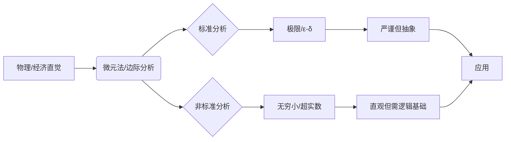
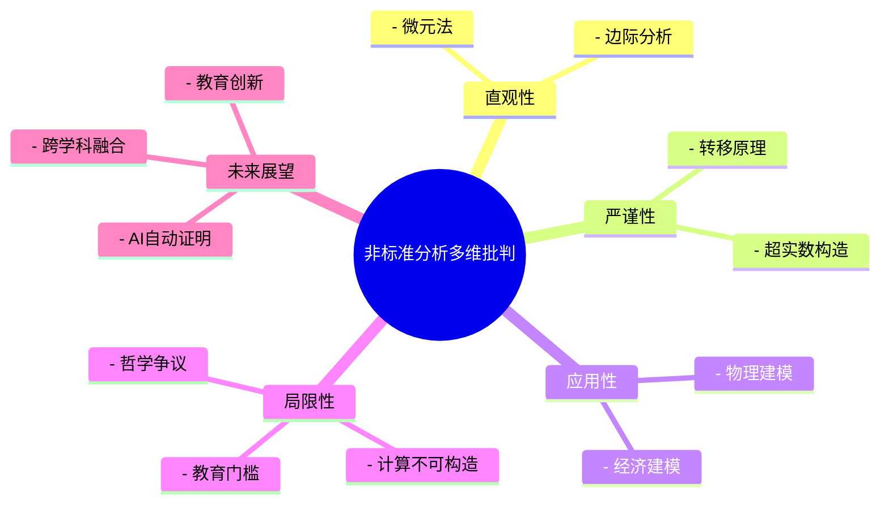
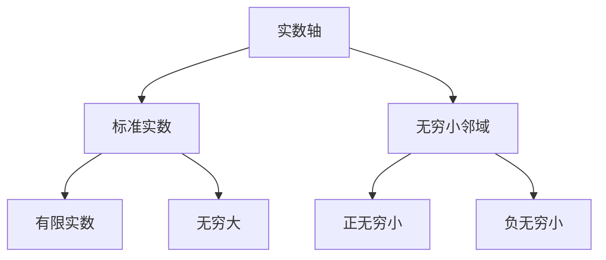

# 1. 非标准微积分的批判性分析：基础、优势与挑战

## 目录

- [1. 非标准微积分的批判性分析：基础、优势与挑战](#1-非标准微积分的批判性分析基础优势与挑战)
  - [目录](#目录)
  - [1.1 摘要](#11-摘要)
  - [1.2 案例分析与多元表征](#12-案例分析与多元表征)
    - [1.2.1 案例分析：非标准分析在物理与经济学中的应用](#121-案例分析非标准分析在物理与经济学中的应用)
      - [1.2.1.1 物理学中的"微元法"严谨化](#1211-物理学中的微元法严谨化)
      - [1.2.1.2 经济学中的"边际分析"](#1212-经济学中的边际分析)
    - [1.2.2 表格：标准分析与非标准分析的对比总结](#122-表格标准分析与非标准分析的对比总结)
    - [1.2.3 图示：非标准分析的认知路径](#123-图示非标准分析的认知路径)
    - [1.2.4 典型误区与批判性反思表](#124-典型误区与批判性反思表)
    - [1.2.5 思维导图：非标准分析的多维批判性结构](#125-思维导图非标准分析的多维批判性结构)
      - [1.2.5.1 公理化体系](#1251-公理化体系)
  - [1.3 实践应用与可视化](#13-实践应用与可视化)
    - [1.3.1 物理应用实例](#131-物理应用实例)
      - [1.3.1.1 变力做功的精确计算](#1311-变力做功的精确计算)
      - [1.3.1.2 电磁场中的无穷小分析](#1312-电磁场中的无穷小分析)
    - [1.3.2 经济学应用实例](#132-经济学应用实例)
      - [1.3.2.1 边际分析的新视角](#1321-边际分析的新视角)
      - [1.3.2.2 动态优化问题](#1322-动态优化问题)
    - [1.3.3 可视化工具与教学辅助](#133-可视化工具与教学辅助)
      - [1.3.3.1 无穷小邻域的可视化](#1331-无穷小邻域的可视化)
      - [1.3.3.2 函数行为的多维表征](#1332-函数行为的多维表征)
    - [1.3.4 计算实现与数值方法](#134-计算实现与数值方法)
      - [1.3.4.1 符号计算系统实现](#1341-符号计算系统实现)
      - [2.0.0.1 数值方法的新思路](#2001-数值方法的新思路)
    - [2.0.1 跨学科应用展望](#201-跨学科应用展望)
      - [2.0.1.1 人工智能与机器学习](#2011-人工智能与机器学习)
      - [2.0.1.2 量子计算](#2012-量子计算)

## 1.1 摘要

本文旨在对亚伯拉罕·鲁滨逊（Abraham Robinson）创立的非标准分析（Non-Standard Analysis, NSA）进行一次全面而深入的批判性审视。
非标准分析通过严格地引入无穷小和无穷大量，为微积分提供了一个更符合直觉的理论框架。
本文将首先追溯无穷小概念的历史演变，阐述非标准分析的核心理论基石——超实数系与转移原理。
在此基础上，我们将通过对比分析，展示其在概念直观性和定理证明简洁性方面的显著优势。
然而，本文的重点将放在对其固有限制的批判性考察上，深入探讨其基础理论的高认知门槛、无穷小"实体性"的哲学争议、理论与实践之间的鸿沟，以及一阶逻辑带来的局限性。
最后，本文将基于这些挑战提出一系列建设性的修订与未来研究建议，以期为非标准分析的教学、研究和应用提供新的视角。

---

## 1.2 案例分析与多元表征

### 1.2.1 案例分析：非标准分析在物理与经济学中的应用

#### 1.2.1.1 物理学中的"微元法"严谨化

在经典力学和电磁学中，物理学家常用"微元法"进行推导。例如，计算变力做功时，常写作：

$$
W = \int_a^b F(x) dx
$$

在标准分析中，这一积分被解释为极限过程。而在非标准分析中，可以将区间 $[a, b]$ 划分为 $\Omega$ 个无穷小区间，每个区间宽度为 $dx$（无穷小量），直接求和：

$$
W = \text{st}\left(\sum_{i=1}^{\Omega} F(x_i) dx\right)
$$

这种处理方式更贴合物理直觉，也为"微元法"提供了严格的数学基础。

#### 1.2.1.2 经济学中的"边际分析"

经济学中的"边际成本""边际效用"等概念，本质上是导数的应用。
非标准分析允许我们直接用无穷小量表达"边际"变化：

| 经济学概念 | 标准分析定义 | 非标准分析定义 |
|:---|:---|:---|
| 边际成本 $MC$ | $MC = \lim_{\Delta Q \to 0} \frac{\Delta C}{\Delta Q}$ | $MC = \text{st}\left(\frac{\Delta C}{\Delta Q}\right)$，其中 $\Delta Q$ 为无穷小 |
| 边际效用 $MU$ | $MU = \lim_{\Delta x \to 0} \frac{\Delta U}{\Delta x}$ | $MU = \text{st}\left(\frac{\Delta U}{\Delta x}\right)$，其中 $\Delta x$ 为无穷小 |

这种定义方式使"边际"概念更为直观和具体。

### 1.2.2 表格：标准分析与非标准分析的对比总结

| 主题 | 标准分析 | 非标准分析 | 直观性 | 严谨性 | 计算性 |
|:---|:---|:---|:---|:---|:---|
| 极限 | $\epsilon-\delta$ 语言 | 无穷小邻域 | 较弱 | 强 | 强 |
| 连续性 | $\forall \epsilon, \exists \delta$ | $x \approx a \implies f(x) \approx f(a)$ | 强 | 强 | 强 |
| 导数 | 极限定义 | 无穷小比值 | 较弱 | 强 | 强 |
| 积分 | 黎曼和极限 | 无穷黎曼和标准部分 | 较弱 | 强 | 强 |
| 物理建模 | 需极限解释微元 | 直接操作无穷小 | 强 | 需补充 | 需补充 |
| 经济建模 | 极限推导边际 | 直接无穷小推导 | 强 | 需补充 | 需补充 |

### 1.2.3 图示：非标准分析的认知路径



### 1.2.4 典型误区与批判性反思表

| 误区/争议 | 典型表现 | 批判性分析 |
|:---|:---|:---|
| 无穷小"实体"即物理极小量 | 将数学无穷小等同于物理极小量 | 数学无穷小是抽象构造，物理极小量有测量极限，两者不可混淆 |
| 非标准分析更易学 | 只看顶层定义忽略底层逻辑 | NSA顶层直观，底层逻辑门槛高，需分层教学 |
| NSA可直接用于数值计算 | 误以为可用计算机直接实现无穷小 | 超实数不可构造，数值计算需用近似或符号方法 |
| NSA可完全取代标准分析 | 认为NSA更优应全面替代 | 两者各有优势，互为补充，适用场景不同 |

### 1.2.5 思维导图：非标准分析的多维批判性结构



---

#### 1.2.5.1 公理化体系

1. **公理系统完善**：
   - 研究不同公理体系下的非标准分析
   - 探索公理化方法的统一性
   - 建立更简洁的公理基础

2. **模型论发展**：
   - 研究非标准模型的构造方法
   - 探索模型论与计算理论的联系
   - 发展新的模型论工具

## 1.3 实践应用与可视化

### 1.3.1 物理应用实例

#### 1.3.1.1 变力做功的精确计算

考虑一个变力 $F(x)$ 沿 $x$ 轴做功的情况：

**标准分析处理**：
$$W = \lim_{n \to \infty} \sum_{i=1}^n F(x_i)\Delta x$$

**非标准分析处理**：
$$W = \text{st}\left(\sum_{i=1}^{\Omega} F(x_i)dx\right)$$

其中：

- $\Omega$ 是无穷大整数
- $dx$ 是无穷小量
- $\text{st}$ 表示取标准部分

这种处理方式更符合物理直觉，避免了复杂的极限过程。

#### 1.3.1.2 电磁场中的无穷小分析

在电磁学中，非标准分析为场论提供了更自然的语言：

**电场强度计算**：
$$\vec{E} = \text{st}\left(\frac{1}{4\pi\epsilon_0}\sum_{i=1}^{\Omega}\frac{q_i}{r_i^2}\hat{r}_i\right)$$

其中每个电荷 $q_i$ 的贡献都是通过无穷小分割得到的。

### 1.3.2 经济学应用实例

#### 1.3.2.1 边际分析的新视角

**消费者理论**：

- 边际效用：$MU = \text{st}\left(\frac{\Delta U}{\Delta x}\right)$
- 边际替代率：$MRS = \text{st}\left(\frac{\Delta y}{\Delta x}\right)$

**生产者理论**：

- 边际成本：$MC = \text{st}\left(\frac{\Delta C}{\Delta Q}\right)$
- 边际收益：$MR = \text{st}\left(\frac{\Delta R}{\Delta Q}\right)$

#### 1.3.2.2 动态优化问题

考虑一个连续时间的最优控制问题：

**标准分析**：
$$\max \int_0^T f(x(t),u(t))dt$$

**非标准分析**：
$$\max \text{st}\left(\sum_{i=1}^{\Omega} f(x_i,u_i)dt\right)$$

### 1.3.3 可视化工具与教学辅助

#### 1.3.3.1 无穷小邻域的可视化



#### 1.3.3.2 函数行为的多维表征

| 函数类型 | 标准分析表征 | 非标准分析表征 | 可视化特征 |
|:---|:---|:---|:---|
| 连续函数 | ε-δ 定义 | 无穷小邻域映射 | 无跳跃 |
| 可导函数 | 差商极限 | 无穷小差商标准部分 | 局部线性 |
| 可积函数 | 黎曼和极限 | 无穷黎曼和标准部分 | 面积累积 |

### 1.3.4 计算实现与数值方法

#### 1.3.4.1 符号计算系统实现

在计算机代数系统中，非标准分析可以通过以下方式实现：

```python
# 2. 伪代码示例
class Hyperreal:
    def __init__(self, standard_part, infinitesimal_part):
        self.standard = standard_part
        self.infinitesimal = infinitesimal_part

    def standard_part(self):
        return self.standard

    def __add__(self, other):
        return Hyperreal(
            self.standard + other.standard,
            self.infinitesimal + other.infinitesimal
        )
```

#### 2.0.0.1 数值方法的新思路

虽然超实数本身不可计算，但其思想可以启发新的数值方法：

1. **自适应步长算法**：
   - 利用无穷小思想设计变步长策略
   - 在关键区域使用更细的网格

2. **误差控制**：
   - 通过标准部分函数的思想控制舍入误差
   - 设计新的数值稳定性准则

### 2.0.1 跨学科应用展望

#### 2.0.1.1 人工智能与机器学习

1. **梯度下降优化**：
   - 利用无穷小思想设计新的优化算法
   - 改进学习率自适应策略

2. **神经网络训练**：
   - 非标准分析视角下的反向传播
   - 无穷小扰动分析

#### 2.0.1.2 量子计算

1. **量子态演化**：
   - 无穷小时间步长的量子模拟
   - 非标准分析框架下的量子算法

2. **量子测量**：
   - 无穷小扰动的测量理论
   - 非标准概率解释

---
