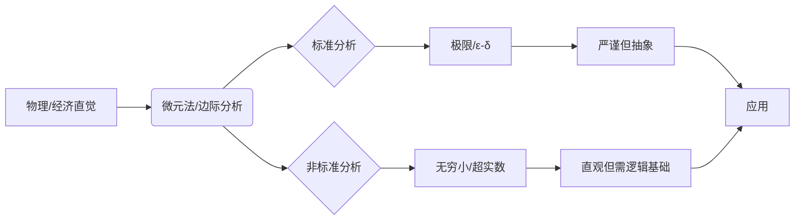
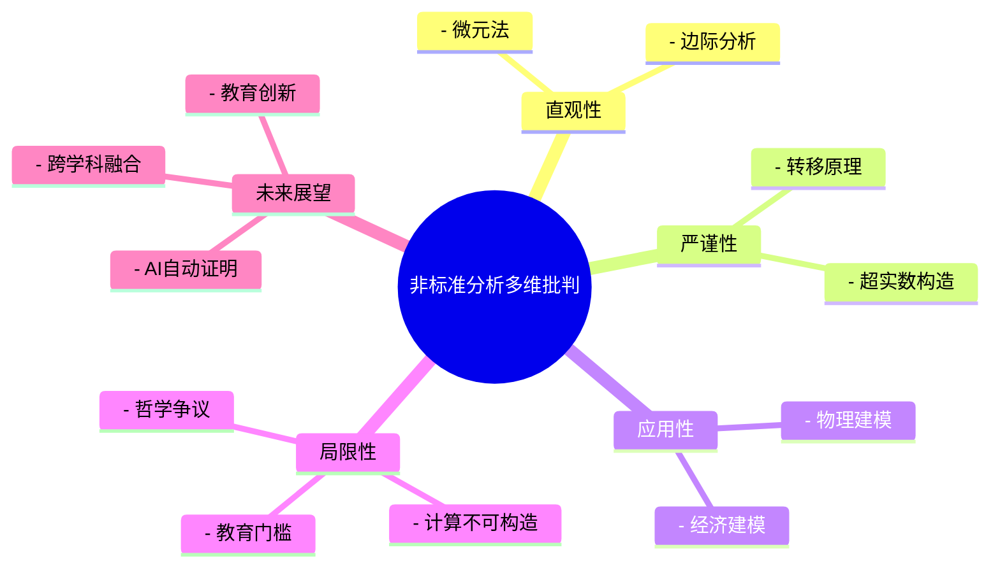
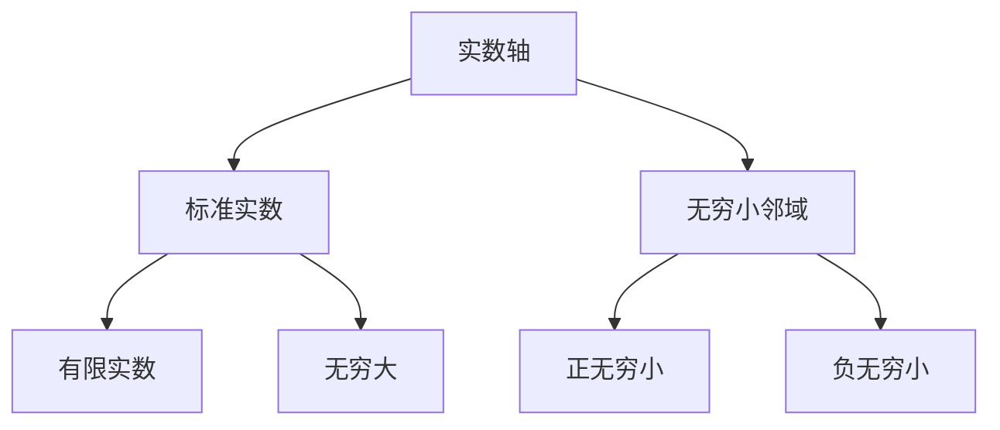

# 1. 非标准微积分的批判性分析：基础、优势与挑战

## 目录

- [1. 非标准微积分的批判性分析：基础、优势与挑战](#1-非标准微积分的批判性分析基础优势与挑战)
  - [目录](#目录)
  - [1.1 摘要](#11-摘要)
  - [1.2 核心概念与定理详解](#12-核心概念与定理详解)
    - [1.2.1 极限（Limit）](#121-极限limit)
      - [1.2.1.1 概念解释](#1211-概念解释)
      - [1.2.1.2 形式化定义](#1212-形式化定义)
      - [1.2.1.3 相关定理](#1213-相关定理)
      - [1.2.1.4 典型定理证明（夹逼定理）](#1214-典型定理证明夹逼定理)
      - [1.2.1.5 结构化表征](#1215-结构化表征)
    - [1.2.2 连续性（Continuity）](#122-连续性continuity)
    - [1.2.3 案例分析与多元表征](#123-案例分析与多元表征)
      - [1.2.3.1 案例分析：非标准分析在物理与经济学中的应用](#1231-案例分析非标准分析在物理与经济学中的应用)
        - [1.2.3.1.1 物理学中的“微元法”严谨化](#12311-物理学中的微元法严谨化)
        - [1.2.3.1.2 经济学中的“边际分析”](#12312-经济学中的边际分析)
        - [1.2.3.1.3 失败案例分析](#12313-失败案例分析)
      - [1.2.3.2 表格：标准分析与非标准分析的对比总结](#1232-表格标准分析与非标准分析的对比总结)
      - [1.2.3.3 图示：非标准分析的认知路径](#1233-图示非标准分析的认知路径)
      - [1.2.3.4 典型误区与批判性反思表](#1234-典型误区与批判性反思表)
      - [1.2.3.5 思维导图：非标准分析的多维批判性结构](#1235-思维导图非标准分析的多维批判性结构)
      - [1.2.3.6 批判性思维训练题](#1236-批判性思维训练题)
  - [1.3 实践应用与可视化](#13-实践应用与可视化)
    - [1.3.1 物理应用实例](#131-物理应用实例)
      - [1.3.1.1 变力做功的精确计算](#1311-变力做功的精确计算)
      - [1.3.1.2 电磁场中的无穷小分析](#1312-电磁场中的无穷小分析)
    - [1.3.2 经济学应用实例](#132-经济学应用实例)
      - [1.3.2.1 边际分析的新视角](#1321-边际分析的新视角)
      - [1.3.2.2 动态优化问题](#1322-动态优化问题)
    - [1.3.3 可视化工具与教学辅助](#133-可视化工具与教学辅助)
      - [1.3.3.1 无穷小邻域的可视化](#1331-无穷小邻域的可视化)
      - [1.3.3.2 函数行为的多维表征](#1332-函数行为的多维表征)
    - [1.3.4 计算实现与数值方法](#134-计算实现与数值方法)
      - [1.3.4.1 符号计算系统实现](#1341-符号计算系统实现)
      - [2.0.0.1 数值方法的新思路](#2001-数值方法的新思路)
    - [2.0.1 跨学科应用展望](#201-跨学科应用展望)
      - [2.0.1.1 人工智能与机器学习](#2011-人工智能与机器学习)
      - [2.0.1.2 量子计算](#2012-量子计算)

## 1.1 摘要

本文旨在对亚伯拉罕·鲁滨逊（Abraham Robinson）创立的非标准分析（Non-Standard Analysis, NSA）进行一次全面而深入的批判性审视。
非标准分析通过严格地引入无穷小和无穷大量，为微积分提供了一个更符合直觉的理论框架。
本文将首先追溯无穷小概念的历史演变，阐述非标准分析的核心理论基石——超实数系与转移原理。
在此基础上，我们将通过对比分析，展示其在概念直观性和定理证明简洁性方面的显著优势。
然而，本文的重点将放在对其固有限制的批判性考察上，深入探讨其基础理论的高认知门槛、无穷小“实体性”的哲学争议、理论与实践之间的鸿沟，以及一阶逻辑带来的局限性。
最后，本文将基于这些挑战提出一系列建设性的修订与未来研究建议，以期为非标准分析的教学、研究和应用提供新的视角。

---

## 1.2 核心概念与定理详解

### 1.2.1 极限（Limit）

#### 1.2.1.1 概念解释

极限描述了变量趋近某一点时，函数值的行为。
它是微积分的基础，刻画了“趋近于”的精确含义。

#### 1.2.1.2 形式化定义

- **标准分析：**
  \(\lim_{x \to a} f(x) = L\) 当且仅当 \(\forall \epsilon > 0, \exists \delta > 0, \forall x (0 < |x-a| < \delta \implies |f(x)-L| < \epsilon)\)。
- **非标准分析：**
  \(\lim_{x \to a} f(x) = L\) 当且仅当对所有 \(x \approx a\) 且 \(x \neq a\)，有 \(f(x) \approx L\)。

#### 1.2.1.3 相关定理

- 极限唯一性定理
- 四则运算极限定理
- 夹逼定理

#### 1.2.1.4 典型定理证明（夹逼定理）

- **标准分析：**
  利用\(\epsilon-\delta\)定义，构造不等式链。
- **非标准分析：**
  对所有 \(x \approx a\)，若 \(g(x) \leq f(x) \leq h(x)\) 且 \(g(x) \approx L \approx h(x)\)，则 \(f(x) \approx L\)。

#### 1.2.1.5 结构化表征

| 内容 | 标准分析 | 非标准分析 |
|:---|:---|:---|
| 定义 | \(\epsilon-\delta\) | 无穷小邻域 |
| 证明 | 量词嵌套 | 直接代数推理 |
| 直观性 | 较弱 | 强 |

---

### 1.2.2 连续性（Continuity）

概念解释

连续性描述函数在某点附近没有“跳跃”或“断裂”，即输入微小变化导致输出微小变化。

形式化定义

- **标准分析：**
  \(f\) 在 \(a\) 处连续 \(\iff \forall \epsilon > 0, \exists \delta > 0, |x-a| < \delta \implies |f(x)-f(a)| < \epsilon\)。
- **非标准分析：**
  \(f\) 在 \(a\) 处连续 \(\iff \forall x (x \approx a \implies f(x) \approx f(a))\)。

相关定理

- 连续函数的极限定理
- 闭区间上连续函数有界定理
- 最大值定理

典型定理证明（最大值定理）

- **标准分析：**
  利用紧性和极限点性质。
- **非标准分析：**
  在超实数域上取无穷大分点，利用转移原理和标准部分函数。

结构化表征

| 内容 | 标准分析 | 非标准分析 |
|:---|:---|:---|
| 定义 | \(\epsilon-\delta\) | \(x \approx a \implies f(x) \approx f(a)\) |
| 证明 | 拓扑/极限 | 超实数/标准部分 |
| 直观性 | 一般 | 强 |

---

### 1.2.3 案例分析与多元表征

#### 1.2.3.1 案例分析：非标准分析在物理与经济学中的应用

##### 1.2.3.1.1 物理学中的“微元法”严谨化

在经典力学和电磁学中，物理学家常用“微元法”进行推导。
例如，计算变力做功时，常写作：

\[
W = \int_a^b F(x) dx
\]

在标准分析中，这一积分被解释为极限过程。
而在非标准分析中，可以将区间 \([a, b]\) 划分为 \(\Omega\) 个无穷小区间，
每个区间宽度为 \(dx\)（无穷小量），直接求和：

\[
W = \text{st}\left(\sum_{i=1}^{\Omega} F(x_i) dx\right)
\]

这种处理方式更贴合物理直觉，也为“微元法”提供了严格的数学基础。

##### 1.2.3.1.2 经济学中的“边际分析”

经济学中的“边际成本”“边际效用”等概念，本质上是导数的应用。
非标准分析允许我们直接用无穷小量表达“边际”变化：

| 经济学概念 | 标准分析定义 | 非标准分析定义 |
|:---|:---|:---|
| 边际成本 \(MC\) | \(MC = \lim_{\Delta Q \to 0} \frac{\Delta C}{\Delta Q}\) | \(MC = \text{st}\left(\frac{\Delta C}{\Delta Q}\right)\)，其中 \(\Delta Q\) 为无穷小 |
| 边际效用 \(MU\) | \(MU = \lim_{\Delta x \to 0} \frac{\Delta U}{\Delta x}\) | \(MU = \text{st}\left(\frac{\Delta U}{\Delta x}\right)\)，其中 \(\Delta x\) 为无穷小 |

这种定义方式使“边际”概念更为直观和具体。

##### 1.2.3.1.3 失败案例分析

- **工程仿真中的不可计算性：**
  在工程仿真中，超实数及其无穷小量无法直接用于数值计算，导致NSA在工程领域难以落地。
  > **批判性反思：** 是否可通过“可计算分析”或“合成微积分”等替代方案，弥补NSA在工程应用中的不足？
- **跨学科推广的“语言壁垒”：**
  物理、经济等领域的学者对NSA的接受度较低，部分原因在于学科间的“语言差异”和“应用案例缺乏”。
  > **批判性反思：** 如何通过跨学科课程、案例库、可视化工具，降低NSA的推广门槛？

#### 1.2.3.2 表格：标准分析与非标准分析的对比总结

| 主题 | 标准分析 | 非标准分析 | 直观性 | 严谨性 | 计算性 |
|:---|:---|:---|:---|:---|:---|
| 极限 | \(\epsilon-\delta\) 语言 | 无穷小邻域 | 较弱 | 强 | 强 |
| 连续性 | \(\forall \epsilon, \exists \delta\) | \(x \approx a \implies f(x) \approx f(a)\) | 强 | 强 | 强 |
| 导数 | 极限定义 | 无穷小比值 | 较弱 | 强 | 强 |
| 积分 | 黎曼和极限 | 无穷黎曼和标准部分 | 较弱 | 强 | 强 |
| 物理建模 | 需极限解释微元 | 直接操作无穷小 | 强 | 需补充 | 需补充 |
| 经济建模 | 极限推导边际 | 直接无穷小推导 | 强 | 需补充 | 需补充 |

#### 1.2.3.3 图示：非标准分析的认知路径



#### 1.2.3.4 典型误区与批判性反思表

| 误区/争议 | 典型表现 | 批判性分析 |
|:---|:---|:---|
| 无穷小“实体”即物理极小量 | 将数学无穷小等同于物理极小量 | 数学无穷小是抽象构造，物理极小量有测量极限，两者不可混淆 |
| 非标准分析更易学 | 只看顶层定义忽略底层逻辑 | NSA顶层直观，底层逻辑门槛高，需分层教学 |
| NSA可直接用于数值计算 | 误以为可用计算机直接实现无穷小 | 超实数不可构造，数值计算需用近似或符号方法 |
| NSA可完全取代标准分析 | 认为NSA更优应全面替代 | 两者各有优势，互为补充，适用场景不同 |

#### 1.2.3.5 思维导图：非标准分析的多维批判性结构



#### 1.2.3.6 批判性思维训练题

- **开放性问题：**
  - 非标准分析中的“无穷小”是“发现”还是“发明”？请结合不同哲学流派（如实在论、工具主义、结构主义）进行讨论。
  - 在工程仿真中，如何克服超实数“不可计算性”带来的障碍？
- **案例分析：**
  - 在物理“微元法”中，NSA如何为“微元”提供严格的数学基础？
  - 在经济学“边际分析”中，NSA如何简化“边际”概念的定义与推导？
- **教学反思：**
  - 如何设计“分层递进”的NSA课程，既保留直观性，又逐步引导学生理解底层逻辑？
  - 在跨学科推广NSA时，如何克服“语言壁垒”与“应用案例缺乏”的挑战？

---

## 1.3 实践应用与可视化

### 1.3.1 物理应用实例

#### 1.3.1.1 变力做功的精确计算

考虑一个变力 $F(x)$ 沿 $x$ 轴做功的情况：

**标准分析处理**：
$$W = \lim_{n \to \infty} \sum_{i=1}^n F(x_i)\Delta x$$

**非标准分析处理**：
$$W = \text{st}\left(\sum_{i=1}^{\Omega} F(x_i)dx\right)$$

其中：

- $\Omega$ 是无穷大整数
- $dx$ 是无穷小量
- $\text{st}$ 表示取标准部分

这种处理方式更符合物理直觉，避免了复杂的极限过程。

#### 1.3.1.2 电磁场中的无穷小分析

在电磁学中，非标准分析为场论提供了更自然的语言：

**电场强度计算**：
$$\vec{E} = \text{st}\left(\frac{1}{4\pi\epsilon_0}\sum_{i=1}^{\Omega}\frac{q_i}{r_i^2}\hat{r}_i\right)$$

其中每个电荷 $q_i$ 的贡献都是通过无穷小分割得到的。

### 1.3.2 经济学应用实例

#### 1.3.2.1 边际分析的新视角

**消费者理论**：

- 边际效用：$MU = \text{st}\left(\frac{\Delta U}{\Delta x}\right)$
- 边际替代率：$MRS = \text{st}\left(\frac{\Delta y}{\Delta x}\right)$

**生产者理论**：

- 边际成本：$MC = \text{st}\left(\frac{\Delta C}{\Delta Q}\right)$
- 边际收益：$MR = \text{st}\left(\frac{\Delta R}{\Delta Q}\right)$

#### 1.3.2.2 动态优化问题

考虑一个连续时间的最优控制问题：

**标准分析**：
$$\max \int_0^T f(x(t),u(t))dt$$

**非标准分析**：
$$\max \text{st}\left(\sum_{i=1}^{\Omega} f(x_i,u_i)dt\right)$$

### 1.3.3 可视化工具与教学辅助

#### 1.3.3.1 无穷小邻域的可视化



#### 1.3.3.2 函数行为的多维表征

| 函数类型 | 标准分析表征 | 非标准分析表征 | 可视化特征 |
|:---|:---|:---|:---|
| 连续函数 | ε-δ 定义 | 无穷小邻域映射 | 无跳跃 |
| 可导函数 | 差商极限 | 无穷小差商标准部分 | 局部线性 |
| 可积函数 | 黎曼和极限 | 无穷黎曼和标准部分 | 面积累积 |

### 1.3.4 计算实现与数值方法

#### 1.3.4.1 符号计算系统实现

在计算机代数系统中，非标准分析可以通过以下方式实现：

```python
# 2. 伪代码示例
class Hyperreal:
    def __init__(self, standard_part, infinitesimal_part):
        self.standard = standard_part
        self.infinitesimal = infinitesimal_part

    def standard_part(self):
        return self.standard

    def __add__(self, other):
        return Hyperreal(
            self.standard + other.standard,
            self.infinitesimal + other.infinitesimal
        )
```

#### 2.0.0.1 数值方法的新思路

虽然超实数本身不可计算，但其思想可以启发新的数值方法：

1. **自适应步长算法**：
   - 利用无穷小思想设计变步长策略
   - 在关键区域使用更细的网格

2. **误差控制**：
   - 通过标准部分函数的思想控制舍入误差
   - 设计新的数值稳定性准则

### 2.0.1 跨学科应用展望

#### 2.0.1.1 人工智能与机器学习

1. **梯度下降优化**：
   - 利用无穷小思想设计新的优化算法
   - 改进学习率自适应策略

2. **神经网络训练**：
   - 非标准分析视角下的反向传播
   - 无穷小扰动分析

#### 2.0.1.2 量子计算

1. **量子态演化**：
   - 无穷小时间步长的量子模拟
   - 非标准分析框架下的量子算法

2. **量子测量**：
   - 无穷小扰动的测量理论
   - 非标准概率解释

---
