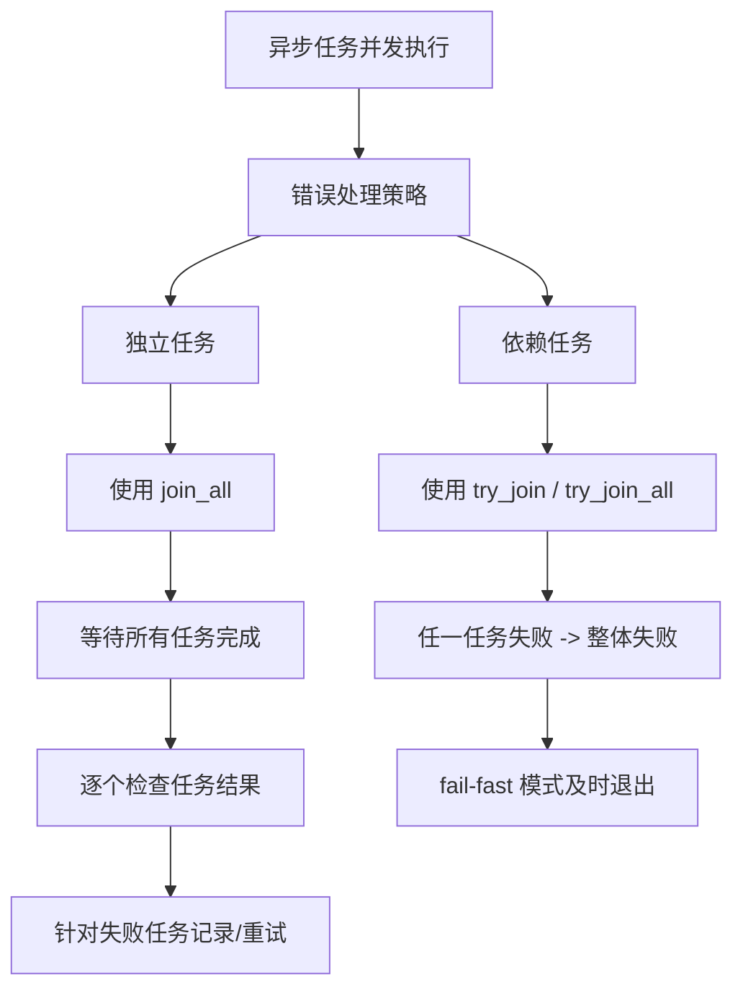

# 1. Rust 异步编程中的错误处理

## 目录

- [1. Rust 异步编程中的错误处理](#1-rust-异步编程中的错误处理)
  - [目录](#目录)
  - [1.1 代码说明](#11-代码说明)
  - [1.2 思维导图](#12-思维导图)
  - [1.3 总结](#13-总结)
  - [1.4 显式处理机制](#14-显式处理机制)
    - [1.4.1 显式同步原语](#141-显式同步原语)
    - [1.4.2 合理的锁粒度和设计](#142-合理的锁粒度和设计)
  - [1.5 隐式处理机制](#15-隐式处理机制)
    - [1.5.1 编译器的类型检查与借用检查](#151-编译器的类型检查与借用检查)
    - [1.5.2 异步任务本质上的协作式调度](#152-异步任务本质上的协作式调度)
  - [1.6 示例说明](#16-示例说明)
  - [1.7 思维导图](#17-思维导图)
  - [1.8 总结](#18-总结)

## 1.1 代码说明

1. **自定义错误类型**
   使用 `TaskError` 作为示例错误类型，并给出实现 `Display` 和 `Error` trait，使得错误信息具有可读性。

2. **异步任务模拟**
   `async_task` 模拟一个异步操作，根据传入的 `id` 决定延时和是否返回错误，此处模拟当 `id==3` 时产生错误。

3. **独立任务处理（场景 1）**
   在 `run_tasks_independently` 中使用 `futures::future::join_all` 等待所有任务执行完后，通过遍历各任务结果分别处理成功和失败的情况，这样即使某个任务失败，也不会影响其他任务的执行结果。

4. **失败即终止模式（场景 2）**
   在 `run_tasks_with_fail_fast` 中使用 `try_join_all`（或你也可以采用 `tokio::try_join!` 宏），一旦任一任务返回错误，整个组合 Future 将提前返回错误（fail-fast），适用于任务彼此依赖的场景。

通过这两种方式，我们可以根据业务场景灵活选择如何处理多个异步任务的错误。
当任务之间无关时，建议将每个任务的错误独立处理、记录日志或者进行重试。
当各任务存在依赖关系时，使用 fail-fast 模式可以及时退出，避免不必要的等待。

## 1.2 思维导图

下面使用 Mermaid 绘制思维导图，展示并发执行任务时优雅处理错误的大致流程：



---

## 1.3 总结

- **独立任务场景**
  使用 `join_all` 收集所有任务结果，并逐个处理错误，不会因为某个任务失败而影响其它任务的执行。

- **依赖任务场景**
  使用 `try_join!` 或 `try_join_all` 确保一旦任一任务失败立即返回错误，避免后续依赖无效任务的继续执行。

- **优雅处理思路**
  1. 根据具体场景选择并发组合方式。
  2. 定义清晰的错误类型和错误处理策略（记录日志、重试、容错恢复等）。
  3. 使用组合器（如 join_all/try_join_all）结合 Rust 的 async/await 机制，保证代码简洁且语义明确。

这样，我们就能够在 Rust 的 async 编程中优雅地处理多个任务并发执行时的失败问题。

下面说明 Rust 异步编程在多线程调度下如何通过显式和隐式两方面来保证任务处理的线程安全性、防止死锁、数据竞争等问题。
简单来说，Rust 的设计确保了在多线程调度下，如果按照正确的模式来编写代码，就不会出现竞态条件和死锁等常见并发问题。
下面详细介绍这两种机制。

---

## 1.4 显式处理机制

### 1.4.1 显式同步原语

- **锁 (Mutex、RwLock)**
  当多个任务需要共享可变数据时，必须显式使用同步原语，比如 `std::sync::Mutex` 或异步环境下常用的 `tokio::sync::Mutex`。使用这些锁时，程序员必须明确地请求锁、操作共享数据，再释放锁。
  例如，在异步任务中用 `await` 获得锁时，只有持有锁的代码块被保护，其他任务等待锁释放后再执行，从而避免数据竞争。

- **显式任务调度**
  使用异步运行时（如 Tokio）的 `spawn` 或相关接口时，程序员明确地将任务投递到多线程执行器中。此时，编译器会要求任务中的数据类型必须实现 `Send` 特质，确保数据可以在线程间安全传递。

### 1.4.2 合理的锁粒度和设计

- 避免在持锁期间使用 `.await`（或尽量缩小锁的持有范围），减少死锁风险。
- 显式设计任务间的依赖，确保不同任务之间的资源竞争点清晰，能通过设计约定避免循环依赖等死锁风险。

---

## 1.5 隐式处理机制

### 1.5.1 编译器的类型检查与借用检查

- **Send/Sync 限制**
  Rust 的类型系统要求：所有在多线程环境下传递的数据必须实现 `Send`，而共享引用必须是 `Sync`。这种隐式检查在编译期就能捕获不安全的内部状态，不允许非线程安全的类型在多线程环境中使用。如果某个数据类型未能正确实现这些特质，编译器会报错，从而确保在运行时不会出现数据竞争。

- **借用检查**
  Rust 编译器利用借用检查器，确保同一时刻可变引用和不可变引用的使用不会导致数据混乱。这种隐式机制大大降低了数据竞争的风险，同时也使得开发者无需在运行时额外插入检查代码。

### 1.5.2 异步任务本质上的协作式调度

- **协作式任务切换**
  Rust 的 async/await 模型采用协作式调度，即任务在遇到 `.await` 调用时显式让出当前线程，这保证了异步任务不会在临界区意外被中断。因为任务主动让出执行权，所以可以避免很多传统并发模型下因抢占式调度导致的死锁或资源抢占问题——只要开发者避免在持锁状态下调用 `.await`，就不会引入死锁隐患。

## 1.6 示例说明

下面以一个简单示例说明在 Tokio 环境下如何使用显式同步原语，同时借助编译器隐式约束，保证多线程调度下任务的安全执行：

```rust:src/async_thread_safe.rs
use tokio::sync::Mutex;
use std::sync::Arc;
use tokio::time::{sleep, Duration};

// 模拟异步任务，更新共享计数器
async fn async_task(counter: Arc<Mutex<i32>>) {
    // 显式请求锁，保证对共享数据的独占访问
    let mut num = counter.lock().await;
    *num += 1;
    println!("Task updated counter to: {}", *num);

    // 模拟耗时操作（注意避免在持锁期间长时间等待）
    sleep(Duration::from_millis(100)).await;
    // 离开作用域自动释放锁
}

#[tokio::main]
async fn main() {
    // 共享数据必须使用 Arc 包裹，并配合 Mutex 保护
    let counter = Arc::new(Mutex::new(0));
    let mut handles = Vec::new();

    // 显式地将任务分派到多线程执行器中（编译器会检测任务是否是 Send）
    for _ in 0..10 {
        let counter = Arc::clone(&counter);
        let handle = tokio::spawn(async_task(counter));
        handles.push(handle);
    }

    // 等待所有任务完成
    for handle in handles {
        handle.await.unwrap();
    }

    println!("Final counter value: {}", *counter.lock().await);
}
```

> **说明：**
程序中使用显式的 `tokio::sync::Mutex` 及 `Arc` 来保护共享状态，并通过 `tokio::spawn` 将任务分派到线程池中。
编译器要求传递给 `spawn` 的任务必须满足 `Send`，这就是隐式保证多线程安全的一部分。
合理设计锁范围（尽量在操作完毕后释放锁，再进行耗时异步等待）降低了死锁可能性。

## 1.7 思维导图

下面使用 Mermaid 绘制思维导图，展示 Rust async 并发编程中显式同步及隐式安全机制的内在关系：

```mermaid
flowchart TD
    A[Rust Async 多线程调度]
    A --> B[显式机制]
    B --> B1[显式任务调度 (tokio::spawn)]
    B --> B2[同步原语 (Mutex, RwLock)]
    B --> B3[设计约定：缩小锁粒度，避免持锁 Await]

    A --> C[隐式机制]
    C --> C1[编译器类型检查]
    C1 --> C1a[Send/Sync 限制]
    C1 --> C1b[借用检查]
    C --> C2[协作式任务切换]
    C2 --> C2a[任务主动让出 (await)]
    C2 --> C2b[降低抢占式多线程风险]
```

## 1.8 总结

- **显式处理：**
  程序员需要在代码中明确使用同步原语（如 Mutex）和任务调度接口（如 tokio::spawn），避免在关键临界区中出现长时间阻塞或不当等待，从而防止死锁和数据竞争。

- **隐式处理：**
  Rust 编译器通过 Send/Sync 限制和借用检查自动保证共享数据的安全性；同时，协作式的 async/await 模型降低了传统抢占式多线程带来的并发问题。

借助这两套机制，Rust 的 async 并发编程在多线程调度下能够让每个任务的处理保持高安全性和稳定性，避免常见的死锁和竞争条件，从而使整个系统更健壮。
