# HTTP/RPC API 自动生成

下面介绍在 Rust 开源生态系统中，能够根据 API 规范自动生成代码的几种著名实现，
它们主要分布在 REST API、gRPC 和 GraphQL 等领域，下面逐一说明。

---

## 📋 目录

- [HTTP/RPC API 自动生成](#httprpc-api-自动生成)
  - [📋 目录](#-目录)
  - [1 基于 OpenAPISwagger 的 REST API 自动生成](#1-基于-openapiswagger-的-rest-api-自动生成)
    - [1.1 Paperclip](#11-paperclip)
    - [1.2 utoipa](#12-utoipa)
  - [2 gRPC API 自动生成](#2-grpc-api-自动生成)
    - [2.1 Tonic](#21-tonic)
    - [2.2 grpcio](#22-grpcio)
  - [3 GraphQL API 自动生成](#3-graphql-api-自动生成)
    - [3.1 async-graphql](#31-async-graphql)
  - [4 思维导图](#4-思维导图)
  - [5 小结](#5-小结)

---

## 1 基于 OpenAPISwagger 的 REST API 自动生成

### 1.1 Paperclip

- **定义与解释**：
  [Paperclip](https://github.com/wafflespeanut/paperclip) 是一个与
  [Actix-web](https://actix.rs/) 集成的库，能够根据 Rust 代码自动生成 OpenAPI（Swagger）文档，
  同时也支持部分代码生成。通过在路由和类型上使用特定的注解，可以获得 API 文档的生成，
  这对于前后端分离开发和接口测试非常方便。

- **用例**：
  在 Actix-web 中使用 Paperclip，只需对 Handler 函数加入注解，例如：

  ```rust:src/paperclip_example.rs
  use actix_web::{web, App, HttpResponse, HttpServer};
  use paperclip::actix::{api_v2_operation, OpenApiExt};

  #[api_v2_operation]
  async fn hello() -> HttpResponse {
      HttpResponse::Ok().body("Hello, world!")
  }

  #[actix_web::main]
  async fn main() -> std::io::Result<()> {
      HttpServer::new(|| {
          App::new()
              .wrap_api()
              .service(web::resource("/hello").to(hello))
              .with_json_spec_at("/api/spec")
              .build()
      })
      .bind("127.0.0.1:8080")?
      .run()
      .await
  }
  ```

  运行后，就可以在 `http://127.0.0.1:8080/api/spec` 地址访问自动生成的 OpenAPI JSON 文档。

### 1.2 utoipa

- **定义与解释**：
  [utoipa](https://github.com/johnthagen/utoipa) 是一个较新的轻量级库，通过 Rust 类型（结构体、枚举等）的派生宏（derive macros）自动生成 OpenAPI 文档。它的优点是使用方式简单、无需大量手写注解，适合希望快速生成 API 文档的项目。

- **用例**：
  对数据结构使用 `#[derive(utoipa::ToSchema)]`，并在 Handler 中调用自动生成的文档生成接口。例如：

  ```rust:src/utoipa_example.rs
  use utoipa::ToSchema;

  #[derive(ToSchema)]
  struct Pet {
      id: i32,
      name: String,
  }

  // 后续与 Web 框架（如 Actix-web 或 Rocket）集成后，
  // 可以生成完整的 OpenAPI spec，并提供一个端点供前端获取该 spec。
  ```

---

## 2 gRPC API 自动生成

### 2.1 Tonic

- **定义与解释**：
  [Tonic](https://github.com/hyperium/tonic) 是目前 Rust 生态中非常受欢迎的 gRPC 实现。它基于 [Prost](https://github.com/danburkert/prost) 来编译 Protocol Buffers 文件（.proto），并通过 [tonic-build](https://docs.rs/tonic-build) 自动生成客户端和服务端代码。

- **用例**：
  只需在项目的 `build.rs` 中配置 `tonic_build` 工具即可：

  ```rust:src/build.rs
  fn main() -> Result<(), Box<dyn std::error::Error>> {
      tonic_build::compile_protos("proto/helloworld.proto")?;
      Ok(())
  }
  ```

  在定义好 `.proto` 文件后，编译时会自动生成 Rust 模块，然后在服务端和客户端代码中直接使用这些生成的代码实现业务逻辑和调用服务。

### 2.2 grpcio

- **定义与解释**：
  [grpcio](https://github.com/pingcap/grpc-rs) 是另一种 gRPC 实现，提供了 C++ gRPC 的 Rust 封装，同样支持通过 `protoc` 插件自动生成代码。不过，由于 gRPC 生态的更新迭代，目前 Tonic 越来越受欢迎，因为其纯 Rust 实现更易于使用和维护。

---

## 3 GraphQL API 自动生成

### 3.1 async-graphql

- **定义与解释**：
  [async-graphql](https://github.com/async-graphql/async-graphql) 是目前 Rust 中功能较全面的 GraphQL 框架，它利用大量的 Rust 宏来生成 GraphQL Schema，减少了手写 Schema 描述的工作量，从而将 Rust 数据结构自动映射为 GraphQL 类型。

- **用例**：
  使用时只需对数据结构和 Resolver 加入宏标注：

  ```rust:src/async_graphql_example.rs
  use async_graphql::{Context, Object, Schema, SimpleObject};

  #[derive(SimpleObject)]
  struct Book {
      id: i32,
      title: String,
  }

  struct QueryRoot;

  #[Object]
  impl QueryRoot {
      async fn book(&self, _ctx: &Context<'_>, id: i32) -> Book {
          Book {
              id,
              title: "Rust Programming".to_owned(),
          }
      }
  }

  type MySchema = Schema<QueryRoot, async_graphql::EmptyMutation, async_graphql::EmptySubscription>;

  async fn create_schema() -> MySchema {
      Schema::build(QueryRoot, async_graphql::EmptyMutation, async_graphql::EmptySubscription)
          .finish()
  }
  ```

  上述代码利用宏自动生成 GraphQL Schema，提供了查询 API 的接口，同时配合 web 框架可以非常方便地部署 GraphQL 服务。

---

## 4 思维导图

下面使用 Mermaid 语法绘制一幅思维导图，总结上述 API 自动生成工具及其相关关系：

```mermaid:diagram/rust_api_codegen.mmd
graph TD
    A[Rust API 自动生成工具]
    A --> B[REST API]
    B --> B1[Paperclip]
    B1 --> B1a[与 Actix-web 集成]
    B1 --> B1b[生成 OpenAPI 文档]
    B --> B2[utoipa]
    B2 --> B2a[基于 derive 宏]
    B2 --> B2b[轻量自动生成 OpenAPI Spec]

    A --> C[gRPC API]
    C --> C1[Tonic]
    C1 --> C1a[基于 Prost]
    C1 --> C1b[自动生成客户端/服务端代码]
    C --> C2[grpcio]
    C2 --> C2a[C++ gRPC 封装]

    A --> D[GraphQL API]
    D --> D1[async-graphql]
    D1 --> D1a[自动生成 GraphQL Schema]
    D1 --> D1b[基于宏简化 Resolver 定义]
```



---

## 5 小结

- **REST API 自动生成**：
  - 通过 [Paperclip](https://github.com/wafflespeanut/paperclip) 可实现与 Actix-web 集成的自动 OpenAPI 生成；
  - [utoipa](https://github.com/johnthagen/utoipa) 提供基于 derive 宏的更轻量方式生成 API 文档。

- **gRPC API 自动生成**：
  - [Tonic](https://github.com/hyperium/tonic) 是当前广泛使用的纯 Rust gRPC 实现，结合 tonic-build 自动生成代码；
  - [grpcio](https://github.com/pingcap/grpc-rs) 则是对 C++ gRPC 的封装。

- **GraphQL API 自动生成**：
  - [async-graphql](https://github.com/async-graphql/async-graphql) 利用 Rust 宏实现了从数据结构自动生成 Schema，并简化了 Resolver 的书写。

通过这些工具，Rust 开发者可以从 API 规范文件自动生成代码，大大减少手动编码的工作量，提高开发效率并保持文档与代码的一致性。
