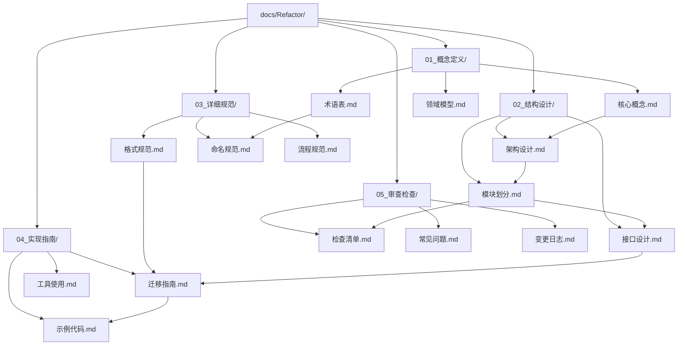
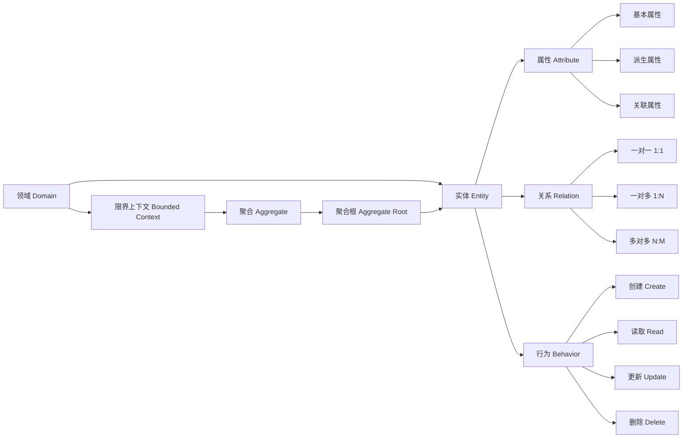
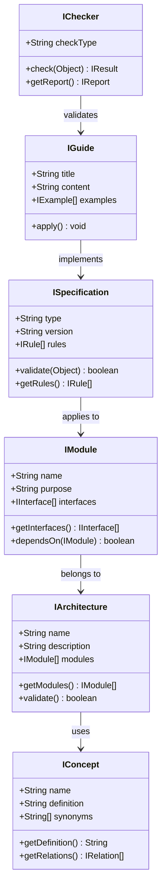

# 依赖关系图

## 文档间依赖关系

---

## 概念间引用关系

---

## 模块间接口

### 接口概览

| 模块 | 提供接口 | 依赖接口 | 说明 |
|------|----------|----------|------|
| 概念定义 | `IConcept` | - | 定义核心概念和术语 |
| 结构设计 | `IArchitecture`, `IModule` | `IConcept` | 基于概念进行结构设计 |
| 详细规范 | `ISpecification` | `IArchitecture` | 基于架构制定规范 |
| 实现指南 | `IGuide`, `ITool` | `ISpecification` | 基于规范提供实现指导 |
| 审查检查 | `IChecker` | `IGuide` | 验证实现是否符合规范 |

### 接口详细定义

---

## 文件引用矩阵

| 文件 | 被引用次数 | 引用其他文件数 | 关键依赖 |
|------|------------|----------------|----------|
| 核心概念.md | 5 | 1 | 术语表.md |
| 架构设计.md | 4 | 2 | 核心概念.md, 领域模型.md |
| 格式规范.md | 3 | 1 | 术语表.md |
| 迁移指南.md | 2 | 2 | 架构设计.md, 格式规范.md |
| 检查清单.md | 1 | 3 | 格式规范.md, 命名规范.md, 流程规范.md |

---

*最后更新: [自动更新日期]*
