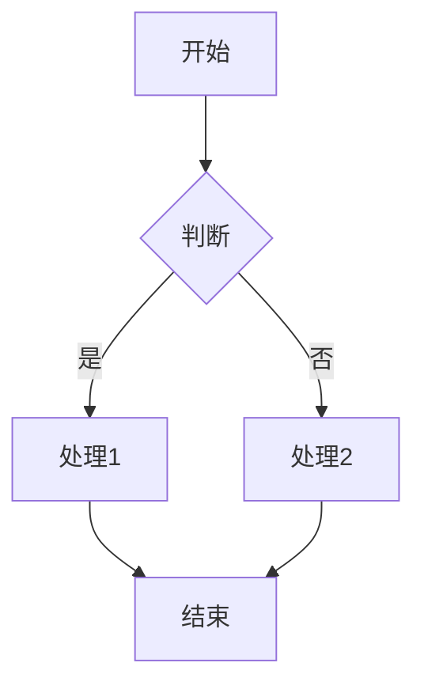

# 工作笔记

## 重构原则

### 核心原则

1. **渐进式重构**
   - 小步快跑，避免大规模一次性修改
   - 每次修改后验证，确保不破坏现有功能
   - 保留回滚能力

2. **保持可追溯性**
   - 记录所有变更决策
   - 保留新旧映射关系
   - 维护变更历史

3. **一致性优先**
   - 统一术语和命名
   - 统一格式和风格
   - 统一结构模式

4. **以读者为中心**
   - 考虑目标读者背景
   - 降低认知负担
   - 提供清晰的导航

### 决策原则

| 场景 | 原则 | 示例 |
|------|------|------|
| 内容冲突 | 以最新/最权威为准 | 同名术语不同定义 |
| 结构选择 | 以可读性优先 | 扁平 vs 层级 |
| 粒度确定 | 以独立理解为准 | 章节拆分粒度 |
| 链接策略 | 以内聚为准 | 相关文档链接 |

---

## 命名规范

### 文件命名

```
[序号]_[类别]_[名称].[扩展名]

示例：
01_concept_core.md       # 概念定义-核心概念
02_architecture_design.md # 架构设计
99_task_log.md           # 任务日志（始终最后）
```

#### 命名规则

| 元素 | 规则 | 示例 |
|------|------|------|
| 序号 | 两位数字，表示顺序 | `01`, `02`... `99` |
| 类别 | 小写英文，下划线连接 | `concept`, `architecture` |
| 名称 | 简洁描述，下划线连接 | `core`, `design` |
| 扩展名 | 小写 | `.md` |

#### 类别前缀

| 前缀 | 含义 | 用途 |
|------|------|------|
| `concept` | 概念定义 | 术语、定义、模型 |
| `architecture` | 架构设计 | 结构、模块、接口 |
| `spec` | 详细规范 | 格式、命名、流程 |
| `guide` | 实现指南 | 迁移、工具、示例 |
| `review` | 审查检查 | 清单、QA、日志 |
| `ref` | 参考资料 | 引用、链接 |
| `meta` | 元信息 | 关于文档本身 |

### 标题命名

#### 层级规范

```markdown
# H1: 文档标题（文件级，唯一）
## H2: 主要章节
### H3: 子章节
#### H4: 详细内容（少用）
##### H5: 辅助说明（避免使用）
###### H6: 不推荐
```

#### 标题格式

| 类型 | 格式 | 示例 |
|------|------|------|
| 概念标题 | 名词短语 | `# 实体定义` |
| 步骤标题 | 动宾短语 | `## 创建实体` |
| 说明标题 | 疑问句式 | `## 什么是实体？` |

### 标识符命名

```markdown
<!-- 锚点命名：小写，连字符连接 -->
## 核心概念 {#core-concepts}

<!-- 引用命名：文件内唯一，语义化 -->
[图1-实体关系]: #fig-1-entity-relation

<!-- 代码块标识：明确语言 -->
```python
# Python 代码
```
```

---

## 格式要求

### 文档模板

```markdown
# 文档标题

> 一句话摘要描述

## 目录

<!-- 如果文档较长 -->

## 章节1

内容...

## 章节2

内容...

---

## 参考资料

- [链接描述](URL)

---

*最后更新: YYYY-MM-DD*
```

### Markdown 格式规范

#### 基本规则

| 元素 | 规范 | 示例 |
|------|------|------|
| 加粗 | 使用 `**` | `**重要内容**` |
| 斜体 | 使用 `*` | `*强调内容*` |
| 代码 | 使用 `` ` `` | `` `code` `` |
| 代码块 | 指定语言 | ` ```python ` |
| 列表 | 统一符号 | `-` 无序, `1.` 有序 |
| 引用 | 使用 `>` | `> 引用内容` |

#### 表格规范

```markdown
| 列1 | 列2 | 列3 |
|-----|-----|-----|
| 内容 | 内容 | 内容 |
```

要求：
- 表头使用标题行
- 对齐指示符保持一致
- 单元格内容简洁

### 代码块规范

#### 语言标识

| 语言 | 标识 |
|------|------|
| Python | `python` |
| JavaScript | `javascript` / `js` |
| TypeScript | `typescript` / `ts` |
| JSON | `json` |
| YAML | `yaml` / `yml` |
| Bash | `bash` / `shell` |
| SQL | `sql` |
| Markdown | `markdown` / `md` |
| Mermaid | `mermaid` |

#### 代码块结构

````markdown
```[语言]
# 文件路径（如果是文件内容）
# 简要说明

[代码内容]

# 输出示例（如果需要）
```
````

### 图示规范

#### Mermaid 图表

```markdown
```mermaid
[图表类型]
    [图表内容]
```
```

支持的类型：
- `graph TD/LR/RL/BT` - 流程图
- `classDiagram` - 类图
- `sequenceDiagram` - 时序图
- `erDiagram` - ER图
- `flowchart` - 增强流程图

#### 图片引用

```markdown

*图片说明*
```

---

## 常见问题

### Q1: 如何决定内容粒度？

**A**: 遵循"一页一主题"原则：
- 一个概念单独成页
- 一个流程单独成页
- 相关概念可组合，但不超过 3 个

### Q2: 如何处理重复内容？

**A**: 
- 提取到公共文档
- 使用链接引用，避免复制
- 必要时使用摘要 + 链接模式

### Q3: 如何处理待定内容？

**A**:
- 使用 `TODO:` 标记
- 在任务日志中跟踪
- 设定解决期限

### Q4: 如何选择文件序号？

**A**:
- 前 10 号保留给核心文档
- 中间号段按逻辑顺序分配
- 99 号固定用于任务日志

### Q5: 如何处理外部链接？

**A**:
- 优先引用官方文档
- 检查链接有效性
- 必要时提供镜像或摘要
- 使用 `[描述](URL){target="_blank"}` 格式

### Q6: 如何处理多语言内容？

**A**:
- 主文档使用中文
- 术语首次出现标注英文
- 代码和配置文件使用英文
- 必要时提供英文版本

### Q7: 文档更新频率？

**A**:
- 常规更新：每周汇总
- 紧急修复：立即更新
- 大版本更新：按里程碑

### Q8: 如何确保一致性？

**A**:
- 使用提供的模板
- 遵循命名规范
- 定期检查清单
- 交叉审查

---

## 快速参考

### 常用快捷键/命令

| 操作 | 命令/方法 |
|------|-----------|
| 生成目录 | VS Code: Markdown All in One |
| 预览文档 | `Ctrl+Shift+V` |
| 格式化表格 | 使用 Markdown Table Formatter |
| 检查链接 | 使用 markdown-link-check |

### 常用模板代码

<details>
<summary>表格模板</summary>

```markdown
| 列1 | 列2 | 列3 |
|-----|-----|-----|
| | | |
```
</details>

<details>
<summary>Mermaid 流程图模板</summary>

```markdown

```
</details>

<details>
<summary>任务列表模板</summary>

```markdown
- [ ] 未完成任务
- [x] 已完成任务
```
</details>

---

*最后更新: [自动更新日期]*
