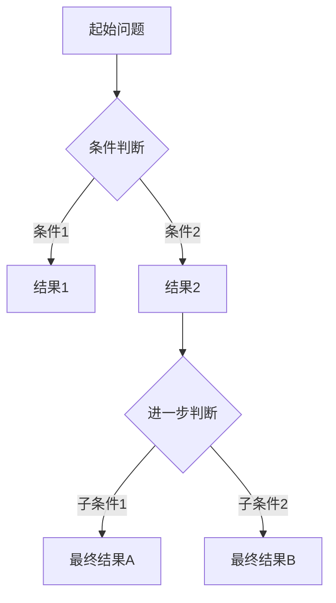
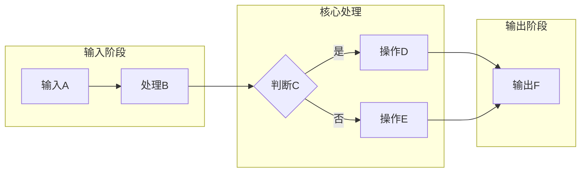

# 文档质量标准规范

> 版本: 1.0.0
> 最后更新: 2026-04-12

## 1. 文档结构标准

### 1.1 标题层级规范

```markdown
# 文档主标题（H1）- 唯一，位于文件顶部

> 元数据：作者、版本、最后更新日期

## 1. 一级章节（H2）

### 1.1 二级章节（H3）

#### 1.1.1 三级章节（H4）

##### 1.1.1.1 四级章节（H5）- 谨慎使用，考虑拆分文档
```

**要求**：

- 每个文档必须有且仅有一个 H1 标题
- 标题层级必须连续，不允许跳级（如 H2 直接到 H4）
- 编号格式：`数字.数字` 或 `数字.数字.数字`
- 中文文档使用中文编号：`一、二、三` 或 `1. 2. 3.`

### 1.2 章节组织标准

每个形式科学文档应包含以下标准章节：

```markdown
# 文档标题

> 元数据块

## 1. 引言 / 概述
- 背景介绍
- 问题陈述
- 文档范围

## 2. 核心概念 / 形式化定义
- 严格的形式化定义
- 符号约定
- 术语表

## 3. 理论体系
- 公理系统
- 定理与证明
- 推导过程

## 4. 实例与示例
- 具体例子
- 代码实现（如适用）
- 图示说明

## 5. 关联与映射
- 与其他概念的关联
- 跨视角映射
- 引用链接

## 6. 总结与展望
- 核心要点回顾
- 开放问题
- 进一步阅读

## 参考文献
## 附录（可选）
```

## 2. 思维表征工具标准

### 2.1 对比矩阵（Comparison Matrix）

**标准格式**：

```markdown
| 特性/维度 | 方案A | 方案B | 方案C | 关键差异 |
|-----------|-------|-------|-------|----------|
| 性能 | O(n) | O(log n) | O(1) | 方案C最优 |
| 空间复杂度 | O(n) | O(n) | O(n²) | A、B相同 |
| 适用场景 | 小规模 | 大规模 | 静态数据 | 各有侧重 |

**表X: XXX对比矩阵**
```

**要求**：

- ✅ 表头必须包含清晰的维度名称
- ✅ 每个单元格必须包含有效内容，禁止纯占位符（`-`）
- ✅ 数值型内容使用统一格式（如 `O(n)` 或 `10ms`）
- ✅ 最后一列提供综合分析或关键差异
- ❌ 禁止使用全 `-` 行作为内容占位符

**占位符替代方案**：

- 待研究内容使用：`[待补充: 具体说明]`
- 进行中内容使用：`[进行中: 预计完成日期]`
- 不适用内容使用：`N/A` 或 `不适用` 并附简要说明

### 2.2 决策树（Decision Tree）

**标准格式**：

```markdown


**图X: XXX决策树**

- **节点A**: 描述
- **节点B**: 描述
- 决策逻辑说明...

```

**要求**：
- 每个节点必须有明确标签
- 边必须有条件说明
- 提供文字解释决策逻辑

### 2.3 流程图（Flow Chart）

**标准格式**：

```markdown


**图X: XXX流程图**

- 阶段说明...
- 关键路径...

```

**要求**：
- 使用子图组织复杂流程
- 明确标注输入/输出
- 关键路径用颜色或粗线标识

## 3. 理论体系章节标准

### 3.1 形式化定义

**标准结构**：

```markdown
#### 定义 X.Y (定义名称)

设 $S$ 为[对象描述]，若满足以下条件：

1. **条件1**: [形式化描述]
   $$\forall x \in S, P(x)$$

2. **条件2**: [形式化描述]
   $$\exists y \in S, Q(y)$$

则称 $S$ 为**定义名称**，记作 $Notation(S)$。

> **直观解释**: [非形式化解释，帮助理解]
>
> **示例**: [具体例子]
```

**要求**：

- 每个定义必须有编号和名称
- 使用标准数学符号（LaTeX 格式）
- 提供直观解释降低理解门槛
- 给出具体例子

### 3.2 定理与证明

**标准结构**：

```markdown
#### 定理 X.Y (定理名称)

**陈述**:
给定 $A$，若 $P(A)$ 成立，则 $Q(A)$ 成立。

$$\forall A, P(A) \implies Q(A)$$

**证明**:
1. [步骤1]：...（依据：引用/公理）
2. [步骤2]：...（依据：引用/引理）
3. [步骤3]：...（依据：推导）

$$\begin{aligned}
LHS &= [表达式1] \\
    &= [表达式2] \quad \text{（理由）} \\
    &= RHS
\end{aligned}$$

**证毕** ∎
```

**要求**：

- 定理陈述必须明确前提和结论
- 证明步骤必须可验证
- 关键步骤标注依据
- 复杂证明可分解为引理

## 4. 代码示例标准

### 4.1 Lean 代码

```markdown
```lean4
-- 文件名: example.lean
-- 描述: [简要说明]

import Mathlib.Data.Nat.Basic
import Mathlib.Algebra.Group.Basic

namespace Example

/--
 函数/定义描述
- 参数: ...
- 返回: ...
-/
def function_name (x : ℕ) : ℕ :=
  x + 1

/--
 定理描述
-/
theorem theorem_name {n : ℕ} : n + 0 = n := by
  -- 证明步骤注释
  simp

end Example
```

```

**要求**：
- 文件头注释包含文件名和描述
- 使用 `/-- ... -/` 文档注释
- 关键步骤添加行内注释
- 提供类型签名

### 4.2 Rust 代码

```markdown
```rust
/// 函数描述
///
/// # 参数
/// - `param1`: 参数1描述
///
/// # 返回
/// 返回值描述
///
/// # 示例
/// ```
/// let result = function_name(42);
/// ```
fn function_name(param1: i32) -> i32 {
    // 实现注释
    param1 + 1
}

#[cfg(test)]
mod tests {
    use super::*;

    #[test]
    fn test_function_name() {
        assert_eq!(function_name(42), 43);
    }
}
```

```

### 4.3 Haskell 代码

```markdown
```haskell
{- |
模块描述

Example usage:
>>> functionName 42
43
-}
module ModuleName where

-- | 函数描述
--
-- >>> functionName 5
-- 6
functionName :: Int -> Int
functionName x = x + 1
```

```

## 5. 引用和交叉链接标准

### 5.1 内部引用

```markdown
- 同文档内引用：`参见 [定义 3.2](#定义-32)`
- 其他文档引用：`参见 [形式化定义文档](../数学基础/形式化定义.md)`
- 章节引用：`详见 [理论体系章节](#3-理论体系)`
```

### 5.2 外部引用

```markdown
- 学术论文：`作者, 年份`，例如：`[Smith, 2024](https://doi.org/...)`
- 书籍：`[作者, 《书名》, 章节/页码]`
- 在线资源：`资源名称 - 访问日期`
```

### 5.3 交叉链接规范

**要求**：

- 所有引用必须是可点击的链接
- 使用相对路径链接到项目内文档
- 外部链接必须包含协议（`https://`）
- 失效链接标记为 `[已失效]` 并提供替代来源

## 6. 文档元数据标准

每个文档顶部必须包含：

```markdown
# 文档标题

> **作者**: [作者名]
> **版本**: [语义化版本，如 1.2.0]
> **最后更新**: [YYYY-MM-DD]
> **状态**: [草稿/评审中/已发布/已废弃]
> **标签**: [标签1, 标签2, ...]
```

## 7. 格式规范

### 7.1 Markdown 格式

- 使用 `-` 作为无序列表标记（非 `*`）
- 有序列表使用 `1.` 格式
- 代码块必须指定语言
- 表格列对齐使用 `:---:`、`---:`、`---`

### 7.2 数学公式

- 行内公式使用 `$...$`
- 块级公式使用 `$$...$$`
- 多行对齐使用 `aligned` 环境
- 公式后标注编号：`$$...$$ (1)`

### 7.3 图示规范

- 所有图示必须有标题：`**图X: 标题**`
- 所有表格必须有标题：`**表X: 标题**`
- 使用 Mermaid 语法绘制流程图
- 复杂图表考虑使用 SVG 或外部工具生成

## 8. 质量分级标准

| 等级 | 要求 | 用途 |
|------|------|------|
| **S级** | 完全符合所有标准，通过所有检查项 | 正式发布 |
| **A级** | 符合核心标准，次要项目可有待完善 | 内部评审 |
| **B级** | 基本结构完整，部分内容待补充 | 草稿阶段 |
| **C级** | 存在明显结构缺陷或大量占位符 | 需重写 |

---

_本文档遵循文档质量标准规范 v1.0.0_
