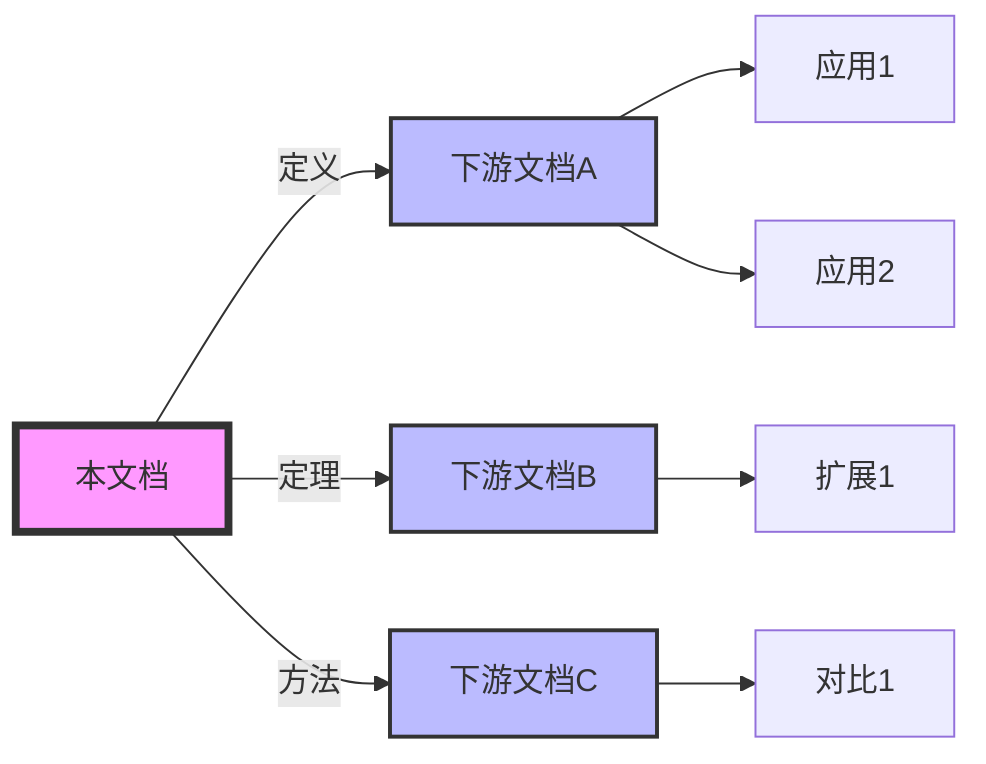
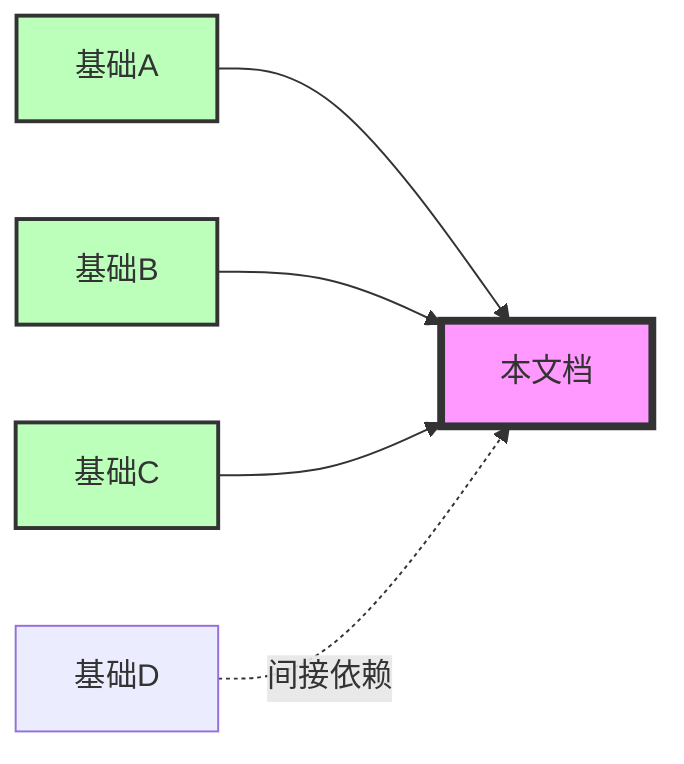
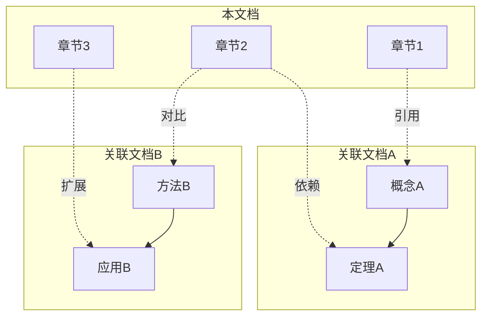

<!--
================================================================================
关联网络章节模板 (Network Section Template)
================================================================================
标准结构：前向引用 → 后向引用 → 交叉链接
================================================================================
-->

## 关联网络 {#关联网络}

### 4.1 前向引用 {#前向引用}

#### 4.1.1 依赖本文档的文档

> **直接依赖**
>
> 以下文档直接依赖本文档定义的概念或结论：

| 文档 | 关系类型 | 引用内容 | 路径 |
|------|----------|----------|------|
| [文档A](../path/to/docA.md) | 扩展 | 扩展定理2.1 | `../path/to/docA.md` |
| [文档B](../path/to/docB.md) | 应用 | 应用于实践场景 | `../path/to/docB.md` |
| [文档C](../path/to/docC.md) | 对比 | 对比分析结果 | `../path/to/docC.md` |

> **间接依赖**
>
> 通过中间文档间接依赖本文档：

```
本文档
  ├──> [中间文档1] ──> [间接依赖1]
  ├──> [中间文档2] ──> [间接依赖2]
  └──> [中间文档3] ──> [间接依赖3]
```

---

#### 4.1.2 引用图谱



---

### 4.2 后向引用 {#后向引用}

#### 4.2.1 本文档依赖的基础

> **理论基础**
>
> 本文档依赖以下理论基础：

| 基础文档 | 关系类型 | 使用内容 | 路径 |
|----------|----------|----------|------|
| [基础A](../base/docA.md) | 定义基础 | 基本定义 | `../base/docA.md` |
| [基础B](../base/docB.md) | 定理基础 | 核心定理 | `../base/docB.md` |
| [基础C](../base/docC.md) | 方法基础 | 证明方法 | `../base/docC.md` |

> **前置阅读**
>
> 阅读本文档前建议先阅读：

1. **[前置文档1](../prereq/doc1.md)** - 必需
2. **[前置文档2](../prereq/doc2.md)** - 强烈推荐
3. **[前置文档3](../prereq/doc3.md)** - 可选补充

---

#### 4.2.2 依赖图谱



---

### 4.3 交叉链接 {#交叉链接}

#### 4.3.1 横向关联

> **相关主题**
>
| 主题 | 关系 | 关联文档 | 对比要点 |
|------|------|----------|----------|
| 主题X | 对比 | [文档X](../rel/docX.md) | 异同分析 |
| 主题Y | 互补 | [文档Y](../rel/docY.md) | 补充说明 |
| 主题Z | 类比 | [文档Z](../rel/docZ.md) | 类比映射 |

---

#### 4.3.2 交叉引用矩阵

| 本文档章节 | 关联文档 | 关联章节 | 关系类型 |
|------------|----------|----------|----------|
| 2.1 定义 | docA.md | 3.2 性质 | 等价 |
| 2.2 定理 | docB.md | 4.1 证明 | 引用 |
| 3.1 应用 | docC.md | 2.3 示例 | 扩展 |
| 3.2 案例 | docD.md | 5.1 分析 | 对比 |

---

#### 4.3.3 知识网络



---

### 4.4 外部资源 {#外部资源}

#### 4.4.1 学术引用

| 引用 | 类型 | 说明 | 链接 |
|------|------|------|------|
| [Smith2020] | 论文 | 核心理论来源 | [DOI](https://doi.org/...) |
| [Johnson2021] | 专著 | 方法学基础 | [URL](https://...) |
| [Lee2022] | 综述 | 相关领域概览 | [arXiv](https://arxiv.org/...) |

---

#### 4.4.2 工具与实现

| 工具 | 用途 | 版本 | 链接 |
|------|------|------|------|
| Tool A | 形式化验证 | v1.0 | [GitHub](https://github.com/...) |
| Tool B | 可视化 | v2.0 | [官网](https://...) |
| Library C | 计算实现 | v3.0 | [PyPI](https://pypi.org/...) |

---

### 4.5 链接维护说明 {#链接维护说明}

> **链接检查清单**
>
- [ ] 所有内部链接可访问
- [ ] 所有外部链接有效
- [ ] 锚点引用准确
- [ ] 相对路径正确
- [ ] 文档版本匹配

> **更新日志**
>
| 日期 | 操作 | 内容 | 操作人 |
|------|------|------|--------|
| YYYY-MM-DD | 添加 | 新增关联文档X | 作者 |
| YYYY-MM-DD | 修改 | 更新链接Y | 作者 |
| YYYY-MM-DD | 删除 | 移除失效链接Z | 作者 |

---

### 4.6 导航索引 {#导航索引}

#### 4.6.1 快速跳转

| 目标 | 链接 |
|------|------|
| 文档首页 | [README](./README.md) |
| 目录索引 | [INDEX](./INDEX.md) |
| 术语表 | [GLOSSARY](./GLOSSARY.md) |
| 上一篇 | [上一文档](./prev.md) |
| 下一篇 | [下一文档](./next.md) |

---

#### 4.6.2 相关主题索引

```markdown
主题A:
  - [子主题A1](./a1.md)
  - [子主题A2](./a2.md)
  - [子主题A3](./a3.md)

主题B:
  - [子主题B1](./b1.md)
  - [子主题B2](./b2.md)
```

---
