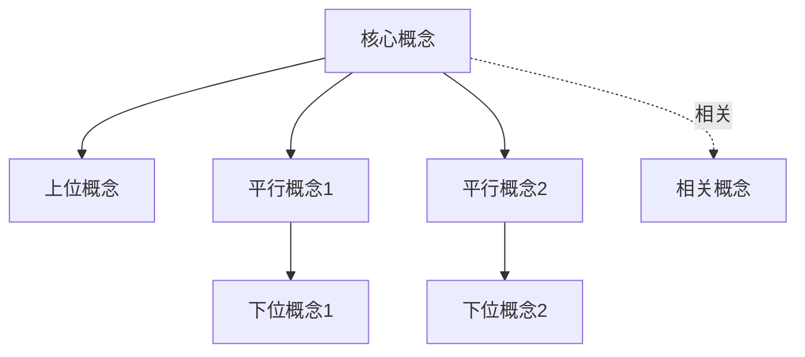
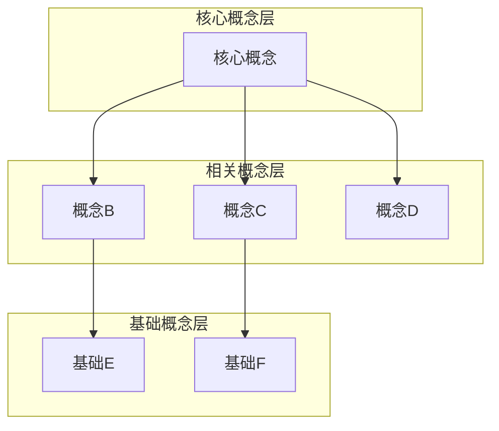
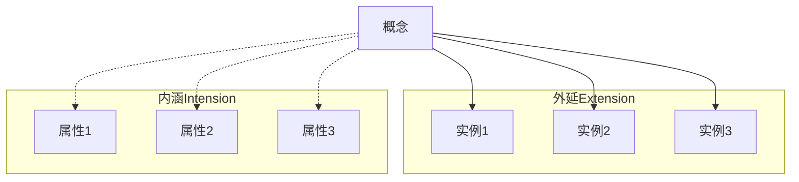
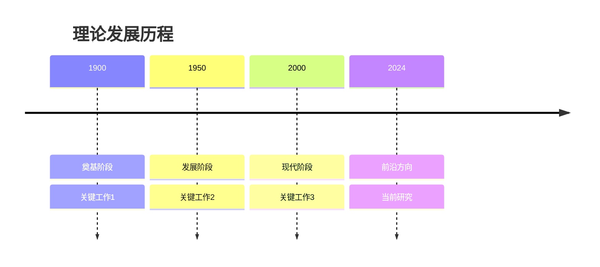
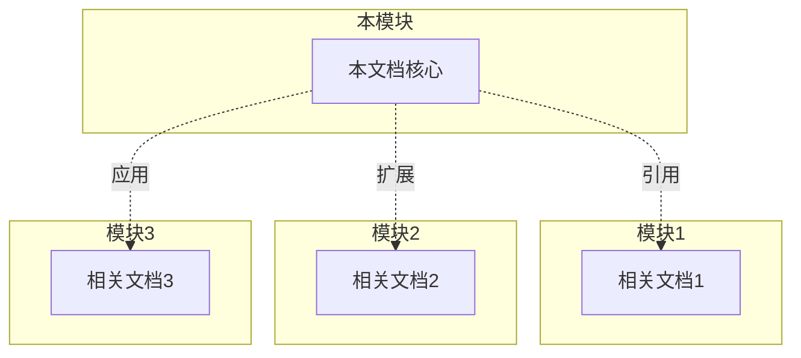
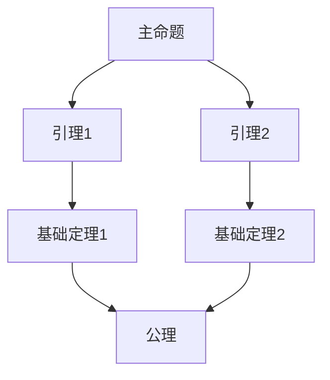
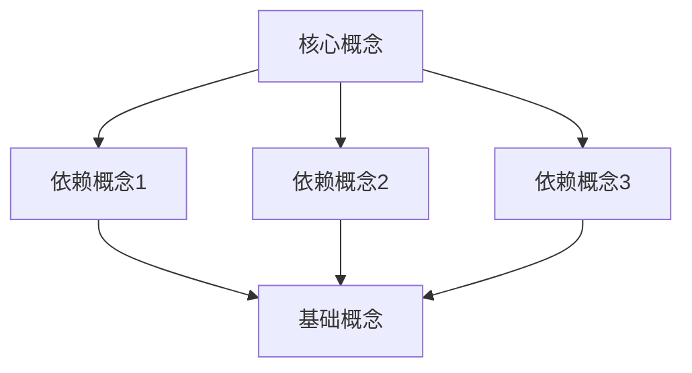

# X.Y 主题标题 | Subject Title

> **文档版本**: v1.0.0
> **创建日期**: YYYY-MM-DD
> **最后更新**: YYYY-MM-DD
> **文档规模**: XXX行 | 简短描述文档内容范围
> **主题**: 一句话描述本文档核心主题
> **难度**: ⭐⭐⭐ (1-5星)
> **前置知识**: [相关前置知识链接]
> **重要性**: ⭐⭐⭐⭐⭐ (1-5星)
> **阅读建议**: 本文档适合...读者，建议...的阅读方式

---

## 📋 目录

- [X.Y 主题标题 | Subject Title](#xy-主题标题--subject-title)
  - [📋 目录](#-目录)
  - [1. 核心理论章节](#1-核心理论章节)
    - [1.1 子章节](#11-子章节)
      - [1.1.1 概念分析：核心概念](#111-概念分析核心概念)
        - [定义矩阵](#定义矩阵)
        - [属性分析](#属性分析)
        - [外延分析](#外延分析)
        - [内涵分析](#内涵分析)
        - [关系网络](#关系网络)
    - [1.2 子章节](#12-子章节)
  - [2. 理论展开章节](#2-理论展开章节)
    - [2.1 理论分支1](#21-理论分支1)
    - [2.2 理论分支2](#22-理论分支2)
  - [3. 证明/构造章节](#3-证明构造章节)
    - [3.1 形式化证明](#31-形式化证明)
    - [3.2 构造性示例](#32-构造性示例)
  - [4. 应用/实例章节](#4-应用实例章节)
    - [4.1 应用场景1](#41-应用场景1)
    - [4.2 应用场景2](#42-应用场景2)
    - [4.3 应用场景3](#43-应用场景3)
  - [5. 批判性分析](#5-批判性分析)
    - [5.1 理论的优点](#51-理论的优点)
    - [5.2 理论的局限性](#52-理论的局限性)
    - [5.3 与现代理论的关系](#53-与现代理论的关系)
    - [5.4 开放问题](#54-开放问题)
  - [6. 思维表征：主题](#6-思维表征主题)
    - [6.1 概念关系网络图](#61-概念关系网络图)
    - [6.2 论证逻辑路径图](#62-论证逻辑路径图)
    - [6.3 概念属性矩阵](#63-概念属性矩阵)
    - [6.4 外延内涵分析图](#64-外延内涵分析图)
    - [6.5 理论发展脉络图](#65-理论发展脉络图)
    - [6.6 跨模块关联图](#66-跨模块关联图)
  - [7. 权威资源对标](#7-权威资源对标)
    - [7.1 Wikipedia对标](#71-wikipedia对标)
    - [7.2 国际著名大学课程对标](#72-国际著名大学课程对标)
      - [7.2.1 大学课程1](#721-大学课程1)
      - [7.2.2 大学课程2](#722-大学课程2)
    - [7.3 权威教材对标](#73-权威教材对标)
      - [7.3.1 教材1](#731-教材1)
      - [7.3.2 教材2](#732-教材2)
  - [8. 主题-子主题论证逻辑关系图](#8-主题-子主题论证逻辑关系图)
    - [8.1 论证依赖关系](#81-论证依赖关系)
    - [8.2 概念依赖关系](#82-概念依赖关系)
  - [9. 参考资源](#9-参考资源)
    - [9.1 经典论文](#91-经典论文)
    - [9.2 教材](#92-教材)
    - [9.3 在线资源](#93-在线资源)
  - [10. 相关主题](#10-相关主题)

---

## 1. 核心理论章节

### 1.1 子章节

#### 1.1.1 概念分析：核心概念

**形式化定义**:

$$
\text{Definition: } \mathcal{X} = (A, B, C, \ldots)
$$

其中：

- $A$: 描述A的含义
- $B$: 描述B的含义
- $C$: 描述C的含义

**直观解释**:

用通俗语言解释这个概念...

##### 定义矩阵

| 维度 | 定义1 | 定义2 | 本文档定义 |
|------|-------|-------|-----------|
| 维度1 | - |- |- | 待补充 |
| 维度2 | - |- |- | 待补充 |
| 维度3 | - |- |- | 待补充 |

##### 属性分析

| 属性类型 | 属性列表 | 说明 |
|---------|---------|------|
| 必要属性 | - |- |- | 待补充 |
| 充分属性 | - |- |- | 待补充 |
| 本质属性 | - |- |- | 待补充 |
| 偶然属性 | - |- |- | 待补充 |

##### 外延分析

**包含实例**:

1. 实例1: 描述
2. 实例2: 描述
3. 实例3: 描述

**子类**:

- 子类1
- 子类2
- 子类3

**边界案例**:

- 边界案例1: 描述

##### 内涵分析

**核心特征**:

1. 特征1: 描述
2. 特征2: 描述

**区别性特征**:

- 与概念A的区别: ...
- 与概念B的区别: ...

##### 关系网络

### 1.2 子章节

**定理 X.Y.Z** (定理名称):

$$
\forall x \in X, \exists y \in Y: P(x, y)
$$

**证明思路**:

1. 步骤1: ...
2. 步骤2: ...
3. 步骤3: ...

**证明细节**:

详细证明过程...

**证明的洞察**:

为什么这样证明？关键洞察是什么？

---

## 2. 理论展开章节

### 2.1 理论分支1

### 2.2 理论分支2

---

## 3. 证明/构造章节

### 3.1 形式化证明

### 3.2 构造性示例

---

## 4. 应用/实例章节

### 4.1 应用场景1

### 4.2 应用场景2

### 4.3 应用场景3

---

## 5. 批判性分析

### 5.1 理论的优点

### 5.2 理论的局限性

### 5.3 与现代理论的关系

### 5.4 开放问题

---

## 6. 思维表征：主题

### 6.1 概念关系网络图

### 6.2 论证逻辑路径图

### 6.3 概念属性矩阵

| 概念 | 属性1 | 属性2 | 属性3 | 属性4 |
|------|-------|-------|-------|-------|
| 概念A | ✓ | ✗ | ✓ | ✓ |
| 概念B | ✗ | ✓ | ✓ | ✗ |
| 概念C | ✓ | ✓ | ✗ | ✓ |

### 6.4 外延内涵分析图

### 6.5 理论发展脉络图

### 6.6 跨模块关联图

---

## 7. 权威资源对标

### 7.1 Wikipedia对标

| 维度 | Wikipedia内容 | 本文档内容 | 状态 |
|------|--------------|-----------|------|
| 定义 | 待补充 | 待补充 | 🟡 |
| 历史 | 待补充 | 待补充 | 🟡 |
| 应用 | 待补充 | 待补充 | 🟡 |
| 示例 | 待补充 | 待补充 | 🟡 |

**补充内容说明**:

本文档相对于Wikipedia的补充：

1. 补充1
2. 补充2

### 7.2 国际著名大学课程对标

#### 7.2.1 大学课程1

| 维度 | 课程内容 | 本文档 | 覆盖度 |
|------|---------|--------|--------|
| 主题1 | - |- |- | 待补充 |
| 主题2 | - |- |- | 待补充 |
| 主题3 | - |- |- | 待补充 |

#### 7.2.2 大学课程2

| 维度 | 课程内容 | 本文档 | 覆盖度 |
|------|---------|--------|--------|
| 主题1 | - |- |- | 待补充 |
| 主题2 | - |- |- | 待补充 |

### 7.3 权威教材对标

#### 7.3.1 教材1

| 章节 | 教材内容 | 本文档 | 状态 |
|------|---------|--------|------|
| Ch1 | - |- |- | 待补充 |
| Ch2 | - |- |- | 待补充 |

#### 7.3.2 教材2

| 章节 | 教材内容 | 本文档 | 状态 |
|------|---------|--------|------|
| Ch1 | - |- |- | 待补充 |

---

## 8. 主题-子主题论证逻辑关系图

### 8.1 论证依赖关系

### 8.2 概念依赖关系

---

## 9. 参考资源

### 9.1 经典论文

1. **作者 (年份)**. "论文标题". _期刊/会议_.
   - 📄 **DOI**: 链接
   - 🏆 **引用**: XX,XXX+
   - ⭐ **地位**: 领域奠基性工作
   - 💡 **贡献**: 核心贡献简述

### 9.2 教材

1. **作者**. _书名_. 出版社, 年份.
   - 📚 **ISBN**: XXX-XXXXXXXXXX
   - ⭐ **推荐指数**: ⭐⭐⭐⭐⭐
   - 💡 **特点**: 教材特点简述

### 9.3 在线资源

- 资源名称 - 资源描述

---

## 10. 相关主题

- 相关文档1
- 相关文档2
- 相关文档3

---

**导航**: ← 上一节：标题 | [返回目录](../README.md) | 下一节：标题 →

---

**维护者**: FormalScience Project Team
**最后审核**: YYYY-MM-DD
