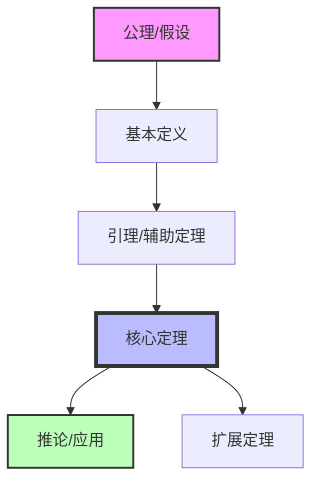

<!--
================================================================================
理论体系章节模板 (Theory Section Template)
================================================================================
标准结构：形式化定义 → 定理 → 证明 → 推论
================================================================================
-->

## 理论体系 {#理论体系}

### 2.1 形式化定义 {#形式化定义}

#### 2.1.1 基本概念

> **定义 2.1** (概念名称)
>
> 概念的数学/形式化定义，使用精确的数学语言描述。
>
> $$\text{数学表达式: } \forall x \in X, \exists y \in Y : P(x, y)$$

**说明**：

- $X$: 定义域说明
- $Y$: 值域说明
- $P$: 谓词/关系说明

---

#### 2.1.2 形式化规约

```markdown
定义模板：

**定义 X.Y** (定义名称)

给定：
- 集合/类型 A
- 集合/类型 B
- 关系/函数 f: A → B

定义：概念 C 为满足以下条件的最小集合/结构：
1. 基础条件: ...
2. 归纳条件: ...
3. 封闭条件: ...
```

---

### 2.2 核心定理 {#核心定理}

#### 2.2.1 主要定理

> **定理 2.1** (定理名称)
>
> 给定前提条件 $P$，则结论 $Q$ 成立：
>
> $$P \implies Q$$

**定理说明**：

- 前提条件：明确列出所有前提
- 结论：明确说明定理的结论
- 重要性：解释定理的理论意义

---

#### 2.2.2 辅助定理

> **引理 2.1** (引理名称)
>
> 辅助性结论，用于证明主要定理。

---

### 2.3 形式化证明 {#形式化证明}

#### 2.3.1 证明结构

**证明** [定理 2.1]

1. **基础步骤**：证明基本情况成立
   - 给定：...
   - 证明：...
   - 结论：...

2. **归纳步骤**：假设对 $n$ 成立，证明对 $n+1$ 成立
   - 归纳假设：...
   - 需证：...
   - 推导：...

3. **结论**：由数学归纳法，定理得证 ∎

---

#### 2.3.2 证明技巧

| 技巧 | 适用场景 | 示例 |
|------|----------|------|
| 数学归纳法 | 递归结构 | 证明递归函数性质 |
| 反证法 | 否定性结论 | 证明不可判定性 |
| 构造法 | 存在性证明 | 构造具体实例 |
| 对角线法 | 可数性证明 | 证明实数不可数 |

---

### 2.4 定理推论 {#定理推论}

#### 2.4.1 直接推论

> **推论 2.1** (推论名称)
>
> 由定理 2.1 可直接推出：
>
> $$\text{具体推论内容}$$

**证明**：
由定理 2.1，令 $x = ...$，即得结论 ∎

---

#### 2.4.2 扩展结果

> **命题 2.1** (扩展命题)
>
> 在定理 2.1 的基础上，考虑更一般情况：...

---

### 2.5 形式化规约示例 {#形式化规约示例}

```latex
% LaTeX 公式示例
\begin{definition}[名称]
给定类型 $A, B$，定义映射 $f: A \to B$ 满足：
\begin{enumerate}
    \item 单射性：$\forall x, y \in A, f(x) = f(y) \implies x = y$
    \item 满射性：$\forall y \in B, \exists x \in A, f(x) = y$
\end{enumerate}
\end{definition}

\begin{theorem}[名称]
若 $P$ 成立，则 $Q$ 成立：
$$P \implies Q$$
\end{theorem}

\begin{proof}
使用自然演绎法：
\begin{enumerate}
    \item 假设 $P$ 成立
    \item 由定义 2.1，可得 ...
    \item 因此 $Q$ 成立
\end{enumerate}
\end{proof}
```

---

## 理论层次结构图



---
