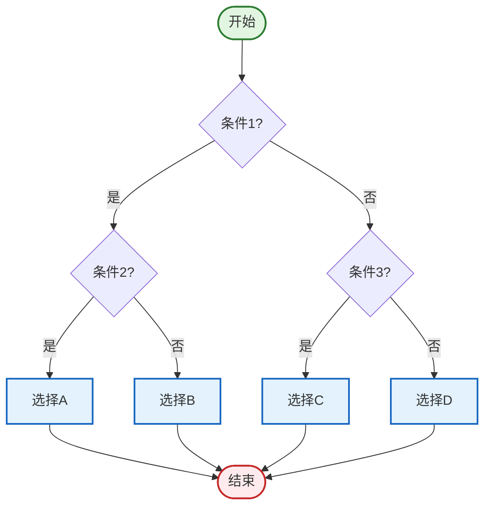
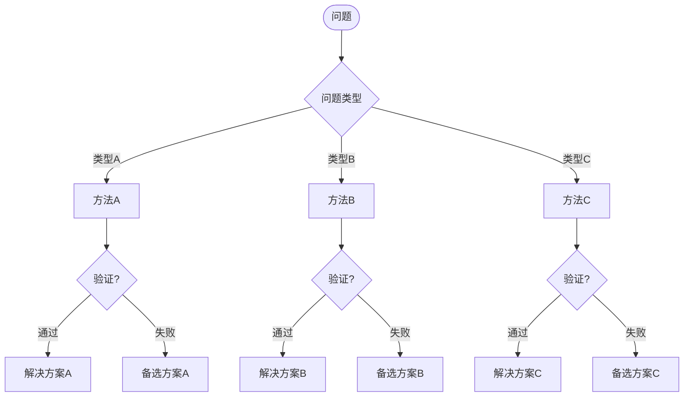
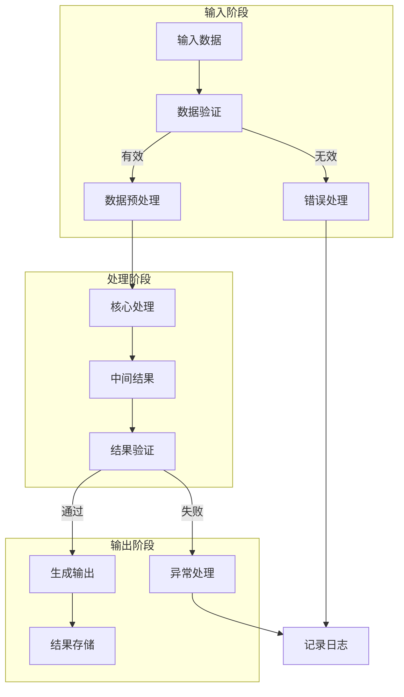
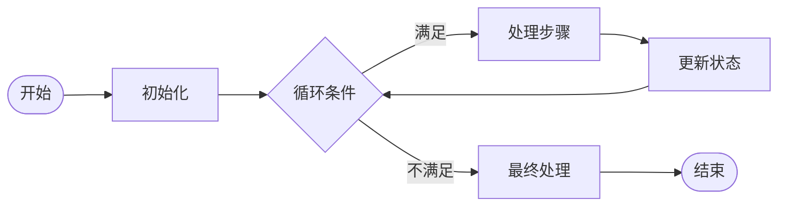
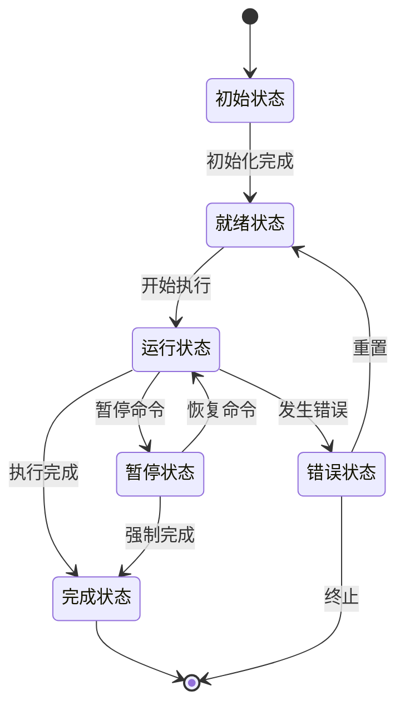
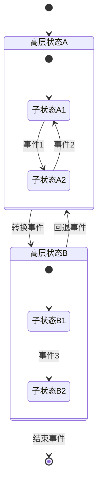
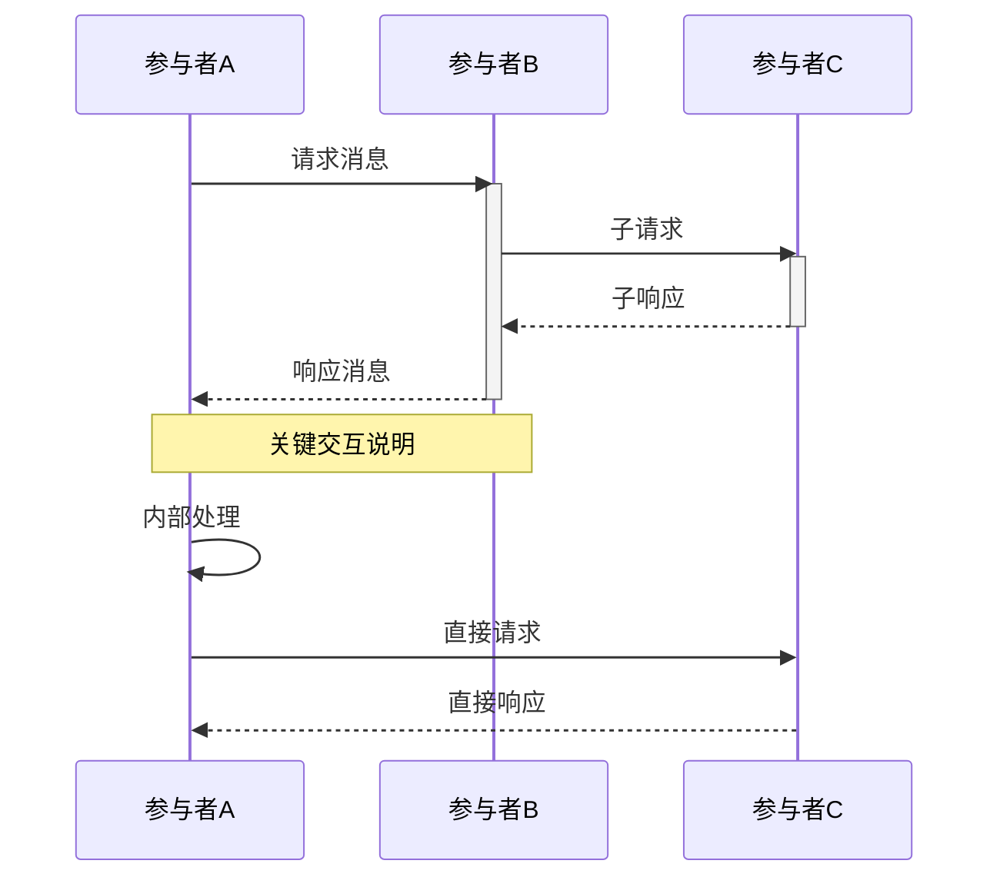

<!--
================================================================================
思维表征章节模板 (Thinking Representation Template)
================================================================================
标准结构：对比矩阵 → 决策树 → 流程图 → 状态机
================================================================================
-->

## 思维表征 {#思维表征}

### 3.1 对比矩阵 {#对比矩阵}

#### 3.1.1 概念对比矩阵

| 维度 | 概念A | 概念B | 概念C |
|------|-------|-------|-------|
| **定义** | 定义A | 定义B | 定义C |
| **特征1** | 值A1 | 值B1 | 值C1 |
| **特征2** | 值A2 | 值B2 | 值C2 |
| **适用场景** | 场景A | 场景B | 场景C |
| **优势** | 优势A | 优势B | 优势C |
| **局限** | 局限A | 局限B | 局限C |

---

#### 3.1.2 方法对比矩阵

| 评估维度 | 方法X | 方法Y | 方法Z |
|----------|-------|-------|-------|
| **时间复杂度** | $O(n)$ | $O(n \log n)$ | $O(n^2)$ |
| **空间复杂度** | $O(1)$ | $O(n)$ | $O(n^2)$ |
| **准确性** | 高 | 中 | 低 |
| **实现难度** | 简单 | 中等 | 复杂 |
| **可扩展性** | 好 | 较好 | 一般 |

---

#### 3.1.3 多维度评估矩阵

```markdown
矩阵说明：
- 评分标准：★★★★★ (5分制)
- 数据来源：理论分析/实验测量/专家评估
- 更新日期：YYYY-MM-DD
```

| 系统/方案 | 性能 | 可靠性 | 安全性 | 可维护性 | 成本效益 | 综合评分 |
|-----------|------|--------|--------|----------|----------|----------|
| 方案A | ★★★★☆ | ★★★★★ | ★★★★☆ | ★★★☆☆ | ★★★★☆ | 4.0/5.0 |
| 方案B | ★★★★★ | ★★★★☆ | ★★★☆☆ | ★★★★☆ | ★★★☆☆ | 3.6/5.0 |
| 方案C | ★★★☆☆ | ★★★★☆ | ★★★★★ | ★★★★★ | ★★★★☆ | 3.8/5.0 |

---

### 3.2 决策树 {#决策树}

#### 3.2.1 概念选择决策树



**决策说明**：

1. **条件1**：判断标准描述
2. **条件2**：次级判断标准
3. **条件3**：替代路径判断

---

#### 3.2.2 问题求解决策树



---

### 3.3 流程图 {#流程图}

#### 3.3.1 标准操作流程



**流程说明**：

| 步骤 | 操作 | 输入 | 输出 | 异常处理 |
|------|------|------|------|----------|
| 1 | 数据验证 | 原始数据 | 验证结果 | 返回错误 |
| 2 | 预处理 | 有效数据 | 标准化数据 | 跳过无效值 |
| 3 | 核心处理 | 预处理数据 | 中间结果 | 重试机制 |
| 4 | 结果验证 | 中间结果 | 最终结果 | 回滚操作 |

---

#### 3.3.2 算法流程图



---

### 3.4 状态机 {#状态机}

#### 3.4.1 有限状态机



**状态说明**：

| 状态 | 描述 | 进入条件 | 退出条件 | 动作 |
|------|------|----------|----------|------|
| 初始 | 系统启动 | - | 资源就绪 | 加载配置 |
| 就绪 | 等待输入 | 初始化完成 | 收到开始信号 | 准备资源 |
| 运行 | 正在执行 | 开始信号 | 完成/暂停/错误 | 执行核心逻辑 |
| 暂停 | 暂时停止 | 暂停命令 | 恢复命令 | 保存状态 |
| 完成 | 正常结束 | 执行完成 | - | 清理资源 |
| 错误 | 异常状态 | 发生错误 | 重置/终止 | 记录日志 |

---

#### 3.4.2 分层状态机



---

### 3.5 时序图 {#时序图}



---

### 3.6 思维表征设计原则

1. **简洁性**：每个图表聚焦一个核心概念
2. **一致性**：使用统一的符号和命名约定
3. **层次性**：从整体到细节，逐步展开
4. **可追溯性**：每个元素都有明确的来源和依据
5. **可验证性**：图表内容应与文本描述一致

---
