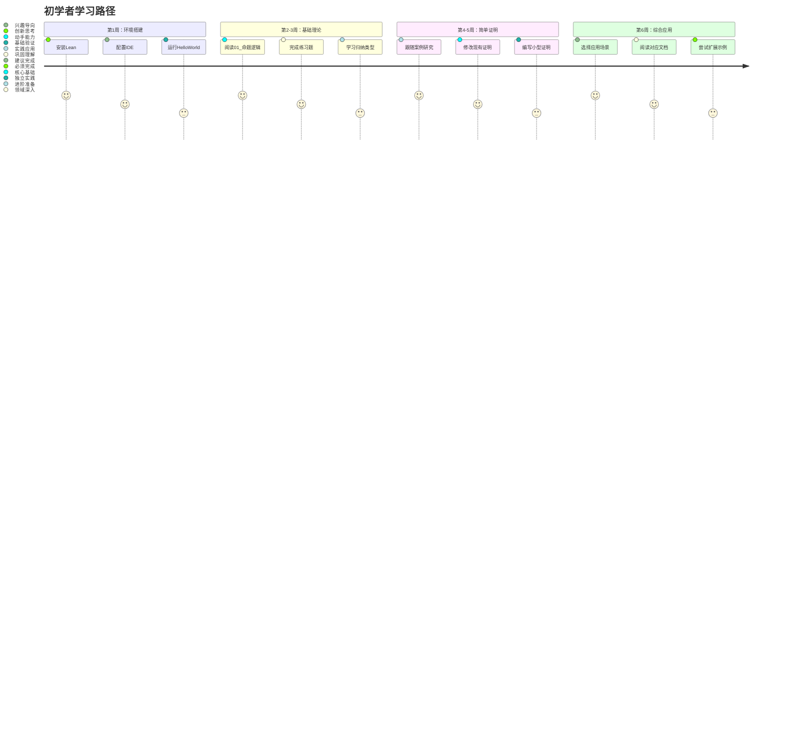
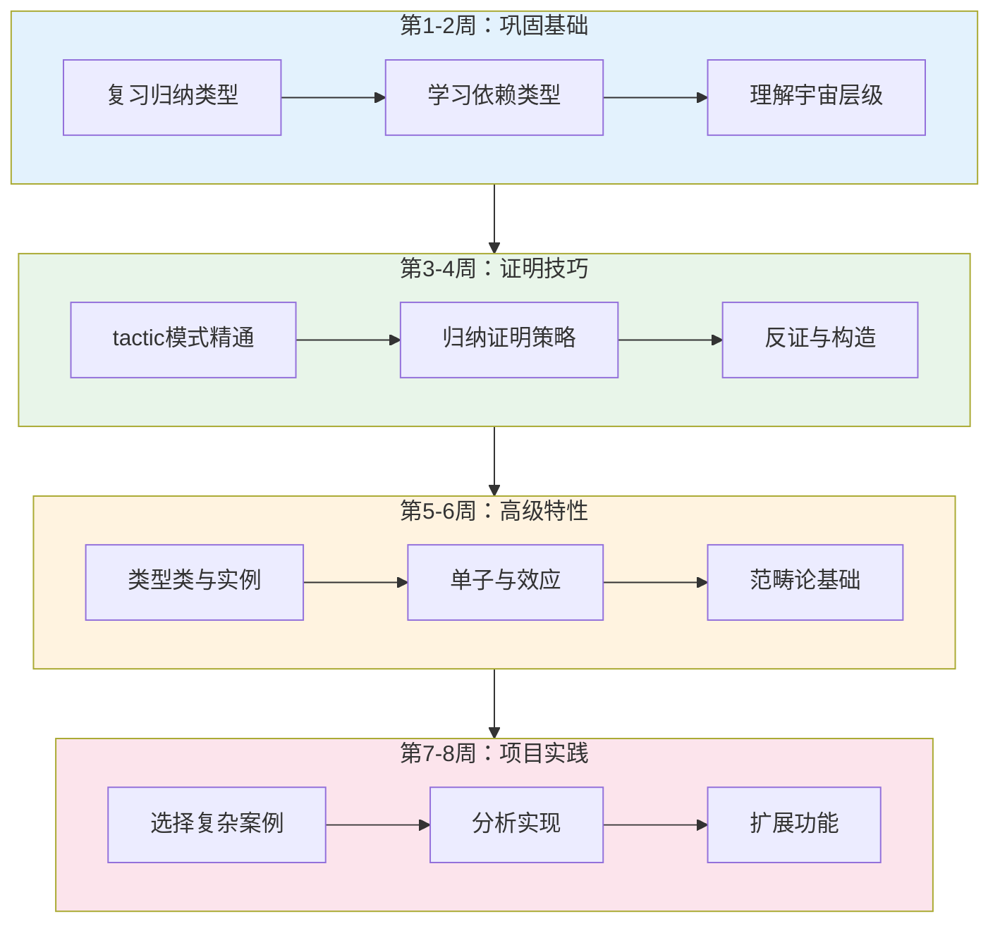
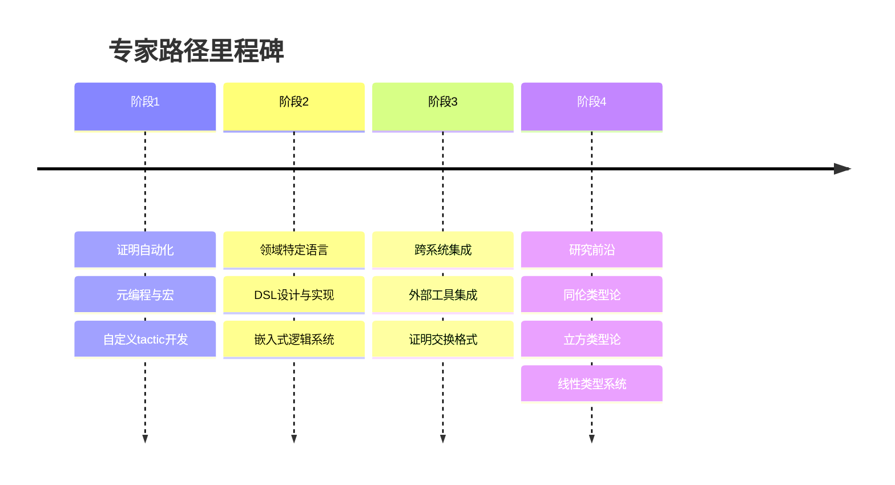
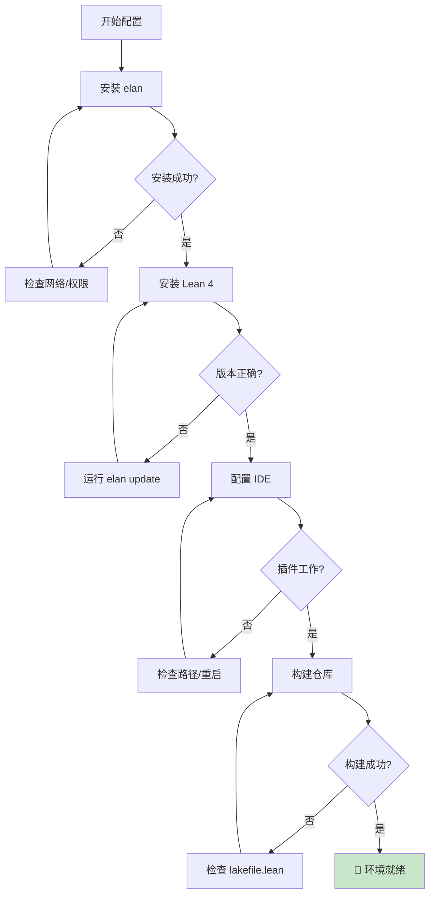

# 00. 新用户入门指南

> **版本**: 1.0
> **更新日期**: 2026-04-11
> **目标读者**: 初次接触形式化科学仓库的新用户
> **阅读时间**: 约 15 分钟

---

## 1. 如何阅读本文档

### 1.1 文档结构概览

本仓库文档采用**分层模块化**组织方式，遵循严格的编号体系：

```
docs/Refactor/
├── 00_*.md              # 入门与参考（本文档、术语表）
├── 01_基础理论/         # 数学基础与类型论
├── 02_实现技术/         # Lean 实现与证明技巧
├── 03_应用领域/         # 调度理论、网络协议等应用
├── 04_工具链/           # 开发工具与自动化
├── 05_案例研究/         # 完整项目案例
├── 06_参考手册/         # API 参考与速查表
└── 07_交叉视角/         # 跨领域主题与进阶话题
```

### 1.2 阅读方式选择

| 阅读方式 | 适用场景 | 推荐路径 |
|---------|---------|---------|
| **线性阅读** | 系统学习、初学者 | 按编号顺序 00 → 01 → 02 → 03 |
| **问题导向** | 解决具体问题 | 先查阅术语表 → 定位相关模块 → 阅读案例 |
| **项目驱动** | 实践项目需求 | 选择案例研究 → 回溯所需理论基础 |
| **快速参考** | 查找特定概念 | 术语表 → 参考手册 → 交叉引用 |

### 1.3 交叉引用系统

本文档使用统一的交叉引用格式：

- **内部引用**: `[参见 01_类型论基础/02_归纳类型]`
- **外部链接**: `[Lean 官方文档](https://leanprover.github.io/)`
- **代码引用**: `参见`FormalScience/Concept/Basic.lean` `
- **术语定义**: _术语_<sup>[🔗 定义](#glossary)</sup>


---

## 2. 推荐学习路径

### 2.1 路径一：初学者路径（预计 4-6 周）

> 🎯 **目标**: 理解形式化验证基本概念，能够阅读简单证明



**详细阶段**:

1. **环境准备** (第1周)
   - 阅读 [00_GLOSSARY.md](./00_GLOSSARY.md) 了解核心术语
   - 完成 [04_工具链/01_环境搭建](./04_工具链/01_环境搭建.md)
   - 验证安装：成功运行 `lake build`

2. **理论基础** (第2-3周)
   - 精读 [01_基础理论/01_命题逻辑基础](./01_基础理论/01_命题逻辑基础.md)
   - 理解 [01_基础理论/02_类型论入门](./01_基础理论/02_类型论入门.md)
   - 完成每章末尾练习题

3. **实践入门** (第4-5周)
   - 学习 [05_案例研究/01_简单证明示例](./05_案例研究/01_简单证明示例.md)
   - 跟随 [02_实现技术/01_Lean语法速览](./02_实现技术/01_Lean语法速览.md)

4. **领域探索** (第6周)
   - 选择感兴趣的应用领域（如调度理论）
   - 阅读对应 [03_应用领域](./03_应用领域/) 文档

---

### 2.2 路径二：进阶路径（预计 6-8 周）

> 🎯 **目标**: 能够独立编写中等复杂度证明，理解高级类型特性



**详细阶段**:

1. **类型系统深化** (第1-2周)
   - [01_基础理论/03_依赖类型](./01_基础理论/03_依赖类型.md)
   - [01_基础理论/04_归纳族与归纳原理](./01_基础理论/04_归纳族与归纳原理.md)
   - [07_交叉视角/02_类型系统比较](./07_交叉视角/02_类型系统比较.md)

2. **证明工程** (第3-4周)
   - [02_实现技术/02_证明策略](./02_实现技术/02_证明策略.md)
   - [02_实现技术/03_归纳证明模式](./02_实现技术/03_归纳证明模式.md)
   - [05_案例研究/02_中等复杂度证明](./05_案例研究/02_中等复杂度证明.md)

3. **高级抽象** (第5-6周)
   - [01_基础理论/05_类型类系统](./01_基础理论/05_类型类系统.md)
   - [03_应用领域/01_调度理论/03_高级性质证明](./03_应用领域/01_调度理论/03_高级性质证明.md)

4. **深度案例** (第7-8周)
   - 选择 [05_案例研究](./05_案例研究/) 中的完整项目
   - 尝试重构或扩展现有证明

---

### 2.3 路径三：专家路径（持续学习）

> 🎯 **目标**: 掌握前沿技术，能够设计复杂形式化系统



**核心模块**:

- [07_交叉视角/04_研究前沿.md](./07_交叉视角/04_研究前沿.md)
- [06_参考手册/03_元编程指南](./06_参考手册/03_元编程指南.md)
- [03_应用领域/](./03_应用领域/) 各领域的完整实现

---

## 3. 前置知识要求

### 3.1 必备知识

| 领域 | 要求 | 相关文档 | 补救资源 |
|-----|------|---------|---------|
| **离散数学** | 了解集合、关系、函数 | [01_基础理论](./01_基础理论/) | 《离散数学及其应用》 |
| **数理逻辑** | 命题逻辑、一阶逻辑基础 | [01_基础理论/01_命题逻辑基础](./01_基础理论/01_命题逻辑基础.md) | Logic in Computer Science |
| **函数式编程** | 基础概念（递归、高阶函数） | [02_实现技术/01_Lean语法速览](./02_实现技术/01_Lean语法速览.md) | Learn You a Haskell |
| **Git基础** | 克隆、提交、分支 | - | Git官方文档 |

### 3.2 推荐知识

| 领域 | 作用 | 学习建议 |
|-----|------|---------|
| **λ演算** | 深入理解类型论 | 阅读 [01_基础理论/06_Lambda演算](./01_基础理论/06_Lambda演算.md) |
| **范畴论** | 理解抽象模式 | 参考 [07_交叉视角/01_范畴论视角](./07_交叉视角/01_范畴论视角.md) |
| **操作系统** | 调度理论应用背景 | 阅读 [03_应用领域/01_调度理论/00_概述](./03_应用领域/01_调度理论/00_概述.md) |

### 3.3 知识自评清单

在开始之前，请确认以下能力：

- [ ] 能够写出命题逻辑的合取、析取、蕴含公式
- [ ] 理解数学归纳法原理
- [ ] 能够阅读简单的函数式代码
- [ ] 熟悉命令行基本操作

若以上任何一项未勾选，建议先完成对应前置学习。

---

## 4. 环境准备

### 4.1 Lean 4 安装

#### 4.1.1 快速安装（推荐）

```bash
# Windows (PowerShell)
Invoke-RestMethod -Uri https://raw.githubusercontent.com/leanprover/elan/master/elan-init.ps1 | Invoke-Expression

# macOS / Linux
curl https://raw.githubusercontent.com/leanprover/elan/master/elan-init.sh -sSf | sh
```

#### 4.1.2 验证安装

```bash
# 检查版本
lean --version
# 预期输出: Lean (version 4.x.x, commit ...)

# 检查 lake 构建工具
lake --version
```

### 4.2 IDE 配置

#### 4.2.1 VS Code（推荐）

1. 安装 [VS Code](https://code.visualstudio.com/)
2. 安装扩展: `leanprover.lean4`
3. 配置设置（`.vscode/settings.json`）:

```json
{
  "lean4.autofocusOutput": false,
  "lean4.infoview.showExpectedType": true,
  "editor.wordSeparators": "`~!@#$%^&*()-=+[{]}\\|;:'\",.<>/?"
}
```

#### 4.2.2 Emacs / Vim

参见 [Lean 4 官方文档](https://leanprover.github.io/lean4/doc/setup.html)

### 4.3 仓库配置

```bash
# 1. 克隆仓库
cd E:\_src
# 仓库已存在，直接进入

# 2. 获取依赖（在仓库根目录）
cd FormalScience
lake update

# 3. 构建项目
lake build

# 4. 验证构建成功
# 应看到所有模块编译通过，无错误
```

### 4.4 环境验证清单



---

## 5. 常见问题

### 5.1 安装问题

**Q: `elan` 安装失败，提示权限错误？**

A: Windows 用户尝试以管理员身份运行 PowerShell；macOS/Linux 用户检查 `/usr/local/bin` 写入权限。

**Q: 构建时出现 "unknown package" 错误？**

A: 运行 `lake update` 获取最新依赖，然后重新 `lake build`。

### 5.2 学习问题

**Q: 证明过程中 tactic 不生效？**

A: 检查当前目标状态（InfoView），确保理解当前上下文。参考 [02_实现技术/02_证明策略](./02_实现技术/02_证明策略.md) 的调试技巧。

**Q: 概念理解困难？**

A: 查阅 [00_GLOSSARY.md](./00_GLOSSARY.md) 获取术语定义，或参考 [05_案例研究](./05_案例研究/) 中的具体示例。

---

## 6. 下一步

根据您的学习目标，选择下一步行动：

| 如果您想... | 请前往... |
|------------|----------|
| 系统学习基础理论 | [01_基础理论/01_命题逻辑基础](./01_基础理论/01_命题逻辑基础.md) |
| 快速上手 Lean 语法 | [02_实现技术/01_Lean语法速览](./02_实现技术/01_Lean语法速览.md) |
| 了解调度理论应用 | [03_应用领域/01_调度理论/00_概述](./03_应用领域/01_调度理论/00_概述.md) |
| 查看完整项目案例 | [05_案例研究/](./05_案例研究/) |
| 查阅术语定义 | [00_GLOSSARY.md](./00_GLOSSARY.md) |
| 规划学习路径 | [07_交叉视角/03_学习路线图.md](./07_交叉视角/03_学习路线图.md) |

---

> 💡 **提示**: 形式化验证是一项需要耐心的技能。建议每天保持一定量的练习，并积极参与社区讨论。

**相关文档**:

- [00_GLOSSARY.md](./00_GLOSSARY.md) - 术语速查
- [07_交叉视角/03_学习路线图.md](./07_交叉视角/03_学习路线图.md) - 详细学习规划
- [04_工具链/01_环境搭建](./04_工具链/01_环境搭建.md) - 环境配置详情
