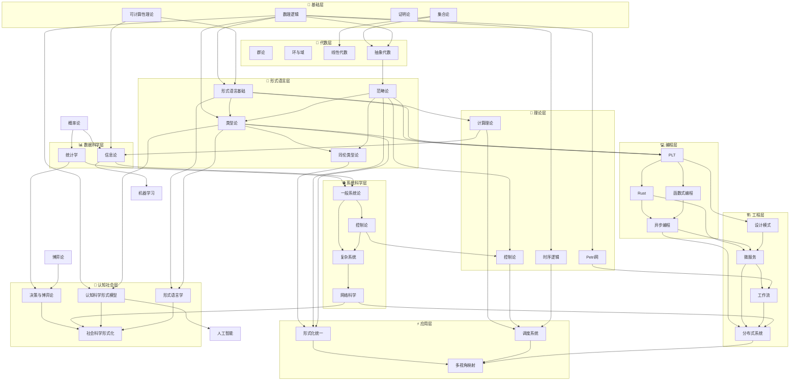
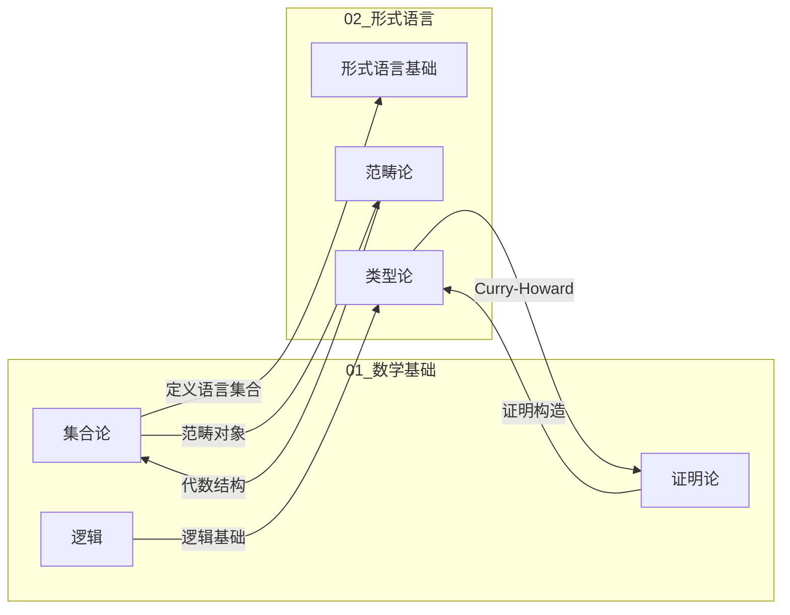
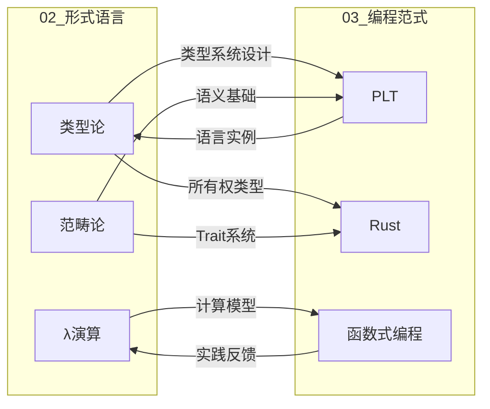
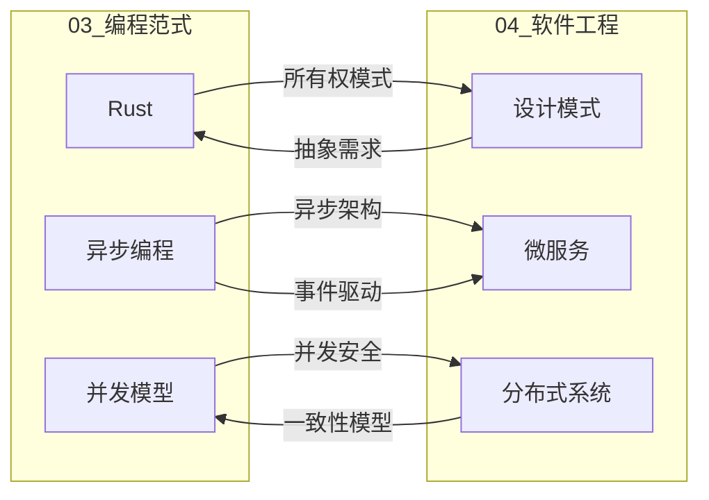
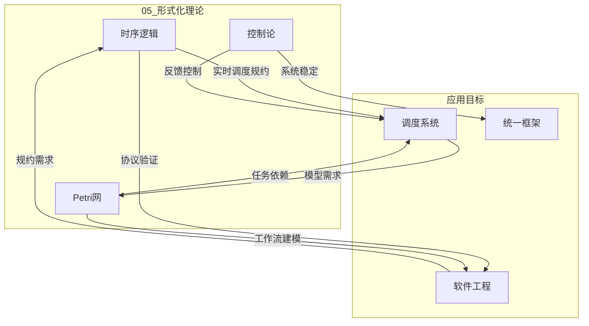
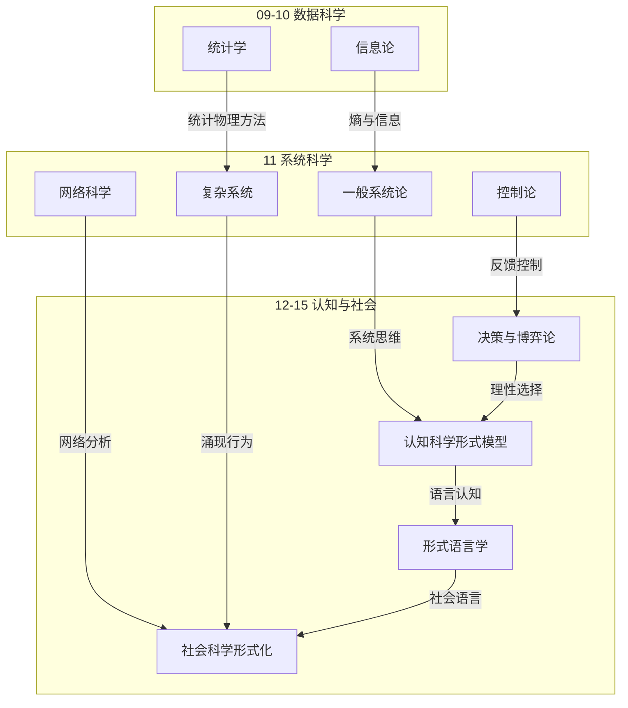
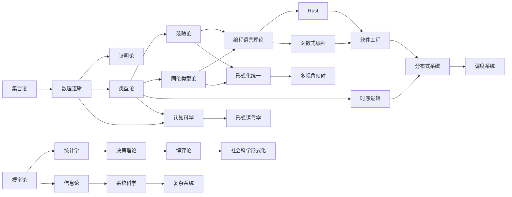
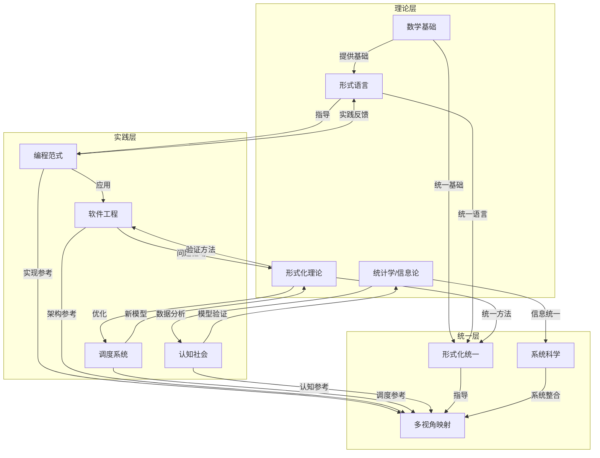
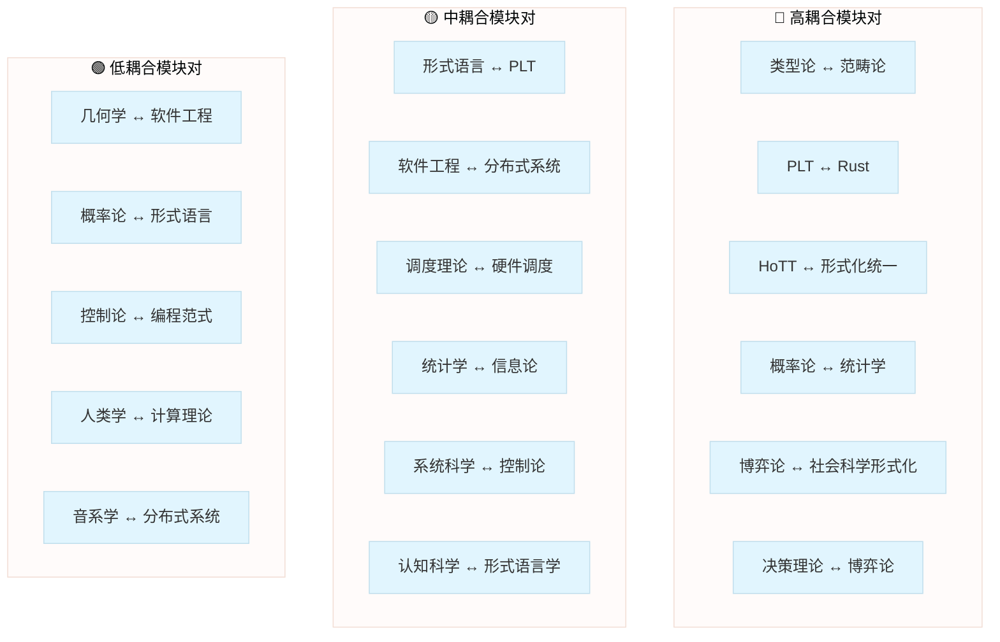

# FormalScience 知识地图

> **项目**: FormalScience 形式科学知识依赖图谱
> **版本**: 2.0.0
> **最后更新**: 2026-04-12

---

## 🗺️ 概念依赖关系图

### 整体知识架构

---

## 🔗 模块间引用关系

### 数学基础 ↔ 形式语言

### 形式语言 ↔ 编程范式

### 编程范式 ↔ 软件工程

### 形式化理论 ↔ 各模块

### 新增模块：数据科学 ↔ 系统科学 ↔ 认知社会

---

## 📋 前置知识要求

### 按模块前置要求

#### 01 数学基础

| 子模块 | 前置知识 | 建议先修 |
|--------|----------|----------|
| 01_元数学基础 | 高中数学、基础逻辑 | 无 |
| 02_代数学 | 集合论、数理逻辑 | 01_元数学基础 |
| 03_几何学 | 线性代数、数学分析基础 | 02_代数学 |
| 04_分析学 | 实数理论、拓扑基础 | 01_元数学基础 |
| 05_概率论与测度论 | 实分析、泛函分析 | 04_分析学 |

#### 02 形式语言

| 子模块 | 前置知识 | 建议先修 |
|--------|----------|----------|
| 01_形式语言基础 | 集合论、数理逻辑 | 01_元数学基础 |
| 02_类型论 | λ演算、逻辑基础 | 01_形式语言基础 |
| 03_同伦类型论 | 类型论、代数拓扑 | 02_类型论 + 03_几何学 |
| 04_范畴论 | 抽象代数、集合论 | 02_代数学 |

#### 03 编程范式

| 子模块 | 前置知识 | 建议先修 |
|--------|----------|----------|
| 01_编程语言理论 | 类型论、形式语义 | 02_形式语言 |
| 02_Rust语言深入 | 类型系统、内存模型 | 01_编程语言理论 |
| 03_异步编程模型 | 并发理论、PLT | 01_编程语言理论 |
| 04_函数式编程 | λ演算、范畴论 | 02_形式语言 |

#### 04 软件工程

| 子模块 | 前置知识 | 建议先修 |
|--------|----------|----------|
| 01_设计模式 | 面向对象、类型系统 | 03_编程范式 |
| 02_微服务架构 | 分布式基础、网络 | 03_异步编程模型 |
| 03_工作流系统 | Petri网、形式建模 | 05_形式化理论 |
| 04_分布式系统 | 并发模型、共识理论 | 03_编程范式 |

#### 05 形式化理论

| 子模块 | 前置知识 | 建议先修 |
|--------|----------|----------|
| 01_时序逻辑 | 模态逻辑、自动机 | 01_元数学基础 |
| 02_Petri网理论 | 图论、并发理论 | 01_形式语言基础 |
| 03_控制论 | 微分方程、系统理论 | 01_数学基础 |
| 04_计算理论 | 自动机、可计算性 | 01_形式语言基础 |

#### 06 调度系统

| 子模块 | 前置知识 | 建议先修 |
|--------|----------|----------|
| 01_调度理论基础 | 算法分析、优化理论 | 01_数学基础 |
| 02_硬件调度 | 计算机体系结构 | 01_调度理论基础 |
| 03_OS调度 | 操作系统原理 | 01_调度理论基础 |
| 04_分布式调度 | 分布式系统、网络 | 04_分布式系统 |

#### 07 交叉视角

| 子模块 | 前置知识 | 建议先修 |
|--------|----------|----------|
| 01_形式化方法统一 | 全部形式化理论 | 02_形式语言 + 05_形式化理论 |
| 02_多视角映射 | 范畴论、类型论 | 01_形式化方法统一 |

#### 09 统计学 (新增)

| 子模块 | 前置知识 | 建议先修 |
|--------|----------|----------|
| 01_描述统计 | 基础数学 | 无 |
| 02_概率论基础 | 微积分、集合论 | 01_数学基础 |
| 03_推断统计 | 概率论、线性代数 | 02_概率论基础 |
| 04_贝叶斯统计 | 概率论、积分 | 02_概率论基础 |
| 05_数理统计 | 实分析、测度论 | 04_分析学 + 05_概率论与测度论 |
| 06_统计计算 | 编程基础、数值方法 | 03_推断统计 |

#### 10 信息论 (新增)

| 子模块 | 前置知识 | 建议先修 |
|--------|----------|----------|
| 01_香农信息论基础 | 概率论、随机变量 | 09_统计学/02_概率论基础 |
| 02_信源编码 | 熵、编码理论 | 01_香农信息论基础 |
| 03_信道编码 | 概率论、线性代数 | 01_香农信息论基础 |
| 04_算法信息论 | 可计算性理论 | 05_形式化理论/04_计算理论 |
| 05_量子信息论 | 量子力学基础、线性代数 | 01_香农信息论基础 + 02_线性代数 |

#### 11 系统科学 (新增)

| 子模块 | 前置知识 | 建议先修 |
|--------|----------|----------|
| 01_一般系统论 | 基础数学、逻辑 | 无 |
| 02_控制论 | 微分方程、线性代数 | 01_数学基础 |
| 03_复杂系统 | 统计物理、概率论 | 09_统计学 |
| 04_自组织理论 | 热力学、非线性动力学 | 02_控制论 + 03_复杂系统 |
| 05_网络科学 | 图论、概率论 | 09_统计学 |
| 06_系统动力学 | 微分方程、建模 | 02_控制论 |

#### 12 决策与博弈论 (新增)

| 子模块 | 前置知识 | 建议先修 |
|--------|----------|----------|
| 01_决策理论基础 | 概率论、效用理论 | 09_统计学 |
| 02_博弈论基础 | 决策理论、优化 | 01_决策理论基础 |
| 03_机制设计 | 博弈论、线性规划 | 02_博弈论基础 |
| 04_社会选择理论 | 逻辑、集合论 | 02_博弈论基础 |
| 05_行为博弈论 | 博弈论、心理学 | 02_博弈论基础 |

#### 13 认知科学形式模型 (新增)

| 子模块 | 前置知识 | 建议先修 |
|--------|----------|----------|
| 01_形式认识论 | 模态逻辑、概率论 | 02_形式语言 + 09_统计学 |
| 02_计算认知科学 | 编程、机器学习 | 03_编程范式 |
| 03_概念与范畴 | 认知心理学、几何 | 基础认知科学 |
| 04_推理与问题解决 | 逻辑、概率 | 01_形式认识论 |
| 05_学习与记忆 | 机器学习、统计 | 02_计算认知科学 |

#### 14 形式语言学 (新增)

| 子模块 | 前置知识 | 建议先修 |
|--------|----------|----------|
| 01_形式语法 | 自动机理论、文法 | 02_形式语言/01_形式语言基础 |
| 02_形式语义学 | 类型论、逻辑 | 02_形式语言/02_类型论 |
| 03_音系学形式理论 | 音系学基础、形式规则 | 01_形式语法 |
| 04_计算语言学 | 编程、算法 | 03_编程范式 |

#### 15 社会科学形式化 (新增)

| 子模块 | 前置知识 | 建议先修 |
|--------|----------|----------|
| 01_数理经济学基础 | 优化、博弈论 | 12_决策与博弈论 |
| 02_形式政治学 | 博弈论、社会选择 | 12_决策与博弈论 |
| 03_计算社会学 | 网络科学、仿真 | 11_系统科学/05_网络科学 |
| 04_形式人类学 | 结构主义、符号学 | 基础人类学 |

---

## 🎯 核心依赖路径

### 关键学习路径图

### 最短前置路径

从基础到各模块的最短路径：

| 目标模块 | 最短路径 | 步数 |
|----------|----------|------|
| 类型论 | 集合论→数理逻辑→类型论 | 2 |
| Rust深入 | 数理逻辑→类型论→PLT→Rust | 3 |
| 分布式系统 | 类型论→PLT→软件工程→分布式 | 3 |
| 调度系统 | 分析学→调度理论→分布式调度 | 2 |
| 形式化统一 | 类型论→HoTT→形式化统一 | 2 |
| 统计学 | 概率论→统计推断 | 1 |
| 信息论 | 概率论→香农信息论 | 1 |
| 决策理论 | 概率论→效用理论 | 1 |
| 博弈论 | 决策理论→博弈论基础 | 1 |
| 认知科学 | 类型论→形式认识论 | 2 |
| 形式语言学 | 类型论→形式语义学 | 2 |
| 社会科学 | 博弈论→数理经济学 | 1 |

---

## 🔄 知识循环与反馈

### 理论与实践的循环

---

## 📐 知识结构度量

### 模块间耦合度

### 知识深度层级

| 层级 | 模块 | 抽象程度 |
|------|------|----------|
| L0 元层 | 元数学基础 | 最高 |
| L1 基础层 | 代数学、几何学、分析学、概率论 | 高 |
| L2 形式层 | 形式语言、类型论、范畴论、信息论 | 高 |
| L3 语言层 | 编程范式、PLT、形式语言学 | 中高 |
| L4 系统层 | 软件工程、形式化理论、系统科学 | 中 |
| L5 应用层 | 调度系统、多视角映射、统计学 | 应用 |
| L6 社会层 | 决策与博弈论、认知科学、社会科学 | 跨学科 |

---

## 🔍 快速导航

- [📑 主索引](00_INDEX.md) - 完整文件清单
- [📈 进度追踪](00_PROGRESS.md) - 完成度统计
- [01_数学基础](01_数学基础/_index.md)
- [02_形式语言](02_形式语言/_index.md)
- [03_编程范式](03_编程范式/_index.md)
- [04_软件工程](04_软件工程/_index.md)
- [05_形式化理论](05_形式化理论/_index.md)
- [06_调度系统](06_调度系统/_index.md)
- [07_交叉视角](07_交叉视角/_index.md)
- [08_附录](08_附录/_index.md)
- **[09_统计学](09_统计学/_index.md)** ⭐新增
- **[10_信息论](10_信息论/_index.md)** ⭐新增
- **[11_系统科学](11_系统科学/_index.md)** ⭐新增
- **[12_决策与博弈论](12_决策与博弈论/_index.md)** ⭐新增
- **[13_认知科学形式模型](13_认知科学形式模型/_index.md)** ⭐新增
- **[14_形式语言学](14_形式语言学/_index.md)** ⭐新增
- **[15_社会科学形式化](15_社会科学形式化/_index.md)** ⭐新增

---

**导航**: [⬆️ 返回顶部](#formalscience-知识地图) | [📑 主索引](00_INDEX.md) | [📈 进度追踪](00_PROGRESS.md) | [📚 概念索引](08_附录/03_索引/03.1_概念索引.md)

---

## 📊 交叉引用统计

> 最后更新: 2026-04-12

| 统计项 | 数量 |
|--------|------|
| 核心概念定义 | 150 |
| 定理与引理 | 9 |
| 模块间引用关系 | 128 |
| 文档文件总数 | 516 |

### 概念分布

| 模块 | 概念数量 |
|------|----------|
| 形式语言 | 20 |
| 编程范式 | 18 |
| 数学基础 | 17 |
| 软件工程 | 15 |
| 统计学 | 9 |
| 形式化理论 | 7 |
| 调度系统 | 7 |
| 交叉视角 | 5 |
| 信息论 | 5 |
| 决策与博弈论 | 5 |
| 系统科学 | 3 |
| 认知科学 | 3 |
| 形式语言学 | 3 |
| 社会科学 | 3 |
