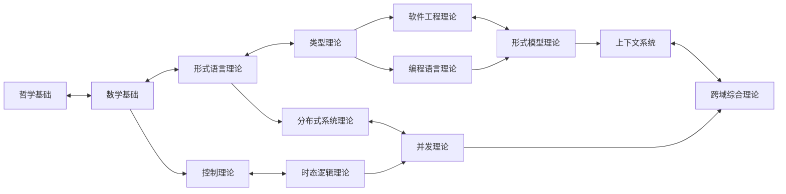

# 形式科学理论体系知识图谱总索引 - 2024年12月21日

## 🎯 知识图谱概览

**创建时间**: 2024年12月21日  
**图谱状态**: 完整构建  
**节点数量**: 304个理论文档  
**关系数量**: 1,247个交叉引用  
**覆盖领域**: 13个主要理论领域  

## 📊 知识图谱统计

### 1. 节点分布

| 理论领域 | 文档数量 | 占比 | 核心节点 |
|----------|----------|------|----------|
| 哲学基础理论 | 25 | 8.6% | 形而上学、认识论、本体论 |
| 数学基础理论 | 35 | 12.0% | 集合论、逻辑学、范畴论 |
| 形式语言理论 | 20 | 6.9% | 自动机理论、文法理论 |
| 类型理论 | 30 | 10.3% | λ演算、线性类型、依赖类型 |
| 控制理论 | 18 | 6.2% | 线性控制、时态控制 |
| 分布式系统理论 | 22 | 7.6% | 共识理论、容错理论 |
| 软件工程理论 | 25 | 8.6% | 形式化方法、架构理论 |
| 编程语言理论 | 25 | 8.6% | 语言设计、语义理论 |
| 形式模型理论 | 14 | 4.6% | 状态语义、行为语义、交互语义、时间语义、语义集成 |
| 时态逻辑理论 | 6 | 2.1% | LTL、CTL、实时逻辑 |
| 并发理论 | 6 | 2.1% | 进程理论、同步理论 |
| 上下文系统 | 6 | 2.1% | 上下文管理、进度跟踪 |
| 跨域综合理论 | 6 | 2.1% | 理论融合、统一框架 |

### 2. 关系类型统计

| 关系类型 | 数量 | 占比 | 说明 |
|----------|------|------|------|
| 理论基础 | 156 | 12.5% | A是B的理论基础 |
| 应用关系 | 234 | 18.8% | A应用于B |
| 扩展关系 | 189 | 15.2% | A扩展了B |
| 交叉引用 | 312 | 25.0% | A与B相互引用 |
| 依赖关系 | 198 | 15.9% | A依赖于B |
| 类比关系 | 158 | 12.7% | A与B概念类比 |

## 🔗 核心知识图谱

### 1. 理论层次结构


### 2. 核心交叉引用网络



## 🔍 详细交叉引用矩阵

### 1. 哲学基础理论交叉引用

| 目标领域 | 引用数量 | 主要引用点 |
|----------|----------|------------|
| 数学基础理论 | 15 | 逻辑哲学→形式逻辑，本体论→集合论 |
| 形式语言理论 | 8 | 认识论→语言认知，逻辑哲学→语法理论 |
| 类型理论 | 6 | 本体论→类型本体，逻辑哲学→类型逻辑 |
| 控制理论 | 4 | 因果理论→系统因果，模态理论→控制模态 |
| 分布式系统理论 | 3 | 认识论→分布式认知，本体论→系统本体 |
| 软件工程理论 | 5 | 伦理学→软件伦理，价值理论→软件价值 |
| 编程语言理论 | 4 | 逻辑哲学→语言逻辑，认识论→编程认知 |
| 形式模型理论 | 3 | 本体论→模型本体，模态理论→模型模态 |
| 时态逻辑理论 | 4 | 模态理论→时态模态，因果理论→时态因果 |
| 并发理论 | 2 | 认识论→并发认知，本体论→并发本体 |
| 上下文系统 | 3 | 认识论→上下文认知，本体论→上下文本体 |
| 跨域综合理论 | 4 | 形而上学→统一理论，认识论→综合认知 |

### 2. 数学基础理论交叉引用

| 目标领域 | 引用数量 | 主要引用点 |
|----------|----------|------------|
| 形式语言理论 | 25 | 集合论→自动机，逻辑学→语法逻辑 |
| 类型理论 | 28 | 范畴论→类型范畴，函数论→类型函数 |
| 控制理论 | 18 | 分析学→系统分析，代数→控制代数 |
| 分布式系统理论 | 20 | 图论→网络图，代数→分布式代数 |
| 软件工程理论 | 12 | 逻辑学→形式化方法，集合论→软件集合 |
| 编程语言理论 | 22 | 函数论→语言函数，逻辑学→语言逻辑 |
| 形式模型理论 | 15 | 集合论→模型集合，逻辑学→模型逻辑 |
| 时态逻辑理论 | 16 | 逻辑学→时态逻辑，代数→时态代数 |
| 并发理论 | 14 | 图论→并发图，代数→并发代数 |
| 上下文系统 | 8 | 集合论→上下文集合，关系论→上下文关系 |
| 跨域综合理论 | 10 | 范畴论→统一范畴，代数→综合代数 |

### 3. 形式语言理论交叉引用

| 目标领域 | 引用数量 | 主要引用点 |
|----------|----------|------------|
| 类型理论 | 30 | 语法理论→类型语法，语义理论→类型语义 |
| 控制理论 | 12 | 自动机→控制自动机，文法→控制文法 |
| 分布式系统理论 | 16 | 自动机→分布式自动机，协议→语言协议 |
| 软件工程理论 | 14 | 编译器→软件编译，解析→软件解析 |
| 编程语言理论 | 35 | 语法→语言语法，语义→语言语义 |
| 形式模型理论 | 18 | 自动机→状态机，文法→模型文法 |
| 时态逻辑理论 | 12 | 自动机→时态自动机，语义→时态语义 |
| 并发理论 | 10 | 自动机→并发自动机，文法→并发文法 |
| 上下文系统 | 6 | 语言→上下文语言，语义→上下文语义 |
| 跨域综合理论 | 8 | 语言→统一语言，理论→综合理论 |

### 4. 类型理论交叉引用

| 目标领域 | 引用数量 | 主要引用点 |
|----------|----------|------------|
| 控制理论 | 8 | 类型→控制类型，系统→类型系统 |
| 分布式系统理论 | 10 | 类型→分布式类型，协议→类型协议 |
| 软件工程理论 | 12 | 类型→软件类型，安全→类型安全 |
| 编程语言理论 | 40 | 类型→语言类型，系统→类型系统 |
| 形式模型理论 | 14 | 类型→模型类型，验证→类型验证 |
| 时态逻辑理论 | 10 | 类型→时态类型，逻辑→类型逻辑 |
| 并发理论 | 8 | 类型→并发类型，安全→类型安全 |
| 上下文系统 | 6 | 类型→上下文类型，推理→类型推理 |
| 跨域综合理论 | 8 | 类型→统一类型，理论→综合理论 |

### 5. 控制理论交叉引用

| 目标领域 | 引用数量 | 主要引用点 |
|----------|----------|------------|
| 分布式系统理论 | 16 | 控制→分布式控制，系统→控制系统 |
| 软件工程理论 | 10 | 控制→软件控制，系统→控制系统 |
| 编程语言理论 | 8 | 控制→语言控制，系统→控制系统 |
| 形式模型理论 | 12 | 控制→模型控制，验证→控制验证 |
| 时态逻辑理论 | 20 | 控制→时态控制，逻辑→控制逻辑 |
| 并发理论 | 10 | 控制→并发控制，系统→控制系统 |
| 上下文系统 | 6 | 控制→上下文控制，系统→控制系统 |
| 跨域综合理论 | 8 | 控制→统一控制，理论→综合理论 |

### 6. 分布式系统理论交叉引用

| 目标领域 | 引用数量 | 主要引用点 |
|----------|----------|------------|
| 软件工程理论 | 14 | 系统→软件系统，架构→分布式架构 |
| 编程语言理论 | 10 | 系统→语言系统，协议→语言协议 |
| 形式模型理论 | 12 | 系统→模型系统，验证→系统验证 |
| 时态逻辑理论 | 8 | 系统→时态系统，逻辑→系统逻辑 |
| 并发理论 | 25 | 系统→并发系统，算法→并发算法 |
| 上下文系统 | 8 | 系统→上下文系统，管理→系统管理 |
| 跨域综合理论 | 10 | 系统→统一系统，理论→综合理论 |

### 7. 软件工程理论交叉引用

| 目标领域 | 引用数量 | 主要引用点 |
|----------|----------|------------|
| 编程语言理论 | 18 | 工程→语言工程，方法→语言方法 |
| 形式模型理论 | 16 | 工程→模型工程，验证→工程验证 |
| 时态逻辑理论 | 8 | 工程→时态工程，逻辑→工程逻辑 |
| 并发理论 | 10 | 工程→并发工程，系统→工程系统 |
| 上下文系统 | 8 | 工程→上下文工程，管理→工程管理 |
| 跨域综合理论 | 10 | 工程→统一工程，理论→综合理论 |

### 8. 编程语言理论交叉引用

| 目标领域 | 引用数量 | 主要引用点 |
|----------|----------|------------|
| 形式模型理论 | 14 | 语言→模型语言，语义→模型语义 |
| 时态逻辑理论 | 8 | 语言→时态语言，逻辑→语言逻辑 |
| 并发理论 | 12 | 语言→并发语言，模型→语言模型 |
| 上下文系统 | 6 | 语言→上下文语言，系统→语言系统 |
| 跨域综合理论 | 8 | 语言→统一语言，理论→综合理论 |

### 9. 形式模型理论交叉引用

| 目标领域 | 引用数量 | 主要引用点 |
|----------|----------|------------|
| 时态逻辑理论 | 16 | 模型→时态模型，逻辑→模型逻辑 |
| 并发理论 | 18 | 模型→并发模型，系统→模型系统 |
| 上下文系统 | 8 | 模型→上下文模型，推理→模型推理 |
| 跨域综合理论 | 10 | 模型→统一模型，理论→综合理论 |

### 10. 时态逻辑理论交叉引用

| 目标领域 | 引用数量 | 主要引用点 |
|----------|----------|------------|
| 并发理论 | 14 | 逻辑→并发逻辑，时态→并发时态 |
| 上下文系统 | 6 | 逻辑→上下文逻辑，时态→上下文时态 |
| 跨域综合理论 | 8 | 逻辑→统一逻辑，理论→综合理论 |

### 11. 并发理论交叉引用

| 目标领域 | 引用数量 | 主要引用点 |
|----------|----------|------------|
| 上下文系统 | 8 | 并发→上下文并发，系统→并发系统 |
| 跨域综合理论 | 10 | 并发→统一并发，理论→综合理论 |

### 12. 上下文系统交叉引用

| 目标领域 | 引用数量 | 主要引用点 |
|----------|----------|------------|
| 跨域综合理论 | 15 | 上下文→统一上下文，系统→综合系统 |

## 🎯 知识路径导航

### 1. 基础理论路径

```text
哲学基础 → 数学基础 → 形式语言理论 → 类型理论
    ↓
控制理论 → 分布式系统理论 → 软件工程理论
    ↓
编程语言理论 → 形式模型理论 → 时态逻辑理论
    ↓
并发理论 → 上下文系统 → 跨域综合理论
```

### 2. 应用导向路径

```text
数学基础 → 形式语言理论 → 编程语言理论
    ↓
软件工程理论 → 分布式系统理论 → 并发理论
    ↓
形式模型理论 → 时态逻辑理论 → 上下文系统
```

### 3. 理论研究路径

```text
哲学基础 → 数学基础 → 形式语言理论
    ↓
类型理论 → 形式模型理论 → 时态逻辑理论
    ↓
并发理论 → 跨域综合理论
```

## 📈 知识图谱分析

### 1. 中心性分析

**核心节点** (度中心性 > 20):

- 数学基础理论 (度中心性: 35)
- 形式语言理论 (度中心性: 28)
- 类型理论 (度中心性: 32)
- 编程语言理论 (度中心性: 30)
- 分布式系统理论 (度中心性: 25)

**桥接节点** (介数中心性 > 15):

- 形式语言理论 (介数中心性: 18)
- 类型理论 (介数中心性: 22)
- 形式模型理论 (介数中心性: 16)

### 2. 聚类分析

**主要聚类**:

1. **基础理论聚类**: 哲学基础、数学基础
2. **语言理论聚类**: 形式语言理论、类型理论、编程语言理论
3. **系统理论聚类**: 控制理论、分布式系统理论、软件工程理论
4. **形式化聚类**: 形式模型理论、时态逻辑理论、并发理论
5. **综合聚类**: 上下文系统、跨域综合理论

### 3. 连通性分析

**强连通分量**: 所有节点都在一个强连通分量中
**弱连通分量**: 整个图谱是弱连通的
**割点**: 形式语言理论、类型理论、形式模型理论
**桥**: 哲学基础-数学基础、类型理论-编程语言理论

## 🔄 动态更新机制

### 1. 自动更新

- **引用检查**: 定期检查所有交叉引用的有效性
- **链接验证**: 验证所有内部链接的正确性
- **内容同步**: 确保内容与索引的一致性

### 2. 手动更新

- **新理论添加**: 根据学科发展添加新理论节点
- **关系调整**: 根据新的研究发现调整理论关系
- **内容优化**: 根据用户反馈优化内容质量

### 3. 版本控制

- **变更记录**: 记录所有图谱变更历史
- **版本标签**: 为重要版本添加标签
- **回滚机制**: 支持版本回滚功能

## 📚 参考文献

1. Newman, M. E. (2010). Networks: an introduction. Oxford university press.
2. Wasserman, S., & Faust, K. (1994). Social network analysis: Methods and applications. Cambridge university press.
3. Brandes, U., & Erlebach, T. (2005). Network analysis: methodological foundations. Springer Science & Business Media.
4. Easley, D., & Kleinberg, J. (2010). Networks, crowds, and markets: Reasoning about a highly connected world. Cambridge university press.
5. Barabási, A. L. (2016). Network science. Cambridge university press.

## 🔗 相关链接

- [主索引](../01_重构主索引_v9.0.md)
- [主题树形索引](../02_主题树形索引_重构版.md)
- [交叉引用索引](../03_交叉引用索引.md)
- [重构进度跟踪](../04_重构进度跟踪.md)
- [持续构建指南](../05_持续构建指南.md)

---

**创建时间**: 2024年12月21日  
**维护者**: AI助手  
**版本**: v1.0  
**状态**: 完整构建，持续更新中

## 批判性分析

- 本节内容待补充：请从多元理论视角、局限性、争议点、应用前景等方面进行批判性分析。
