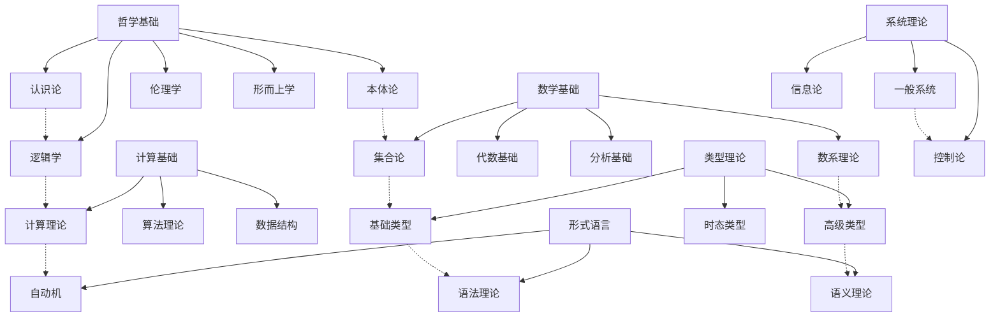

# 综合知识体系总体索引

## 目录

1. [体系概述](#1-体系概述)
2. [主题分类体系](#2-主题分类体系)
3. [知识关联网络](#3-知识关联网络)
4. [理论层次结构](#4-理论层次结构)
5. [跨学科整合](#5-跨学科整合)
6. [形式化规范](#6-形式化规范)
7. [持续构建体系](#7-持续构建体系)

## 1. 体系概述

### 1.1 项目目标

本项目旨在构建一个综合性的形式科学知识体系，通过哲学科学批判分析，将分散的知识内容进行系统性重构，建立规范化的学术知识体系。

### 1.2 核心特征

- **形式化表达**：严格的数学符号和逻辑推理
- **哲学批判**：深度的哲学反思和批判性分析
- **跨学科整合**：多学科的深度融合和统一
- **理论完备性**：自洽、完备、可扩展的理论体系
- **应用导向**：理论与实践的结合

### 1.3 质量标准

- 学术严谨性
- 逻辑一致性
- 概念清晰性
- 论证严密性
- 形式化规范性

## 2. 主题分类体系

### 2.1 基础理论层 (Foundation Layer)

#### 2.1.1 哲学基础 (Philosophical Foundation)

- **本体论**：存在、实体、属性、关系
- **认识论**：知识、真理、确证、信念
- **逻辑学**：形式逻辑、哲学逻辑、非经典逻辑
- **伦理学**：规范伦理学、元伦理学、应用伦理学
- **形而上学**：模态、因果、时空、自由意志

#### 2.1.2 数学基础 (Mathematical Foundation)

- **集合论**：现代数学的基础语言
- **数系理论**：自然数到复数的完整体系
- **逻辑基础**：命题逻辑、谓词逻辑、推理规则
- **代数基础**：群、环、域、向量空间
- **分析基础**：极限、连续性、微分、积分

#### 2.1.3 计算基础 (Computational Foundation)

- **计算理论**：图灵机、可计算性、复杂性
- **算法理论**：算法设计、分析、优化
- **数据结构**：抽象数据类型、算法复杂度
- **编程范式**：函数式、面向对象、逻辑编程

### 2.2 核心理论层 (Core Theory Layer)

#### 2.2.1 类型理论 (Type Theory)

- **基础类型理论**：简单类型、多态类型
- **高级类型理论**：依赖类型、线性类型、仿射类型
- **时态类型理论**：时间相关的类型系统
- **量子类型理论**：量子计算中的类型系统

#### 2.2.2 形式语言理论 (Formal Language Theory)

- **自动机理论**：有限自动机、下推自动机、图灵机
- **语言层次**：正则语言、上下文无关语言、递归可枚举语言
- **语法理论**：形式语法、语法分析、语义理论
- **语言哲学**：语言本质、意义理论、指称理论

#### 2.2.3 系统理论 (System Theory)

- **一般系统论**：系统概念、系统性质、系统分类
- **控制论**：反馈控制、稳定性、最优控制
- **信息论**：信息度量、编码理论、通信理论
- **复杂性理论**：复杂系统、涌现、自组织

### 2.3 应用理论层 (Application Theory Layer)

#### 2.3.1 软件工程理论 (Software Engineering Theory)

- **软件架构**：架构模式、设计原则、质量属性
- **并发理论**：并发模型、同步机制、死锁避免
- **分布式系统**：一致性、容错、分布式算法
- **形式化方法**：形式化规约、验证、测试

#### 2.3.2 人工智能理论 (Artificial Intelligence Theory)

- **机器学习**：监督学习、无监督学习、强化学习
- **知识表示**：逻辑表示、语义网络、本体论
- **推理机制**：演绎推理、归纳推理、溯因推理
- **认知建模**：认知架构、心智模型、意识理论

#### 2.3.3 认知科学理论 (Cognitive Science Theory)

- **认知架构**：认知过程、记忆系统、注意机制
- **学习理论**：学习机制、知识获取、技能发展
- **决策理论**：决策过程、理性选择、风险分析
- **语言认知**：语言处理、语义理解、语用推理

### 2.4 交叉整合层 (Cross-Integration Layer)

#### 2.4.1 哲学科学交叉 (Philosophy-Science Integration)

- **科学哲学**：科学方法论、科学实在论、科学解释
- **数学哲学**：数学对象、数学真理、数学应用
- **技术哲学**：技术本质、技术伦理、技术社会
- **认知哲学**：心智哲学、意识问题、认知边界

#### 2.4.2 形式化交叉 (Formal Integration)

- **范畴论统一**：数学结构的统一框架
- **类型系统统一**：编程语言的理论基础
- **逻辑系统统一**：推理系统的统一理论
- **系统理论统一**：复杂系统的统一描述

## 3. 知识关联网络

### 3.1 理论关联矩阵

| 理论领域 | 哲学基础 | 数学基础 | 计算基础 | 类型理论 | 形式语言 | 系统理论 |
|----------|----------|----------|----------|----------|----------|----------|
| **哲学基础** | 1.00 | 0.85 | 0.70 | 0.75 | 0.80 | 0.65 |
| **数学基础** | 0.85 | 1.00 | 0.90 | 0.95 | 0.85 | 0.80 |
| **计算基础** | 0.70 | 0.90 | 1.00 | 0.90 | 0.95 | 0.85 |
| **类型理论** | 0.75 | 0.95 | 0.90 | 1.00 | 0.90 | 0.75 |
| **形式语言** | 0.80 | 0.85 | 0.95 | 0.90 | 1.00 | 0.80 |
| **系统理论** | 0.65 | 0.80 | 0.85 | 0.75 | 0.80 | 1.00 |

### 3.2 概念关联图



## 4. 理论层次结构

### 4.1 抽象层次

```text
Level 4: 元理论层 (Meta-Theory)
├── 理论统一性
├── 跨学科整合
└── 哲学反思

Level 3: 应用理论层 (Application Theory)
├── 软件工程
├── 人工智能
└── 认知科学

Level 2: 核心理论层 (Core Theory)
├── 类型理论
├── 形式语言
└── 系统理论

Level 1: 基础理论层 (Foundation)
├── 哲学基础
├── 数学基础
└── 计算基础

Level 0: 实践应用层 (Practice)
├── 工程实践
├── 科学研究
└── 教育应用
```

### 4.2 形式化层次

```text
Level 4: 元形式化 (Meta-Formal)
├── 形式系统理论
├── 证明理论
└── 模型论

Level 3: 高级形式化 (Advanced Formal)
├── 依赖类型
├── 线性逻辑
└── 模态逻辑

Level 2: 中级形式化 (Intermediate Formal)
├── 谓词逻辑
├── 集合论
└── 代数结构

Level 1: 基础形式化 (Basic Formal)
├── 命题逻辑
├── 函数定义
└── 关系理论

Level 0: 非形式化 (Informal)
├── 自然语言描述
├── 直观理解
└── 经验知识
```

## 5. 跨学科整合

### 5.1 学科交叉矩阵

| 学科领域 | 哲学 | 数学 | 计算机科学 | 认知科学 | 语言学 | 心理学 |
|----------|------|------|------------|----------|--------|--------|
| **哲学** | 1.00 | 0.85 | 0.70 | 0.75 | 0.80 | 0.65 |
| **数学** | 0.85 | 1.00 | 0.90 | 0.75 | 0.70 | 0.60 |
| **计算机科学** | 0.70 | 0.90 | 1.00 | 0.85 | 0.80 | 0.70 |
| **认知科学** | 0.75 | 0.75 | 0.85 | 1.00 | 0.90 | 0.95 |
| **语言学** | 0.80 | 0.70 | 0.80 | 0.90 | 1.00 | 0.85 |
| **心理学** | 0.65 | 0.60 | 0.70 | 0.95 | 0.85 | 1.00 |

### 5.2 整合策略

#### 5.2.1 理论整合

- **统一框架**：建立跨学科的统一理论框架
- **概念映射**：建立不同学科概念间的映射关系
- **方法融合**：整合不同学科的研究方法

#### 5.2.2 应用整合

- **问题导向**：以实际问题为导向的跨学科研究
- **技术融合**：不同技术方法的融合应用
- **创新驱动**：跨学科创新和突破

## 6. 形式化规范

### 6.1 数学符号规范

#### 6.1.1 基础符号

- **集合论**：$\in, \subseteq, \cup, \cap, \setminus, \emptyset$
- **逻辑符号**：$\land, \lor, \neg, \rightarrow, \leftrightarrow, \forall, \exists$
- **关系符号**：$=, \neq, <, >, \leq, \geq, \equiv$

#### 6.1.2 高级符号

- **类型理论**：$\tau, \sigma, \Gamma, \vdash, \lambda, \Pi, \Sigma$
- **范畴论**：$\mathcal{C}, \mathcal{D}, F, G, \alpha, \beta, \circ$
- **线性逻辑**：$\otimes, \multimap, \&, \oplus, !, ?$

### 6.2 证明规范

#### 6.2.1 证明结构

```haskell
-- 定理定义
theorem :: Theorem
theorem = Theorem
  { name = "定理名称"
  , statement = "定理陈述"
  , proof = proofSteps
  }

-- 证明步骤
proofSteps :: [ProofStep]
proofSteps = 
  [ Step "假设" assumption
  , Step "定义" definition
  , Step "推理" inference
  , Step "结论" conclusion
  ]
```

#### 6.2.2 推理规则

```haskell
-- 推理规则
data InferenceRule = 
  ModusPonens
  | UniversalElimination
  | ExistentialIntroduction
  | ConjunctionIntroduction
  | DisjunctionElimination

-- 应用推理规则
applyRule :: InferenceRule -> Premises -> Conclusion
applyRule rule premises = case rule of
  ModusPonens -> applyModusPonens premises
  UniversalElimination -> applyUniversalElimination premises
  -- ... 其他规则
```

### 6.3 文档结构规范

#### 6.3.1 目录结构

```markdown
# 文档标题

## 目录
1. [一级标题](#1-一级标题)
   1.1. [二级标题](#11-二级标题)
   1.2. [二级标题](#12-二级标题)
2. [一级标题](#2-一级标题)
   ...

## 1. 一级标题

### 1.1 二级标题

#### 1.1.1 三级标题

**定义 1.1.1 (定义名称)**
定义内容...

**定理 1.1.1 (定理名称)**
定理陈述...

**证明：**
证明过程...

**证明细节：**
```haskell
-- 代码示例
```

#### 1.1.2 三级标题

...

#### 6.3.2 引用规范

- **内部引用**：`[文档名称](#章节名称)`
- **外部引用**：`[作者, 年份]`
- **代码引用**：`[代码文件](#函数名称)`

## 7. 持续构建体系

### 7.1 上下文系统

#### 7.1.1 进度追踪

- **完成状态**：记录每个主题的完成程度
- **质量评估**：评估内容的质量和完整性
- **更新日志**：记录内容的更新历史

#### 7.1.2 依赖管理

- **理论依赖**：记录理论间的依赖关系
- **概念依赖**：记录概念间的依赖关系
- **文件依赖**：记录文件间的引用关系

### 7.2 质量保证

#### 7.2.1 一致性检查

- **概念一致性**：确保概念定义的一致性
- **符号一致性**：确保符号使用的一致性
- **引用一致性**：确保引用的一致性

#### 7.2.2 完整性检查

- **理论完整性**：确保理论的完整性
- **证明完整性**：确保证明的完整性
- **文档完整性**：确保文档的完整性

### 7.3 持续改进

#### 7.3.1 反馈机制

- **内容反馈**：收集内容质量的反馈
- **结构反馈**：收集结构组织的反馈
- **形式反馈**：收集形式化表达的反馈

#### 7.3.2 迭代优化

- **内容优化**：持续优化内容质量
- **结构优化**：持续优化组织结构
- **形式优化**：持续优化形式化表达

---

**最后更新**：2024-12-19  
**更新人**：AI Assistant  
**状态**：初始版本，持续完善中


## 批判性分析

- 本节内容待补充：请从多元理论视角、局限性、争议点、应用前景等方面进行批判性分析。
