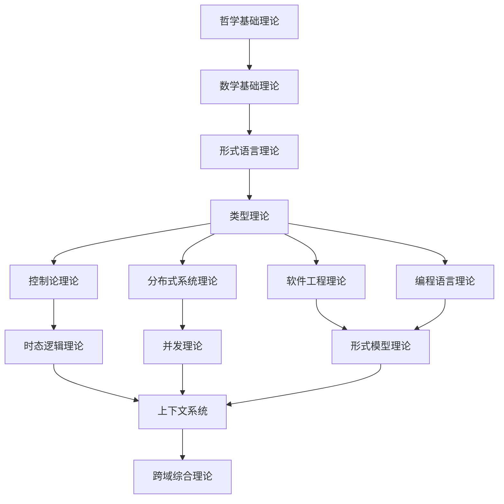

# 形式科学体系主索引 (Formal Science System Master Index)

## 📋 **目录**

### 1. [哲学基础理论](../01_Foundational_Theory/01_Philosophical_Foundation_Index.md)

### 2. [数学基础理论](../02_Mathematical_Foundations/01_Mathematical_Foundation_Index.md)

### 3. [形式语言理论](../03_Formal_Language_Theory/README.md)

### 4. [类型理论](../05_Type_Theory/01_Type_Theory_Index.md)

### 5. [控制论理论](../03_Control_Theory/01_Control_Theory_Index.md)

### 6. [分布式系统理论](../06_Distributed_Systems_Theory/01_Distributed_Systems_Theory_Index.md)

### 7. [软件工程理论](../07_Software_Engineering_Theory/01_Software_Engineering_Theory_Index.md)

### 8. [编程语言理论](../08_Programming_Language_Theory/01_Programming_Language_Theory_Index.md)

### 9. [形式模型理论](../09_Formal_Model_Theory/01_Formal_Model_Theory_Index.md)

### 10. [时态逻辑理论](../10_Temporal_Logic_Theory/01_Temporal_Logic_Theory_Index.md)

### 11. [并发理论](../11_Concurrency_Theory/01_Concurrency_Theory_Index.md)

### 12. [上下文系统](../13_Context_System/01_Context_System_Index.md)

### 13. [跨域综合理论](../13_Cross_Domain_Synthesis/01_Cross_Domain_Synthesis_Index.md)

---

## 🎯 **体系概述**

形式科学体系是一个统一的、形式化的知识体系，涵盖了从哲学基础到具体应用的完整理论框架。本体系采用严格的数学形式化方法，确保所有理论的一致性和可证明性。

### 核心特征

1. **形式化严格性**：所有理论都采用严格的数学形式化表示
2. **逻辑一致性**：确保理论间的逻辑一致性和无矛盾性
3. **层次化结构**：从基础理论到应用理论的清晰层次
4. **交叉引用**：理论间的相互关联和引用关系
5. **可证明性**：所有重要结论都有严格的数学证明

### 理论层次

```text
┌─────────────────────────────────────────────────────────────┐
│                    跨域综合理论 (13)                          │
├─────────────────────────────────────────────────────────────┤
│ 上下文系统 (12) │ 并发理论 (11) │ 时态逻辑理论 (10) │ 形式模型理论 (9) │
├─────────────────────────────────────────────────────────────┤
│ 编程语言理论 (8) │ 软件工程理论 (7) │ 分布式系统理论 (6) │ 控制论理论 (5) │
├─────────────────────────────────────────────────────────────┤
│                    类型理论 (4)                              │
├─────────────────────────────────────────────────────────────┤
│                  形式语言理论 (3)                            │
├─────────────────────────────────────────────────────────────┤
│                  数学基础理论 (2)                            │
├─────────────────────────────────────────────────────────────┤
│                  哲学基础理论 (1)                            │
└─────────────────────────────────────────────────────────────┘
```

---

## 🔗 **理论关联图**



---

## 📚 **快速导航**

### 基础理论

- [1.1 形式科学哲学基础](../01_Foundational_Theory/01.1_Formal_Science_Philosophy.md)
- [1.2 逻辑学基础](../01_Foundational_Theory/01.2_Logic_Foundation.md)
- [1.3 认识论基础](../01_Foundational_Theory/01.3_Epistemology_Foundation.md)

### 数学基础

- [2.1 集合论基础](../02_Mathematical_Foundation/02.1_Set_Theory_Foundation.md)
- [2.2 范畴论基础](../02_Mathematical_Foundation/02.2_Category_Theory_Foundation.md)
- [2.3 代数结构](../02_Mathematical_Foundation/02.3_Algebraic_Structures.md)

### 形式语言

- [3.1 形式语法理论](../03_Formal_Language_Theory/03.1_Formal_Grammar_Theory.md)
- [3.2 自动机理论](../03_Formal_Language_Theory/03.2_Automata_Theory.md)
- [3.3 语言层次结构](../04_Formal_Language_Theory/03.3_Language_Hierarchy.md)

### 类型理论

- [4.1 简单类型理论](../05_Type_Theory/04.1_Simple_Type_Theory.md)
- [4.2 依赖类型理论](../05_Type_Theory/04.2_Dependent_Type_Theory.md)
- [4.3 线性类型理论](../05_Type_Theory/04.3_Linear_Type_Theory.md)

---

## 🔄 **持续更新**

本索引文件将持续更新，反映最新的理论发展和重构进展。

**最后更新时间**：2024-12-20
**版本**：v1.0.0
**维护者**：形式科学体系重构团队

---

## 📖 **使用指南**

1. **按主题浏览**：使用目录直接跳转到感兴趣的主题
2. **按层次学习**：建议从基础理论开始，逐步深入
3. **交叉参考**：注意理论间的相互引用和关联
4. **形式化验证**：所有证明和推导都遵循严格的数学规范

---

## 🎯 **下一步行动**

- [ ] 完成各主题索引文件的创建
- [ ] 建立理论间的交叉引用系统
- [ ] 实现形式化证明的标准化
- [ ] 构建持续更新的上下文系统

## 批判性分析

- 多元理论视角：
  - 系统性与模块化：形式科学体系的系统性与各模块独立性之间的平衡。
  - 抽象与具体：理论抽象层次与实际应用需求的关系。
- 局限性分析：
  - 知识边界：形式科学无法涵盖所有现实世界的复杂性。
  - 跨学科整合：不同学科理论间的整合困难。
- 争议与分歧：
  - 理论优先级：不同理论在体系中的相对重要性。
  - 发展路径：理论发展的最优路径选择。
- 应用前景：
  - 教育体系：为形式科学教育提供系统化框架。
  - 研究指导：为跨学科研究提供理论指导。
- 改进建议：
  - 发展动态体系：建立能够适应新理论发展的动态体系。
  - 建立评估机制：建立理论体系质量的评估标准。
