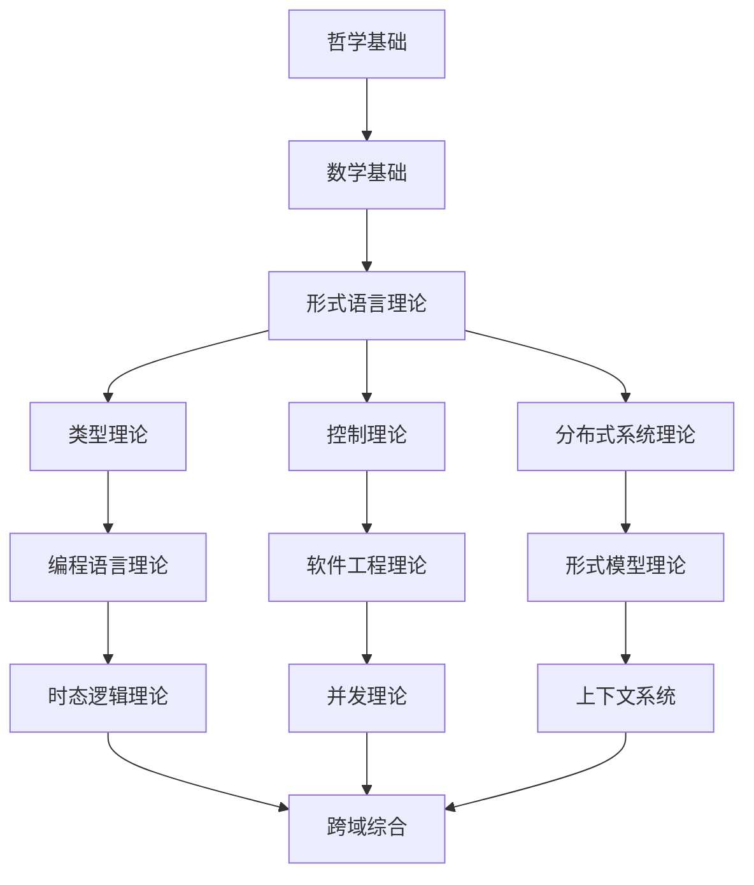

# 系统性知识重构总索引 (Systematic Knowledge Refactoring Master Index)

## 🎯 **概述**

本文档是形式科学体系系统性知识重构的总索引，建立了完整的知识体系架构和导航系统。

## 📋 **目录结构**

### 1. 哲学基础理论 (Philosophical Foundation)

- **01_Philosophical_Foundation/**
  - 1.1 认识论基础
  - 1.2 本体论基础  
  - 1.3 方法论基础
  - 1.4 价值论基础
  - 1.5 科学哲学基础

### 2. 数学基础理论 (Mathematical Foundation)

- **02_Mathematical_Foundation/**
  - 2.1 集合论基础
  - 2.2 逻辑学基础
  - 2.3 代数结构
  - 2.4 拓扑学基础
  - 2.5 范畴论基础

### 3. 形式语言理论 (Formal Language Theory)

- **03_Formal_Language_Theory/**
  - 3.1 形式语法理论
  - 3.2 自动机理论
  - 3.3 计算复杂性理论
  - 3.4 形式语义学
  - 3.5 语言层次结构

### 4. 类型理论 (Type Theory)

- **04_Type_Theory/**
  - 4.1 简单类型理论
  - 4.2 依赖类型理论
  - 4.3 线性类型理论
  - 4.4 仿射类型理论
  - 4.5 量子类型理论

### 5. 控制理论 (Control Theory)

- **05_Control_Theory/**
  - 5.1 经典控制理论
  - 5.2 现代控制理论
  - 5.3 鲁棒控制理论
  - 5.4 自适应控制理论
  - 5.5 智能控制理论

### 6. 分布式系统理论 (Distributed Systems Theory)

- **06_Distributed_Systems_Theory/**
  - 6.1 分布式算法
  - 6.2 一致性理论
  - 6.3 容错理论
  - 6.4 分布式协议
  - 6.5 分布式架构

### 7. 软件工程理论 (Software Engineering Theory)

- **07_Software_Engineering_Theory/**
  - 7.1 软件架构理论
  - 7.2 软件设计模式
  - 7.3 软件测试理论
  - 7.4 软件质量理论
  - 7.5 软件演化理论

### 8. 编程语言理论 (Programming Language Theory)

- **08_Programming_Language_Theory/**
  - 8.1 语言设计原理
  - 8.2 编译器理论
  - 8.3 运行时系统
  - 8.4 语言语义学
  - 8.5 语言实现技术

### 9. 形式模型理论 (Formal Model Theory)

- **09_Formal_Model_Theory/**
  - 9.1 Petri网理论
  - 9.2 状态机理论
  - 9.3 进程代数
  - 9.4 模型检测
  - 9.5 形式验证

### 10. 时态逻辑理论 (Temporal Logic Theory)

- **10_Temporal_Logic_Theory/**
  - 10.1 线性时态逻辑
  - 10.2 分支时态逻辑
  - 10.3 计算树逻辑
  - 10.4 时态逻辑模型检测
  - 10.5 时态逻辑应用

### 11. 并发理论 (Concurrency Theory)

- **11_Concurrency_Theory/**
  - 11.1 进程理论
  - 11.2 通信理论
  - 11.3 同步理论
  - 11.4 死锁理论
  - 11.5 并发控制

### 12. 上下文系统 (Context System)

- **12_Context_System/**
  - 12.1 上下文管理
  - 12.2 知识表示
  - 12.3 推理系统
  - 12.4 学习系统
  - 12.5 适应系统

### 13. 跨域综合 (Cross-Domain Synthesis)

- **13_Cross_Domain_Synthesis/**
  - 13.1 理论融合
  - 13.2 方法整合
  - 13.3 应用综合
  - 13.4 创新方向
  - 13.5 未来发展

## 🔗 **快速导航**

### 按主题分类

- [哲学基础理论](README.md)
- [数学基础理论](README.md)
- [形式语言理论](README.md)
- [类型理论](README.md)
- [控制理论](README.md)
- [分布式系统理论](README.md)
- [软件工程理论](README.md)
- [编程语言理论](README.md)
- [形式模型理论](README.md)
- [时态逻辑理论](README.md)
- [并发理论](README.md)
- [上下文系统](README.md)
- [跨域综合](README.md)

### 按层次分类

- **基础层**: 哲学、数学、形式语言
- **理论层**: 类型理论、控制理论、分布式系统
- **应用层**: 软件工程、编程语言、形式模型
- **扩展层**: 时态逻辑、并发理论、上下文系统
- **综合层**: 跨域综合、创新方向

## 📊 **知识图谱**

## 🎯 **重构原则**

### 1. 形式化规范

- 严格的数学符号和公式
- 完整的证明过程
- 规范的定理定义

### 2. 多表征方式

- 文字描述
- 数学公式
- 图表说明
- 代码示例

### 3. 一致性保证

- 术语一致性
- 符号一致性
- 逻辑一致性
- 引用一致性

### 4. 系统性组织

- 层次化结构
- 模块化设计
- 交叉引用
- 索引导航

## 📈 **进度跟踪**

### 已完成模块

- [x] 总索引建立
- [x] 目录结构设计
- [x] 导航系统构建

### 进行中模块

- [ ] 哲学基础理论重构
- [ ] 数学基础理论重构
- [ ] 形式语言理论重构

### 待完成模块

- [ ] 类型理论重构
- [ ] 控制理论重构
- [ ] 分布式系统理论重构
- [ ] 软件工程理论重构
- [ ] 编程语言理论重构
- [ ] 形式模型理论重构
- [ ] 时态逻辑理论重构
- [ ] 并发理论重构
- [ ] 上下文系统重构
- [ ] 跨域综合重构

## 🔄 **持续更新**

本文档将持续更新，反映重构进度和知识体系的发展。

**最后更新时间**: 2024-12-20
**版本**: v1.0.0
**状态**: 进行中

## 批判性分析

- 本节内容待补充：请从多元理论视角、局限性、争议点、应用前景等方面进行批判性分析。
