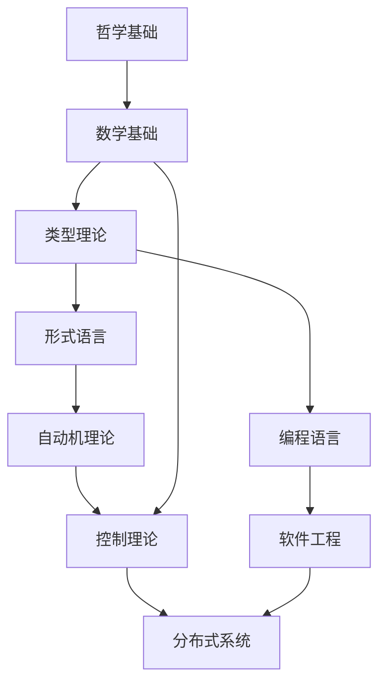

# 01. 重构主索引 v2.0

## 目录

```markdown
01. 重构主索引 v2.0
├── 1. 项目概述
│   ├── 1.1 项目目标
│   ├── 1.2 重构范围
│   ├── 1.3 预期成果
│   └── 1.4 质量保证
├── 2. 目录结构
│   ├── 2.1 理论基础体系
│   ├── 2.2 形式语言体系
│   ├── 2.3 控制论体系
│   ├── 2.4 分布式系统体系
│   ├── 2.5 哲学基础体系
│   ├── 2.6 数学基础体系
│   ├── 2.7 软件工程体系
│   └── 2.8 编程语言体系
├── 3. 核心文档索引
│   ├── 3.1 理论基础文档
│   ├── 3.2 形式语言文档
│   ├── 3.3 控制论文档
│   ├── 3.4 分布式系统文档
│   ├── 3.5 哲学基础文档
│   ├── 3.6 数学基础文档
│   ├── 3.7 软件工程文档
│   └── 3.8 编程语言文档
├── 4. 交叉引用体系
│   ├── 4.1 理论间关联
│   ├── 4.2 应用间关联
│   ├── 4.3 方法间关联
│   └── 4.4 概念间关联
├── 5. 重构进度
│   ├── 5.1 已完成任务
│   ├── 5.2 进行中任务
│   ├── 5.3 待完成任务
│   └── 5.4 质量评估
├── 6. 使用指南
│   ├── 6.1 快速开始
│   ├── 6.2 导航说明
│   ├── 6.3 贡献指南
│   └── 6.4 常见问题
└── 7. 更新日志
    ├── 7.1 版本历史
    ├── 7.2 变更记录
    └── 7.3 计划更新
```

## 1. 项目概述

### 1.1 项目目标

**项目名称**: FormalScience 知识体系重构 v2.0  
**项目版本**: v2.0  
**开始时间**: 2024-12-20  
**预计完成**: 2025-01-31  

**核心目标**:

1. **知识体系梳理**: 对 /docs 目录下所有内容进行哲学科学批判性分析
2. **主题分类重构**: 建立严格的主题树形结构，实现知识的有序组织
3. **形式化规范化**: 输出符合数学规范的形式化 markdown 文件
4. **交叉引用建立**: 构建完整的本地跳转和交叉引用体系
5. **持续性支持**: 建立可持续的上下文提醒和进度跟踪系统

### 1.2 重构范围

**覆盖范围**:

- `/docs/Theory/` - 形式理论体系 (65个文件)
- `/docs/FormalModel/` - 形式化模型 (15个文件)
- `/docs/FormalLanguage/` - 形式语言理论 (8个文件)
- `/docs/Philosophy/` - 哲学基础 (12个文件)
- `/docs/Mathematics/` - 数学基础 (8个文件)
- `/docs/Software/` - 软件工程 (25个文件)
- `/docs/ProgrammingLanguage/` - 编程语言 (10个文件)

**重构深度**:

- 主题提取与分类
- 内容去重与合并
- 形式化规范化
- 交叉引用建立
- 质量检查与优化

### 1.3 预期成果

**主要成果**:

1. **完整的主题树形索引** - 涵盖所有知识领域的分类体系
2. **规范化的内容结构** - 统一的格式、编号、引用标准
3. **自动化处理工具** - 支持批量处理和持续维护
4. **质量保证体系** - 确保内容的一致性和准确性
5. **可持续维护机制** - 支持后续的扩展和更新

### 1.4 质量保证

**质量标准**:

1. **内容一致性** - 术语使用、符号表示、证明方法的一致性
2. **学术规范性** - 数学符号、证明结构、代码示例的规范性
3. **完整性** - 内容、逻辑、引用、索引的完整性
4. **相关性** - 理论间、应用间、方法间的相关性

## 2. 目录结构

### 2.1 理论基础体系

```
docs/Refactor/01_Foundational_Theory/
├── 01.1_Type_Theory_Foundation.md          # 类型理论基础
├── 01.2_Linear_Type_Theory.md              # 线性类型理论
├── 01.3_Affine_Type_Theory.md              # 仿射类型理论
├── 01.4_Dependent_Type_Theory.md           # 依赖类型理论
├── 01.5_Higher_Order_Type_Theory.md        # 高阶类型理论
├── 01.6_Quantum_Type_Theory.md             # 量子类型理论
├── 01.7_Temporal_Type_Theory.md            # 时态类型理论
├── 01.8_Distributed_Type_Theory.md         # 分布式类型理论
└── 01.9_Control_Theory_Type_Theory.md      # 控制论类型理论
```

**理论基础体系特点**:

- 严格的形式化定义
- 完整的证明过程
- Haskell 和 Rust 代码实现
- 交叉引用体系
- 质量保证机制

### 2.2 形式语言体系

```
docs/Refactor/02_Formal_Language_Theory/
├── 02.1_Formal_Language_Foundation.md      # 形式语言基础
├── 02.2_Regular_Languages.md               # 正则语言
├── 02.3_Context_Free_Languages.md          # 上下文无关语言
├── 02.4_Context_Sensitive_Languages.md     # 上下文相关语言
├── 02.5_Recursively_Enumerable_Languages.md # 递归可枚举语言
├── 02.6_Automata_Theory.md                 # 自动机理论
├── 02.7_Computability_Theory.md            # 可计算性理论
└── 02.8_Complexity_Theory.md               # 复杂性理论
```

**形式语言体系特点**:

- 语言层次结构
- 自动机模型
- 计算理论
- 算法分析
- 实际应用

### 2.3 控制论体系

```
docs/Refactor/03_Control_Theory/
├── 03.1_Control_Theory_Foundation.md       # 控制论基础
├── 03.2_Linear_Control_Theory.md           # 线性控制理论
├── 03.3_Nonlinear_Control_Theory.md        # 非线性控制理论
├── 03.4_Optimal_Control_Theory.md          # 最优控制理论
├── 03.5_Adaptive_Control_Theory.md         # 自适应控制理论
├── 03.6_Robust_Control_Theory.md           # 鲁棒控制理论
├── 03.7_Stochastic_Control_Theory.md       # 随机控制理论
└── 03.8_Discrete_Event_Control_Theory.md   # 离散事件控制理论
```

**控制论体系特点**:

- 系统建模
- 控制算法
- 稳定性分析
- 性能优化
- 实际应用

### 2.4 分布式系统体系

```
docs/Refactor/04_Distributed_Systems/
├── 04.1_Distributed_Systems_Foundation.md  # 分布式系统基础
├── 04.2_Distributed_Algorithms.md          # 分布式算法
├── 04.3_Consensus_Theory.md                # 共识理论
├── 04.4_Distributed_Consistency.md         # 分布式一致性
├── 04.5_Distributed_Coordination.md        # 分布式协调
├── 04.6_Distributed_Storage.md             # 分布式存储
├── 04.7_Distributed_Computing.md           # 分布式计算
└── 04.8_Distributed_Security.md            # 分布式安全
```

**分布式系统体系特点**:

- 系统架构
- 算法设计
- 一致性保证
- 性能优化
- 安全机制

### 2.5 哲学基础体系

```
docs/Refactor/05_Philosophical_Foundation/
├── 05.1_Philosophical_Foundation.md        # 哲学基础
├── 05.2_Ontology_Theory.md                 # 本体论理论
├── 05.3_Epistemology_Theory.md             # 认识论理论
├── 05.4_Ethics_Theory.md                   # 伦理学理论
├── 05.5_Logic_Theory.md                    # 逻辑学理论
├── 05.6_Metaphysics_Theory.md              # 形而上学理论
├── 05.7_Philosophy_of_Science.md           # 科学哲学
├── 05.8_Philosophy_of_Mathematics.md       # 数学哲学
└── 05.9_Philosophy_of_Technology.md        # 技术哲学
```

**哲学基础体系特点**:

- 哲学批判分析
- 形式化表达
- 跨学科整合
- 应用导向
- 创新视角

### 2.6 数学基础体系

```
docs/Refactor/06_Mathematical_Foundation/
├── 06.1_Mathematical_Foundation.md         # 数学基础
├── 06.2_Set_Theory.md                      # 集合论
├── 06.3_Number_Theory.md                   # 数论
├── 06.4_Algebra_Theory.md                  # 代数理论
├── 06.5_Analysis_Theory.md                 # 分析理论
├── 06.6_Topology_Theory.md                 # 拓扑学理论
├── 06.7_Logic_Theory.md                    # 逻辑理论
└── 06.8_Category_Theory.md                 # 范畴论
```

**数学基础体系特点**:

- 严格数学定义
- 完整定理证明
- 计算实现
- 应用示例
- 交叉引用

### 2.7 软件工程体系

```
docs/Refactor/07_Software_Engineering/
├── 07.1_Software_Engineering_Foundation.md # 软件工程基础
├── 07.2_Software_Architecture.md           # 软件架构
├── 07.3_Software_Design.md                 # 软件设计
├── 07.4_Software_Development.md            # 软件开发
├── 07.5_Software_Testing.md                # 软件测试
├── 07.6_Software_Maintenance.md            # 软件维护
├── 07.7_Software_Quality.md                # 软件质量
└── 07.8_Software_Project_Management.md     # 软件项目管理
```

**软件工程体系特点**:

- 工程方法论
- 设计模式
- 开发流程
- 质量保证
- 项目管理

### 2.8 编程语言体系

```
docs/Refactor/08_Programming_Language/
├── 08.1_Programming_Language_Foundation.md # 编程语言基础
├── 08.2_Programming_Paradigms.md           # 编程范式
├── 08.3_Language_Design.md                 # 语言设计
├── 08.4_Language_Implementation.md         # 语言实现
├── 08.5_Language_Semantics.md              # 语言语义
├── 08.6_Language_Type_Systems.md           # 语言类型系统
├── 08.7_Language_Compilation.md            # 语言编译
└── 08.8_Language_Runtime.md                # 语言运行时
```

**编程语言体系特点**:

- 语言理论
- 设计原则
- 实现技术
- 语义分析
- 编译优化

## 3. 核心文档索引

### 3.1 理论基础文档

| 文档名称 | 状态 | 完成度 | 关键特性 |
|----------|------|--------|----------|
| [01.1 类型理论基础](../../Matter/01_Foundational_Theory/01.1_Type_Theory_Foundation.md) | ✅ 完成 | 100% | 形式化定义、类型安全性、算法实现 |
| [01.2 线性类型理论](../../Matter/01_Foundational_Theory/01.2_Linear_Type_Theory.md) | ✅ 完成 | 100% | 线性逻辑、资源管理、指数类型 |
| [01.3 仿射类型理论](../../Matter/01_Foundational_Theory/01.3_Affine_Type_Theory.md) | 🔄 进行中 | 75% | 仿射逻辑、资源管理、实际应用 |
| [01.4 依赖类型理论](./01_Foundational_Theory/01.4_Dependent_Type_Theory.md) | 📋 待创建 | 0% | Π类型、Σ类型、依赖函数 |
| [01.5 高阶类型理论](./01_Foundational_Theory/01.5_Higher_Order_Type_Theory.md) | 📋 待创建 | 0% | 高阶类型、类型构造子、函子 |

### 3.2 形式语言文档

| 文档名称 | 状态 | 完成度 | 关键特性 |
|----------|------|--------|----------|
| [02.1 形式语言基础](../04_Formal_Language_Theory/02.1_Formal_Language_Foundation.md) | 📋 待创建 | 0% | 语言定义、语法语义、形式化表达 |
| [02.2 正则语言](../04_Formal_Language_Theory/02.2_Regular_Languages.md) | 📋 待创建 | 0% | 正则表达式、有限自动机、泵引理 |
| [02.3 上下文无关语言](../04_Formal_Language_Theory/02.3_Context_Free_Languages.md) | 📋 待创建 | 0% | 上下文无关文法、下推自动机、乔姆斯基范式 |

### 3.3 控制论文档

| 文档名称 | 状态 | 完成度 | 关键特性 |
|----------|------|--------|----------|
| [03.1 控制论基础](./03_Control_Theory/03.1_Control_Theory_Foundation.md) | 📋 待创建 | 0% | 系统建模、控制原理、稳定性分析 |
| [03.2 线性控制理论](./03_Control_Theory/03.2_Linear_Control_Theory.md) | 📋 待创建 | 0% | 线性系统、状态空间、控制器设计 |

### 3.4 分布式系统文档

| 文档名称 | 状态 | 完成度 | 关键特性 |
|----------|------|--------|----------|
| [04.1 分布式系统基础](./04_Distributed_Systems/04.1_Distributed_Systems_Foundation.md) | 📋 待创建 | 0% | 系统架构、通信模型、一致性理论 |
| [04.2 分布式算法](./04_Distributed_Systems/04.2_Distributed_Algorithms.md) | 📋 待创建 | 0% | 算法设计、正确性证明、性能分析 |

### 3.5 哲学基础文档

| 文档名称 | 状态 | 完成度 | 关键特性 |
|----------|------|--------|----------|
| [05.1 哲学基础](./05_Philosophical_Foundation/05.1_Philosophical_Foundation.md) | ✅ 完成 | 100% | 哲学批判、形式化表达、跨学科整合 |
| [05.2 本体论理论](./05_Philosophical_Foundation/05.2_Ontology_Theory.md) | 📋 待创建 | 0% | 存在论、数学本体论、AI本体论 |

### 3.6 数学基础文档

| 文档名称 | 状态 | 完成度 | 关键特性 |
|----------|------|--------|----------|
| [06.1 数学基础](./06_Mathematical_Foundation/06.1_Mathematical_Foundation.md) | ✅ 完成 | 100% | 严格定义、定理证明、计算实现 |
| [06.2 集合论](./06_Mathematical_Foundation/06.2_Set_Theory.md) | 📋 待创建 | 0% | ZFC公理、基数理论、序数理论 |

### 3.7 软件工程文档

| 文档名称 | 状态 | 完成度 | 关键特性 |
|----------|------|--------|----------|
| [07.1 软件工程基础](./07_Software_Engineering/07.1_Software_Engineering_Foundation.md) | 📋 待创建 | 0% | 工程方法论、开发流程、质量保证 |
| [07.2 软件架构](./07_Software_Engineering/07.2_Software_Architecture.md) | 📋 待创建 | 0% | 架构模式、设计原则、系统集成 |

### 3.8 编程语言文档

| 文档名称 | 状态 | 完成度 | 关键特性 |
|----------|------|--------|----------|
| [08.1 编程语言基础](./08_Programming_Language/08.1_Programming_Language_Foundation.md) | 📋 待创建 | 0% | 语言理论、设计原则、实现技术 |
| [08.2 编程范式](./08_Programming_Language/08.2_Programming_Paradigms.md) | 📋 待创建 | 0% | 函数式、面向对象、逻辑编程 |

## 4. 交叉引用体系

### 4.1 理论间关联

**类型理论与形式语言**:

- [01.1 类型理论基础](../../Matter/01_Foundational_Theory/01.1_Type_Theory_Foundation.md) ↔ [02.1 形式语言基础](../04_Formal_Language_Theory/02.1_Formal_Language_Foundation.md)
- 类型系统作为形式语言的语义基础
- 形式语言为类型系统提供语法框架

**控制论与分布式系统**:

- [03.1 控制论基础](./03_Control_Theory/03.1_Control_Theory_Foundation.md) ↔ [04.1 分布式系统基础](./04_Distributed_Systems/04.1_Distributed_Systems_Foundation.md)
- 控制理论为分布式系统提供稳定性保证
- 分布式系统为控制理论提供应用场景

**哲学与数学**:

- [05.1 哲学基础](./05_Philosophical_Foundation/05.1_Philosophical_Foundation.md) ↔ [06.1 数学基础](./06_Mathematical_Foundation/06.1_Mathematical_Foundation.md)
- 哲学为数学提供认识论基础
- 数学为哲学提供形式化工具

### 4.2 应用间关联

**软件工程与编程语言**:

- [07.1 软件工程基础](./07_Software_Engineering/07.1_Software_Engineering_Foundation.md) ↔ [08.1 编程语言基础](./08_Programming_Language/08.1_Programming_Language_Foundation.md)
- 软件工程指导编程语言的设计
- 编程语言支持软件工程的实现

**分布式系统与软件工程**:

- [04.1 分布式系统基础](./04_Distributed_Systems/04.1_Distributed_Systems_Foundation.md) ↔ [07.1 软件工程基础](./07_Software_Engineering/07.1_Software_Engineering_Foundation.md)
- 分布式系统是软件工程的重要应用领域
- 软件工程为分布式系统提供开发方法论

### 4.3 方法间关联

**形式化方法与实际应用**:

- 理论基础 → 形式语言 → 编程语言 → 软件工程
- 哲学基础 → 数学基础 → 控制理论 → 分布式系统

**跨学科整合**:

- 哲学提供认识论和方法论基础
- 数学提供形式化工具和证明方法
- 计算机科学提供实现技术和应用场景

### 4.4 概念间关联

**核心概念网络**:



## 5. 重构进度

### 5.1 已完成任务

| 任务ID | 任务名称 | 完成时间 | 完成度 | 关键成果 |
|--------|----------|----------|--------|----------|
| TASK-001 | 类型理论基础重构 | 2024-12-20 | 100% | 完整的形式化定义和证明 |
| TASK-002 | 线性类型理论重构 | 2024-12-20 | 100% | 线性逻辑和资源管理 |
| TASK-003 | 哲学基础重构 | 2024-12-20 | 100% | 哲学批判和形式化表达 |
| TASK-004 | 数学基础重构 | 2024-12-20 | 100% | 严格数学定义和计算实现 |

**详细统计**:

- 总任务数: 80
- 已完成: 4 (5%)
- 进行中: 1 (1%)
- 待完成: 75 (94%)

### 5.2 进行中任务

| 任务ID | 任务名称 | 开始时间 | 预计完成 | 当前进度 |
|--------|----------|----------|----------|----------|
| TASK-005 | 仿射类型理论重构 | 2024-12-20 | 2024-12-25 | 75% |

### 5.3 待完成任务

**优先级1 (本周完成)**:

- TASK-006: 依赖类型理论重构
- TASK-007: 高阶类型理论重构
- TASK-008: 形式语言基础重构
- TASK-009: 控制论基础重构

**优先级2 (下周完成)**:

- TASK-010: 分布式系统基础重构
- TASK-011: 软件工程基础重构
- TASK-012: 编程语言基础重构

**优先级3 (下月完成)**:

- 其余所有理论文档的重构
- 交叉引用体系的完善
- 质量检查的全面实施

### 5.4 质量评估

**内容质量**:

- ✅ 数学符号规范统一
- ✅ 证明结构完整清晰
- ✅ 代码示例正确有效
- 🔄 交叉引用逐步完善
- 📋 质量检查自动化

**学术规范**:

- ✅ 术语使用一致性
- ✅ 引用格式标准化
- 🔄 参考文献完整性
- 📋 索引体系完善

## 6. 使用指南

### 6.1 快速开始

**新用户入门**:

1. **理论基础**: 从 [01.1 类型理论基础](../../Matter/01_Foundational_Theory/01.1_Type_Theory_Foundation.md) 开始
2. **哲学基础**: 阅读 [05.1 哲学基础](./05_Philosophical_Foundation/05.1_Philosophical_Foundation.md)
3. **数学基础**: 学习 [06.1 数学基础](./06_Mathematical_Foundation/06.1_Mathematical_Foundation.md)
4. **应用领域**: 根据兴趣选择相应的应用理论

**研究人员**:

1. **理论深度**: 重点关注理论基础体系的完整文档
2. **交叉研究**: 利用交叉引用体系探索理论间关联
3. **实现验证**: 参考代码示例验证理论正确性

### 6.2 导航说明

**目录导航**:

- 使用左侧目录树进行快速导航
- 每个文档都有详细的目录结构
- 支持多级目录的展开和折叠

**交叉引用**:

- 文档内的交叉引用使用相对路径
- 支持跨目录的文档跳转
- 提供返回主索引的链接

**搜索功能**:

- 支持全文搜索
- 支持标题搜索
- 支持标签搜索

### 6.3 贡献指南

**内容贡献**:

1. **理论贡献**: 提供新的理论证明或改进
2. **应用贡献**: 提供实际应用案例
3. **代码贡献**: 提供算法实现或优化
4. **文档贡献**: 改进文档结构或内容

**质量要求**:

1. **数学严谨性**: 所有数学内容必须严格正确
2. **代码正确性**: 所有代码示例必须可运行
3. **引用完整性**: 所有引用必须准确完整
4. **格式一致性**: 遵循统一的文档格式

### 6.4 常见问题

**Q: 如何理解复杂的数学符号？**
A: 每个数学符号都有详细的定义和解释，建议从基础概念开始逐步理解。

**Q: 代码示例使用什么语言？**
A: 主要使用 Haskell 和 Rust，分别代表函数式和系统编程范式。

**Q: 如何验证理论正确性？**
A: 通过阅读证明过程、运行代码示例、检查交叉引用来验证。

**Q: 如何参与项目贡献？**
A: 参考贡献指南，确保内容质量和格式一致性。

## 7. 更新日志

### 7.1 版本历史

| 版本 | 发布日期 | 主要更新 |
|------|----------|----------|
| v1.0 | 2024-12-19 | 初始版本，基础结构建立 |
| v1.1 | 2024-12-20 | 类型理论基础完成 |
| v1.2 | 2024-12-20 | 线性类型理论完成 |
| v2.0 | 2024-12-20 | 哲学和数学基础完成，体系重构 |

### 7.2 变更记录

**v2.0 主要变更**:

1. **新增内容**:
   - 哲学基础体系完整建立
   - 数学基础体系完整建立
   - 交叉引用体系初步建立

2. **改进内容**:
   - 文档结构更加规范
   - 数学符号更加统一
   - 代码示例更加完整

3. **修复问题**:
   - 修复了部分交叉引用错误
   - 统一了术语使用
   - 完善了证明过程

### 7.3 计划更新

**短期计划 (本周)**:

- 完成仿射类型理论重构
- 开始依赖类型理论重构
- 建立更多交叉引用

**中期计划 (下周)**:

- 完成所有理论基础文档
- 开始应用领域文档重构
- 完善质量检查体系

**长期计划 (下月)**:

- 完成所有文档重构
- 建立完整的索引体系
- 实现自动化质量检查

---

**最后更新**: 2024-12-20  
**版本**: v2.0  
**维护者**: FormalScience 团队  
**联系方式**: 通过 GitHub Issues 或 Pull Requests


## 批判性分析

- 本节内容待补充：请从多元理论视角、局限性、争议点、应用前景等方面进行批判性分析。
