# 形式科学主题分类体系 - 重构版

## 1. 体系概述

### 1.1 分类原则

本分类体系基于以下核心原则：

1. **哲学科学批判性**：每个主题都经过哲学反思和科学验证
2. **形式化规范性**：所有内容都采用严格的数学形式化表达
3. **多表征一致性**：通过多种表征方式确保内容的一致性
4. **层次化组织**：建立清晰的层次结构和逻辑关系
5. **跨学科整合**：实现不同学科领域的深度整合

### 1.2 分类框架

```mermaid
graph TD
    A[形式科学体系] --> B[01_基础理论]
    A --> C[02_形式语言]
    A --> D[03_系统理论]
    A --> E[04_计算理论]
    A --> F[05_哲学基础]
    A --> G[06_应用领域]
    A --> H[07_交叉学科]
    
    B --> B1[集合论基础]
    B --> B2[逻辑学基础]
    B --> B3[代数基础]
    B --> B4[拓扑基础]
    
    C --> C1[语法理论]
    C --> C2[语义理论]
    C --> C3[类型理论]
    C --> C4[证明理论]
    
    D --> D1[控制理论]
    D --> D2[信息理论]
    D --> D3[决策理论]
    D --> D4[博弈理论]
    
    E --> E1[计算复杂性]
    E --> E2[算法理论]
    E --> E3[自动机理论]
    E --> E4[可计算性理论]
    
    F --> F1[本体论]
    F --> F2[认识论]
    F --> F3[方法论]
    F --> F4[价值论]
    
    G --> G1[软件工程]
    G --> G2[人工智能]
    G --> G3[系统科学]
    G --> G4[认知科学]
    
    H --> H1[数学哲学]
    H --> H2[科学哲学]
    H --> H3[技术哲学]
    H --> H4[认知哲学]
```



## 2. 详细分类结构

### 2.1 01_基础理论 (Foundational_Theory)

#### 2.1.1 集合论基础 (Set_Theory_Foundation)

- **01.01.01** 朴素集合论
- **01.01.02** 公理集合论
- **01.01.03** 构造性集合论
- **01.01.04** 范畴论视角

#### 2.1.2 逻辑学基础 (Logic_Foundation)

- **01.02.01** 命题逻辑
- **01.02.02** 谓词逻辑
- **01.02.03** 模态逻辑
- **01.02.04** 直觉主义逻辑

#### 2.1.3 代数基础 (Algebra_Foundation)

- **01.03.01** 群论基础
- **01.03.02** 环论基础
- **01.03.03** 域论基础
- **01.03.04** 范畴代数

#### 2.1.4 拓扑基础 (Topology_Foundation)

- **01.04.01** 点集拓扑
- **01.04.02** 代数拓扑
- **01.04.03** 微分拓扑
- **01.04.04** 同伦论

### 2.2 02_形式语言 (Formal_Language)

#### 2.2.1 语法理论 (Syntax_Theory)

- **02.01.01** 形式文法
- **02.01.02** 自动机理论
- **02.01.03** 语法分析
- **02.01.04** 语法变换

#### 2.2.2 语义理论 (Semantics_Theory)

- **02.02.01** 指称语义
- **02.02.02** 操作语义
- **02.02.03** 公理语义
- **02.02.04** 代数语义

#### 2.2.3 类型理论 (Type_Theory)

- **02.03.01** 简单类型论
- **02.03.02** 多态类型论
- **02.03.03** 依赖类型论
- **02.03.04** 同伦类型论

#### 2.2.4 证明理论 (Proof_Theory)

- **02.04.01** 自然演绎
- **02.04.02** 序列演算
- **02.04.03** 证明搜索
- **02.04.04** 证明复杂性

### 2.3 03_系统理论 (System_Theory)

#### 2.3.1 控制理论 (Control_Theory)

- **03.01.01** 线性控制
- **03.01.02** 非线性控制
- **03.01.03** 最优控制
- **03.01.04** 鲁棒控制

#### 2.3.2 信息理论 (Information_Theory)

- **03.02.01** 香农信息论
- **03.02.02** 算法信息论
- **03.02.03** 量子信息论
- **03.02.04** 语义信息论

#### 2.3.3 决策理论 (Decision_Theory)

- **03.03.01** 理性决策
- **03.03.02** 博弈论
- **03.03.03** 多目标决策
- **03.03.04** 不确定性决策

#### 2.3.4 博弈理论 (Game_Theory)

- **03.04.01** 策略博弈
- **03.04.02** 合作博弈
- **03.04.03** 演化博弈
- **03.04.04** 机制设计

### 2.4 04_计算理论 (Computation_Theory)

#### 2.4.1 计算复杂性 (Computational_Complexity)

- **04.01.01** 时间复杂性
- **04.01.02** 空间复杂性
- **04.01.03** 随机复杂性
- **04.01.04** 量子复杂性

#### 2.4.2 算法理论 (Algorithm_Theory)

- **04.02.01** 算法设计
- **04.02.02** 算法分析
- **04.02.03** 算法优化
- **04.02.04** 算法验证

#### 2.4.3 自动机理论 (Automata_Theory)

- **04.03.01** 有限自动机
- **04.03.02** 下推自动机
- **04.03.03** 图灵机
- **04.03.04** 量子自动机

#### 2.4.4 可计算性理论 (Computability_Theory)

- **04.04.01** 递归函数
- **04.04.02** 停机问题
- **04.04.03** 不可判定性
- **04.04.04** 相对可计算性

### 2.5 05_哲学基础 (Philosophical_Foundation)

#### 2.5.1 本体论 (Ontology)

- **05.01.01** 数学本体论
- **05.01.02** 计算本体论
- **05.01.03** 信息本体论
- **05.01.04** 系统本体论

#### 2.5.2 认识论 (Epistemology)

- **05.02.01** 数学认识论
- **05.02.02** 科学认识论
- **05.02.03** 计算认识论
- **05.02.04** 形式化认识论

#### 2.5.3 方法论 (Methodology)

- **05.03.01** 公理化方法
- **05.03.02** 构造性方法
- **05.03.03** 形式化方法
- **05.03.04** 系统方法

#### 2.5.4 价值论 (Axiology)

- **05.04.01** 数学价值
- **05.04.02** 科学价值
- **05.04.03** 技术价值
- **05.04.04** 伦理价值

### 2.6 06_应用领域 (Application_Domains)

#### 2.6.1 软件工程 (Software_Engineering)

- **06.01.01** 形式化方法
- **06.01.02** 程序验证
- **06.01.03** 软件架构
- **06.01.04** 软件测试

#### 2.6.2 人工智能 (Artificial_Intelligence)

- **06.02.01** 机器学习
- **06.02.02** 知识表示
- **06.02.03** 自动推理
- **06.02.04** 智能系统

#### 2.6.3 系统科学 (Systems_Science)

- **06.03.01** 复杂系统
- **06.03.02** 网络科学
- **06.03.03** 系统动力学
- **06.03.04** 系统优化

#### 2.6.4 认知科学 (Cognitive_Science)

- **06.04.01** 认知建模
- **06.04.02** 心智哲学
- **06.04.03** 认知计算
- **06.04.04** 意识研究

### 2.7 07_交叉学科 (Interdisciplinary_Studies)

#### 2.7.1 数学哲学 (Philosophy_of_Mathematics)

- **07.01.01** 数学基础
- **07.01.02** 数学实在论
- **07.01.03** 数学结构主义
- **07.01.04** 数学直觉主义

#### 2.7.2 科学哲学 (Philosophy_of_Science)

- **07.02.01** 科学方法论
- **07.02.02** 科学实在论
- **07.02.03** 科学革命
- **07.02.04** 科学解释

#### 2.7.3 技术哲学 (Philosophy_of_Technology)

- **07.03.01** 技术本质
- **07.03.02** 技术伦理
- **07.03.03** 技术社会
- **07.03.04** 技术未来

#### 2.7.4 认知哲学 (Philosophy_of_Cognition)

- **07.04.01** 心智理论
- **07.04.02** 意识问题
- **07.04.03** 认知架构
- **07.04.04** 认知发展

## 3. 文档规范

### 3.1 文件命名规范

```text
[序号]_[主题名称]_[子主题]_[版本].md
```

示例：

- `01.01.01_朴素集合论_基础概念_v1.0.md`
- `02.03.02_多态类型论_系统设计_v1.0.md`

### 3.2 目录结构规范

每个主题目录包含：

- `README.md` - 主题概述
- `01_基础概念/` - 基础概念定义
- `02_核心理论/` - 核心理论内容
- `03_形式化证明/` - 形式化证明过程
- `04_应用实例/` - 实际应用案例
- `05_参考文献/` - 相关参考文献
- `06_扩展阅读/` - 扩展阅读材料

### 3.3 内容格式规范

#### 3.3.1 标题层次

- 一级标题：`# 标题`
- 二级标题：`## 1. 标题`
- 三级标题：`### 1.1 标题`
- 四级标题：`#### 1.1.1 标题`

#### 3.3.2 数学公式

- 行内公式：`$公式$`
- 块级公式：`$$公式$$`

#### 3.3.3 定理定义

```markdown
**定义 1.1 (定义名称)**
定义内容...

**定理 1.1 (定理名称)**
定理内容...

**证明：**
证明过程...
```

#### 3.3.4 代码示例

```haskell
-- 代码示例
function :: Type -> Type
function x = ...
```

### 3.4 交叉引用规范

#### 3.4.1 内部引用

- 文件引用：`[引用内容](../02_形式语言/02.03.01_简单类型论.md)`
- 章节引用：`[引用内容](../02_形式语言/02.03.01_简单类型论.md#1.1)`

#### 3.4.2 外部引用

- 学术论文：`[作者名 (年份)](DOI或URL)`
- 书籍：`[作者名 (年份)](ISBN)`

## 4. 质量控制

### 4.1 内容一致性检查

- 概念定义的一致性
- 符号使用的一致性
- 引用格式的一致性
- 术语使用的一致性

### 4.2 逻辑完整性检查

- 证明过程的完整性
- 论证链条的完整性
- 理论体系的完整性
- 应用案例的完整性

### 4.3 形式化规范性检查

- 数学符号的规范性
- 逻辑结构的规范性
- 证明格式的规范性
- 引用格式的规范性

## 5. 持续更新机制

### 5.1 版本控制

- 主版本号：重大理论更新
- 次版本号：内容扩展更新
- 修订号：错误修正更新

### 5.2 更新流程

1. 内容审查
2. 同行评议
3. 形式化验证
4. 版本发布
5. 文档更新

### 5.3 反馈机制

- 读者反馈收集
- 专家评审意见
- 错误报告处理
- 改进建议实施

## 6. 总结

本主题分类体系为形式科学的重构提供了系统性的框架，确保：

1. **内容的哲学深度**：每个主题都经过哲学反思
2. **形式的数学严谨**：所有内容都采用严格的形式化表达
3. **结构的逻辑清晰**：建立清晰的层次和关系
4. **应用的实践导向**：理论与实际应用相结合
5. **发展的持续更新**：建立可持续的更新机制

通过这个体系，我们将建立一个完整、严谨、实用的形式科学知识体系。
