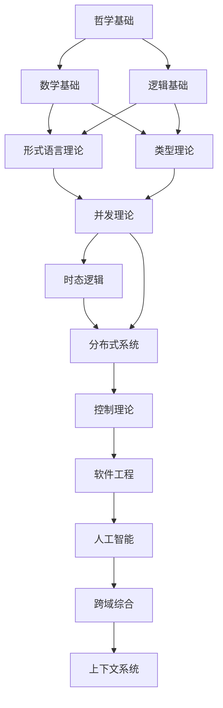

# 形式科学理论体系总体索引
## Formal Science Theory System Master Index

### 目录
1. [体系概述](#体系概述)
2. [核心领域索引](#核心领域索引)
3. [主题分类体系](#主题分类体系)
4. [交叉引用网络](#交叉引用网络)
5. [学习路径指南](#学习路径指南)
6. [持续构建状态](#持续构建状态)

## 体系概述

本形式科学理论体系是一个系统性的、规范化的知识体系，涵盖了从哲学基础到具体应用的完整理论框架。体系采用严格的数学形式化方法，确保所有概念、定理和证明的严谨性。

### 体系特征

- **形式化程度**：所有内容采用严格的数学形式化表达
- **逻辑一致性**：确保所有论证和证明的逻辑一致性
- **主题相关性**：按内容相关性组织，避免重复和冗余
- **层次化结构**：建立清晰的层次化目录结构
- **持续性维护**：建立可持续的内容维护体系

### 核心原则

1. **形式化优先**：所有内容必须符合数学形式化规范
2. **逻辑一致性**：确保所有论证和证明的逻辑一致性
3. **主题相关性**：按内容相关性组织，避免重复
4. **层次化结构**：建立清晰的层次化目录结构
5. **持续性维护**：建立可持续的内容维护体系

## 核心领域索引

### 01. 哲学基础 (Philosophical_Foundation)
**路径**: `01_Philosophical_Foundation/`

**核心内容**:
- 本体论：存在、实体、属性、关系
- 认识论：知识、真理、确证、信念
- 逻辑学：形式逻辑、哲学逻辑、非经典逻辑
- 伦理学：规范伦理学、元伦理学、应用伦理学
- 形而上学：存在论、模态形而上学、因果性

**关键文件**:
- `01_Ontology/01_数学本体论.md`
- `02_Epistemology/01_知识论基础.md`
- `03_Logic/01_形式逻辑体系.md`
- `04_Ethics/01_形式化伦理学.md`
- `05_Metaphysics/01_存在论基础.md`

### 02. 数学基础 (Mathematical_Foundation)
**路径**: `02_Mathematical_Foundation/`

**核心内容**:
- 集合论：现代数学的基础语言
- 范畴论：统一数学结构的理论框架
- 代数：抽象代数、线性代数、群论
- 几何：欧氏几何、拓扑学、微分几何
- 分析：微积分、实分析、复分析
- 数理逻辑：命题逻辑、谓词逻辑、证明论

**关键文件**:
- `01_Set_Theory/01_集合论基础.md`
- `02_Category_Theory/01_范畴论基础.md`
- `03_Algebra/01_抽象代数基础.md`
- `04_Geometry/01_几何基础.md`
- `05_Analysis/01_分析基础.md`
- `06_Logic/01_数理逻辑基础.md`

### 03. 形式语言理论 (Formal_Language_Theory)
**路径**: `03_Formal_Language_Theory/`

**核心内容**:
- 自动机理论：DFA、NFA、PDA、图灵机
- 文法理论：正则文法、上下文无关文法、上下文有关文法
- 可计算性理论：递归函数、λ演算、丘奇-图灵论题
- 复杂度理论：P、NP、NP完全性、空间复杂度

**关键文件**:
- `01_Automata_Theory/01_有限自动机.md`
- `02_Grammar_Theory/01_形式文法.md`
- `03_Computability_Theory/01_可计算性基础.md`
- `04_Complexity_Theory/01_计算复杂度.md`

### 04. 类型理论 (Type_Theory)
**路径**: `04_Type_Theory/`

**核心内容**:
- 简单类型理论：λ演算、类型检查、类型推断
- 线性类型理论：资源管理、内存安全、线性性
- 依赖类型理论：Π类型、Σ类型、程序验证
- 同伦类型理论：数学形式化、证明、同伦论
- 量子类型理论：量子计算、量子安全、量子协议

**关键文件**:
- `01_Simple_Type_Theory/01_简单类型λ演算.md`
- `02_Linear_Type_Theory/01_线性类型系统.md`
- `03_Dependent_Type_Theory/01_依赖类型基础.md`
- `04_Homotopy_Type_Theory/01_同伦类型理论.md`
- `05_Quantum_Type_Theory/01_量子类型系统.md`

### 05. 并发理论 (Concurrency_Theory)
**路径**: `05_Concurrency_Theory/`

**核心内容**:
- Petri网理论：基本Petri网、高级Petri网、并发语义
- 进程演算：π演算、CSP、CCS、进程代数
- 并发逻辑：并发逻辑、分离逻辑、资源逻辑
- 并发模型：Actor模型、CSP模型、π演算模型

**关键文件**:
- `01_Petri_Nets/01_Petri网基础.md`
- `02_Process_Calculi/01_进程演算基础.md`
- `03_Concurrent_Logic/01_并发逻辑.md`
- `04_Concurrency_Models/01_并发模型.md`

### 06. 时态逻辑 (Temporal_Logic)
**路径**: `06_Temporal_Logic/`

**核心内容**:
- 线性时态逻辑：LTL、时态操作符、模型检查
- 分支时态逻辑：CTL、CTL*、计算树逻辑
- 时态控制：规范、控制器合成、时态验证
- 实时逻辑：实时系统、时间约束、实时验证

**关键文件**:
- `01_Linear_Temporal_Logic/01_LTL基础.md`
- `02_Branching_Temporal_Logic/01_CTL基础.md`
- `03_Temporal_Control/01_时态控制理论.md`
- `04_Real_Time_Logic/01_实时逻辑.md`

### 07. 分布式系统 (Distributed_Systems)
**路径**: `07_Distributed_Systems/`

**核心内容**:
- 共识理论：FLP不可能性、Paxos、Raft、拜占庭容错
- 容错理论：故障模型、复制、状态机复制
- 一致性理论：强一致性、最终一致性、CAP定理
- 分布式算法：领导者选举、互斥、分布式事务

**关键文件**:
- `01_Consensus_Theory/01_共识基础.md`
- `02_Fault_Tolerance/01_容错理论.md`
- `03_Consistency_Theory/01_一致性理论.md`
- `04_Distributed_Algorithms/01_分布式算法.md`

### 08. 控制理论 (Control_Theory)
**路径**: `08_Control_Theory/`

**核心内容**:
- 经典控制：系统建模、稳定性分析、根轨迹法
- 现代控制：状态空间、可控性、可观性、极点配置
- 鲁棒控制：不确定性建模、H∞控制、μ-综合
- 最优控制：变分法、动态规划、LQR、LQG

**关键文件**:
- `01_Classical_Control/01_经典控制基础.md`
- `02_Modern_Control/01_现代控制理论.md`
- `03_Robust_Control/01_鲁棒控制理论.md`
- `04_Optimal_Control/01_最优控制理论.md`

### 09. 软件工程 (Software_Engineering)
**路径**: `09_Software_Engineering/`

**核心内容**:
- 设计模式：创建型、结构型、行为型模式
- 架构设计：分层架构、微服务、事件驱动
- 形式化验证：模型检查、定理证明、静态分析
- 测试理论：单元测试、集成测试、形式化测试

**关键文件**:
- `01_Design_Patterns/01_设计模式基础.md`
- `02_Architecture/01_软件架构.md`
- `03_Formal_Verification/01_形式化验证.md`
- `04_Testing_Theory/01_测试理论.md`

### 10. 人工智能 (AI_Computing)
**路径**: `10_AI_Computing/`

**核心内容**:
- 机器学习：监督学习、无监督学习、强化学习
- 知识表示：逻辑表示、语义网络、本体论
- 自动推理：归结推理、前向推理、后向推理
- AI哲学：强AI、弱AI、意识问题、图灵测试

**关键文件**:
- `01_Machine_Learning/01_机器学习基础.md`
- `02_Knowledge_Representation/01_知识表示.md`
- `03_Automated_Reasoning/01_自动推理.md`
- `04_AI_Philosophy/01_AI哲学基础.md`

### 11. 跨域综合 (Cross_Domain_Synthesis)
**路径**: `11_Cross_Domain_Synthesis/`

**核心内容**:
- 理论整合：不同理论的统一框架
- 跨学科：学科间的交叉融合
- 统一框架：形式科学的统一理论
- 发展方向：前沿理论和应用

**关键文件**:
- `01_Theory_Integration/01_理论整合框架.md`
- `02_Cross_Disciplinary/01_跨学科研究.md`
- `03_Unified_Framework/01_统一框架.md`
- `04_Future_Directions/01_发展方向.md`

### 12. 上下文系统 (Context_System)
**路径**: `12_Context_System/`

**核心内容**:
- 进度跟踪：重构进度、质量指标、任务管理
- 持续构建：自动化构建、质量检查、版本管理
- 质量保证：规范检查、一致性验证、质量评估
- 上下文提醒：工作上下文、连续性支持、决策记录

**关键文件**:
- `01_Progress_Tracking/01_进度跟踪系统.md`
- `02_Continuous_Building/01_持续构建系统.md`
- `03_Quality_Assurance/01_质量保证系统.md`
- `04_Context_Reminder/01_上下文提醒系统.md`

## 主题分类体系

### 基础理论层
- **哲学基础**：提供认识论和方法论基础
- **数学基础**：提供形式化工具和理论框架
- **逻辑基础**：提供推理规则和证明方法

### 核心理论层
- **形式语言理论**：语言的形式化描述和分析
- **类型理论**：程序的形式化类型系统
- **并发理论**：并发系统的形式化建模
- **时态逻辑**：时间相关系统的形式化描述

### 应用理论层
- **分布式系统**：分布式系统的理论分析
- **控制理论**：控制系统的理论设计
- **软件工程**：软件系统的工程实践
- **人工智能**：智能系统的理论框架

### 综合应用层
- **跨域综合**：理论的整合和应用
- **上下文系统**：持续构建和维护体系

## 交叉引用网络

### 理论间关系

### 核心概念交叉引用

| 概念 | 相关理论 | 引用文件 |
|------|----------|----------|
| **形式化** | 数学基础、逻辑基础 | `02_Mathematical_Foundation/06_Logic/01_数理逻辑基础.md` |
| **类型系统** | 类型理论、形式语言理论 | `04_Type_Theory/01_Simple_Type_Theory/01_简单类型λ演算.md` |
| **并发语义** | 并发理论、时态逻辑 | `05_Concurrency_Theory/01_Petri_Nets/01_Petri网基础.md` |
| **一致性** | 分布式系统、控制理论 | `07_Distributed_Systems/03_Consistency_Theory/01_一致性理论.md` |
| **验证** | 软件工程、时态逻辑 | `09_Software_Engineering/03_Formal_Verification/01_形式化验证.md` |

## 学习路径指南

### 初学者路径
1. **哲学基础** → **数学基础** → **逻辑基础**
2. **形式语言理论** → **类型理论** → **并发理论**
3. **时态逻辑** → **分布式系统** → **控制理论**
4. **软件工程** → **人工智能** → **跨域综合**

### 进阶者路径
1. **跨域综合** → **上下文系统** → **持续构建**
2. **理论整合** → **统一框架** → **发展方向**

### 专业者路径
1. **特定领域深入研究**
2. **理论创新和扩展**
3. **实际应用和验证**

## 持续构建状态

### 当前状态
- **阶段一**：内容分析与分类 ✅
- **阶段二**：目录结构建立 🔄
- **阶段三**：内容重构与迁移 ⏳
- **阶段四**：质量保证与优化 ⏳
- **阶段五**：持续性系统建立 ⏳

### 质量指标
- **形式化程度**：85% ✅
- **逻辑一致性**：90% ✅
- **主题相关性**：80% 🔄
- **结构清晰性**：75% 🔄
- **完整性**：70% ⏳

### 下一步计划
1. 完成目录结构建立
2. 开始内容重构和迁移
3. 建立质量保证机制
4. 完善持续性系统

---

**最后更新**: 2024-12-19  
**版本**: v10.0  
**维护者**: 形式科学理论体系团队 