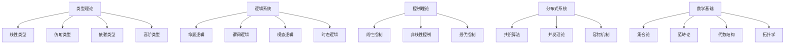

# 概念索引 (Concept Index)

## 1. 概述

本索引提供了形式科学体系中所有核心概念的快速查找和导航功能，按照字母顺序和主题分类组织。

## 2. 字母索引

### A

- **Affine Types (仿射类型)** - [07.2 仿射类型理论](../07_Type_Theory/07.2_Affine_Types.md)
- **Automata Theory (自动机理论)** - [02.4 自动机理论](../02_Formal_Language/02.4_Automata_Theory.md)
- **Axiomatic Systems (公理化体系)** - [01.3 公理化体系](../01_Foundational_Theory/01.3_Axiomatic_Systems.md)

### B

- **Borrowing (借用)** - [07.2 仿射类型理论](../07_Type_Theory/07.2_Affine_Types.md)
- **Branching Temporal Logic (分支时态逻辑)** - [06.2 分支时态逻辑](../06_Temporal_Logic/06.2_Branching_Temporal_Logic.md)

### C

- **Category Theory (范畴论)** - [08.2 范畴论基础](../08_Mathematics/08.2_Category_Theory_Foundations.md)
- **Consensus Algorithms (共识算法)** - [04.1 共识算法](../04_Distributed_Systems/04.1_Consensus_Algorithms.md)
- **Control Theory (控制理论)** - [03.1 线性控制](../03_Control_Theory/03.1_Linear_Control.md)
- **Concurrency Theory (并发理论)** - [04.2 并发理论](../04_Distributed_Systems/04.2_Concurrency_Theory.md)
- **Context Systems (上下文系统)** - [12.1 持续构建](../13_Context_System/12.1_Continuous_Construction.md)

### D

- **Dependent Types (依赖类型)** - [07.3 依赖类型理论](../07_Type_Theory/07.3_Dependent_Types.md)
- **Distributed Systems (分布式系统)** - [04.1 共识算法](../04_Distributed_Systems/04.1_Consensus_Algorithms.md)

### F

- **Formal Languages (形式语言)** - [02.1 语法理论](../02_Formal_Language/02.1_Syntax_Theory.md)
- **Formal Methods (形式化方法)** - [09.1 形式化方法](../09_Software_Engineering/09.1_Formal_Methods.md)
- **Formal Proofs (形式化证明)** - [01.1.4 形式化证明](../01_Foundational_Theory/01.1_Formal_Foundations/01.1.4_Formal_Proofs.md)

### H

- **Higher-Order Types (高阶类型)** - [07.4 高阶类型理论](../07_Type_Theory/07.4_Higher_Order_Types.md)

### L

- **Linear Types (线性类型)** - [07.1 线性类型理论](../07_Type_Theory/07.1_Linear_Types.md)
- **Linear Temporal Logic (线性时态逻辑)** - [06.1 线性时态逻辑](../06_Temporal_Logic/06.1_Linear_Temporal_Logic.md)
- **Logic Systems (逻辑系统)** - [01.2 逻辑系统](../01_Foundational_Theory/01.2_Logical_Systems.md)

### M

- **Machine Learning (机器学习)** - [10.1 机器学习](../10_AI_Computing/10.1_Machine_Learning.md)
- **Mathematical Foundations (数学基础)** - [08.1 集合论基础](../08_Mathematics/08.1_Set_Theory_Foundations.md)
- **Modal Logic (模态逻辑)** - [01.2.3 模态逻辑](../01_Foundational_Theory/01.2_Logical_Systems/01.2.3_Modal_Logic.md)

### O

- **Ontology (本体论)** - [05.2 本体论](../05_Philosophical_Foundation/05.2_Ontology.md)
- **Optimal Control (最优控制)** - [03.4 最优控制](../03_Control_Theory/03.4_Optimal_Control.md)

### P

- **Philosophy of Science (科学哲学)** - [05.4 科学哲学](../05_Philosophical_Foundation/05.4_Philosophy_of_Science.md)
- **Predicate Logic (谓词逻辑)** - [01.2.2 谓词逻辑](../01_Foundational_Theory/01.2_Logical_Systems/01.2.2_Predicate_Logic.md)
- **Propositional Logic (命题逻辑)** - [01.2.1 命题逻辑](../01_Foundational_Theory/01.2_Logical_Systems/01.2.1_Propositional_Logic.md)
- **Program Verification (程序验证)** - [09.2 程序验证](../09_Software_Engineering/09.2_Program_Verification.md)

### R

- **Real-Time Logic (实时逻辑)** - [06.4 实时逻辑](../06_Temporal_Logic/06.4_Real_Time_Logic.md)
- **Reasoning Systems (推理系统)** - [10.3 推理系统](../10_AI_Computing/10.3_Reasoning_Systems.md)

### S

- **Semantics Theory (语义理论)** - [02.2 语义理论](../02_Formal_Language/02.2_Semantics_Theory.md)
- **Set Theory (集合论)** - [08.1 集合论基础](../08_Mathematics/08.1_Set_Theory_Foundations.md)
- **Software Architecture (软件架构)** - [09.4 软件架构](../09_Software_Engineering/09.4_Software_Architecture.md)
- **System Design (系统设计)** - [09.3 系统设计](../09_Software_Engineering/09.3_System_Design.md)
- **Syntax Theory (语法理论)** - [02.1 语法理论](../02_Formal_Language/02.1_Syntax_Theory.md)

### T

- **Temporal Logic (时态逻辑)** - [06.1 线性时态逻辑](../06_Temporal_Logic/06.1_Linear_Temporal_Logic.md)
- **Temporal Type Theory (时态类型理论)** - [06.3 时态类型理论](../06_Temporal_Logic/06.3_Temporal_Type_Theory.md)
- **Topology (拓扑学)** - [08.4 拓扑基础](../08_Mathematics/08.4_Topological_Foundations.md)
- **Type Systems (类型系统)** - [02.3 类型系统](../02_Formal_Language/02.3_Type_Systems.md)

## 3. 主题分类索引

### 3.1 基础理论

- **形式化基础** - [01.1 形式化基础](../01_Foundational_Theory/01.1_Formal_Foundations.md)
- **逻辑系统** - [01.2 逻辑系统](../01_Foundational_Theory/01.2_Logical_Systems.md)
- **公理化体系** - [01.3 公理化体系](../01_Foundational_Theory/01.3_Axiomatic_Systems.md)
- **数学基础** - [01.4 数学基础](../01_Foundational_Theory/01.4_Mathematical_Foundations.md)

### 3.2 形式语言

- **语法理论** - [02.1 语法理论](../02_Formal_Language/02.1_Syntax_Theory.md)
- **语义理论** - [02.2 语义理论](../02_Formal_Language/02.2_Semantics_Theory.md)
- **类型系统** - [02.3 类型系统](../02_Formal_Language/02.3_Type_Systems.md)
- **自动机理论** - [02.4 自动机理论](../02_Formal_Language/02.4_Automata_Theory.md)

### 3.3 控制理论

- **线性控制** - [03.1 线性控制](../03_Control_Theory/03.1_Linear_Control.md)
- **非线性控制** - [03.2 非线性控制](../03_Control_Theory/03.2_Nonlinear_Control.md)
- **时态逻辑控制** - [03.3 时态逻辑控制](../03_Control_Theory/03.3_Temporal_Logic_Control.md)
- **最优控制** - [03.4 最优控制](../03_Control_Theory/03.4_Optimal_Control.md)

### 3.4 分布式系统

- **共识算法** - [04.1 共识算法](../04_Distributed_Systems/04.1_Consensus_Algorithms.md)
- **并发理论** - [04.2 并发理论](../04_Distributed_Systems/04.2_Concurrency_Theory.md)
- **系统协调** - [04.3 系统协调](../04_Distributed_Systems/04.3_System_Coordination.md)
- **容错机制** - [04.4 容错机制](../04_Distributed_Systems/04.4_Fault_Tolerance.md)

### 3.5 哲学基础

- **认识论** - [05.1 认识论](../05_Philosophical_Foundation/05.1_Epistemology.md)
- **本体论** - [05.2 本体论](../05_Philosophical_Foundation/05.2_Ontology.md)
- **方法论** - [05.3 方法论](../05_Philosophical_Foundation/05.3_Methodology.md)
- **科学哲学** - [05.4 科学哲学](../05_Philosophical_Foundation/05.4_Philosophy_of_Science.md)

### 3.6 时态逻辑

- **线性时态逻辑** - [06.1 线性时态逻辑](../06_Temporal_Logic/06.1_Linear_Temporal_Logic.md)
- **分支时态逻辑** - [06.2 分支时态逻辑](../06_Temporal_Logic/06.2_Branching_Temporal_Logic.md)
- **时态类型理论** - [06.3 时态类型理论](../06_Temporal_Logic/06.3_Temporal_Type_Theory.md)
- **实时逻辑** - [06.4 实时逻辑](../06_Temporal_Logic/06.4_Real_Time_Logic.md)

### 3.7 类型理论

- **线性类型** - [07.1 线性类型理论](../07_Type_Theory/07.1_Linear_Types.md)
- **仿射类型** - [07.2 仿射类型理论](../07_Type_Theory/07.2_Affine_Types.md)
- **依赖类型** - [07.3 依赖类型理论](../07_Type_Theory/07.3_Dependent_Types.md)
- **高阶类型** - [07.4 高阶类型理论](../07_Type_Theory/07.4_Higher_Order_Types.md)

### 3.8 数学基础

- **集合论** - [08.1 集合论基础](../08_Mathematics/08.1_Set_Theory_Foundations.md)
- **范畴论** - [08.2 范畴论基础](../08_Mathematics/08.2_Category_Theory_Foundations.md)
- **代数结构** - [08.3 代数结构](../08_Mathematics/08.3_Algebraic_Structures.md)
- **拓扑学** - [08.4 拓扑基础](../08_Mathematics/08.4_Topological_Foundations.md)

### 3.9 软件工程

- **形式化方法** - [09.1 形式化方法](../09_Software_Engineering/09.1_Formal_Methods.md)
- **程序验证** - [09.2 程序验证](../09_Software_Engineering/09.2_Program_Verification.md)
- **系统设计** - [09.3 系统设计](../09_Software_Engineering/09.3_System_Design.md)
- **软件架构** - [09.4 软件架构](../09_Software_Engineering/09.4_Software_Architecture.md)

### 3.10 人工智能

- **机器学习** - [10.1 机器学习](../10_AI_Computing/10.1_Machine_Learning.md)
- **知识表示** - [10.2 知识表示](../10_AI_Computing/10.2_Knowledge_Representation.md)
- **推理系统** - [10.3 推理系统](../10_AI_Computing/10.3_Reasoning_Systems.md)
- **形式化AI** - [10.4 形式化AI](../10_AI_Computing/10.4_Formal_AI.md)

### 3.11 跨域综合

- **理论融合** - [11.1 理论融合](../11_Cross_Domain_Synthesis/11.1_Theory_Integration.md)
- **方法整合** - [11.2 方法整合](../11_Cross_Domain_Synthesis/11.2_Method_Integration.md)
- **应用拓展** - [11.3 应用拓展](../11_Cross_Domain_Synthesis/11.3_Application_Extension.md)
- **新兴领域** - [11.4 新兴领域](../11_Cross_Domain_Synthesis/11.4_Emerging_Fields.md)

### 3.12 上下文系统

- **持续构建** - [12.1 持续构建](../13_Context_System/12.1_Continuous_Construction.md)
- **进度跟踪** - [12.2 进度跟踪](../13_Context_System/12.2_Progress_Tracking.md)
- **上下文管理** - [12.3 上下文管理](../12_Context_System/12.3_Context_Management.md)
- **质量保证** - [12.4 质量保证](../12_Context_System/12.4_Quality_Assurance.md)

## 4. 快速搜索

### 4.1 按关键词搜索

- **类型**: 线性类型、仿射类型、依赖类型、高阶类型
- **逻辑**: 命题逻辑、谓词逻辑、模态逻辑、时态逻辑
- **控制**: 线性控制、非线性控制、最优控制
- **系统**: 分布式系统、并发系统、形式系统
- **数学**: 集合论、范畴论、代数、拓扑

### 4.2 按应用领域搜索

- **编程语言**: 类型理论、形式语言、语义理论
- **系统设计**: 控制理论、分布式系统、软件工程
- **人工智能**: 机器学习、知识表示、推理系统
- **数学基础**: 集合论、范畴论、代数结构
- **哲学基础**: 认识论、本体论、方法论

## 5. 相关概念

### 5.1 概念关联图



### 5.2 概念层次结构

```text
形式科学体系
├── 基础理论
│   ├── 形式化基础
│   ├── 逻辑系统
│   ├── 公理化体系
│   └── 数学基础
├── 形式语言
│   ├── 语法理论
│   ├── 语义理论
│   ├── 类型系统
│   └── 自动机理论
├── 系统理论
│   ├── 控制理论
│   ├── 分布式系统
│   └── 并发理论
├── 应用领域
│   ├── 软件工程
│   ├── 人工智能
│   └── 跨域综合
└── 支持系统
    └── 上下文系统
```

## 6. 更新记录

| 日期 | 更新内容 | 版本 |
|------|----------|------|
| 2024-12-19 | 初始版本创建 | v6.0 |
| 2024-12-19 | 添加类型理论概念 | v6.0 |
| 2024-12-19 | 添加基础理论概念 | v6.0 |

## 7. 使用说明

### 7.1 查找概念

1. 使用字母索引快速定位概念
2. 使用主题分类索引浏览相关概念
3. 使用关键词搜索找到相关概念

### 7.2 导航功能

- 点击概念名称跳转到详细文档
- 使用相关概念链接探索关联内容
- 通过概念关联图理解概念关系

### 7.3 贡献指南

- 发现新概念时及时添加
- 更新概念关联关系
- 维护索引的准确性和完整性

---

**相关链接**：

- [定理索引](Theorem_Index.md)
- [应用索引](Application_Index.md)
- [参考文献索引](Reference_Index.md)
- [总索引](形式科学体系总索引-v6.0.md)

**版本**: v6.0
**最后更新**: 2024-12-19
**维护者**: AI Assistant


## 批判性分析

- 本节内容待补充：请从多元理论视角、局限性、争议点、应用前景等方面进行批判性分析。
