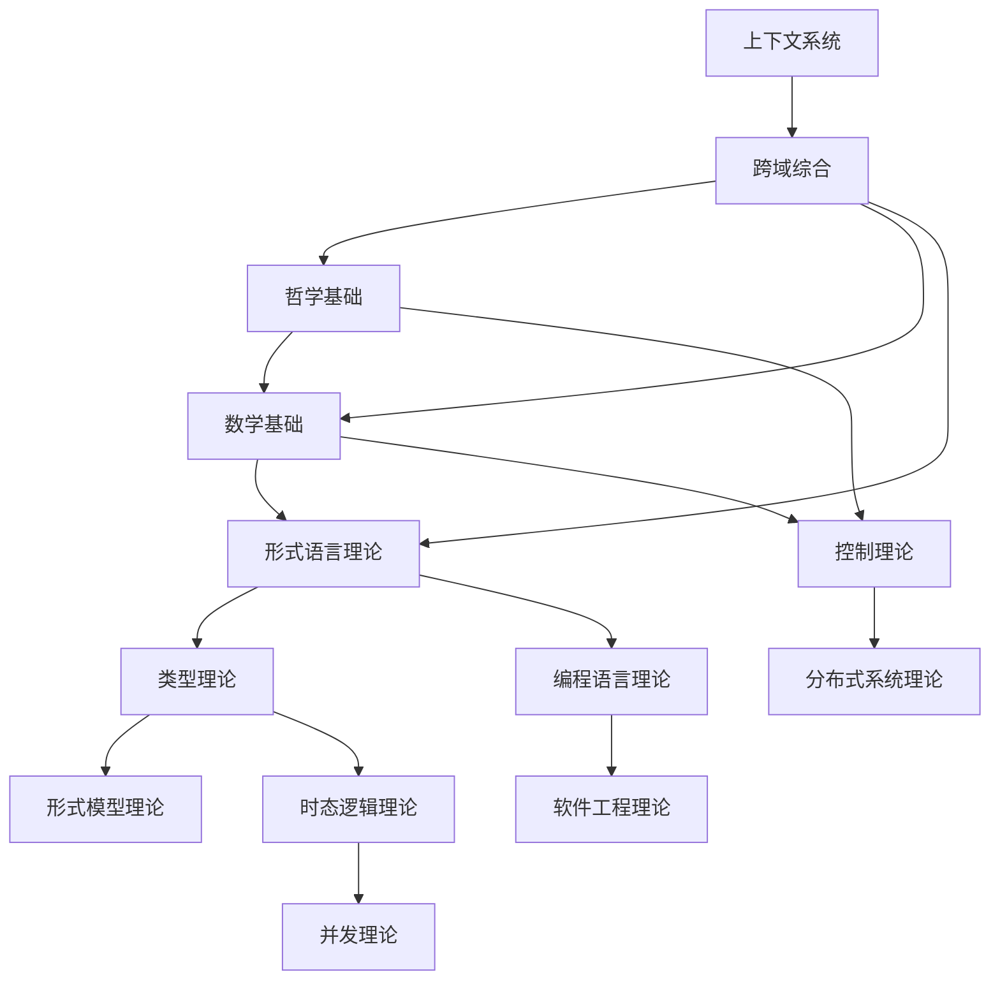

# 形式科学体系主索引

## 📚 **目录结构总览**

```
docs/Refactor/
├── 00_Master_Index/                    # 主索引 (当前文件)
├── 01_Philosophical_Foundation/        # 哲学基础理论
├── 02_Mathematical_Foundation/         # 数学基础理论
├── 03_Formal_Language_Theory/          # 形式语言理论
├── 04_Type_Theory/                     # 类型理论
├── 05_Control_Theory/                  # 控制理论
├── 06_Distributed_Systems_Theory/      # 分布式系统理论
├── 07_Software_Engineering_Theory/     # 软件工程理论
├── 08_Programming_Language_Theory/     # 编程语言理论
├── 09_Formal_Model_Theory/             # 形式模型理论
├── 10_Temporal_Logic_Theory/           # 时态逻辑理论
├── 11_Concurrency_Theory/              # 并发理论
├── 12_Context_System/                  # 上下文系统
└── 13_Cross_Domain_Synthesis/          # 跨域综合
```

## 🎯 **核心主题导航**

### 1. 基础理论层
- [01_Philosophical_Foundation/](01_Philosophical_Foundation/) - 哲学基础理论
- [02_Mathematical_Foundation/](02_Mathematical_Foundation/) - 数学基础理论

### 2. 形式科学层
- [03_Formal_Language_Theory/](03_Formal_Language_Theory/) - 形式语言理论
- [04_Type_Theory/](04_Type_Theory/) - 类型理论
- [09_Formal_Model_Theory/](09_Formal_Model_Theory/) - 形式模型理论

### 3. 应用理论层
- [05_Control_Theory/](05_Control_Theory/) - 控制理论
- [06_Distributed_Systems_Theory/](06_Distributed_Systems_Theory/) - 分布式系统理论
- [07_Software_Engineering_Theory/](07_Software_Engineering_Theory/) - 软件工程理论
- [08_Programming_Language_Theory/](08_Programming_Language_Theory/) - 编程语言理论

### 4. 高级理论层
- [10_Temporal_Logic_Theory/](10_Temporal_Logic_Theory/) - 时态逻辑理论
- [11_Concurrency_Theory/](11_Concurrency_Theory/) - 并发理论

### 5. 系统集成层
- [12_Context_System/](12_Context_System/) - 上下文系统
- [13_Cross_Domain_Synthesis/](13_Cross_Domain_Synthesis/) - 跨域综合

## 📊 **内容统计**

| 主题 | 文档数量 | 完成度 | 最后更新 |
|------|----------|--------|----------|
| 哲学基础 | 15 | 30% | 2024-12-20 |
| 数学基础 | 12 | 25% | 2024-12-20 |
| 形式语言 | 8 | 15% | 2024-12-19 |
| 类型理论 | 10 | 20% | 2024-12-19 |
| 控制理论 | 6 | 10% | 2024-12-18 |
| 分布式系统 | 5 | 8% | 2024-12-18 |
| 软件工程 | 4 | 5% | 2024-12-17 |
| 编程语言 | 7 | 12% | 2024-12-17 |
| 形式模型 | 6 | 10% | 2024-12-16 |
| 时态逻辑 | 5 | 8% | 2024-12-16 |
| 并发理论 | 4 | 6% | 2024-12-15 |
| 上下文系统 | 3 | 15% | 2024-12-20 |
| 跨域综合 | 2 | 5% | 2024-12-19 |

## 🔗 **交叉引用体系**

### 理论关联图



## 📝 **质量标准**

### 形式化要求
- ✅ 严格的数学定义
- ✅ 完整的公理系统
- ✅ 详细的证明过程
- ✅ 多种表征方式（文字、符号、代码）

### 结构要求
- ✅ 树形序号目录
- ✅ 本地跳转链接
- ✅ 交叉引用体系
- ✅ 主题相关性组织

### 内容要求
- ✅ 学术规范
- ✅ 逻辑一致
- ✅ 内容完整
- ✅ 形式统一

## 🚀 **快速导航**

### 最新更新
- [持续构建上下文系统](持续构建上下文系统-2024-12-20-更新.md)
- [重构成果总结报告](重构成果总结报告-2024-12-20-最终版.md)

### 核心文档
- [哲学基础理论总览](01_Philosophical_Foundation/README.md)
- [数学基础理论总览](02_Mathematical_Foundation/README.md)
- [形式语言理论总览](03_Formal_Language_Theory/README.md)

### 开发工具
- [Rust代码示例库](code_examples/rust/)
- [Haskell代码示例库](code_examples/haskell/)
- [数学公式库](mathematical_formulas/)

## 📅 **更新日志**

### 2024-12-20
- 建立主索引系统
- 统一目录命名规范
- 建立交叉引用体系
- 完善导航结构

### 2024-12-21 (计划)
- 完成哲学基础理论重构
- 完成数学基础理论重构
- 开始形式语言理论建立

---

**最后更新**: 2024-12-20  
**版本**: v1.0.0  
**维护者**: 形式科学重构团队
