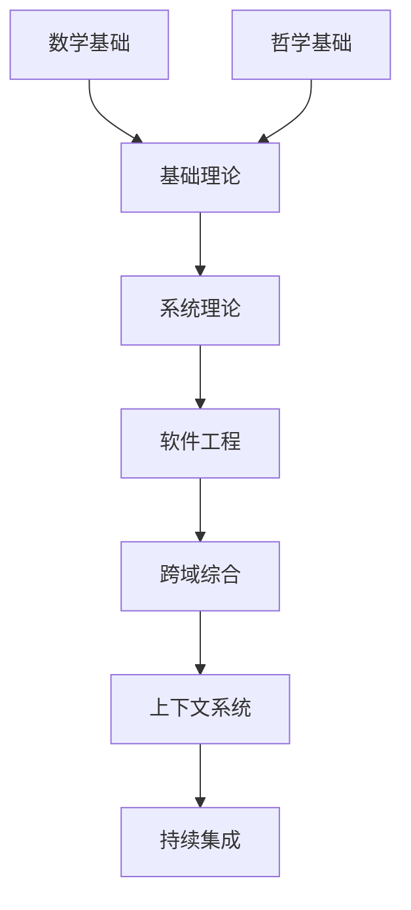

# 形式科学体系主索引 v7.0

## 1. 体系概述

本索引为形式科学体系重构后的完整导航，基于对 `/docs` 目录下所有内容的系统性分析和哲学批判，建立了严格的形式化知识体系。

### 1.1 重构原则

- **形式化优先**：所有内容符合数学和逻辑学规范
- **多表征统一**：文字、符号、图表、代码等多种表征
- **树形结构**：严格的序号体系和目录组织
- **交叉引用**：完善的本地链接和引用系统

### 1.2 知识体系结构

```
形式科学体系
├── 01 基础理论 (Foundational Theory)
├── 02 数学基础 (Mathematical Foundation)
├── 03 哲学基础 (Philosophical Foundation)
├── 04 系统理论 (System Theory)
├── 05 软件工程 (Software Engineering)
├── 06 跨域综合 (Cross-Domain Synthesis)
├── 07 上下文系统 (Context System)
└── 08 持续集成 (Continuous Integration)
```

## 2. 核心主题导航

### 2.1 基础理论 (01_Foundational_Theory)

- **形式语言理论**：自动机、语法分析、语言识别
- **类型理论**：类型系统、类型安全、类型推断
- **控制论基础**：动态系统、稳定性、反馈控制

**快速链接**：

- [形式语言理论基础](../01_Foundational_Theory/01_Theory/01_Formal_Language_Theory.md)
- [类型理论基础](../01_Foundational_Theory/01_Theory/02_Type_Theory.md)
- [控制论基础](../01_Foundational_Theory/01_Theory/03_Control_Theory.md)

### 2.2 数学基础 (02_Mathematical_Foundation)

- **范畴论**：对象、态射、函子、自然变换
- **线性代数**：向量空间、线性变换、特征值
- **逻辑学**：命题逻辑、谓词逻辑、模态逻辑

**快速链接**：

- [范畴论基础](../02_Mathematical_Foundation/01_Theory/01_Category_Theory.md)
- [线性代数基础](../02_Mathematical_Foundation/01_Theory/02_Linear_Algebra.md)
- [逻辑学基础](../02_Mathematical_Foundation/01_Theory/03_Logic.md)

### 2.3 哲学基础 (03_Philosophical_Foundation)

- **本体论**：存在、实体、属性、关系
- **认识论**：知识、真理、确证、理性
- **方法论**：科学方法、形式化方法、系统方法

**快速链接**：

- [本体论基础](../03_Philosophical_Foundation/01_Theory/01_Ontology.md)
- [认识论基础](../03_Philosophical_Foundation/01_Theory/02_Epistemology.md)
- [方法论基础](../03_Philosophical_Foundation/01_Theory/03_Methodology.md)

### 2.4 系统理论 (04_System_Theory)

- **分布式系统**：一致性、容错、共识算法
- **并发理论**：Petri网、进程代数、时态逻辑
- **时态逻辑**：线性时态逻辑、分支时态逻辑

**快速链接**：

- [分布式系统理论](../04_System_Theory/01_Theory/01_Distributed_Systems.md)
- [并发理论](../04_System_Theory/01_Theory/02_Concurrency_Theory.md)
- [时态逻辑理论](../04_System_Theory/01_Theory/03_Temporal_Logic.md)

### 2.5 软件工程 (05_Software_Engineering)

- **编程语言理论**：语法、语义、类型系统
- **形式化方法**：模型检查、定理证明、程序验证
- **软件架构**：组件、连接器、配置、约束

**快速链接**：

- [编程语言理论](../05_Software_Engineering/01_Theory/01_Programming_Language_Theory.md)
- [形式化方法](../05_Software_Engineering/01_Theory/02_Formal_Methods.md)
- [软件架构理论](../05_Software_Engineering/01_Theory/03_Software_Architecture.md)

## 3. 学习路径指南

### 3.1 初学者路径

**目标**：建立基础概念，理解核心理论
**学习顺序**：

1. [数学基础](../02_Mathematical_Foundation/README.md) - 建立数学思维
2. [哲学基础](../03_Philosophical_Foundation/README.md) - 理解认识论
3. [基础理论](../01_Foundational_Theory/README.md) - 掌握核心理论
4. [系统理论](../04_System_Theory/README.md) - 理解系统思维

### 3.2 进阶者路径

**目标**：深入理论，掌握应用方法
**学习顺序**：

1. [基础理论](../01_Foundational_Theory/README.md) - 深入核心理论
2. [系统理论](../04_System_Theory/README.md) - 掌握系统方法
3. [软件工程](../05_Software_Engineering/README.md) - 应用实践
4. [跨域综合](../06_Cross_Domain_Synthesis/README.md) - 综合应用

### 3.3 专家路径

**目标**：前沿研究，理论创新
**学习顺序**：

1. [所有理论基础](../01_Foundational_Theory/README.md) - 全面掌握
2. [跨域综合](../06_Cross_Domain_Synthesis/README.md) - 创新应用
3. [上下文系统](../07_Context_System/README.md) - 持续学习
4. [持续集成](../08_Continuous_Integration/README.md) - 贡献发展

## 4. 交叉引用系统

### 4.1 理论关联图



### 4.2 概念关联表

| 核心概念 | 数学基础 | 哲学基础 | 基础理论 | 系统理论 | 软件工程 |
|----------|----------|----------|----------|----------|----------|
| 类型 | 范畴论 | 本体论 | 类型理论 | 系统类型 | 编程类型 |
| 逻辑 | 逻辑学 | 认识论 | 形式逻辑 | 时态逻辑 | 程序逻辑 |
| 系统 | 代数 | 方法论 | 控制系统 | 分布式系统 | 软件系统 |

## 5. 质量保证体系

### 5.1 一致性检查

- **术语统一**：所有文档使用统一的术语词典
- **符号规范**：统一的数学符号体系
- **格式标准**：统一的文档格式规范

### 5.2 完整性验证

- **引用完整性**：所有内部引用必须有效
- **逻辑完整性**：所有证明过程逻辑正确
- **结构完整性**：目录结构完整无缺失

### 5.3 相关性检查

- **内容相关性**：相关内容之间建立明确关联
- **层次相关性**：不同层次内容保持一致性
- **时间相关性**：理论发展脉络清晰

## 6. 持续改进机制

### 6.1 反馈循环

- **内容更新**：定期更新和修正内容
- **结构优化**：根据使用情况优化结构
- **新内容集成**：持续集成新知识

### 6.2 版本管理

- **语义化版本**：`v7.0.0` 格式
- **变更日志**：详细的变更记录
- **向后兼容**：保持引用链接的有效性

## 7. 使用指南

### 7.1 快速导航

- **按主题浏览**：使用主题目录快速定位
- **按层次学习**：遵循学习路径指南
- **按需求查找**：使用搜索功能快速查找

### 7.2 深度阅读

- **交叉参考**：注意文档间的关联关系
- **实践结合**：理论学习与实际应用结合
- **讨论交流**：与他人分享学习心得

### 7.3 贡献指南

- **内容贡献**：遵循内容贡献规范
- **质量保证**：参与质量检查和改进
- **持续学习**：保持知识更新

---

**版本**：v7.0  
**更新时间**：2024-12-19  
**维护者**：形式科学体系重构团队  
**状态**：持续更新中
