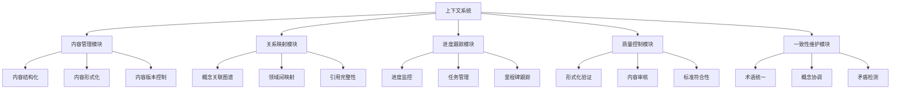
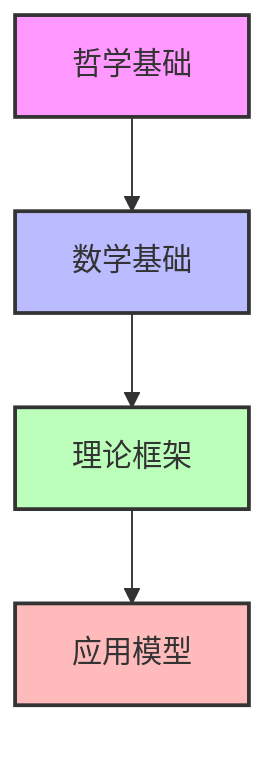
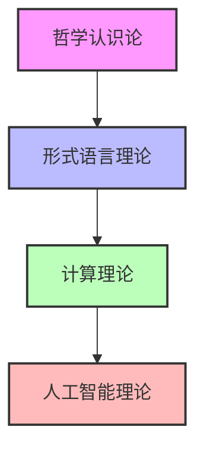

# 形式科学重构项目 - 上下文系统架构

**创建时间**: 2025-01-15  
**最后更新**: 2025-01-15  
**文档状态**: 活跃

## 1. 上下文系统概述

### 1.1 系统定义

上下文系统是形式科学重构项目的核心支撑框架，旨在实现知识的连贯组织、多维关联和一致性维护。系统通过建立概念间的显式联系，实现跨领域知识整合，并支持持续、渐进式的知识构建。

### 1.2 系统目标

1. **持续性维护**: 确保重构过程在中断后能够无缝恢复
2. **一致性保证**: 维护整个知识体系的概念一致性和逻辑连贯性
3. **关联性建立**: 创建概念间的显式关联，支持知识的多维导航
4. **形式化促进**: 支持知识从非形式化到高度形式化的渐进转换
5. **批判性整合**: 整合不同视角的批判性分析，促进深度理解

## 2. 系统架构

### 2.1 核心组件

### 2.2 模块功能

#### 2.2.1 内容管理模块

- **内容结构化**: 将知识内容按照统一规范组织成结构化形式
- **内容形式化**: 支持知识从自然语言描述到数学形式化的转换
- **内容版本控制**: 追踪内容变更历史，支持版本间比较

#### 2.2.2 关系映射模块

- **概念关联图谱**: 构建概念间的多维关联网络
- **领域间映射**: 建立不同知识领域间的桥接关系
- **引用完整性**: 检查并维护引用的完整性和有效性

#### 2.2.3 进度跟踪模块

- **进度监控**: 实时追踪各领域重构进度
- **任务管理**: 组织和调度重构任务
- **里程碑跟踪**: 记录重要阶段性成果

#### 2.2.4 质量控制模块

- **形式化验证**: 验证形式化内容的正确性
- **内容审核**: 确保内容的深度、广度和准确性
- **标准符合性**: 检查内容是否符合预定标准

#### 2.2.5 一致性维护模块

- **术语统一**: 确保术语使用的一致性
- **概念协调**: 协调不同领域中相似概念的定义
- **矛盾检测**: 检测并解决概念定义或理论陈述中的矛盾

## 3. 上下文流动机制

### 3.1 垂直上下文流

垂直上下文流在抽象层级之间传递知识，实现从基础概念到高级理论的知识构建。

### 3.2 水平上下文流

水平上下文流在相同抽象层级的不同领域间传递知识，实现知识的跨领域整合。

### 3.3 对角上下文流

对角上下文流在不同抽象层级的不同领域间传递知识，实现概念的创新性应用。

## 4. 实施框架

### 4.1 文档结构

上下文系统的文档组织采用统一的结构：

1. **元数据区**: 包含文档创建时间、更新时间、状态等信息
2. **概述区**: 概括文档的主要内容和目的
3. **内容区**: 详细展开文档的主体内容
4. **关联区**: 列出与当前文档相关的其他文档
5. **进度区**: 记录相关工作的进展情况
6. **附录区**: 包含补充材料和参考信息

### 4.2 关联表示

知识关联采用以下方式表示：

1. **直接引用**: 通过Markdown链接直接引用相关文档
2. **概念映射**: 建立概念之间的映射关系
3. **依赖图**: 可视化展示概念或文档间的依赖关系
4. **对比表**: 以表格形式对比相关概念

### 4.3 进度表示

进度信息采用以下方式表示：

1. **进度百分比**: 量化完成程度
2. **状态标记**: 使用统一的状态标记（计划中、进行中、已完成等）
3. **时间轴**: 可视化展示进度时间线
4. **里程碑标记**: 突出显示重要里程碑

## 5. 实现状态

### 5.1 已实现组件

- [x] 内容管理模块基础框架
- [x] 进度跟踪模块核心功能
- [x] 文档结构标准化

### 5.2 进行中组件

- [ ] 关系映射模块概念图谱构建
- [ ] 质量控制模块形式化验证
- [ ] 一致性维护模块术语统一

### 5.3 规划中组件

- [ ] 自动化引用检查工具
- [ ] 跨领域概念映射可视化
- [ ] 矛盾检测与解决机制

## 6. 下一步计划

1. 完成上下文系统迁移，将分散的上下文文档整合到统一框架
2. 实现概念关联图谱的基础版本，支持关键概念的多维导航
3. 开发术语统一检查工具，确保术语使用的一致性
4. 建立形式化验证框架，支持数学定义和证明的正确性验证

## 7. 相关文档

- [上下文管理系统](../README.md)
- [统一目录结构规范](../统一目录结构规范.md)
- [重构执行计划](../重构执行计划_20250115.md)
- [上下文系统迁移计划](../上下文系统迁移计划_20250113.md)

## 批判性分析

- 本节内容待补充：请从多元理论视角、局限性、争议点、应用前景等方面进行批判性分析。
