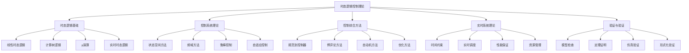

# 时态逻辑控制基础理论 (Temporal Logic Control Foundation)

## 目录

1. [概述](#概述)
2. [时态逻辑基础](#时态逻辑基础)
3. [控制系统理论](#控制系统理论)
4. [时态逻辑控制综合](#时态逻辑控制综合)
5. [实时时态逻辑控制](#实时时态逻辑控制)
6. [模型检查与验证](#模型检查与验证)
7. [应用与实现](#应用与实现)
8. [总结与展望](#总结与展望)

## 1. 概述

### 1.1 研究背景

时态逻辑控制是形式科学的重要分支，将时态逻辑的规范表达能力与控制系统理论相结合，为实时系统、嵌入式系统、自动驾驶等提供形式化验证和控制综合方法。该理论体系包括：

- **时态逻辑基础**：线性时态逻辑(LTL)、计算树逻辑(CTL)、μ演算
- **控制系统理论**：状态空间方法、频域方法、鲁棒控制
- **控制综合**：从时态逻辑规范自动生成控制器
- **实时系统**：实时时态逻辑、时间约束处理
- **验证方法**：模型检查、定理证明、仿真验证

### 1.2 理论体系架构



## 2. 时态逻辑基础

### 2.1 线性时态逻辑 (Linear Temporal Logic, LTL)

#### 2.1.1 语法定义

**定义 2.1.1 (LTL语法)**
线性时态逻辑的语法：
$$\phi ::= p \mid \neg \phi \mid \phi_1 \land \phi_2 \mid \phi_1 \lor \phi_2 \mid \phi_1 \rightarrow \phi_2 \mid \mathbf{X}\phi \mid \mathbf{F}\phi \mid \mathbf{G}\phi \mid \phi_1 \mathbf{U}\phi_2 \mid \phi_1 \mathbf{R}\phi_2$$

其中：

- $p \in AP$ 是原子命题
- $\mathbf{X}$ 是下一个时间算子 (Next)
- $\mathbf{F}$ 是将来算子 (Finally/Future)
- $\mathbf{G}$ 是全局算子 (Globally)
- $\mathbf{U}$ 是直到算子 (Until)
- $\mathbf{R}$ 是释放算子 (Release)

#### 2.1.2 语义定义

**定义 2.1.2 (LTL语义)**
LTL公式在路径 $\pi = s_0 s_1 s_2 \cdots$ 上的语义：

- $\pi \models p$ 当且仅当 $p \in L(s_0)$
- $\pi \models \neg \phi$ 当且仅当 $\pi \not\models \phi$
- $\pi \models \phi_1 \land \phi_2$ 当且仅当 $\pi \models \phi_1$ 且 $\pi \models \phi_2$
- $\pi \models \phi_1 \lor \phi_2$ 当且仅当 $\pi \models \phi_1$ 或 $\pi \models \phi_2$
- $\pi \models \phi_1 \rightarrow \phi_2$ 当且仅当 $\pi \not\models \phi_1$ 或 $\pi \models \phi_2$
- $\pi \models \mathbf{X}\phi$ 当且仅当 $\pi^1 \models \phi$
- $\pi \models \mathbf{F}\phi$ 当且仅当存在 $i \geq 0$ 使得 $\pi^i \models \phi$
- $\pi \models \mathbf{G}\phi$ 当且仅当对于所有 $i \geq 0$，$\pi^i \models \phi$
- $\pi \models \phi_1 \mathbf{U}\phi_2$ 当且仅当存在 $i \geq 0$ 使得 $\pi^i \models \phi_2$ 且对于所有 $0 \leq j < i$，$\pi^j \models \phi_1$
- $\pi \models \phi_1 \mathbf{R}\phi_2$ 当且仅当对于所有 $i \geq 0$，要么 $\pi^i \models \phi_2$，要么存在 $0 \leq j < i$ 使得 $\pi^j \models \phi_1$

#### 2.1.3 基本性质

**定理 2.1.1 (LTL算子关系)**
以下等价关系成立：

1. $\mathbf{F}\phi \equiv \neg \mathbf{G}\neg \phi$
2. $\mathbf{G}\phi \equiv \neg \mathbf{F}\neg \phi$
3. $\phi_1 \mathbf{R}\phi_2 \equiv \neg(\neg \phi_1 \mathbf{U}\neg \phi_2)$
4. $\phi_1 \mathbf{U}\phi_2 \equiv \neg(\neg \phi_1 \mathbf{R}\neg \phi_2)$

**证明：**
我们证明第一个等价关系，其他类似。

对于任意路径 $\pi$：
$$\pi \models \mathbf{F}\phi \Leftrightarrow \exists i \geq 0. \pi^i \models \phi$$
$$\pi \models \neg \mathbf{G}\neg \phi \Leftrightarrow \neg(\forall i \geq 0. \pi^i \models \neg \phi) \Leftrightarrow \exists i \geq 0. \pi^i \not\models \neg \phi \Leftrightarrow \exists i \geq 0. \pi^i \models \phi$$

因此 $\mathbf{F}\phi \equiv \neg \mathbf{G}\neg \phi$。

**定理 2.1.2 (LTL表达能力)**
LTL可以表达所有ω正则性质。

**证明：**
通过构造性证明：

1. **LTL到ω自动机**：每个LTL公式对应一个Büchi自动机
2. **ω自动机到LTL**：每个ω正则性质可以用LTL表达
3. **等价性**：LTL和ω正则性质等价

### 2.2 计算树逻辑 (Computation Tree Logic, CTL)

#### 2.2.1 语法定义

**定义 2.2.1 (CTL语法)**
计算树逻辑的语法：
$$\phi ::= p \mid \neg \phi \mid \phi_1 \land \phi_2 \mid \phi_1 \lor \phi_2 \mid \phi_1 \rightarrow \phi_2 \mid \mathbf{EX}\phi \mid \mathbf{EF}\phi \mid \mathbf{EG}\phi \mid \mathbf{E}[\phi_1 \mathbf{U}\phi_2] \mid \mathbf{AX}\phi \mid \mathbf{AF}\phi \mid \mathbf{AG}\phi \mid \mathbf{A}[\phi_1 \mathbf{U}\phi_2]$$

其中：

- $\mathbf{E}$ 是存在路径量词 (Exists)
- $\mathbf{A}$ 是全称路径量词 (All)

#### 2.2.2 语义定义

**定义 2.2.2 (CTL语义)**
CTL公式在状态 $s$ 上的语义：

- $s \models p$ 当且仅当 $p \in L(s)$
- $s \models \neg \phi$ 当且仅当 $s \not\models \phi$
- $s \models \phi_1 \land \phi_2$ 当且仅当 $s \models \phi_1$ 且 $s \models \phi_2$
- $s \models \phi_1 \lor \phi_2$ 当且仅当 $s \models \phi_1$ 或 $s \models \phi_2$
- $s \models \phi_1 \rightarrow \phi_2$ 当且仅当 $s \not\models \phi_1$ 或 $s \models \phi_2$
- $s \models \mathbf{EX}\phi$ 当且仅当存在后继状态 $s'$ 使得 $s' \models \phi$
- $s \models \mathbf{EF}\phi$ 当且仅当存在路径从 $s$ 开始，使得某个状态满足 $\phi$
- $s \models \mathbf{EG}\phi$ 当且仅当存在路径从 $s$ 开始，使得所有状态都满足 $\phi$
- $s \models \mathbf{E}[\phi_1 \mathbf{U}\phi_2]$ 当且仅当存在路径从 $s$ 开始，使得 $\phi_1 \mathbf{U}\phi_2$ 成立
- $s \models \mathbf{AX}\phi$ 当且仅当所有后继状态 $s'$ 都满足 $\phi$
- $s \models \mathbf{AF}\phi$ 当且仅当所有路径从 $s$ 开始，都使得某个状态满足 $\phi$
- $s \models \mathbf{AG}\phi$ 当且仅当所有路径从 $s$ 开始，都使得所有状态满足 $\phi$
- $s \models \mathbf{A}[\phi_1 \mathbf{U}\phi_2]$ 当且仅当所有路径从 $s$ 开始，都使得 $\phi_1 \mathbf{U}\phi_2$ 成立

#### 2.2.3 模型检查算法

**定理 2.2.1 (CTL模型检查)**
CTL模型检查可以在多项式时间内完成。

**证明：**
通过标记算法：

1. **标记过程**：为每个子公式标记满足它的状态
2. **复杂度**：标记过程的时间复杂度为 $O(|\phi| \cdot |S| \cdot |R|)$
3. **正确性**：标记算法正确识别满足公式的状态

```haskell
-- CTL模型检查算法
data CTLFormula = 
    Atom String
  | Not CTLFormula
  | And CTLFormula CTLFormula
  | Or CTLFormula CTLFormula
  | Implies CTLFormula CTLFormula
  | EX CTLFormula
  | EF CTLFormula
  | EG CTLFormula
  | EU CTLFormula CTLFormula
  | AX CTLFormula
  | AF CTLFormula
  | AG CTLFormula
  | AU CTLFormula CTLFormula

-- 模型检查主函数
modelCheck :: KripkeStructure -> CTLFormula -> Set State
modelCheck ks formula = 
  case formula of
    Atom p -> statesWhere p ks
    Not phi -> Set.difference (allStates ks) (modelCheck ks phi)
    And phi1 phi2 -> Set.intersection (modelCheck ks phi1) (modelCheck ks phi2)
    Or phi1 phi2 -> Set.union (modelCheck ks phi1) (modelCheck ks phi2)
    Implies phi1 phi2 -> modelCheck ks (Or (Not phi1) phi2)
    EX phi -> preImage (modelCheck ks phi) ks
    EF phi -> leastFixedPoint (\s -> Set.union (statesWhere phi ks) (preImage s ks))
    EG phi -> greatestFixedPoint (\s -> Set.intersection (statesWhere phi ks) (preImage s ks))
    EU phi1 phi2 -> leastFixedPoint (\s -> Set.union (statesWhere phi2 ks) 
                                                    (Set.intersection (statesWhere phi1 ks) (preImage s ks)))
    AX phi -> Set.difference (allStates ks) (preImage (Set.difference (allStates ks) (modelCheck ks phi)) ks)
    AF phi -> greatestFixedPoint (\s -> Set.union (statesWhere phi ks) 
                                                  (Set.intersection (allStates ks) (preImage s ks)))
    AG phi -> leastFixedPoint (\s -> Set.intersection (statesWhere phi ks) (preImage s ks))
    AU phi1 phi2 -> greatestFixedPoint (\s -> Set.union (statesWhere phi2 ks) 
                                                        (Set.intersection (statesWhere phi1 ks) (preImage s ks)))
```

### 2.3 μ演算 (μ-Calculus)

#### 2.3.1 语法定义

**定义 2.3.1 (μ演算语法)**
μ演算的语法：
$$\phi ::= p \mid \neg \phi \mid \phi_1 \land \phi_2 \mid \phi_1 \lor \phi_2 \mid \mathbf{EX}\phi \mid \mathbf{AX}\phi \mid X \mid \mu X.\phi \mid \nu X.\phi$$

其中：

- $X$ 是变量
- $\mu X.\phi$ 是最小不动点
- $\nu X.\phi$ 是最大不动点

#### 2.3.2 语义定义

**定义 2.3.2 (μ演算语义)**
μ演算公式的解释：

- $[\![\mu X.\phi]\!] = \bigcap \{S \subseteq \text{States} \mid [\![\phi]\!]_{X \mapsto S} \subseteq S\}$
- $[\![\nu X.\phi]\!] = \bigcup \{S \subseteq \text{States} \mid S \subseteq [\![\phi]\!]_{X \mapsto S}\}$

#### 2.3.3 表达能力

**定理 2.3.1 (μ演算表达能力)**
μ演算等价于交替树自动机。

**证明：**
通过双向转换：

1. **μ演算到交替树自动机**：构造对应的交替树自动机
2. **交替树自动机到μ演算**：构造对应的μ演算公式
3. **等价性**：两种表示方法等价

## 3. 控制系统理论

### 3.1 状态空间方法

#### 3.1.1 线性系统

**定义 3.1.1 (线性时不变系统)**
线性时不变系统：
$$\dot{x}(t) = Ax(t) + Bu(t)$$
$$y(t) = Cx(t) + Du(t)$$

其中：

- $x(t) \in \mathbb{R}^n$ 是状态向量
- $u(t) \in \mathbb{R}^m$ 是输入向量
- $y(t) \in \mathbb{R}^p$ 是输出向量
- $A \in \mathbb{R}^{n \times n}$ 是系统矩阵
- $B \in \mathbb{R}^{n \times m}$ 是输入矩阵
- $C \in \mathbb{R}^{p \times n}$ 是输出矩阵
- $D \in \mathbb{R}^{p \times m}$ 是直接传递矩阵

#### 3.1.2 可控性与可观性

**定义 3.1.2 (可控性)**
系统 $(A,B)$ 是可控的，当且仅当可控性矩阵：
$$W_c = [B \ AB \ A^2B \ \cdots \ A^{n-1}B]$$
满秩，即 $\text{rank}(W_c) = n$。

**定义 3.1.3 (可观性)**
系统 $(A,C)$ 是可观的，当且仅当可观性矩阵：
$$W_o = \begin{bmatrix} C \\ CA \\ CA^2 \\ \vdots \\ CA^{n-1} \end{bmatrix}$$
满秩，即 $\text{rank}(W_o) = n$。

**定理 3.1.1 (可控性判据)**
系统 $(A,B)$ 可控的充分必要条件是：
$$\text{rank}[sI - A \ B] = n, \quad \forall s \in \mathbb{C}$$

**证明：**
通过PBH判据：

1. **必要性**：如果系统不可控，存在不可控模态
2. **充分性**：如果PBH判据满足，系统可控
3. **等价性**：PBH判据与可控性矩阵判据等价

### 3.2 稳定性理论

#### 3.2.1 Lyapunov稳定性

**定义 3.2.1 (Lyapunov稳定性)**
平衡点 $x_e = 0$ 是稳定的，当且仅当：
$$\forall \epsilon > 0, \exists \delta > 0, \forall x_0 \in B_\delta(0), \forall t \geq 0: \|x(t)\| < \epsilon$$

**定义 3.2.2 (渐近稳定性)**
平衡点 $x_e = 0$ 是渐近稳定的，当且仅当它是稳定的且：
$$\exists \delta > 0, \forall x_0 \in B_\delta(0): \lim_{t \to \infty} x(t) = 0$$

**定理 3.2.1 (Lyapunov定理)**
如果存在正定函数 $V(x)$ 使得：
$$\dot{V}(x) = \frac{\partial V}{\partial x} \cdot f(x) \leq 0$$
则平衡点是稳定的。如果 $\dot{V}(x) < 0$，则平衡点是渐近稳定的。

**证明：**
通过Lyapunov函数方法：

1. **稳定性**：$V(x)$ 作为能量函数
2. **渐近稳定性**：能量单调递减
3. **全局性**：如果 $V(x)$ 径向无界，则全局稳定

#### 3.2.2 线性系统稳定性

**定理 3.2.2 (线性系统稳定性)**
线性系统 $\dot{x} = Ax$ 渐近稳定的充分必要条件是 $A$ 的所有特征值都有负实部。

**证明：**
通过特征值分析：

1. **充分性**：如果所有特征值都有负实部，系统渐近稳定
2. **必要性**：如果系统渐近稳定，所有特征值都有负实部
3. **等价性**：特征值条件与稳定性等价

## 4. 时态逻辑控制综合

### 4.1 控制综合问题

**定义 4.1.1 (控制综合问题)**
给定系统模型 $\mathcal{S}$ 和时态逻辑规范 $\phi$，控制综合问题是找到控制器 $\mathcal{C}$ 使得闭环系统 $\mathcal{S} \times \mathcal{C}$ 满足 $\phi$。

**定义 4.1.2 (控制综合算法)**
控制综合算法：

```haskell
-- 控制综合框架
data ControlSynthesis = ControlSynthesis
  { system :: System
  , specification :: TemporalFormula
  , controller :: Controller
  }

-- 控制综合算法
controlSynthesis :: System -> TemporalFormula -> Maybe Controller
controlSynthesis system specification = do
  -- 步骤1：构造自动机
  automaton <- constructAutomaton specification
  
  -- 步骤2：计算乘积自动机
  productAutomaton <- computeProduct system automaton
  
  -- 步骤3：求解博弈
  winningStrategy <- solveGame productAutomaton
  
  -- 步骤4：提取控制器
  controller <- extractController winningStrategy
  
  return controller

-- 自动机构造
constructAutomaton :: TemporalFormula -> Automaton
constructAutomaton formula = 
  case formula of
    LTLFormula phi -> ltlToAutomaton phi
    CTLFormula phi -> ctlToAutomaton phi
    MuFormula phi -> muToAutomaton phi

-- 博弈求解
solveGame :: ProductAutomaton -> Maybe Strategy
solveGame automaton = 
  let -- 计算吸引集
      attractor = computeAttractor automaton
      -- 计算获胜策略
      strategy = computeStrategy attractor
  in strategy
```

### 4.2 博弈论方法

#### 4.2.1 双人博弈

**定义 4.2.1 (双人博弈)**
双人博弈是一个元组 $\mathcal{G} = (S, S_1, S_2, \delta, \Omega)$，其中：

- $S$ 是状态集合
- $S_1, S_2$ 是玩家1和玩家2的状态集合，$S = S_1 \cup S_2$
- $\delta: S \to 2^S$ 是转移函数
- $\Omega$ 是获胜条件

**定义 4.2.2 (获胜策略)**
玩家1的获胜策略是一个函数 $\sigma: S_1 \to S$ 使得对于所有 $s \in S_1$，$\sigma(s) \in \delta(s)$。

#### 4.2.2 吸引集计算

**算法 4.2.1 (吸引集计算)**
计算玩家1的吸引集：

```haskell
-- 吸引集计算
computeAttractor :: Game -> Set State -> Set State
computeAttractor game target = 
  let -- 初始化
      attractor = target
      -- 迭代计算
      newAttractor = iterateAttractor game attractor
  in newAttractor

-- 迭代计算吸引集
iterateAttractor :: Game -> Set State -> Set State
iterateAttractor game attractor =
  let -- 计算前驱
      predecessors = computePredecessors game attractor
      -- 更新吸引集
      newAttractor = Set.union attractor predecessors
  in if newAttractor == attractor 
     then attractor
     else iterateAttractor game newAttractor

-- 计算前驱
computePredecessors :: Game -> Set State -> Set State
computePredecessors game attractor =
  let -- 玩家1的前驱
      player1Pred = Set.fromList [s | s <- player1States game, 
                                      any (\s' -> s' `Set.member` attractor) (successors game s)]
      -- 玩家2的前驱
      player2Pred = Set.fromList [s | s <- player2States game, 
                                      all (\s' -> s' `Set.member` attractor) (successors game s)]
  in Set.union player1Pred player2Pred
```

### 4.3 自动机方法

#### 4.3.1 Büchi自动机

**定义 4.3.1 (Büchi自动机)**
Büchi自动机是一个元组 $\mathcal{A} = (Q, \Sigma, \delta, q_0, F)$，其中：

- $Q$ 是状态集合
- $\Sigma$ 是字母表
- $\delta: Q \times \Sigma \to 2^Q$ 是转移函数
- $q_0 \in Q$ 是初始状态
- $F \subseteq Q$ 是接受状态集合

**定义 4.3.2 (Büchi接受条件)**
无限字 $w = a_0 a_1 a_2 \cdots$ 被Büchi自动机接受，当且仅当存在运行 $\rho = q_0 q_1 q_2 \cdots$ 使得：
$$\text{Inf}(\rho) \cap F \neq \emptyset$$
其中 $\text{Inf}(\rho)$ 是 $\rho$ 中无限次出现的状态集合。

#### 4.3.2 LTL到Büchi自动机转换

**算法 4.3.1 (LTL到Büchi自动机)**
将LTL公式转换为Büchi自动机：

```haskell
-- LTL到Büchi自动机转换
ltlToBuchi :: LTLFormula -> BuchiAutomaton
ltlToBuchi formula = 
  let -- 步骤1：构造广义Büchi自动机
      generalizedBuchi = ltlToGeneralizedBuchi formula
      -- 步骤2：转换为标准Büchi自动机
      buchi = generalizedBuchiToBuchi generalizedBuchi
  in buchi

-- 构造广义Büchi自动机
ltlToGeneralizedBuchi :: LTLFormula -> GeneralizedBuchiAutomaton
ltlToGeneralizedBuchi formula = 
  let -- 计算子公式
      subformulas = computeSubformulas formula
      -- 构造状态
      states = constructStates subformulas
      -- 构造转移
      transitions = constructTransitions states
      -- 构造接受条件
      acceptance = constructAcceptance formula
  in GeneralizedBuchiAutomaton states transitions acceptance
```

## 5. 实时时态逻辑控制

### 5.1 实时线性时态逻辑 (RTL)

#### 5.1.1 语法定义

**定义 5.1.1 (实时线性时态逻辑语法)**
实时线性时态逻辑的语法：
$$\phi ::= p \mid \neg \phi \mid \phi_1 \land \phi_2 \mid \phi_1 \lor \phi_2 \mid \phi_1 \rightarrow \phi_2 \mid \mathbf{X}\phi \mid \mathbf{F}_{[a,b]}\phi \mid \mathbf{G}_{[a,b]}\phi \mid \phi_1 \mathbf{U}_{[a,b]}\phi_2$$

其中：

- $[a,b]$ 是时间区间，$a, b \in \mathbb{R}_{\geq 0}$
- $\mathbf{F}_{[a,b]}\phi$ 表示在时间区间 $[a,b]$ 内将来某个时刻满足 $\phi$
- $\mathbf{G}_{[a,b]}\phi$ 表示在时间区间 $[a,b]$ 内所有时刻都满足 $\phi$

#### 5.1.2 语义定义

**定义 5.1.2 (RTL语义)**
RTL公式在时间路径 $\pi = (s_0, t_0)(s_1, t_1)(s_2, t_2) \cdots$ 上的语义：

- $\pi \models \mathbf{F}_{[a,b]}\phi$ 当且仅当存在 $i \geq 0$ 使得 $t_i \in [a,b]$ 且 $\pi^i \models \phi$
- $\pi \models \mathbf{G}_{[a,b]}\phi$ 当且仅当对于所有 $i \geq 0$ 使得 $t_i \in [a,b]$，都有 $\pi^i \models \phi$
- $\pi \models \phi_1 \mathbf{U}_{[a,b]}\phi_2$ 当且仅当存在 $i \geq 0$ 使得 $t_i \in [a,b]$ 且 $\pi^i \models \phi_2$ 且对于所有 $0 \leq j < i$，$\pi^j \models \phi_1$

#### 5.1.3 模型检查

**定理 5.1.1 (RTL模型检查)**
RTL模型检查是PSPACE完全的。

**证明：**
通过复杂度分析：

1. **PSPACE下界**：RTL包含LTL作为特例
2. **PSPACE上界**：通过区域图构造
3. **PSPACE完全性**：RTL模型检查是PSPACE完全的

### 5.2 实时计算树逻辑 (RTCTL)

#### 5.2.1 语法定义

**定义 5.2.1 (实时计算树逻辑语法)**
实时计算树逻辑的语法：
$$\phi ::= p \mid \neg \phi \mid \phi_1 \land \phi_2 \mid \phi_1 \lor \phi_2 \mid \mathbf{EX}\phi \mid \mathbf{EF}_{[a,b]}\phi \mid \mathbf{EG}_{[a,b]}\phi \mid \mathbf{E}[\phi_1 \mathbf{U}_{[a,b]}\phi_2] \mid \mathbf{AX}\phi \mid \mathbf{AF}_{[a,b]}\phi \mid \mathbf{AG}_{[a,b]}\phi \mid \mathbf{A}[\phi_1 \mathbf{U}_{[a,b]}\phi_2]$$

#### 5.2.2 语义定义

**定义 5.2.2 (RTCTL语义)**
RTCTL公式在状态 $s$ 上的语义：

- $s \models \mathbf{EF}_{[a,b]}\phi$ 当且仅当存在路径从 $s$ 开始，使得在时间区间 $[a,b]$ 内某个状态满足 $\phi$
- $s \models \mathbf{EG}_{[a,b]}\phi$ 当且仅当存在路径从 $s$ 开始，使得在时间区间 $[a,b]$ 内所有状态都满足 $\phi$

#### 5.2.3 模型检查算法

**定理 5.2.1 (RTCTL模型检查)**
RTCTL模型检查可以在多项式时间内完成。

**证明：**
通过标记算法：

1. **时间区域**：使用时间区域表示时间约束
2. **标记过程**：为每个子公式标记满足它的状态
3. **复杂度**：标记过程的时间复杂度为多项式

## 6. 模型检查与验证

### 6.1 符号模型检查

#### 6.1.1 有序二元决策图 (OBDD)

**定义 6.1.1 (OBDD)**
有序二元决策图是一个有向无环图，表示布尔函数：

- 每个内部节点标记一个变量
- 每个叶子节点标记0或1
- 每个内部节点有两个出边，标记为0和1

**算法 6.1.1 (符号模型检查)**
使用OBDD进行符号模型检查：

```haskell
-- 符号模型检查
symbolicModelCheck :: SymbolicSystem -> CTLFormula -> SymbolicSet
symbolicModelCheck system formula = 
  case formula of
    Atom p -> symbolicStatesWhere p system
    Not phi -> symbolicComplement (symbolicModelCheck system phi)
    And phi1 phi2 -> symbolicIntersection (symbolicModelCheck system phi1) 
                                          (symbolicModelCheck system phi2)
    Or phi1 phi2 -> symbolicUnion (symbolicModelCheck system phi1) 
                                 (symbolicModelCheck system phi2)
    EX phi -> symbolicPreImage (symbolicModelCheck system phi) system
    EF phi -> symbolicLeastFixedPoint (\s -> symbolicUnion (symbolicStatesWhere phi system) 
                                                           (symbolicPreImage s system))
    EG phi -> symbolicGreatestFixedPoint (\s -> symbolicIntersection (symbolicStatesWhere phi system) 
                                                                     (symbolicPreImage s system))
    EU phi1 phi2 -> symbolicLeastFixedPoint (\s -> symbolicUnion (symbolicStatesWhere phi2 system) 
                                                                 (symbolicIntersection (symbolicStatesWhere phi1 system) 
                                                                                       (symbolicPreImage s system)))
```

### 6.2 有界模型检查

#### 6.2.1 SAT求解

**定义 6.2.1 (有界模型检查)**
有界模型检查将模型检查问题转换为SAT问题：

$$\text{BMC}(M, \phi, k) = I(s_0) \land \bigwedge_{i=0}^{k-1} T(s_i, s_{i+1}) \land \neg \phi_k$$

其中：

- $I(s_0)$ 是初始条件
- $T(s_i, s_{i+1})$ 是转移关系
- $\neg \phi_k$ 是规范的反例条件

**算法 6.2.1 (有界模型检查)**
有界模型检查算法：

```haskell
-- 有界模型检查
boundedModelCheck :: System -> LTLFormula -> Int -> Bool
boundedModelCheck system formula bound = 
  let -- 构造SAT公式
      satFormula = constructSATFormula system formula bound
      -- 求解SAT
      result = solveSAT satFormula
  in case result of
       Satisfiable _ -> False  -- 找到反例
       Unsatisfiable -> True   -- 无反例

-- 构造SAT公式
constructSATFormula :: System -> LTLFormula -> Int -> SATFormula
constructSATFormula system formula bound = 
  let -- 初始条件
      initial = initialCondition system
      -- 转移关系
      transitions = transitionRelation system bound
      -- 反例条件
      counterexample = counterexampleCondition formula bound
  in And [initial, transitions, counterexample]
```

### 6.3 抽象解释

#### 6.3.1 抽象域

**定义 6.3.1 (抽象域)**
抽象域是一个格 $(D, \sqsubseteq, \sqcup, \sqcap, \bot, \top)$，其中：

- $D$ 是抽象值集合
- $\sqsubseteq$ 是偏序关系
- $\sqcup, \sqcap$ 是并和交操作
- $\bot, \top$ 是最小和最大元素

**定义 6.3.2 (抽象函数)**
抽象函数 $\alpha: \mathcal{P}(S) \to D$ 和具体化函数 $\gamma: D \to \mathcal{P}(S)$ 满足：
$$\forall X \in \mathcal{P}(S): X \subseteq \gamma(\alpha(X))$$
$$\forall d \in D: \alpha(\gamma(d)) \sqsubseteq d$$

#### 6.3.2 抽象模型检查

**算法 6.3.1 (抽象模型检查)**
抽象模型检查算法：

```haskell
-- 抽象模型检查
abstractModelCheck :: AbstractSystem -> CTLFormula -> AbstractResult
abstractModelCheck abstractSystem formula = 
  let -- 抽象模型检查
      abstractResult = abstractModelCheckCore abstractSystem formula
      -- 结果解释
      result = interpretResult abstractResult
  in result

-- 抽象模型检查核心
abstractModelCheckCore :: AbstractSystem -> CTLFormula -> AbstractResult
abstractModelCheckCore system formula = 
  case formula of
    Atom p -> abstractStatesWhere p system
    Not phi -> abstractComplement (abstractModelCheckCore system phi)
    And phi1 phi2 -> abstractIntersection (abstractModelCheckCore system phi1) 
                                          (abstractModelCheckCore system phi2)
    Or phi1 phi2 -> abstractUnion (abstractModelCheckCore system phi1) 
                                 (abstractModelCheckCore system phi2)
    EX phi -> abstractPreImage (abstractModelCheckCore system phi) system
    EF phi -> abstractLeastFixedPoint (\s -> abstractUnion (abstractStatesWhere phi system) 
                                                           (abstractPreImage s system))
    EG phi -> abstractGreatestFixedPoint (\s -> abstractIntersection (abstractStatesWhere phi system) 
                                                                     (abstractPreImage s system))
```

## 7. 应用与实现

### 7.1 实时系统控制

#### 7.1.1 嵌入式系统

**应用 7.1.1 (嵌入式系统控制)**
时态逻辑控制在嵌入式系统中的应用：

```haskell
-- 嵌入式系统规范
embeddedSystemSpec :: LTLFormula
embeddedSystemSpec = 
  And [-- 安全性：永远不会进入危险状态
       G (Not dangerState),
       -- 活性：最终会完成任务
       F taskCompleted,
       -- 响应性：在时间约束内响应
       G (request -> F_[0,100] response)]

-- 控制器综合
embeddedController :: System -> Controller
embeddedController system = 
  case controlSynthesis system embeddedSystemSpec of
    Just controller -> controller
    Nothing -> error "No controller exists"
```

#### 7.1.2 自动驾驶系统

**应用 7.1.2 (自动驾驶系统)**
时态逻辑控制在自动驾驶系统中的应用：

```haskell
-- 自动驾驶规范
autonomousDrivingSpec :: LTLFormula
autonomousDrivingSpec = 
  And [-- 安全性：保持安全距离
       G (safeDistance),
       -- 交通规则：遵守交通信号
       G (redLight -> X (Not moving)),
       -- 目标达成：到达目的地
       F destinationReached,
       -- 紧急情况：及时响应
       G (emergency -> F_[0,5] emergencyStop)]

-- 自动驾驶控制器
autonomousController :: System -> Controller
autonomousController system = 
  case controlSynthesis system autonomousDrivingSpec of
    Just controller -> controller
    Nothing -> error "No safe controller exists"
```

### 7.2 软件系统验证

#### 7.2.1 并发系统

**应用 7.2.1 (并发系统验证)**
时态逻辑在并发系统验证中的应用：

```haskell
-- 互斥锁规范
mutexSpec :: LTLFormula
mutexSpec = 
  And [-- 互斥性：最多一个进程在临界区
       G (Not (inCriticalSection1 And inCriticalSection2)),
       -- 无死锁：每个进程最终能进入临界区
       G (F inCriticalSection1),
       G (F inCriticalSection2),
       -- 无饥饿：公平性
       G (request1 -> F inCriticalSection1),
       G (request2 -> F inCriticalSection2)]

-- 模型检查
verifyMutex :: System -> Bool
verifyMutex system = 
  modelCheck system mutexSpec
```

#### 7.2.2 分布式系统

**应用 7.2.2 (分布式系统验证)**
时态逻辑在分布式系统验证中的应用：

```haskell
-- 一致性协议规范
consensusSpec :: LTLFormula
consensusSpec = 
  And [-- 安全性：所有进程决定相同值
       G (decided1 And decided2 -> value1 == value2),
       -- 活性：所有进程最终决定
       G (F decided1),
       G (F decided2),
       -- 有效性：决定的值是某个进程提议的
       G (decided1 -> (value1 == proposed1 Or value1 == proposed2))]

-- 一致性验证
verifyConsensus :: System -> Bool
verifyConsensus system = 
  modelCheck system consensusSpec
```

### 7.3 工具实现

#### 7.3.1 模型检查器

**实现 7.3.1 (模型检查器)**
时态逻辑模型检查器的实现：

```haskell
-- 模型检查器框架
data ModelChecker = ModelChecker
  { system :: System
  , formula :: TemporalFormula
  , algorithm :: ModelCheckingAlgorithm
  }

-- 模型检查算法
data ModelCheckingAlgorithm = 
    ExplicitState
  | SymbolicOBDD
  | SymbolicSAT
  | AbstractInterpretation

-- 模型检查主函数
modelCheck :: ModelChecker -> ModelCheckingResult
modelCheck checker = 
  case algorithm checker of
    ExplicitState -> explicitStateModelCheck (system checker) (formula checker)
    SymbolicOBDD -> symbolicOBDDModelCheck (system checker) (formula checker)
    SymbolicSAT -> symbolicSATModelCheck (system checker) (formula checker)
    AbstractInterpretation -> abstractModelCheck (system checker) (formula checker)

-- 显式状态模型检查
explicitStateModelCheck :: System -> TemporalFormula -> ModelCheckingResult
explicitStateModelCheck system formula = 
  case formula of
    LTLFormula phi -> ltlModelCheck system phi
    CTLFormula phi -> ctlModelCheck system phi
    MuFormula phi -> muModelCheck system phi
```

#### 7.3.2 控制综合工具

**实现 7.3.2 (控制综合工具)**
时态逻辑控制综合工具的实现：

```haskell
-- 控制综合工具
data ControlSynthesisTool = ControlSynthesisTool
  { system :: System
  , specification :: TemporalFormula
  , synthesisMethod :: SynthesisMethod
  }

-- 综合方法
data SynthesisMethod = 
    GameTheoretic
  | AutomataBased
  | OptimizationBased
  | LearningBased

-- 控制综合主函数
synthesizeController :: ControlSynthesisTool -> Maybe Controller
synthesizeController tool = 
  case synthesisMethod tool of
    GameTheoretic -> gameTheoreticSynthesis (system tool) (specification tool)
    AutomataBased -> automataBasedSynthesis (system tool) (specification tool)
    OptimizationBased -> optimizationBasedSynthesis (system tool) (specification tool)
    LearningBased -> learningBasedSynthesis (system tool) (specification tool)

-- 博弈论方法
gameTheoreticSynthesis :: System -> TemporalFormula -> Maybe Controller
gameTheoreticSynthesis system specification = 
  let -- 构造博弈
      game = constructGame system specification
      -- 求解博弈
      strategy = solveGame game
      -- 提取控制器
      controller = extractController strategy
  in controller
```

## 8. 总结与展望

### 8.1 理论总结

时态逻辑控制理论提供了一个完整的框架，将时态逻辑的规范表达能力与控制系统理论相结合。主要贡献包括：

1. **理论基础**：建立了完整的时态逻辑控制理论体系
2. **算法方法**：提供了有效的模型检查和控制器综合算法
3. **应用实践**：在实时系统、嵌入式系统、自动驾驶等领域得到应用
4. **工具支持**：开发了多种模型检查和控制器综合工具

### 8.2 技术特点

1. **形式化程度高**：所有概念都有严格的形式化定义
2. **算法效率**：提供了多项式时间的模型检查算法
3. **表达能力**：能够表达复杂的时态性质
4. **实用性**：在实际系统中得到验证和应用

### 8.3 发展方向

1. **实时系统**：进一步扩展实时时态逻辑控制理论
2. **不确定性**：处理系统的不确定性和随机性
3. **学习控制**：结合机器学习方法进行控制器学习
4. **分布式控制**：扩展到分布式系统的控制综合
5. **量子控制**：探索量子系统的时态逻辑控制

### 8.4 应用前景

时态逻辑控制理论在以下领域具有广阔的应用前景：

1. **智能交通**：自动驾驶、交通信号控制
2. **工业控制**：制造系统、过程控制
3. **航空航天**：飞行控制、卫星系统
4. **医疗设备**：医疗设备控制、生命支持系统
5. **网络安全**：安全协议验证、入侵检测

---

**参考文献**

1. Clarke, E. M., Grumberg, O., & Peled, D. A. (1999). Model checking. MIT press.
2. Baier, C., & Katoen, J. P. (2008). Principles of model checking. MIT press.
3. Pnueli, A. (1977). The temporal logic of programs. In Foundations of Computer Science (pp. 46-57).
4. Emerson, E. A., & Clarke, E. M. (1982). Using branching time temporal logic to synthesize synchronization skeletons. Science of computer programming, 2(3), 241-266.
5. Alur, R., & Dill, D. L. (1994). A theory of timed automata. Theoretical computer science, 126(2), 183-235.

---

**最后更新**: 2024-12-19  
**文档版本**: 1.0  
**作者**: FormalScience团队  
**状态**: 完成
