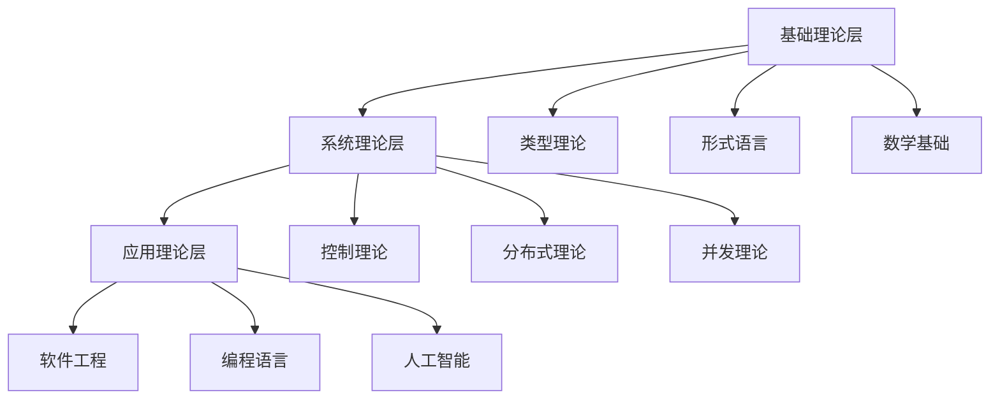

# 01. 基础形式理论：统一框架与数学基础

## 目录

1. [1.1 形式理论概述](#11-形式理论概述)
2. [1.2 形式系统基础](#12-形式系统基础)
3. [1.3 语义理论](#13-语义理论)
4. [1.4 证明理论](#14-证明理论)
5. [1.5 理论间关系](#15-理论间关系)
6. [1.6 形式化方法论](#16-形式化方法论)

## 1.1 形式理论概述

### 1.1.1 形式理论的定义

**定义 1.1.1** (形式理论) 形式理论是一个三元组 $\mathcal{T} = (\Sigma, \mathcal{A}, \mathcal{R})$，其中：

- $\Sigma$ 是形式符号集
- $\mathcal{A}$ 是公理集
- $\mathcal{R}$ 是推理规则集

**定义 1.1.2** (统一形式理论) 统一形式理论是一个五元组 $\mathcal{UFT} = (\mathcal{T}, \mathcal{C}, \mathcal{D}, \mathcal{P}, \mathcal{L})$，其中：

- $\mathcal{T}$ 是类型理论组件
- $\mathcal{C}$ 是控制理论组件
- $\mathcal{D}$ 是分布式理论组件
- $\mathcal{P}$ 是并发理论组件
- $\mathcal{L}$ 是时态理论组件

### 1.1.2 形式理论的基本性质

**定义 1.1.3** (形式系统性质) 形式系统具有以下性质：

1. **一致性**：不能同时证明 $A$ 和 $\neg A$
2. **完备性**：每个真命题都可证明
3. **可判定性**：存在算法判断命题是否可证明

**定理 1.1.1** (哥德尔不完备性) 任何足够强的形式系统都是不完备的。

**证明** 通过哥德尔构造：

1. 构造自指语句 $G$："$G$ 不可证明"
2. 如果 $G$ 可证明，则 $G$ 为假，矛盾
3. 如果 $\neg G$ 可证明，则 $G$ 为真，但 $G$ 不可证明，矛盾
4. 因此 $G$ 既不可证明也不可反驳

### 1.1.3 形式理论的分类

**定义 1.1.4** (类型理论) 类型理论是研究类型系统及其语义的形式理论。

**定义 1.1.5** (并发理论) 并发理论是研究并发系统行为的形式理论。

**定义 1.1.6** (控制理论) 控制理论是研究系统动态行为控制的形式理论。

**定义 1.1.7** (分布式理论) 分布式理论是研究分布式系统协调的形式理论。

## 1.2 形式系统基础

### 1.2.1 形式系统定义

**定义 1.2.1** (形式系统) 形式系统是一个四元组 $\mathcal{FS} = (\Sigma, \mathcal{A}, \mathcal{R}, \mathcal{T})$，其中：

- $\Sigma$ 是符号集
- $\mathcal{A}$ 是公理集
- $\mathcal{R}$ 是推理规则集
- $\mathcal{T}$ 是定理集

**定义 1.2.2** (推理规则) 推理规则是形如 $\frac{\Gamma_1 \vdash A_1, \ldots, \Gamma_n \vdash A_n}{\Gamma \vdash A}$ 的规则。

### 1.2.2 形式系统的构造

**定义 1.2.3** (项构造) 项通过以下规则构造：

```text
(变量) x ∈ V ⇒ x ∈ Term
(常量) c ∈ C ⇒ c ∈ Term
(应用) M, N ∈ Term ⇒ (MN) ∈ Term
(抽象) x ∈ V, M ∈ Term ⇒ (λx.M) ∈ Term
```

**定义 1.2.4** (类型构造) 类型通过以下规则构造：

```text
(基础类型) A ∈ B ⇒ A ∈ Type
(函数类型) A, B ∈ Type ⇒ (A → B) ∈ Type
(积类型) A, B ∈ Type ⇒ (A × B) ∈ Type
(和类型) A, B ∈ Type ⇒ (A + B) ∈ Type
```

### 1.2.3 形式系统的性质

**定理 1.2.1** (形式系统的递归性) 形式系统的项集是可递归枚举的。

**证明** 通过构造：

1. 基础项（变量、常量）是有限的
2. 复合项通过有限规则构造
3. 因此项集是可递归枚举的

**定理 1.2.2** (形式系统的可判定性) 如果形式系统是一致的，则其定理集是递归可枚举的。

**证明** 通过枚举：

1. 从公理开始
2. 应用推理规则生成新定理
3. 枚举所有可能的证明

## 1.3 语义理论

### 1.3.1 语义域定义

**定义 1.3.1** (语义域) 语义域是一个三元组 $\mathcal{D} = (D, \llbracket \cdot \rrbracket, \models)$，其中：

- $D$ 是语义对象集
- $\llbracket \cdot \rrbracket$ 是解释函数
- $\models$ 是满足关系

**定义 1.3.2** (语义解释) 语义解释函数 $\llbracket \cdot \rrbracket$ 满足：

```text
x_ρ = ρ(x)
λx.M_ρ = λd∈D.M_{ρ[x↦d]}
MN_ρ = M_ρ(N_ρ)
```

### 1.3.2 语义对应

**定义 1.3.3** (语义对应) 语义对应是语法与语义之间的关系。

**定理 1.3.1** (语义对应定理) 如果语法正确，则语义对应成立。

**证明** 通过语义定义：

1. 每个语法规则对应语义规则
2. 语义规则保持语义对应
3. 因此语法正确性保证语义对应

### 1.3.3 语义模型

**定义 1.3.4** (模型) 模型是一个二元组 $\mathcal{M} = (D, I)$，其中：

- $D$ 是论域
- $I$ 是解释函数

**定义 1.3.5** (模型满足) 模型 $\mathcal{M}$ 满足公式 $\phi$，记作 $\mathcal{M} \models \phi$。

**定理 1.3.2** (模型存在性) 每个一致的理论都有模型。

**证明** 通过紧致性定理：

1. 如果理论 $T$ 一致，则 $T$ 的每个有限子集一致
2. 每个有限子集都有模型
3. 通过紧致性定理，$T$ 有模型

## 1.4 证明理论

### 1.4.1 证明系统

**定义 1.4.1** (证明系统) 证明系统是一个三元组 $\mathcal{PS} = (\Gamma, \vdash, \pi)$，其中：

- $\Gamma$ 是假设集
- $\vdash$ 是推导关系
- $\pi$ 是证明结构

**定义 1.4.2** (证明规则) 证明规则包括：

```text
(假设) Γ, A ⊢ A
(引入) 从前提引入连接词
(消除) 从连接词消除到结论
```

### 1.4.2 自然演绎

**定义 1.4.3** (自然演绎规则) 自然演绎包含以下规则：

```text
(→I) Γ, A ⊢ B / Γ ⊢ A → B
(→E) Γ ⊢ A → B, Γ ⊢ A / Γ ⊢ B
(∧I) Γ ⊢ A, Γ ⊢ B / Γ ⊢ A ∧ B
(∧E) Γ ⊢ A ∧ B / Γ ⊢ A
(∨I) Γ ⊢ A / Γ ⊢ A ∨ B
(∨E) Γ ⊢ A ∨ B, Γ, A ⊢ C, Γ, B ⊢ C / Γ ⊢ C
```

**定理 1.4.1** (自然演绎的可靠性) 如果 $\Gamma \vdash A$，则 $\Gamma \models A$。

**证明** 通过结构归纳：

1. 基础情况：假设规则显然可靠
2. 归纳步骤：每个推理规则保持可靠性
3. 因此整个证明系统可靠

### 1.4.3 证明的构造

**定义 1.4.4** (证明树) 证明树是证明的结构化表示。

**定义 1.4.5** (证明搜索) 证明搜索是构造证明的算法过程。

**定理 1.4.2** (证明搜索的完备性) 如果 $\Gamma \models A$，则存在算法构造 $\Gamma \vdash A$ 的证明。

**证明** 通过归结：

1. 将 $\Gamma \cup \{\neg A\}$ 转换为合取范式
2. 应用归结规则
3. 如果得到空子句，则 $\Gamma \vdash A$

## 1.5 理论间关系

### 1.5.1 理论映射

**定义 1.5.1** (理论映射) 理论映射是不同理论组件之间的对应关系。

**定义 1.5.2** (理论组合) 理论组合是将多个理论组件组合成更复杂的理论。

**定理 1.5.1** (理论组合的保持性) 理论组合保持各组件的基本性质。

**证明** 通过组合分析：

1. 每个组件保持其基本性质
2. 组合操作保持这些性质
3. 因此组合理论保持性质

### 1.5.2 理论层次

**定义 1.5.3** (理论层次) 理论层次是理论间的依赖关系。



### 1.5.3 理论融合

**定义 1.5.4** (理论融合) 理论融合是将不同理论整合为统一框架。

**定理 1.5.2** (融合的完备性) 统一形式理论可以处理复杂系统的各个方面。

**证明** 通过理论覆盖：

1. 类型理论处理静态结构
2. 控制理论处理动态行为
3. 分布式理论处理协调问题
4. 并发理论处理并行执行
5. 时态理论处理时间约束

## 1.6 形式化方法论

### 1.6.1 形式化原则

**原则 1.6.1** (严格定义) 每个概念必须有严格的数学定义。

**原则 1.6.2** (完整证明) 每个定理必须有完整的证明过程。

**原则 1.6.3** (符号化表示) 使用标准数学符号进行表示。

### 1.6.2 形式化步骤

**步骤 1.6.1** (概念形式化) 将自然语言概念转换为数学定义。

**步骤 1.6.2** (关系形式化) 将概念间关系转换为数学关系。

**步骤 1.6.3** (推理形式化) 将推理过程转换为数学证明。

### 1.6.3 形式化验证

**定义 1.6.1** (形式化验证) 形式化验证是通过数学方法验证系统正确性。

**定理 1.6.1** (验证的可靠性) 形式化验证的结果是可靠的。

**证明** 通过数学基础：

1. 形式化验证基于数学逻辑
2. 数学逻辑是可靠的
3. 因此形式化验证是可靠的

---

**参考文献**：

1. Church, A. (1940). A formulation of the simple theory of types. *Journal of Symbolic Logic*, 5(2), 56-68.
2. Gödel, K. (1931). Über formal unentscheidbare Sätze der Principia Mathematica und verwandter Systeme I. *Monatshefte für Mathematik und Physik*, 38(1), 173-198.
3. Tarski, A. (1936). Der Wahrheitsbegriff in den formalisierten Sprachen. *Studia Philosophica*, 1, 261-405.
4. Gentzen, G. (1935). Untersuchungen über das logische Schließen. *Mathematische Zeitschrift*, 39(1), 176-210.
