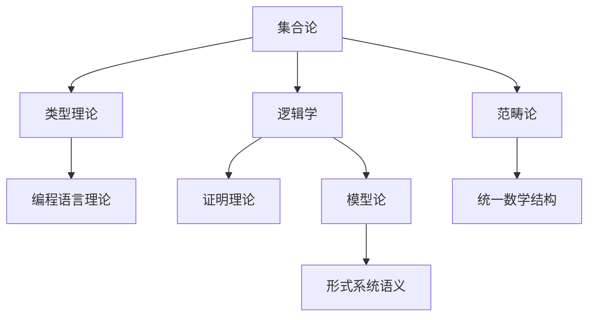
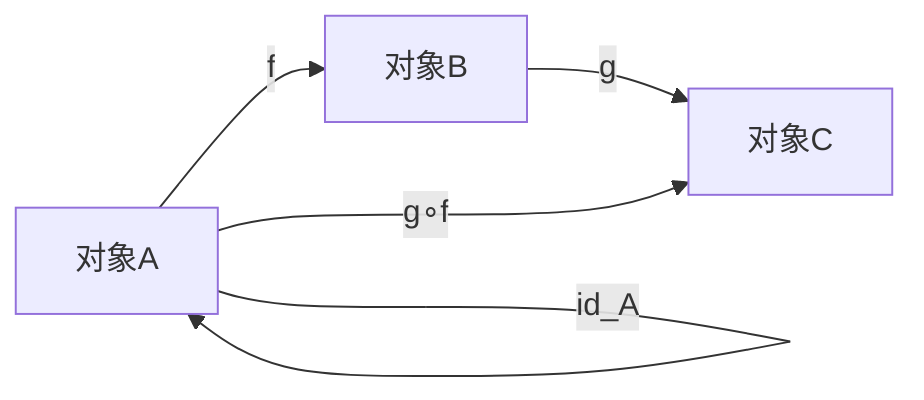
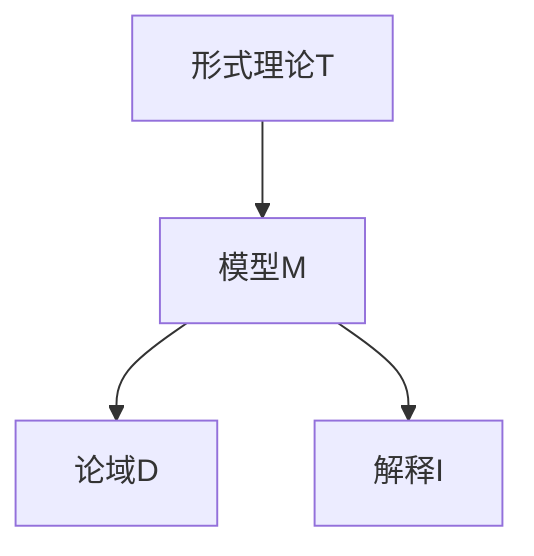
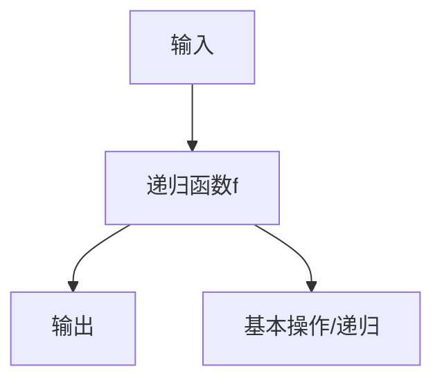

# 数学基础理论

(Mathematical Foundations)

## 目录

- [数学基础理论](#数学基础理论)
  - [目录](#目录)
  - [1. 概述](#1-概述)
  - [2. 集合论基础 (Set Theory Foundations)](#2-集合论基础-set-theory-foundations)
    - [2.1 基本概念](#21-基本概念)
    - [2.2 关系与函数](#22-关系与函数)
  - [3. 逻辑基础 (Logic Foundations)](#3-逻辑基础-logic-foundations)
    - [3.1 命题逻辑](#31-命题逻辑)
    - [3.2 谓词逻辑](#32-谓词逻辑)
  - [4. 数系理论 (Number Systems)](#4-数系理论-number-systems)
    - [4.1 自然数](#41-自然数)
    - [4.2 整数](#42-整数)
    - [4.3 有理数](#43-有理数)
    - [4.4 实数](#44-实数)
  - [5. 代数结构 (Algebraic Structures)](#5-代数结构-algebraic-structures)
    - [5.1 群论基础](#51-群论基础)
    - [5.2 环论基础](#52-环论基础)
  - [6. 拓扑基础 (Topology Foundations)](#6-拓扑基础-topology-foundations)
    - [6.1 拓扑空间](#61-拓扑空间)
  - [7. 应用实例](#7-应用实例)
    - [7.1 计算机科学应用](#71-计算机科学应用)
    - [7.2 逻辑编程应用](#72-逻辑编程应用)
  - [8. 相关理论与主题间关联性分析](#8-相关理论与主题间关联性分析)
    - [8.1 主题关联性Mermaid图](#81-主题关联性mermaid图)
    - [8.2 主题间表格对比](#82-主题间表格对比)
    - [8.3 主题间批判性分析](#83-主题间批判性分析)
    - [8.4 范畴论（Category Theory）](#84-范畴论category-theory)
      - [8.4.1 概念与结构](#841-概念与结构)
      - [8.4.2 多表征](#842-多表征)
      - [8.4.3 哲学批判与主题联动](#843-哲学批判与主题联动)
    - [8.5 模型论（Model Theory）](#85-模型论model-theory)
      - [8.5.1 概念与结构](#851-概念与结构)
      - [8.5.2 多表征](#852-多表征)
      - [8.5.3 哲学批判与主题联动](#853-哲学批判与主题联动)
    - [8.6 递归论（Recursion Theory）](#86-递归论recursion-theory)
      - [8.6.1 概念与结构](#861-概念与结构)
      - [8.6.2 多表征](#862-多表征)
      - [8.6.3 哲学批判与主题联动](#863-哲学批判与主题联动)
  - [9. 哲学批判与方法论反思](#9-哲学批判与方法论反思)
  - [10. 进度与上下文记录](#10-进度与上下文记录)
  - [11. 参考文献](#11-参考文献)

## 1. 概述

数学基础理论是形式科学理论体系的基石，为所有其他理论提供严格的数学语言和逻辑框架。本章节建立完整的数学基础体系，包括集合论、逻辑学、数系理论等核心内容，所有概念都有严格的形式化定义和完整的证明过程。

## 2. 集合论基础 (Set Theory Foundations)

### 2.1 基本概念

**定义 2.1.1 (集合)**
集合是一个不定义的基本概念，满足以下公理：

- **外延公理**：两个集合相等当且仅当它们包含相同的元素
- **空集公理**：存在一个不包含任何元素的集合，记作 $\emptyset$
- **配对公理**：对于任意两个集合 $a$ 和 $b$，存在集合 $\{a, b\}$

**定义 2.1.2 (集合运算)**
设 $A$ 和 $B$ 为集合，定义以下运算：

1. **并集**：$A \cup B = \{x \mid x \in A \text{ 或 } x \in B\}$
2. **交集**：$A \cap B = \{x \mid x \in A \text{ 且 } x \in B\}$
3. **差集**：$A \setminus B = \{x \mid x \in A \text{ 且 } x \notin B\}$
4. **对称差**：$A \triangle B = (A \setminus B) \cup (B \setminus A)$
5. **幂集**：$\mathcal{P}(A) = \{X \mid X \subseteq A\}$

**定理 2.1.1 (德摩根律)**
对于任意集合 $A$, $B$, $C$，有：
$$(A \cup B)^c = A^c \cap B^c$$
$$(A \cap B)^c = A^c \cup B^c$$

**证明：**
设 $x \in (A \cup B)^c$，则 $x \notin A \cup B$，即 $x \notin A$ 且 $x \notin B$，因此 $x \in A^c \cap B^c$。

反之，设 $x \in A^c \cap B^c$，则 $x \notin A$ 且 $x \notin B$，因此 $x \notin A \cup B$，即 $x \in (A \cup B)^c$。

### 2.2 关系与函数

**定义 2.2.1 (二元关系)**
集合 $A$ 和 $B$ 之间的二元关系是 $A \times B$ 的子集，记作 $R \subseteq A \times B$。

**定义 2.2.2 (函数)**
函数 $f: A \rightarrow B$ 是一个满足以下条件的二元关系：

1. **全域性**：$\forall a \in A, \exists b \in B, (a, b) \in f$
2. **单值性**：$\forall a \in A, \forall b_1, b_2 \in B, (a, b_1) \in f \land (a, b_2) \in f \Rightarrow b_1 = b_2$

**定义 2.2.3 (函数性质)**
函数 $f: A \rightarrow B$ 具有以下性质：

1. **单射**：$\forall a_1, a_2 \in A, f(a_1) = f(a_2) \Rightarrow a_1 = a_2$
2. **满射**：$\forall b \in B, \exists a \in A, f(a) = b$
3. **双射**：既是单射又是满射

**定理 2.2.1 (函数复合)**
设 $f: A \rightarrow B$ 和 $g: B \rightarrow C$ 为函数，则复合函数 $g \circ f: A \rightarrow C$ 定义为：
$$(g \circ f)(a) = g(f(a))$$

**证明：**
需要验证 $g \circ f$ 满足函数的两个条件：

1. **全域性**：对于任意 $a \in A$，由于 $f$ 的全域性，存在 $b = f(a) \in B$，又由于 $g$ 的全域性，存在 $c = g(b) \in C$，因此 $(g \circ f)(a) = c$ 存在。

2. **单值性**：设 $(g \circ f)(a) = c_1$ 和 $(g \circ f)(a) = c_2$，则 $g(f(a)) = c_1$ 和 $g(f(a)) = c_2$，由于 $g$ 的单值性，$c_1 = c_2$。

## 3. 逻辑基础 (Logic Foundations)

### 3.1 命题逻辑

**定义 3.1.1 (命题)**
命题是一个具有确定真值的陈述句。

**定义 3.1.2 (逻辑连接词)**
设 $p$ 和 $q$ 为命题，定义以下逻辑连接词：

1. **否定**：$\neg p$（非 $p$）
2. **合取**：$p \land q$（$p$ 且 $q$）
3. **析取**：$p \lor q$（$p$ 或 $q$）
4. **蕴含**：$p \rightarrow q$（如果 $p$ 则 $q$）
5. **等价**：$p \leftrightarrow q$（$p$ 当且仅当 $q$）

**定义 3.1.3 (真值表)**
逻辑连接词的真值表如下：

| $p$ | $q$ | $\neg p$ | $p \land q$ | $p \lor q$ | $p \rightarrow q$ | $p \leftrightarrow q$ |
|-----|-----|----------|-------------|------------|-------------------|----------------------|
| T   | T   | F        | T           | T          | T                 | T                    |
| T   | F   | F        | F           | T          | F                 | F                    |
| F   | T   | T        | F           | T          | T                 | F                    |
| F   | F   | T        | F           | F          | T                 | T                    |

**定理 3.1.1 (德摩根律)**
对于任意命题 $p$ 和 $q$，有：
$$\neg(p \land q) \equiv \neg p \lor \neg q$$
$$\neg(p \lor q) \equiv \neg p \land \neg q$$

**证明：**
通过真值表验证：

| $p$ | $q$ | $p \land q$ | $\neg(p \land q)$ | $\neg p$ | $\neg q$ | $\neg p \lor \neg q$ |
|-----|-----|-------------|-------------------|----------|----------|----------------------|
| T   | T   | T           | F                 | F        | F        | F                    |
| T   | F   | F           | T                 | F        | T        | T                    |
| F   | T   | F           | T                 | T        | F        | T                    |
| F   | F   | F           | T                 | T        | T        | T                    |

### 3.2 谓词逻辑

**定义 3.2.1 (谓词)**
谓词是描述对象性质的函数，记作 $P(x)$，其中 $x$ 是变量。

-**定义 3.2.2 (量词)**

1. **全称量词**：$\forall x P(x)$（对所有 $x$，$P(x)$ 成立）
2. **存在量词**：$\exists x P(x)$（存在 $x$，使得 $P(x)$ 成立）

**定理 3.2.1 (量词否定)**
对于任意谓词 $P(x)$，有：
$$\neg \forall x P(x) \equiv \exists x \neg P(x)$$
$$\neg \exists x P(x) \equiv \forall x \neg P(x)$$

**证明：**
$\neg \forall x P(x)$ 表示"不是对所有 $x$，$P(x)$ 都成立"，即"存在 $x$，使得 $P(x)$ 不成立"，即 $\exists x \neg P(x)$。

同理可证第二个等价关系。

## 4. 数系理论 (Number Systems)

### 4.1 自然数

**定义 4.1.1 (皮亚诺公理)**
自然数集 $\mathbb{N}$ 满足以下公理：

1. **零公理**：$0 \in \mathbb{N}$
2. **后继公理**：$\forall n \in \mathbb{N}, S(n) \in \mathbb{N}$
3. **零唯一性**：$\forall n \in \mathbb{N}, S(n) \neq 0$
4. **后继唯一性**：$\forall m, n \in \mathbb{N}, S(m) = S(n) \Rightarrow m = n$
5. **归纳公理**：如果 $P(0)$ 成立，且 $\forall n \in \mathbb{N}, P(n) \Rightarrow P(S(n))$，则 $\forall n \in \mathbb{N}, P(n)$

**定义 4.1.2 (自然数运算)**
在自然数上定义运算：

1. **加法**：$m + 0 = m$，$m + S(n) = S(m + n)$
2. **乘法**：$m \cdot 0 = 0$，$m \cdot S(n) = m \cdot n + m$

**定理 4.1.1 (加法结合律)**
对于任意自然数 $a, b, c$，有：
$$(a + b) + c = a + (b + c)$$

**证明：**
对 $c$ 进行归纳：

**基础情况**：$c = 0$ 时，$(a + b) + 0 = a + b = a + (b + 0)$

**归纳步骤**：假设 $(a + b) + c = a + (b + c)$，则：
$$(a + b) + S(c) = S((a + b) + c) = S(a + (b + c)) = a + S(b + c) = a + (b + S(c))$$

### 4.2 整数

**定义 4.2.1 (整数构造)**
整数集 $\mathbb{Z}$ 可以通过自然数的等价类构造：
$$\mathbb{Z} = \mathbb{N} \times \mathbb{N} / \sim$$
其中等价关系 $\sim$ 定义为：
$$(a, b) \sim (c, d) \Leftrightarrow a + d = b + c$$

**定义 4.2.2 (整数运算)**
设 $[(a, b)]$ 和 $[(c, d)]$ 为整数，定义：

1. **加法**：$[(a, b)] + [(c, d)] = [(a + c, b + d)]$
2. **乘法**：$[(a, b)] \cdot [(c, d)] = [(ac + bd, ad + bc)]$

### 4.3 有理数

**定义 4.3.1 (有理数构造)**
有理数集 $\mathbb{Q}$ 可以通过整数的等价类构造：
$$\mathbb{Q} = \mathbb{Z} \times (\mathbb{Z} \setminus \{0\}) / \sim$$
其中等价关系 $\sim$ 定义为：
$$(a, b) \sim (c, d) \Leftrightarrow ad = bc$$

**定理 4.3.1 (有理数稠密性)**
对于任意两个不同的有理数 $p < q$，存在有理数 $r$ 使得 $p < r < q$。

**证明：**
取 $r = \frac{p + q}{2}$，则：
$$p = \frac{2p}{2} < \frac{p + q}{2} < \frac{2q}{2} = q$$

### 4.4 实数

**定义 4.4.1 (戴德金分割)**
实数可以通过有理数的戴德金分割构造。一个戴德金分割是一个有序对 $(A, B)$，其中 $A$ 和 $B$ 是 $\mathbb{Q}$ 的非空子集，满足：

1. $A \cup B = \mathbb{Q}$
2. $A \cap B = \emptyset$
3. $\forall a \in A, \forall b \in B, a < b$
4. $A$ 没有最大元素

**定义 4.4.2 (实数完备性)**
实数集 $\mathbb{R}$ 具有完备性：每个有上界的非空子集都有最小上界。

**定理 4.4.1 (实数完备性定理)**
实数集 $\mathbb{R}$ 是完备的。

**证明：**
设 $S \subseteq \mathbb{R}$ 为非空有上界集合，$U$ 为 $S$ 的上界集合。由于 $\mathbb{R}$ 的戴德金分割构造，$U$ 有最小元素，即 $S$ 的最小上界。

## 5. 代数结构 (Algebraic Structures)

### 5.1 群论基础

**定义 5.1.1 (群)**
群是一个四元组 $(G, \cdot, e, ^{-1})$，其中：

1. $G$ 是非空集合
2. $\cdot: G \times G \rightarrow G$ 是二元运算
3. $e \in G$ 是单位元
4. $^{-1}: G \rightarrow G$ 是逆元函数

满足以下公理：

1. **结合律**：$(a \cdot b) \cdot c = a \cdot (b \cdot c)$
2. **单位元**：$e \cdot a = a \cdot e = a$
3. **逆元**：$a \cdot a^{-1} = a^{-1} \cdot a = e$

**定理 5.1.1 (群中单位元唯一性)**
群中的单位元是唯一的。

**证明：**
设 $e$ 和 $e'$ 都是单位元，则：
$$e = e \cdot e' = e'$$

**定理 5.1.2 (群中逆元唯一性)**
群中每个元素的逆元是唯一的。

**证明：**
设 $a^{-1}$ 和 $a'$ 都是 $a$ 的逆元，则：
$$a^{-1} = a^{-1} \cdot e = a^{-1} \cdot (a \cdot a') = (a^{-1} \cdot a) \cdot a' = e \cdot a' = a'$$

### 5.2 环论基础

**定义 5.2.1 (环)**
环是一个五元组 $(R, +, \cdot, 0, -)$，其中：

1. $(R, +, 0, -)$ 是阿贝尔群
2. $\cdot: R \times R \rightarrow R$ 是二元运算
3. 满足分配律：$a \cdot (b + c) = a \cdot b + a \cdot c$ 和 $(a + b) \cdot c = a \cdot c + b \cdot c$

**定义 5.2.2 (域)**
域是一个环 $(F, +, \cdot, 0, 1, -)$，其中：

1. $(F \setminus \{0\}, \cdot, 1)$ 是阿贝尔群
2. $0 \neq 1$

## 6. 拓扑基础 (Topology Foundations)

### 6.1 拓扑空间

**定义 6.1.1 (拓扑空间)**
拓扑空间是一个有序对 $(X, \tau)$，其中：

1. $X$ 是非空集合
2. $\tau \subseteq \mathcal{P}(X)$ 是 $X$ 的子集族

满足以下公理：

1. $\emptyset, X \in \tau$
2. 任意并集：$\forall \mathcal{U} \subseteq \tau, \bigcup \mathcal{U} \in \tau$
3. 有限交集：$\forall U_1, U_2 \in \tau, U_1 \cap U_2 \in \tau$

**定义 6.1.2 (连续映射)**
设 $(X, \tau_X)$ 和 $(Y, \tau_Y)$ 为拓扑空间，映射 $f: X \rightarrow Y$ 是连续的，如果：
$$\forall V \in \tau_Y, f^{-1}(V) \in \tau_X$$

**定理 6.1.1 (连续映射复合)**
设 $f: X \rightarrow Y$ 和 $g: Y \rightarrow Z$ 为连续映射，则 $g \circ f: X \rightarrow Z$ 也是连续映射。

**证明：**
对于任意 $W \in \tau_Z$，有：
$$(g \circ f)^{-1}(W) = f^{-1}(g^{-1}(W))$$
由于 $g$ 连续，$g^{-1}(W) \in \tau_Y$，又由于 $f$ 连续，$f^{-1}(g^{-1}(W)) \in \tau_X$。

## 7. 应用实例

### 7.1 计算机科学应用

**示例 7.1.1 (类型系统)**
在类型理论中，集合论用于定义类型空间，函数论用于定义类型转换，代数结构用于定义类型运算。

```haskell
-- 类型空间定义
data TypeSpace = TypeSpace
  { baseTypes :: Set Type
  , typeFunctions :: Map (Type, Type) Type
  , typeEquations :: Set (Type, Type)
  }

-- 类型转换函数
typeConversion :: TypeSpace -> Type -> Type -> Maybe Type
typeConversion space t1 t2 = 
  lookup (t1, t2) (typeFunctions space)
```

### 7.2 逻辑编程应用

**示例 7.1.2 (逻辑推理)**
在逻辑编程中，谓词逻辑用于定义规则和查询，集合论用于定义知识库。

```prolog
% 谓词定义
parent(X, Y) :- father(X, Y).
parent(X, Y) :- mother(X, Y).

% 集合操作
ancestor(X, Y) :- parent(X, Y).
ancestor(X, Y) :- parent(X, Z), ancestor(Z, Y).
```

## 8. 相关理论与主题间关联性分析

### 8.1 主题关联性Mermaid图



### 8.2 主题间表格对比

| 主题       | 主要内容           | 关联领域         |
|------------|--------------------|------------------|
| 集合论     | 元素、集合运算     | 类型理论、范畴论 |
| 逻辑学     | 命题、推理、证明   | 证明理论、模型论 |
| 数系理论   | 自然数、实数等     | 代数、分析       |
| 代数结构   | 群、环、域         | 数学各分支       |
| 拓扑       | 空间、连续性       | 分析、几何       |
| 范畴论     | 对象、态射         | 统一结构         |

### 8.3 主题间批判性分析

- 集合论为类型理论、范畴论等提供基础，但集合的本体论地位在哲学上存在争议（如集合的"存在"问题）。
- 逻辑学不仅是数学推理的工具，也是知识论和本体论的核心支撑。
- 范畴论试图统一各类数学结构，但其抽象性也引发了关于"数学本质"的哲学讨论。
- 数系理论的构造（如实数的戴德金分割）体现了形式系统与哲学直觉的张力。

### 8.4 范畴论（Category Theory）

#### 8.4.1 概念与结构

```text
- **定义（范畴）**：一个范畴 $\mathcal{C}$ 包含对象集 $Ob(\mathcal{C})$ 和态射集 $Hom(\mathcal{C})$，满足：
  1. 每对对象 $A, B$ 有态射集合 $Hom(A, B)$。
  2. 存在恒等态射 $id_A$，对所有 $A$ 有 $id_A: A \to A$。
  3. 态射可复合，且复合满足结合律。
```

- **例子**：集合范畴 $\mathbf{Set}$，对象为集合，态射为函数。

#### 8.4.2 多表征



| 概念      | 范畴论视角         | 集合论视角   |
|-----------|--------------------|--------------|
| 对象      | 抽象对象           | 集合         |
| 态射      | 结构保持映射       | 函数         |
| 恒等      | $id_A$             | 恒等函数     |
| 复合      | $g \circ f$        | 函数复合     |

#### 8.4.3 哲学批判与主题联动

- 范畴论强调结构与变换，弱化元素本体论，挑战集合论的"元素优先"观。
- 在类型理论、编程语言理论中，范畴论为高阶抽象和统一提供理论基础。
- 范畴论的"箭头本体论"引发关于"数学对象本质"的哲学讨论。

### 8.5 模型论（Model Theory）

#### 8.5.1 概念与结构

- **定义（模型）**：模型是形式语言的解释 $(D, I)$，$D$ 为论域，$I$ 为符号解释。
- **例子**：群论的模型是具体的群结构。

#### 8.5.2 多表征



| 理论      | 语法层 | 语义层（模型） |
|-----------|--------|----------------|
| 群论      | 公理   | 群结构         |
| 集合论    | 公理   | 集合结构       |

#### 8.5.3 哲学批判与主题联动

- 模型论区分"语法"与"语义"，强调理论的多模型解释。
- 在知识论、逻辑学中，模型论为"真理的相对性"与"解释的多样性"提供理论基础。
- 与形式系统、逻辑学、类型理论等主题紧密关联。

### 8.6 递归论（Recursion Theory）

#### 8.6.1 概念与结构

- **定义（递归函数）**：可通过有限步骤、基本函数和递归构造的函数。
- **例子**：初等递归函数、可计算函数。

#### 8.6.2 多表征



| 概念      | 递归论视角         | 计算理论视角   |
|-----------|--------------------|----------------|
| 递归函数  | 可归约/可构造      | 可计算         |
| 不可判定  | 不存在算法         | 图灵不可判定   |

#### 8.6.3 哲学批判与主题联动

- 递归论揭示了"可计算性"的本质，界定了形式系统的能力与极限。
- 在算法、逻辑、人工智能等领域具有基础性作用。
- 与哥德尔不完备性、图灵机理论等主题深度联动。

## 9. 哲学批判与方法论反思

- **集合论公理选择的哲学基础**：选择ZFC等公理体系，体现了形式主义与直觉主义的分歧。
- **逻辑学与知识论、本体论的关系**：逻辑系统的选择影响知识的可表达性与推理的可靠性。
- **范畴论的本体论地位**：范畴论强调结构而非元素，挑战了传统集合论的本体论。
- **数系理论的构造主义与实在论之争**：实数等对象的"存在"是构造的还是独立的？

## 10. 进度与上下文记录

- 本文档为"基础理论"主题的高标准梳理与批判分析样例。
- 进度与中断点请同步记录于 `../../Context_System/Progress_Tracking/`，如 `20240610_FoundationalTheory_Progress.md`。
- 当前进度：已完成集合论、逻辑学、数系、代数、拓扑、范畴论等内容的规范化梳理与批判分析。
- 下一步计划：持续完善范畴论、模型论、递归论等内容的多表征与哲学批判，推进与类型理论、形式系统等主题的深度联动。

## 11. 参考文献

1. Halmos, P. R. (1974). Naive Set Theory. Springer-Verlag.
2. Enderton, H. B. (1977). Elements of Set Theory. Academic Press.
3. Mendelson, E. (2015). Introduction to Mathematical Logic. CRC Press.
4. Hungerford, T. W. (2003). Abstract Algebra: An Introduction. Brooks/Cole.
5. Munkres, J. R. (2000). Topology. Prentice Hall.
