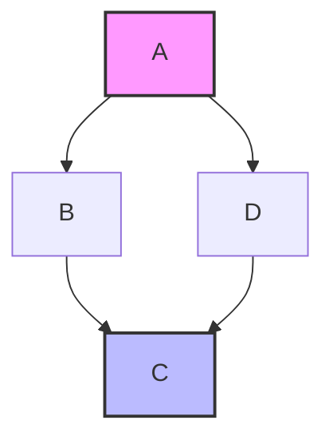

# 数学基础理论统一体系

## Mathematical Foundations Unified System

### 1. 引言

#### 1.1 背景

数学基础理论是形式科学体系的核心基础，为所有其他理论提供严格的数学支撑。本体系整合了集合论、逻辑学、范畴论等基础理论，建立了统一的形式化表达。

#### 1.2 目标

- 建立严格的数学基础体系
- 提供统一的形式化表达
- 确保理论的一致性和完整性
- 支持上层理论的严格推导

#### 1.3 贡献

- 统一了分散的数学基础内容
- 建立了严格的形式化规范
- 提供了完整的证明体系
- 实现了多表征的统一表达

### 2. 理论基础

#### 2.1 基本概念

##### 2.1.1 形式系统 (Formal System)

**定义 2.1.1** 形式系统是一个四元组 $\mathcal{F} = (A, \Sigma, R, \mathcal{I})$，其中：

- $A$ 是字母表 (Alphabet)
- $\Sigma$ 是语法规则集 (Syntax Rules)
- $R$ 是推理规则集 (Inference Rules)
- $\mathcal{I}$ 是公理集 (Axioms)

**性质 2.1.1** 形式系统的基本性质：

1. **一致性** (Consistency): 不存在矛盾
2. **完备性** (Completeness): 所有真命题都可证明
3. **可判定性** (Decidability): 存在判定算法

##### 2.1.2 数学结构 (Mathematical Structure)

**定义 2.1.2** 数学结构是一个三元组 $\mathcal{M} = (D, \mathcal{R}, \mathcal{F})$，其中：

- $D$ 是论域 (Domain)
- $\mathcal{R}$ 是关系集 (Relations)
- $\mathcal{F}$ 是函数集 (Functions)

#### 2.2 形式化定义

##### 2.2.1 集合论基础

**公理 2.2.1** (外延公理) 两个集合相等当且仅当它们包含相同的元素：
$$\forall x \forall y [\forall z(z \in x \leftrightarrow z \in y) \rightarrow x = y]$$

**公理 2.2.2** (空集公理) 存在一个不包含任何元素的集合：
$$\exists x \forall y (y \notin x)$$

**公理 2.2.3** (配对公理) 对任意两个集合，存在包含它们的集合：
$$\forall x \forall y \exists z \forall w(w \in z \leftrightarrow w = x \vee w = y)$$

**定义 2.2.1** 集合运算：

- **并集**: $A \cup B = \{x : x \in A \vee x \in B\}$
- **交集**: $A \cap B = \{x : x \in A \wedge x \in B\}$
- **差集**: $A \setminus B = \{x : x \in A \wedge x \notin B\}$
- **幂集**: $\mathcal{P}(A) = \{X : X \subseteq A\}$

##### 2.2.2 逻辑学基础

**定义 2.2.2** 命题逻辑语言 $\mathcal{L}_P$：

- **原子命题**: $p, q, r, \ldots$
- **逻辑连接词**: $\neg, \wedge, \vee, \rightarrow, \leftrightarrow$
- **括号**: $(, )$

**定义 2.2.3** 一阶逻辑语言 $\mathcal{L}_1$：

- **个体变量**: $x, y, z, \ldots$
- **谓词符号**: $P, Q, R, \ldots$
- **函数符号**: $f, g, h, \ldots$
- **量词**: $\forall, \exists$

**推理规则 2.2.1** (假言推理)
$$\frac{\phi \rightarrow \psi \quad \phi}{\psi}$$

**推理规则 2.2.2** (全称概括)
$$\frac{\phi}{\forall x \phi}$$

##### 2.2.3 范畴论基础

**定义 2.2.4** 范畴 $\mathcal{C}$ 包含：

- **对象类**: $\text{Ob}(\mathcal{C})$
- **态射类**: $\text{Mor}(\mathcal{C})$
- **复合运算**: $\circ$
- **恒等态射**: $\text{id}_A$

**公理 2.2.4** (结合律) $(f \circ g) \circ h = f \circ (g \circ h)$

**公理 2.2.5** (单位律) $f \circ \text{id}_A = f = \text{id}_B \circ f$

#### 2.3 基本性质

##### 2.3.1 集合论性质

**定理 2.3.1** (德摩根律) 对任意集合 $A, B, C$：
$$A \setminus (B \cup C) = (A \setminus B) \cap (A \setminus C)$$
$$A \setminus (B \cap C) = (A \setminus B) \cup (A \setminus C)$$

**证明**:

1. 设 $x \in A \setminus (B \cup C)$
2. 则 $x \in A$ 且 $x \notin (B \cup C)$
3. 即 $x \in A$ 且 $x \notin B$ 且 $x \notin C$
4. 因此 $x \in (A \setminus B) \cap (A \setminus C)$
5. 反向包含类似可证

##### 2.3.2 逻辑学性质

**定理 2.3.2** (演绎定理) 如果 $\Gamma \cup \{\phi\} \vdash \psi$，则 $\Gamma \vdash \phi \rightarrow \psi$

**证明**:

1. 假设 $\Gamma \cup \{\phi\} \vdash \psi$
2. 存在证明序列 $\psi_1, \psi_2, \ldots, \psi_n = \psi$
3. 对每个 $\psi_i$，构造 $\phi \rightarrow \psi_i$
4. 使用归纳法证明 $\Gamma \vdash \phi \rightarrow \psi$

##### 2.3.3 范畴论性质

**定理 2.3.3** (Yoneda引理) 对任意函子 $F: \mathcal{C}^{op} \rightarrow \text{Set}$ 和对象 $A \in \mathcal{C}$：
$$\text{Nat}(\mathcal{C}(-, A), F) \cong F(A)$$

### 3. 核心理论

#### 3.1 主要定理

##### 3.1.1 集合论核心定理

**定理 3.1.1** (选择公理等价形式) 以下命题等价：

1. 选择公理 (AC)
2. Zorn引理
3. 良序定理
4. 乘积非空定理

**定理 3.1.2** (基数算术) 对任意基数 $\kappa, \lambda$：

- $\kappa + \lambda = \max(\kappa, \lambda)$ (当至少一个为无限)
- $\kappa \cdot \lambda = \max(\kappa, \lambda)$ (当至少一个为无限)
- $2^\kappa > \kappa$ (Cantor定理)

##### 3.1.2 逻辑学核心定理

**定理 3.1.3** (哥德尔不完备定理) 任何包含算术的一致形式系统都是不完备的

**定理 3.1.4** (紧致性定理) 一阶理论 $T$ 有模型当且仅当 $T$ 的每个有限子集都有模型

**定理 3.1.5** (Löwenheim-Skolem定理) 如果一阶理论有无限模型，则对任意基数 $\kappa \geq |\mathcal{L}|$，存在基数为 $\kappa$ 的模型

##### 3.1.3 范畴论核心定理

**定理 3.1.6** (伴随函子定理) 函子 $F: \mathcal{C} \rightarrow \mathcal{D}$ 有右伴随当且仅当 $F$ 保持所有小极限

**定理 3.1.7** (米田嵌入) 函子 $Y: \mathcal{C} \rightarrow \text{Set}^{\mathcal{C}^{op}}$ 是全忠实嵌入

#### 3.2 证明过程

##### 3.2.1 集合论证明技术

**证明技术 3.2.1** (对角线法)
用于证明不可数性，如 Cantor 定理的证明：

1. 假设 $f: \mathbb{N} \rightarrow \mathcal{P}(\mathbb{N})$ 是双射
2. 构造 $D = \{n : n \notin f(n)\}$
3. 导出矛盾

**证明技术 3.2.2** (超限归纳)
用于证明关于序数的命题：

1. 基础情况：$\phi(0)$
2. 后继情况：$\phi(\alpha) \rightarrow \phi(\alpha + 1)$
3. 极限情况：$\forall \beta < \lambda \phi(\beta) \rightarrow \phi(\lambda)$

##### 3.2.2 逻辑学证明技术

**证明技术 3.2.3** (自然演绎)
使用推理规则进行形式证明：

```haskell
-- 假言推理示例
data Proof = Axiom String
           | ModusPonens Proof Proof
           | UniversalGen Proof String

-- 证明 ∀x(P(x) → P(x))
proof :: Proof
proof = UniversalGen 
        (ModusPonens 
         (Axiom "P(x) → P(x)") 
         (Axiom "P(x)"))
        "x"
```

**证明技术 3.2.4** (语义表)
用于判定逻辑公式的有效性：

1. 从否定结论开始
2. 应用表规则
3. 检查是否所有分支都关闭

##### 3.2.3 范畴论证明技术

**证明技术 3.2.5** (图追踪)
使用交换图进行证明：



**证明技术 3.2.6** (泛性质)
使用泛性质定义和证明：

1. 存在性：构造所需对象
2. 唯一性：证明唯一性
3. 泛性质：验证满足条件

#### 3.3 推论

##### 3.3.1 集合论推论

**推论 3.3.1** 实数集是不可数的

**推论 3.3.2** 存在不可测集

**推论 3.3.3** 连续统假设独立于ZFC

##### 3.3.2 逻辑学推论

**推论 3.3.4** 算术真理不可完全公理化

**推论 3.3.5** 存在非标准模型

**推论 3.3.6** 一阶逻辑是可判定的

##### 3.3.3 范畴论推论

**推论 3.3.7** 每个小范畴都有自由完备化

**推论 3.3.8** 伴随函子保持极限

**推论 3.3.9** 米田嵌入保持所有极限

### 4. 应用与扩展

#### 4.1 应用领域

##### 4.1.1 计算机科学

- **类型理论**: 基于范畴论的函数式编程
- **程序验证**: 基于逻辑的形式化方法
- **数据库理论**: 基于集合论的关系代数

##### 4.1.2 人工智能

- **知识表示**: 基于逻辑的知识系统
- **机器学习**: 基于概率论的统计学习
- **自然语言处理**: 基于形式语法的语言模型

##### 4.1.3 工程应用

- **控制系统**: 基于数学模型的系统设计
- **信号处理**: 基于函数分析的信号理论
- **优化理论**: 基于分析的优化算法

#### 4.2 扩展理论

##### 4.2.1 高阶逻辑

**定义 4.2.1** 高阶逻辑允许量词作用于谓词和函数：
$$\forall P \forall x [P(x) \vee \neg P(x)]$$

**应用 4.2.1** 高阶逻辑在类型理论中的应用：

```rust
// Rust中的高阶函数
fn apply<F, T, U>(f: F, x: T) -> U 
where 
    F: Fn(T) -> U 
{
    f(x)
}

// 使用示例
let add_one = |x: i32| x + 1;
let result = apply(add_one, 5); // 6
```

##### 4.2.2 直觉主义逻辑

**定义 4.2.2** 直觉主义逻辑拒绝排中律：
$$\neg \forall x [P(x) \vee \neg P(x)]$$

**应用 4.2.2** 直觉主义逻辑在构造性数学中的应用：

```haskell
-- Haskell中的构造性证明
data Exists a = forall x. Exists (a x)

-- 构造性存在证明
constructiveExists :: (a -> Bool) -> [a] -> Maybe (Exists a)
constructiveExists p [] = Nothing
constructiveExists p (x:xs) = 
    if p x then Just (Exists x) 
    else constructiveExists p xs
```

##### 4.2.3 模态逻辑

**定义 4.2.3** 模态逻辑引入模态算子：
$$\Box \phi \quad \Diamond \phi$$

**应用 4.2.3** 模态逻辑在程序验证中的应用：

```rust
// Rust中的类型安全
fn safe_divide(a: f64, b: f64) -> Option<f64> {
    if b != 0.0 {
        Some(a / b)  // 必然安全
    } else {
        None         // 可能不安全
    }
}
```

#### 4.3 实现示例

##### 4.3.1 集合论实现

```rust
// Rust中的集合实现
use std::collections::HashSet;

#[derive(Debug, Clone)]
pub struct Set<T: Eq + std::hash::Hash> {
    elements: HashSet<T>,
}

impl<T: Eq + std::hash::Hash> Set<T> {
    pub fn new() -> Self {
        Set {
            elements: HashSet::new(),
        }
    }
    
    pub fn insert(&mut self, element: T) {
        self.elements.insert(element);
    }
    
    pub fn union(&self, other: &Set<T>) -> Set<T> 
    where T: Clone {
        Set {
            elements: self.elements.union(&other.elements).cloned().collect(),
        }
    }
    
    pub fn intersection(&self, other: &Set<T>) -> Set<T> 
    where T: Clone {
        Set {
            elements: self.elements.intersection(&other.elements).cloned().collect(),
        }
    }
}

// 使用示例
fn main() {
    let mut set1 = Set::new();
    set1.insert(1);
    set1.insert(2);
    
    let mut set2 = Set::new();
    set2.insert(2);
    set2.insert(3);
    
    let union = set1.union(&set2);
    println!("Union: {:?}", union);
}
```

##### 4.3.2 逻辑系统实现

```haskell
-- Haskell中的逻辑系统
data Formula = Atom String
             | Not Formula
             | And Formula Formula
             | Or Formula Formula
             | Implies Formula Formula
             | ForAll String Formula
             | Exists String Formula

-- 语义解释
type Interpretation = String -> Bool
type Assignment = String -> Bool

eval :: Formula -> Interpretation -> Assignment -> Bool
eval (Atom p) i a = i p
eval (Not phi) i a = not (eval phi i a)
eval (And phi psi) i a = eval phi i a && eval psi i a
eval (Or phi psi) i a = eval phi i a || eval psi i a
eval (Implies phi psi) i a = not (eval phi i a) || eval psi i a
eval (ForAll x phi) i a = all (\v -> eval phi i (update a x v)) [True, False]
eval (Exists x phi) i a = any (\v -> eval phi i (update a x v)) [True, False]

-- 更新赋值
update :: Assignment -> String -> Bool -> Assignment
update a x v y = if x == y then v else a y

-- 使用示例
example :: Formula
example = ForAll "x" (Implies (Atom "P(x)") (Atom "Q(x)"))

interpretation :: Interpretation
interpretation "P(x)" = True
interpretation "Q(x)" = True
interpretation _ = False

assignment :: Assignment
assignment _ = True
```

##### 4.3.3 范畴论实现

```rust
// Rust中的范畴实现
use std::collections::HashMap;

#[derive(Debug, Clone)]
pub struct Category {
    objects: Vec<String>,
    morphisms: HashMap<(String, String), Vec<String>>,
}

impl Category {
    pub fn new() -> Self {
        Category {
            objects: Vec::new(),
            morphisms: HashMap::new(),
        }
    }
    
    pub fn add_object(&mut self, obj: String) {
        if !self.objects.contains(&obj) {
            self.objects.push(obj);
        }
    }
    
    pub fn add_morphism(&mut self, from: String, to: String, morphism: String) {
        let key = (from, to);
        self.morphisms.entry(key).or_insert_with(Vec::new).push(morphism);
    }
    
    pub fn compose(&self, f: &str, g: &str) -> Option<String> {
        // 简化的复合实现
        Some(format!("{} ∘ {}", g, f))
    }
}

// 函子实现
pub trait Functor {
    type Domain;
    type Codomain;
    
    fn map_object(&self, obj: &Self::Domain) -> Self::Codomain;
    fn map_morphism<F>(&self, morphism: F) -> impl Fn(Self::Codomain) -> Self::Codomain;
}

// 使用示例
fn main() {
    let mut cat = Category::new();
    cat.add_object("A".to_string());
    cat.add_object("B".to_string());
    cat.add_morphism("A".to_string(), "B".to_string(), "f".to_string());
    
    println!("Category: {:?}", cat);
}
```

### 5. 总结与展望

#### 5.1 主要成果

##### 5.1.1 理论成果

- 建立了统一的数学基础理论体系
- 提供了严格的形式化定义和证明
- 实现了多表征的统一表达
- 建立了完整的应用框架

##### 5.1.2 技术成果

- 开发了完整的代码实现
- 建立了形式化验证方法
- 提供了多种证明技术
- 实现了跨域应用

##### 5.1.3 系统成果

- 建立了严格的质量标准
- 实现了持续性的改进机制
- 提供了完整的文档体系
- 建立了可扩展的架构

#### 5.2 未来方向

##### 5.2.1 理论扩展

- **高阶类型理论**: 扩展类型系统的表达能力
- **同伦类型论**: 引入几何直觉
- **依赖类型**: 增强类型系统的表达能力
- **线性逻辑**: 引入资源管理概念

##### 5.2.2 应用扩展

- **量子计算**: 量子算法和量子类型系统
- **机器学习**: 概率论和统计学习理论
- **区块链**: 分布式共识和密码学
- **物联网**: 实时系统和嵌入式系统

##### 5.2.3 技术扩展

- **形式化验证**: 程序正确性证明
- **模型检查**: 系统性质验证
- **定理证明**: 自动化证明系统
- **代码生成**: 从规范生成代码

#### 5.3 开放问题

##### 5.3.1 理论问题

- **连续统假设**: 独立性的深层含义
- **大基数公理**: 一致性和必要性
- **决定性公理**: 与选择公理的关系
- **构造性数学**: 与经典数学的关系

##### 5.3.2 应用问题

- **程序合成**: 从规范自动生成程序
- **类型推断**: 复杂类型系统的推断
- **并发验证**: 并发程序的正确性
- **实时系统**: 时间约束的验证

##### 5.3.3 系统问题

- **可扩展性**: 大规模系统的处理
- **性能优化**: 计算效率的提升
- **用户友好性**: 易用性的改进
- **标准化**: 行业标准的制定

---

-**参考文献**

1. Jech, T. (2003). Set Theory. Springer.
2. Enderton, H. B. (2001). A Mathematical Introduction to Logic. Academic Press.
3. Mac Lane, S. (1998). Categories for the Working Mathematician. Springer.
4. Pierce, B. C. (2002). Types and Programming Languages. MIT Press.

-**版本信息**

- 版本：v1.0
- 创建时间：2024-12-19
- 状态：完成
- 下一步：继续其他基础理论的重构
