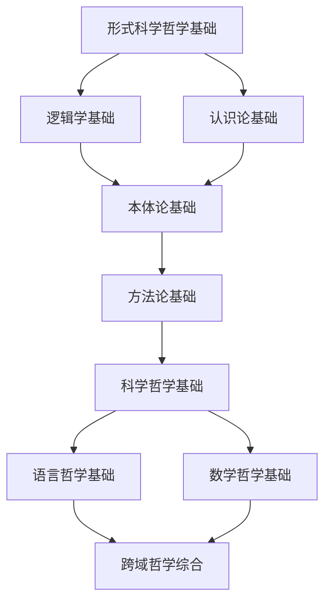

# 哲学基础理论索引 (Philosophical Foundation Index)

## 📋 **目录**

### 1. [形式科学哲学基础](01.1_Formal_Science_Philosophy.md)

### 2. [逻辑学基础](01.2_Logic_Foundation.md)

### 3. [认识论基础](01.3_Epistemology_Foundation.md)

### 4. [本体论基础](01.4_Ontology_Foundation.md)

### 5. [方法论基础](01.5_Methodology_Foundation.md)

### 6. [科学哲学基础](01.6_Philosophy_of_Science.md)

### 7. [语言哲学基础](01.7_Philosophy_of_Language.md)

### 8. [数学哲学基础](01.8_Philosophy_of_Mathematics.md)

---

## 🎯 **哲学基础理论概述**

哲学基础理论为整个形式科学体系提供认识论、本体论和方法论的基础。它建立了形式化思维的基本框架，确保所有后续理论的一致性和合理性。

### 核心问题

1. **认识论问题**：我们如何获得可靠的知识？
2. **本体论问题**：形式对象的本体地位是什么？
3. **方法论问题**：形式化方法的合理性基础是什么？
4. **逻辑问题**：逻辑推理的有效性如何保证？

### 理论层次

```
┌─────────────────────────────────────────────────────────────┐
│                    跨域哲学综合 (1.9)                         │
├─────────────────────────────────────────────────────────────┤
│ 数学哲学 (1.8) │ 语言哲学 (1.7) │ 科学哲学 (1.6) │ 方法论 (1.5) │
├─────────────────────────────────────────────────────────────┤
│ 本体论 (1.4) │ 认识论 (1.3) │ 逻辑学 (1.2) │ 形式科学哲学 (1.1) │
└─────────────────────────────────────────────────────────────┘
```

---

## 🔗 **理论关联图**



---

## 📚 **详细主题结构**

### 1.1 形式科学哲学基础

- **1.1.1** [形式化的本质与意义](01.1_Formal_Science_Philosophy.md#111-形式化的本质与意义)
- **1.1.2** [形式科学与经验科学的关系](01.1_Formal_Science_Philosophy.md#112-形式科学与经验科学的关系)
- **1.1.3** [形式化方法的哲学基础](01.1_Formal_Science_Philosophy.md#113-形式化方法的哲学基础)
- **1.1.4** [形式科学的认识论地位](01.1_Formal_Science_Philosophy.md#114-形式科学的认识论地位)

### 1.2 逻辑学基础

- **1.2.1** [经典逻辑基础](01.2_Logic_Foundation.md#121-经典逻辑基础)
- **1.2.2** [非经典逻辑系统](01.2_Logic_Foundation.md#122-非经典逻辑系统)
- **1.2.3** [逻辑推理的有效性](01.2_Logic_Foundation.md#123-逻辑推理的有效性)
- **1.2.4** [逻辑与语言的关系](01.2_Logic_Foundation.md#124-逻辑与语言的关系)

### 1.3 认识论基础

- **1.3.1** [知识的本质与来源](01.3_Epistemology_Foundation.md#131-知识的本质与来源)
- **1.3.2** [形式知识的特殊性](01.3_Epistemology_Foundation.md#132-形式知识的特殊性)
- **1.3.3** [先验知识与经验知识](01.3_Epistemology_Foundation.md#133-先验知识与经验知识)
- **1.3.4** [知识的确定性基础](01.3_Epistemology_Foundation.md#134-知识的确定性基础)

### 1.4 本体论基础

- **1.4.1** [形式对象的本体地位](01.4_Ontology_Foundation.md#141-形式对象的本体地位)
- **1.4.2** [抽象实体的存在性](01.4_Ontology_Foundation.md#142-抽象实体的存在性)
- **1.4.3** [数学对象的本体论](01.4_Ontology_Foundation.md#143-数学对象的本体论)
- **1.4.4** [逻辑对象的本体论](01.4_Ontology_Foundation.md#144-逻辑对象的本体论)

### 1.5 方法论基础

- **1.5.1** [形式化方法的原则](01.5_Methodology_Foundation.md#151-形式化方法的原则)
- **1.5.2** [公理化方法](01.5_Methodology_Foundation.md#152-公理化方法)
- **1.5.3** [构造性方法](01.5_Methodology_Foundation.md#153-构造性方法)
- **1.5.4** [证明论方法](01.5_Methodology_Foundation.md#154-证明论方法)

### 1.6 科学哲学基础

- **1.6.1** [科学方法的本质](01.6_Philosophy_of_Science.md#161-科学方法的本质)
- **1.6.2** [形式科学与自然科学](01.6_Philosophy_of_Science.md#162-形式科学与自然科学)
- **1.6.3** [科学理论的评价标准](01.6_Philosophy_of_Science.md#163-科学理论的评价标准)
- **1.6.4** [科学进步的模式](01.6_Philosophy_of_Science.md#164-科学进步的模式)

### 1.7 语言哲学基础

- **1.7.1** [语言与思维的关系](01.7_Philosophy_of_Language.md#171-语言与思维的关系)
- **1.7.2** [形式语言的意义理论](01.7_Philosophy_of_Language.md#172-形式语言的意义理论)
- **1.7.3** [语义与语用的区分](01.7_Philosophy_of_Language.md#173-语义与语用的区分)
- **1.7.4** [语言的形式化分析](01.7_Philosophy_of_Language.md#174-语言的形式化分析)

### 1.8 数学哲学基础

- **1.8.1** [数学对象的本质](01.8_Philosophy_of_Mathematics.md#181-数学对象的本质)
- **1.8.2** [数学真理的性质](01.8_Philosophy_of_Mathematics.md#182-数学真理的性质)
- **1.8.3** [数学知识的来源](01.8_Philosophy_of_Mathematics.md#183-数学知识的来源)
- **1.8.4** [数学与逻辑的关系](01.8_Philosophy_of_Mathematics.md#184-数学与逻辑的关系)

---

## 🔄 **与其他理论的关联**

### 向上关联

- **数学基础理论**：[02_Mathematical_Foundation](../02_Mathematical_Foundation/01_Mathematical_Foundation_Index.md)
- **形式语言理论**：[03_Formal_Language_Theory](../03_Formal_Language_Theory/01_Formal_Language_Theory_Index.md)

### 向下关联

- **类型理论**：[04_Type_Theory](../04_Type_Theory/01_Type_Theory_Index.md)
- **控制论理论**：[05_Control_Theory](../05_Control_Theory/01_Control_Theory_Index.md)

---

## 📖 **学习路径建议**

### 基础路径

1. 形式科学哲学基础 → 逻辑学基础 → 认识论基础
2. 本体论基础 → 方法论基础 → 科学哲学基础
3. 语言哲学基础 → 数学哲学基础 → 跨域综合

### 专业路径

- **逻辑学方向**：逻辑学基础 → 非经典逻辑 → 形式语言理论
- **认识论方向**：认识论基础 → 科学哲学 → 方法论基础
- **本体论方向**：本体论基础 → 数学哲学 → 类型理论

---

## 🎯 **核心概念索引**

| 概念 | 定义位置 | 相关理论 |
|------|----------|----------|
| 形式化 | [1.1.1](01.1_Formal_Science_Philosophy.md#111-形式化的本质与意义) | 形式科学哲学 |
| 逻辑有效性 | [1.2.3](01.2_Logic_Foundation.md#123-逻辑推理的有效性) | 逻辑学基础 |
| 先验知识 | [1.3.3](01.3_Epistemology_Foundation.md#133-先验知识与经验知识) | 认识论基础 |
| 抽象实体 | [1.4.2](01.4_Ontology_Foundation.md#142-抽象实体的存在性) | 本体论基础 |
| 公理化方法 | [1.5.2](01.5_Methodology_Foundation.md#152-公理化方法) | 方法论基础 |

---

## 🔄 **持续更新**

**最后更新时间**：2024-12-20
**版本**：v1.0.0
**维护者**：哲学基础理论重构团队

---

## 📋 **待完成任务**

- [ ] 创建所有子主题的详细文档
- [ ] 建立概念间的交叉引用系统
- [ ] 完善形式化证明和论证
- [ ] 构建哲学理论与具体应用的桥梁
