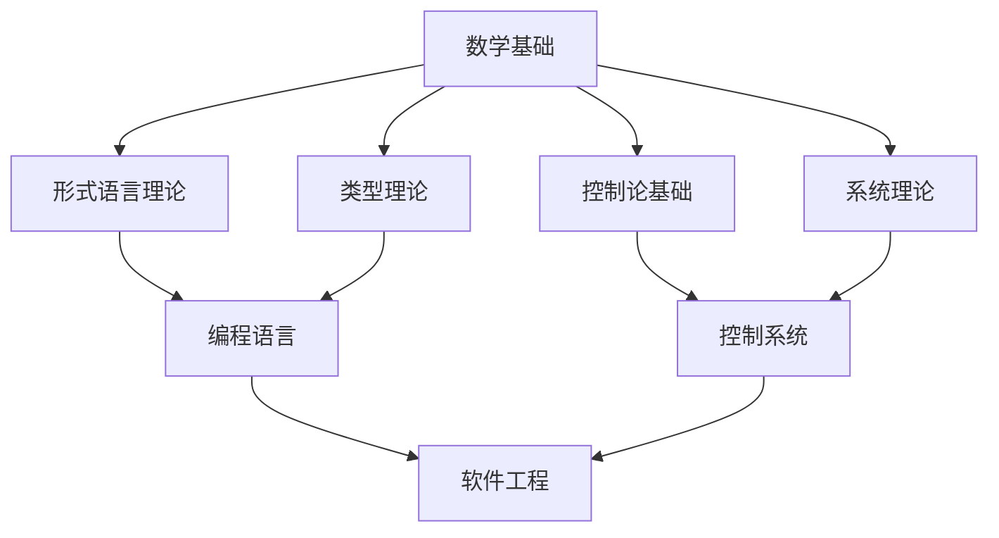

# 基础理论 (Foundational Theory) v7.0

## 1. 概述

基础理论是形式科学体系的核心支柱，为整个知识体系提供理论基础和方法论支撑。本目录包含形式语言理论、类型理论、控制论基础等核心理论，建立了严格的形式化框架。

### 1.1 理论基础

- **数学基础**：基于集合论、逻辑学、范畴论
- **哲学基础**：基于认识论、本体论、方法论
- **系统基础**：基于系统论、信息论、控制论

### 1.2 核心特征

- **形式化严格**：使用严格的数学符号和证明
- **逻辑一致**：理论内部和理论间保持逻辑一致
- **应用导向**：理论直接服务于实际应用
- **可扩展性**：支持理论的扩展和发展

## 2. 目录结构

```
01_Foundational_Theory/
├── README.md                    # 本文件
├── 01_Theory/                   # 理论基础
│   ├── 01_Formal_Language_Theory.md
│   ├── 02_Type_Theory.md
│   ├── 03_Control_Theory.md
│   └── 04_System_Theory.md
├── 02_Formalization/            # 形式化定义
│   ├── 01_Formal_Definitions.md
│   ├── 02_Axiomatic_Systems.md
│   ├── 03_Proof_Systems.md
│   └── 04_Semantic_Frameworks.md
├── 03_Proofs/                   # 证明过程
│   ├── 01_Type_Safety_Proofs.md
│   ├── 02_System_Properties.md
│   ├── 03_Algorithm_Correctness.md
│   └── 04_Formal_Verification.md
├── 04_Applications/             # 应用实例
│   ├── 01_Programming_Languages.md
│   ├── 02_System_Design.md
│   ├── 03_Software_Verification.md
│   └── 04_AI_Systems.md
├── 05_Code_Examples/            # 代码示例
│   ├── 01_Rust_Examples/
│   ├── 02_Haskell_Examples/
│   └── 03_Formal_Proofs/
└── 06_References/               # 参考文献
    ├── 01_Classical_Papers.md
    ├── 02_Modern_Developments.md
    └── 03_Textbooks.md
```

## 3. 核心理论

### 3.1 形式语言理论 (Formal Language Theory)

**定义**：研究形式语言的数学理论，包括语法、语义、计算模型等。

**核心概念**：

- **自动机理论**：有限状态机、下推自动机、图灵机
- **语法理论**：上下文无关文法、正则文法、无限制文法
- **语义理论**：指称语义、操作语义、公理语义

**形式化定义**：

```haskell
-- 形式语言定义
data Language = Language {
    alphabet :: Set Symbol,
    grammar :: Grammar,
    semantics :: SemanticFunction
}

-- 自动机定义
data Automaton = Automaton {
    states :: Set State,
    alphabet :: Set Symbol,
    transitions :: Set Transition,
    startState :: State,
    acceptStates :: Set State
}
```

**快速链接**：

- [理论基础](../01_Theory/01_Formal_Language_Theory.md)
- [形式化定义](../02_Formalization/01_Formal_Definitions.md)
- [应用实例](../04_Applications/01_Programming_Languages.md)

### 3.2 类型理论 (Type Theory)

**定义**：研究类型系统的数学理论，为编程语言提供类型安全保证。

**核心概念**：

- **类型系统**：类型检查、类型推断、类型安全
- **类型构造**：函数类型、积类型、和类型、递归类型
- **类型语义**：类型解释、类型等价、类型子类型

**形式化定义**：

```haskell
-- 类型系统定义
data Type = 
    TUnit
  | TBool
  | TInt
  | TFloat
  | TArrow Type Type
  | TProduct Type Type
  | TSum Type Type
  | TRec String Type

-- 类型判断
type TypeJudgment = (Context, Expression, Type)
type Context = Map Variable Type
```

**快速链接**：

- [理论基础](../01_Theory/02_Type_Theory.md)
- [类型安全证明](../03_Proofs/01_Type_Safety_Proofs.md)
- [代码示例](../05_Code_Examples/02_Haskell_Examples/)

### 3.3 控制论基础 (Control Theory)

**定义**：研究动态系统控制和调节的数学理论。

**核心概念**：

- **动态系统**：状态空间、输入输出、系统响应
- **稳定性**：李雅普诺夫稳定性、渐近稳定性
- **控制设计**：反馈控制、最优控制、鲁棒控制

**形式化定义**：

```haskell
-- 动态系统定义
data DynamicSystem = DynamicSystem {
    stateSpace :: VectorSpace,
    inputSpace :: VectorSpace,
    outputSpace :: VectorSpace,
    stateEquation :: StateEquation,
    outputEquation :: OutputEquation
}

-- 状态方程
type StateEquation = State -> Input -> Time -> State
type OutputEquation = State -> Output
```

**快速链接**：

- [理论基础](../01_Theory/03_Control_Theory.md)
- [系统性质证明](../03_Proofs/02_System_Properties.md)
- [应用实例](../04_Applications/02_System_Design.md)

### 3.4 系统理论 (System Theory)

**定义**：研究复杂系统结构和行为的统一理论。

**核心概念**：

- **系统结构**：组件、连接、层次、组织
- **系统行为**：动态、稳态、响应、稳定性
- **系统控制**：反馈、调节、优化、适应

**形式化定义**：

```haskell
-- 系统定义
data System = System {
    components :: Set Component,
    connections :: Set Connection,
    behavior :: BehaviorFunction,
    constraints :: Set Constraint
}

-- 系统行为
type BehaviorFunction = State -> Input -> Time -> State
```

**快速链接**：

- [理论基础](../01_Theory/04_System_Theory.md)
- [算法正确性证明](../03_Proofs/03_Algorithm_Correctness.md)
- [应用实例](../04_Applications/03_Software_Verification.md)

## 4. 理论关联

### 4.1 理论层次结构



### 4.2 概念关联表

| 核心概念 | 形式语言理论 | 类型理论 | 控制论基础 | 系统理论 |
|----------|--------------|----------|------------|----------|
| 状态 | 自动机状态 | 类型状态 | 系统状态 | 系统状态 |
| 转换 | 状态转换 | 类型转换 | 状态转移 | 系统演化 |
| 约束 | 语法约束 | 类型约束 | 控制约束 | 系统约束 |
| 验证 | 语言验证 | 类型检查 | 稳定性验证 | 系统验证 |

## 5. 学习路径

### 5.1 基础路径

**目标**：理解核心概念和基本理论
**学习顺序**：

1. [形式语言理论基础](../01_Theory/01_Formal_Language_Theory.md)
2. [类型理论基础](../01_Theory/02_Type_Theory.md)
3. [控制论基础](../01_Theory/03_Control_Theory.md)
4. [系统理论基础](../01_Theory/04_System_Theory.md)

### 5.2 深入路径

**目标**：掌握形式化方法和证明技术
**学习顺序**：

1. [形式化定义](../02_Formalization/01_Formal_Definitions.md)
2. [公理系统](../02_Formalization/02_Axiomatic_Systems.md)
3. [证明系统](../02_Formalization/03_Proof_Systems.md)
4. [语义框架](../02_Formalization/04_Semantic_Frameworks.md)

### 5.3 应用路径

**目标**：掌握实际应用和实现技术
**学习顺序**：

1. [编程语言应用](../04_Applications/01_Programming_Languages.md)
2. [系统设计应用](../04_Applications/02_System_Design.md)
3. [软件验证应用](../04_Applications/03_Software_Verification.md)
4. [AI系统应用](../04_Applications/04_AI_Systems.md)

## 6. 质量保证

### 6.1 理论一致性

- **内部一致性**：每个理论内部逻辑一致
- **外部一致性**：不同理论间概念一致
- **层次一致性**：理论层次结构合理

### 6.2 形式化标准

- **符号规范**：使用标准数学符号
- **证明完整**：所有定理有完整证明
- **定义精确**：所有概念有精确定义

### 6.3 应用验证

- **实例丰富**：提供充分的应用实例
- **代码正确**：所有代码示例正确可运行
- **效果验证**：理论应用效果可验证

## 7. 发展前景

### 7.1 理论发展

- **新理论**：发展新的基础理论
- **理论整合**：整合不同理论
- **理论扩展**：扩展现有理论

### 7.2 应用扩展

- **新应用**：发现新的应用领域
- **应用优化**：优化现有应用
- **应用创新**：创新应用方法

### 7.3 教育发展

- **教材建设**：建设高质量教材
- **课程开发**：开发相关课程
- **人才培养**：培养理论人才

---

**版本**：v7.0  
**更新时间**：2024-12-19  
**维护者**：基础理论研究团队  
**状态**：持续更新中
