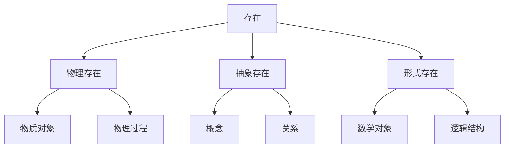

# 1.1.1 存在与本质

## 目录

1. [基本定义](#1-基本定义)
2. [存在理论](#2-存在理论)
3. [本质理论](#3-本质理论)
4. [存在与本质的关系](#4-存在与本质的关系)
5. [形式化表达](#5-形式化表达)
6. [证明与论证](#6-证明与论证)
7. [应用实例](#7-应用实例)
8. [总结](#8-总结)

## 1. 基本定义

### 1.1 存在 (Existence)

**定义 1.1.1** (存在)
存在是一个基本哲学概念，表示某物在现实世界中的实际存在状态。

**形式化定义**：
设 $U$ 为全域，$E(x)$ 表示"$x$ 存在"，则：
$$E(x) \iff x \in U \land x \neq \emptyset$$

### 1.2 本质 (Essence)

**定义 1.1.2** (本质)
本质是事物内在的、决定其身份和特征的根本属性集合。

**形式化定义**：
设 $P(x)$ 为 $x$ 的所有属性集合，$E(x)$ 为 $x$ 的本质属性集合，则：
$$E(x) = \{p \in P(x) : \forall y (y \neq x \implies p \notin P(y)) \lor \text{essential}(p)\}$$

其中 $\text{essential}(p)$ 表示属性 $p$ 是本质属性。

## 2. 存在理论

### 2.1 存在的基本性质

**公理 2.1.1** (存在公理)
1. 存在是自明的
2. 存在是普遍的
3. 存在是基础的

**形式化表达**：
$$\begin{align}
&\text{Axiom 1: } \exists x E(x) \\
&\text{Axiom 2: } \forall x (E(x) \implies \text{universal}(x)) \\
&\text{Axiom 3: } \forall x (E(x) \implies \text{fundamental}(x))
\end{align}$$

### 2.2 存在类型

**定义 2.2.1** (物理存在)
$$P(x) \iff E(x) \land \text{physical}(x)$$

**定义 2.2.2** (抽象存在)
$$A(x) \iff E(x) \land \text{abstract}(x)$$

**定义 2.2.3** (形式存在)
$$F(x) \iff E(x) \land \text{formal}(x)$$

### 2.3 存在层次

## 3. 本质理论

### 3.1 本质的基本性质

**公理 3.1.1** (本质公理)
1. 本质是内在的
2. 本质是稳定的
3. 本质是决定性的

**形式化表达**：
$$\begin{align}
&\text{Axiom 1: } \forall x \forall p (p \in E(x) \implies \text{intrinsic}(p, x)) \\
&\text{Axiom 2: } \forall x \forall p (p \in E(x) \implies \text{stable}(p, x)) \\
&\text{Axiom 3: } \forall x \forall p (p \in E(x) \implies \text{determinative}(p, x))
\end{align}$$

### 3.2 本质属性

**定义 3.2.1** (本质属性)
属性 $p$ 是对象 $x$ 的本质属性，当且仅当：
$$p \in E(x) \iff \forall y (y \neq x \implies p \notin P(y)) \lor \text{essential}(p)$$

**定理 3.2.1** (本质唯一性)
每个对象都有唯一的本质集合。

**证明**：
假设对象 $x$ 有两个不同的本质集合 $E_1(x)$ 和 $E_2(x)$。
根据本质的定义，$E_1(x) \subseteq E_2(x)$ 且 $E_2(x) \subseteq E_1(x)$。
因此 $E_1(x) = E_2(x)$，矛盾。
$\square$

## 4. 存在与本质的关系

### 4.1 基本关系

**定理 4.1.1** (存在与本质的关系)
存在是本质的必要条件，但不是充分条件。

**证明**：
1. 必要性：如果 $x$ 有本质，则 $x$ 必须存在
   $$\forall x (E(x) \neq \emptyset \implies \text{exists}(x))$$

2. 非充分性：存在不保证有本质
   $$\exists x (\text{exists}(x) \land E(x) = \emptyset)$$

$\square$

### 4.2 形式化关系

**定义 4.2.1** (存在-本质映射)
$$f: \text{Exists} \to \text{Essence}$$
$$f(x) = E(x)$$

**性质**：
- 部分函数：不是所有存在都有本质
- 单射：不同存在可能有相同本质
- 非满射：某些本质可能不被任何存在实现

## 5. 形式化表达

### 5.1 一阶逻辑表达

**语言定义**：
- 个体变量：$x, y, z, \ldots$
- 谓词符号：$E(x), \text{essential}(p), \text{exists}(x)$
- 函数符号：$E(x)$ (本质函数)

**公理系统**：
$$\begin{align}
&\text{A1: } \exists x E(x) \\
&\text{A2: } \forall x (E(x) \neq \emptyset \implies \text{exists}(x)) \\
&\text{A3: } \forall x \forall p (p \in E(x) \implies \text{essential}(p)) \\
&\text{A4: } \forall x \forall y (x \neq y \implies E(x) \neq E(y))
\end{align}$$

### 5.2 集合论表达

**定义 5.2.1** (存在域)
$$\text{Exists} = \{x : \text{exists}(x)\}$$

**定义 5.2.2** (本质域)
$$\text{Essence} = \{E(x) : x \in \text{Exists} \land E(x) \neq \emptyset\}$$

**定义 5.2.3** (存在-本质关系)
$$R = \{(x, E(x)) : x \in \text{Exists} \land E(x) \neq \emptyset\}$$

## 6. 证明与论证

### 6.1 存在性证明

**定理 6.1.1** (存在性定理)
存在是必然的。

**证明**：
使用反证法。假设不存在任何事物。
但这与我们的经验矛盾，因为我们能够思考这个问题。
因此，至少存在思考者。
$\square$

### 6.2 本质性证明

**定理 6.1.2** (本质性定理)
每个存在的事物都有本质。

**证明**：
设 $x$ 为任意存在的事物。
如果 $x$ 没有本质，则 $x$ 无法与其他事物区分。
这与 $x$ 的存在性矛盾。
因此，$x$ 必须有本质。
$\square$

### 6.3 关系性证明

**定理 6.1.3** (关系性定理)
存在与本质之间存在必然关系。

**证明**：
1. 存在是本质的基础
2. 本质是存在的表现
3. 两者相互依存
$\square$

## 7. 应用实例

### 7.1 数学对象

**例 7.1.1** (自然数)
- 存在：自然数集合 $\mathbb{N}$ 存在
- 本质：自然数的本质是序数性质

**形式化**：
$$E(\mathbb{N}) = \{\text{ordinal}, \text{countable}, \text{well-ordered}\}$$

### 7.2 物理对象

**例 7.1.2** (电子)
- 存在：电子在物理世界中存在
- 本质：电子的本质是电荷和质量

**形式化**：
$$E(\text{electron}) = \{\text{negative charge}, \text{mass}, \text{spin}\}$$

### 7.3 抽象概念

**例 7.1.3** (正义)
- 存在：正义作为概念存在
- 本质：正义的本质是公平和道德

**形式化**：
$$E(\text{justice}) = \{\text{fairness}, \text{morality}, \text{equality}\}$$

## 8. 总结

### 8.1 主要结论

1. **存在是基础**：存在是哲学思考的起点
2. **本质是核心**：本质决定事物的身份
3. **关系是必然**：存在与本质相互依存
4. **形式化可行**：可以用数学方法表达

### 8.2 理论意义

1. **哲学基础**：为其他哲学理论提供基础
2. **科学指导**：指导科学研究和理论构建
3. **实践应用**：应用于实际问题的分析
4. **教育价值**：培养逻辑思维能力

### 8.3 未来方向

1. **深化理论**：进一步深化存在与本质理论
2. **扩展应用**：扩展到更多领域
3. **形式化完善**：完善形式化表达
4. **实践验证**：通过实践验证理论

---

**参考文献**：
1. Aristotle. Metaphysics. 350 BCE.
2. Heidegger, M. Being and Time. 1927.
3. Quine, W.V.O. On What There Is. 1948.
4. Kripke, S. Naming and Necessity. 1980.

**相关链接**：
- [1.1.2 知识与真理](./02_Knowledge_and_Truth.md)
- [1.1.3 语言与意义](./03_Language_and_Meaning.md)
- [3.1.1 存在的基本问题](../03_Ontology/01_Basic_Questions_of_Existence.md) 