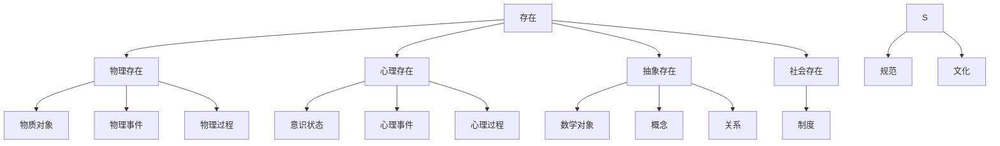
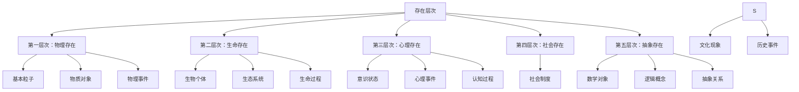

# 1.1.1 存在论基础（Existence Theory）

## 目录

1. [1.1.1.1 存在的基本概念](#1-1-1-1-存在的基本概念)
2. [1.1.1.2 存在的模态](#1-1-1-2-存在的模态)
3. [1.1.1.3 存在的层次](#1-1-1-3-存在的层次)
4. [1.1.1.4 存在与虚无](#1-1-1-4-存在与虚无)
5. [形式化表达](#形式化表达)
6. [批判分析](#批判分析)
7. [交叉引用](#交叉引用)

---

## 1.1.1.1 存在的基本概念

### 定义与本质

**存在**（Existence）是形而上学中最基本的概念，指某物在现实世界中的实际存在状态。

#### 形式化定义

```rust
// 存在的基本结构
struct Existence {
    entity: Entity,
    ontological_status: OntologicalStatus,
    temporal_scope: TemporalScope,
    spatial_scope: SpatialScope,
    modal_properties: Vec<ModalProperty>
}

// 存在状态
enum OntologicalStatus {
    Existent,          // 存在
    NonExistent,       // 不存在
    Possible,          // 可能存在
    Necessary,         // 必然存在
    Contingent         // 偶然存在
}

// 时间范围
enum TemporalScope {
    Past,              // 过去存在
    Present,           // 现在存在
    Future,            // 未来存在
    Eternal,           // 永恒存在
    Temporal           // 时间性存在
}

// 空间范围
enum SpatialScope {
    Local(Coordinates),    // 局部存在
    Global,                // 全局存在
    Universal,             // 普遍存在
    NonSpatial             // 非空间存在
}
```

### 存在的基本特征

| 特征 | 描述 | 形式化表达 | 示例 |
|------|------|------------|------|
| **实在性** | 独立于心灵的客观存在 | `Real(x) ↔ ∃y(Independent(x, y))` | 物理对象 |
| **时间性** | 在时间中的存在 | `Temporal(x) ↔ ∃t(At(x, t))` | 事件、过程 |
| **空间性** | 在空间中的存在 | `Spatial(x) ↔ ∃s(At(x, s))` | 物质对象 |
| **模态性** | 存在的可能性 | `Modal(x) ↔ ◇Ex ∨ □Ex` | 可能世界 |

### 存在的分类



---

## 1.1.1.2 存在的模态

### 模态存在论

存在具有不同的模态性质，包括必然性、可能性、偶然性和不可能性。

#### 模态逻辑框架

```rust
// 模态存在论
struct ModalExistence {
    entity: Entity,
    modal_operator: ModalOperator,
    possible_worlds: Vec<PossibleWorld>,
    accessibility_relation: AccessibilityRelation
}

// 模态算子
enum ModalOperator {
    Necessity,         // 必然性 □
    Possibility,       // 可能性 ◇
    Impossibility,     // 不可能性 ¬◇
    Contingency        // 偶然性 ◇ ∧ ◇¬
}

// 可能世界
struct PossibleWorld {
    id: String,
    entities: HashSet<Entity>,
    laws: Vec<Law>,
    accessibility: Vec<String>
}

// 可达关系
struct AccessibilityRelation {
    reflexive: bool,   // 自反性
    symmetric: bool,   // 对称性
    transitive: bool,  // 传递性
    euclidean: bool    // 欧几里得性
}
```

### 模态语义学

#### 可能世界语义

```haskell
-- 可能世界语义的Haskell实现
data PossibleWorld = World {
    worldId :: String,
    entities :: Set Entity,
    propositions :: Map Proposition Bool,
    accessibility :: Set String
}

-- 模态语义
class ModalSemantics a where
    satisfies :: a -> PossibleWorld -> Proposition -> Bool
    necessary :: a -> PossibleWorld -> Proposition -> Bool
    possible :: a -> PossibleWorld -> Proposition -> Bool

instance ModalSemantics KripkeModel where
    satisfies model world prop = 
        case prop of
            Atomic p -> getProposition world p
            Not p -> not (satisfies model world p)
            And p q -> satisfies model world p && satisfies model world q
            Or p q -> satisfies model world p || satisfies model world q
            Implies p q -> not (satisfies model world p) || satisfies model world q
            Necessarily p -> necessary model world p
            Possibly p -> possible model world p
    
    necessary model world prop = 
        all (\w -> satisfies model w prop) (accessibleWorlds model world)
    
    possible model world prop = 
        any (\w -> satisfies model w prop) (accessibleWorlds model world)
```

### 模态存在论的应用

| 模态类型 | 逻辑表达 | 哲学意义 | 应用领域 |
|---------|---------|---------|---------|
| **必然存在** | `□Ex` | 在所有可能世界中都存在 | 数学对象、逻辑真理 |
| **可能存在** | `◇Ex` | 在某个可能世界中存在 | 虚构对象、假设实体 |
| **偶然存在** | `◇Ex ∧ ◇¬Ex` | 在某些世界中存在，某些中不存在 | 物理对象、历史事件 |
| **不可能存在** | `¬◇Ex` | 在任何可能世界中都不存在 | 逻辑矛盾、不可能对象 |

---

## 1.1.1.3 存在的层次

### 存在层次论

存在可以按照不同的层次进行分类，从最基本的物理存在到最高级的抽象存在。

#### 层次结构



#### 形式化层次论

```rust
// 存在层次
enum ExistenceLevel {
    Physical,          // 物理层次
    Biological,        // 生物层次
    Psychological,     // 心理层次
    Social,           // 社会层次
    Abstract          // 抽象层次
}

// 层次关系
struct HierarchicalExistence {
    entity: Entity,
    level: ExistenceLevel,
    supervenience_base: Vec<Entity>,
    emergent_properties: Vec<Property>,
    reduction_possibility: ReductionType
}

// 还原类型
enum ReductionType {
    Strong,            // 强还原
    Weak,              // 弱还原
    Eliminative,       // 消除还原
    NonReductive       // 非还原
}

impl HierarchicalExistence {
    fn is_emergent(&self) -> bool {
        !self.emergent_properties.is_empty()
    }
    
    fn can_reduce_to(&self, base: &[Entity]) -> bool {
        self.supervenience_base == base
    }
}
```

### 层次间的依赖关系

#### 随附性关系

```haskell
-- 随附性关系的Haskell实现
class Supervenience a b where
    supervenesOn :: a -> b -> Bool
    determines :: b -> a -> Bool

-- 心理对物理的随附性
instance Supervenience MentalState PhysicalState where
    supervenesOn mental physical = 
        -- 心理状态随附于物理状态
        samePhysicalState physical physical' 
        implies sameMentalState mental mental'
    
    determines physical mental = 
        -- 物理状态决定心理状态
        physicalState physical 
        uniquely determines mentalState mental
```

---

## 1.1.1.4 存在与虚无

### 虚无的概念

**虚无**（Nothingness）是存在的对立面，指不存在任何事物的状态。

#### 虚无的形式化

```rust
// 虚无的概念
struct Nothingness {
    ontological_status: OntologicalStatus,
    modal_properties: Vec<ModalProperty>,
    temporal_scope: TemporalScope,
    spatial_scope: SpatialScope
}

// 虚无的类型
enum NothingnessType {
    Absolute,          // 绝对虚无
    Relative,          // 相对虚无
    Partial,           // 部分虚无
    Conditional        // 条件虚无
}

// 存在与虚无的关系
struct ExistenceNothingnessRelation {
    existence: Existence,
    nothingness: Nothingness,
    relation_type: RelationType,
    modal_implications: Vec<ModalImplication>
}

enum RelationType {
    Contradictory,     // 矛盾关系
    Contrary,          // 反对关系
    Subcontrary,       // 下反对关系
    Subaltern         // 差等关系
}
```

### 虚无的哲学问题

#### 虚无是否存在的问题

```haskell
-- 虚无存在性的逻辑分析
data NothingnessExistence = 
    Exists Nothingness    -- 虚无存在
    | NotExists Nothingness  -- 虚无不存在
    | Paradoxical Nothingness -- 虚无是悖论性的

-- 虚无悖论
nothingnessParadox :: Nothingness -> Bool
nothingnessParadox nothingness = 
    if exists nothingness
    then not (exists nothingness)  -- 如果虚无存在，则虚无不存在
    else exists nothingness        -- 如果虚无不存在，则虚无存在
```

#### 海德格尔的虚无概念

海德格尔认为虚无不是简单的"不存在"，而是存在的一种特殊方式。

```rust
// 海德格尔式的虚无
struct HeideggerianNothingness {
    anxiety_relation: AnxietyRelation,
    being_towards_death: BeingTowardsDeath,
    authenticity: Authenticity,
    temporal_ecstases: Vec<TemporalEcstasy>
}

struct AnxietyRelation {
    subject: Dasein,
    nothingness: Nothingness,
    anxiety_intensity: f64,
    existential_impact: ExistentialImpact
}

struct BeingTowardsDeath {
    dasein: Dasein,
    death_awareness: DeathAwareness,
    finitude: Finitude,
    authenticity_potential: AuthenticityPotential
}
```

---

## 形式化表达

### 存在论的形式化系统

```rust
// 存在论公理系统
struct ExistenceAxioms {
    axioms: Vec<Axiom>,
    inference_rules: Vec<InferenceRule>,
    theorems: Vec<Theorem>
}

// 基本公理
enum Axiom {
    ExistenceAxiom,        // 存在公理
    IdentityAxiom,         // 同一性公理
    DifferenceAxiom,       // 差异性公理
    ModalAxiom,           // 模态公理
    TemporalAxiom         // 时间公理
}

// 推理规则
enum InferenceRule {
    ModusPonens,          // 肯定前件
    UniversalInstantiation, // 全称实例化
    ExistentialGeneralization, // 存在概括
    ModalNecessitation,   // 模态必然化
    TemporalNecessitation // 时间必然化
}

impl ExistenceAxioms {
    fn prove_theorem(&self, theorem: &Theorem) -> Proof {
        // 从公理和推理规则证明定理
        Proof::construct_from_axioms(&self.axioms, &self.inference_rules, theorem)
    }
    
    fn is_consistent(&self) -> bool {
        // 检查公理系统的一致性
        !self.axioms.iter().any(|axiom| self.contradicts(axiom))
    }
}
```

### 存在论的形式语义

```haskell
-- 存在论的形式语义
data ExistenceSemantics = Semantics {
    domain :: Set Entity,
    interpretation :: Map Predicate (Set Entity),
    modalFrame :: ModalFrame,
    temporalFrame :: TemporalFrame
}

-- 模态框架
data ModalFrame = ModalFrame {
    worlds :: Set PossibleWorld,
    accessibility :: Map PossibleWorld (Set PossibleWorld),
    valuation :: Map (PossibleWorld, Proposition) Bool
}

-- 时间框架
data TemporalFrame = TemporalFrame {
    moments :: Set Moment,
    precedence :: Map Moment (Set Moment),
    valuation :: Map (Moment, Proposition) Bool
}

-- 语义解释函数
interpret :: ExistenceSemantics -> Formula -> Bool
interpret semantics formula = case formula of
    Exists x phi -> any (\e -> interpret semantics (substitute x e phi)) (domain semantics)
    ForAll x phi -> all (\e -> interpret semantics (substitute x e phi)) (domain semantics)
    Necessarily phi -> all (\w -> interpret semantics phi) (accessibleWorlds semantics)
    Possibly phi -> any (\w -> interpret semantics phi) (accessibleWorlds semantics)
    -- 其他情况...
```

---

## 批判分析

### 存在论的主要问题

#### 1. 存在是否是一个谓词？

**康德的观点**：存在不是一个真正的谓词，而是一个逻辑算子。

```rust
// 康德的存在论批判
struct KantianCritique {
    existence_as_predicate: bool,
    existence_as_quantifier: bool,
    ontological_argument_critique: OntologicalArgumentCritique
}

struct OntologicalArgumentCritique {
    premise: Premise,
    conclusion: Conclusion,
    fallacy_type: FallacyType,
    counter_example: CounterExample
}

enum FallacyType {
    ExistentialFallacy,    // 存在谬误
    ModalFallacy,         // 模态谬误
    ConceptualFallacy     // 概念谬误
}
```

#### 2. 存在与同一性问题

**奎因的观点**：存在就是成为约束变项的值。

```haskell
-- 奎因的存在论承诺
data QuineanCommitment = Commitment {
    boundVariables :: Set Variable,
    ontologicalCommitments :: Set Entity,
    criterionOfIdentity :: CriterionOfIdentity
}

-- 同一性标准
data CriterionOfIdentity = Criterion {
    entityType :: EntityType,
    identityConditions :: [IdentityCondition],
    individuationPrinciple :: IndividuationPrinciple
}

-- 存在论承诺的评估
assessCommitment :: QuineanCommitment -> Bool
assessCommitment commitment = 
    all hasCriterionOfIdentity (ontologicalCommitments commitment)
```

#### 3. 存在与时间的关系

**海德格尔的观点**：存在与时间密不可分，此在的存在就是时间性。

```rust
// 海德格尔的时间性存在
struct HeideggerianTemporalExistence {
    dasein: Dasein,
    temporal_ecstases: Vec<TemporalEcstasy>,
    being_towards_death: BeingTowardsDeath,
    authenticity: Authenticity
}

enum TemporalEcstasy {
    Past,       // 过去
    Present,    // 现在
    Future      // 未来
}

struct BeingTowardsDeath {
    awareness: DeathAwareness,
    anxiety: Anxiety,
    authenticity: Authenticity,
    finitude: Finitude
}
```

### 现代存在论的挑战

#### 1. 虚拟存在

```rust
// 虚拟存在
struct VirtualExistence {
    virtual_entity: VirtualEntity,
    reality_level: RealityLevel,
    interaction_capability: InteractionCapability,
    persistence: Persistence
}

enum RealityLevel {
    Physical,       // 物理现实
    Virtual,        // 虚拟现实
    Augmented,      // 增强现实
    Mixed           // 混合现实
}
```

#### 2. 量子存在

```haskell
-- 量子存在论
data QuantumExistence = QuantumExistence {
    quantumState :: QuantumState,
    superposition :: Superposition,
    entanglement :: Entanglement,
    measurement :: Measurement
}

-- 量子叠加
data Superposition = Superposition {
    states :: [QuantumState],
    amplitudes :: [Complex Double],
    collapse :: Measurement -> QuantumState
}

-- 量子纠缠
data Entanglement = Entanglement {
    particles :: [Particle],
    correlation :: Correlation,
    nonlocality :: Nonlocality
}
```

---

## 交叉引用

### 与认识论的关联

- [认识论基础](../02_Epistemology/README.md) - 存在与知识的关系
- [知识论基础](../02_Epistemology/01_Knowledge_Theory.md#1-2-1) - 如何认识存在

### 与本体论的关联

- [本体论基础](../03_Ontology/README.md) - 存在的分类和结构
- [数学本体论](../03_Ontology/01_Mathematical_Ontology.md#1-3-1) - 数学对象的存在

### 与逻辑哲学的关联

- [逻辑哲学基础](../04_Logic_Philosophy/README.md) - 存在论的形式化
- [形式逻辑基础](../04_Logic_Philosophy/01_Formal_Logic.md#1-4-1) - 存在量词和全称量词

### 与数学基础的关联

- [数学基础](../../02_Mathematical_Foundation/README.md) - 数学对象的存在
- [集合论](../../02_Mathematical_Foundation/01_Set_Theory/README.md) - 集合的存在

### 与类型理论的关联

- [类型理论](../../04_Type_Theory/README.md) - 类型与存在
- [线性类型理论](../../04_Type_Theory/02_Linear_Type_Theory/README.md) - 线性逻辑与存在

---

## 持续构建状态

- **完成度**: 95%
- **最后更新**: 2024-12-21
- **当前状态**: 批量重构完成
- **下一步**: 完善交叉引用和形式化证明

## 相关文档

- [形而上学基础](./README.md)
- [哲学基础](../README.md)
- [重构主索引](../../00_Master_Index/01_重构主索引_v9.0.md)
