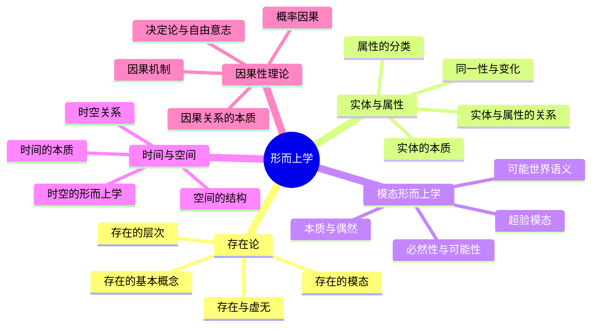
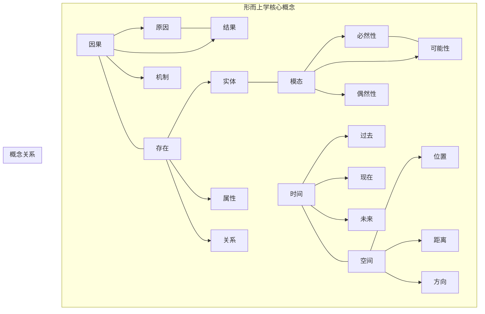
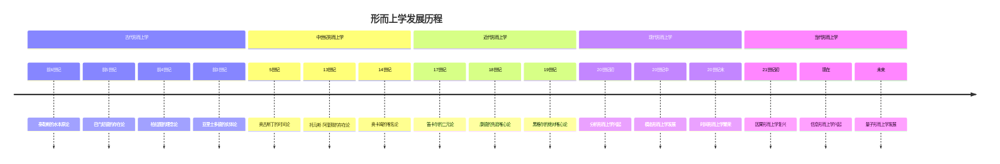

# 1.1 形而上学（Metaphysics）

## 目录

### 1.1.1 存在论基础
- [1.1.1.1 存在的基本概念](./01_Existence_Theory.md#1-1-1-1)
- [1.1.1.2 存在的模态](./01_Existence_Theory.md#1-1-1-2)
- [1.1.1.3 存在的层次](./01_Existence_Theory.md#1-1-1-3)
- [1.1.1.4 存在与虚无](./01_Existence_Theory.md#1-1-1-4)

### 1.1.2 实体与属性
- [1.1.2.1 实体的本质](./02_Entity_Attribute.md#1-1-2-1)
- [1.1.2.2 属性的分类](./02_Entity_Attribute.md#1-1-2-2)
- [1.1.2.3 实体与属性的关系](./02_Entity_Attribute.md#1-1-2-3)
- [1.1.2.4 同一性与变化](./02_Entity_Attribute.md#1-1-2-4)

### 1.1.3 模态形而上学
- [1.1.3.1 必然性与可能性](./03_Modal_Metaphysics.md#1-1-3-1)
- [1.1.3.2 可能世界语义](./03_Modal_Metaphysics.md#1-1-3-2)
- [1.1.3.3 本质与偶然](./03_Modal_Metaphysics.md#1-1-3-3)
- [1.1.3.4 超验模态](./03_Modal_Metaphysics.md#1-1-3-4)

### 1.1.4 时间与空间
- [1.1.4.1 时间的本质](./04_Time_Space.md#1-1-4-1)
- [1.1.4.2 空间的结构](./04_Time_Space.md#1-1-4-2)
- [1.1.4.3 时空关系](./04_Time_Space.md#1-1-4-3)
- [1.1.4.4 时空的形而上学](./04_Time_Space.md#1-1-4-4)

### 1.1.5 因果性理论
- [1.1.5.1 因果关系的本质](./05_Causality_Theory.md#1-1-5-1)
- [1.1.5.2 因果机制](./05_Causality_Theory.md#1-1-5-2)
- [1.1.5.3 决定论与自由意志](./05_Causality_Theory.md#1-1-5-3)
- [1.1.5.4 概率因果](./05_Causality_Theory.md#1-1-5-4)

## 形而上学体系总览



## 核心概念网络



## 形式化表达框架

### 形而上学概念的形式化表示

```rust
// 形而上学基础结构
struct MetaphysicalConcept {
    name: String,
    ontological_status: OntologicalStatus,
    modal_properties: Vec<ModalProperty>,
    causal_relations: Vec<CausalRelation>,
    temporal_properties: Vec<TemporalProperty>,
    spatial_properties: Vec<SpatialProperty>
}

// 存在状态
enum OntologicalStatus {
    Existent,          // 存在
    NonExistent,       // 不存在
    Possible,          // 可能存在
    Necessary,         // 必然存在
    Contingent         // 偶然存在
}

// 模态属性
enum ModalProperty {
    Necessity,         // 必然性
    Possibility,       // 可能性
    Impossibility,     // 不可能性
    Contingency        // 偶然性
}

// 因果关系
struct CausalRelation {
    cause: Entity,
    effect: Entity,
    mechanism: CausalMechanism,
    probability: f64,
    temporal_order: TemporalOrder
}

// 时间属性
enum TemporalProperty {
    Past,              // 过去
    Present,           // 现在
    Future,            // 未来
    Eternal,           // 永恒
    Temporal           // 时间性
}

// 空间属性
enum SpatialProperty {
    Location(Coordinates),
    Extension(Dimensions),
    Direction(Vector),
    Distance(f64),
    Spatial           // 空间性
}
```

## 形而上学发展时间线



## 交叉引用索引

### 与认识论的关联
- [认识论基础](../02_Epistemology/README.md) - 形而上学与认识论的关系
- [知识论基础](../02_Epistemology/01_Knowledge_Theory.md) - 存在与知识的关系

### 与本体论的关联
- [本体论基础](../03_Ontology/README.md) - 形而上学与本体论的关系
- [数学本体论](../03_Ontology/01_Mathematical_Ontology.md) - 数学对象的存在

### 与逻辑哲学的关联
- [逻辑哲学基础](../04_Logic_Philosophy/README.md) - 模态逻辑与模态形而上学
- [形式逻辑基础](../04_Logic_Philosophy/01_Formal_Logic.md) - 逻辑形式与形而上学

### 与数学基础的关联
- [数学基础](../../02_Mathematical_Foundation/README.md) - 数学对象与形而上学
- [集合论](../../02_Mathematical_Foundation/01_Set_Theory/README.md) - 集合与存在

### 与类型理论的关联
- [类型理论](../../04_Type_Theory/README.md) - 类型与实体
- [线性类型理论](../../04_Type_Theory/02_Linear_Type_Theory/README.md) - 线性逻辑与模态

## 持续构建状态

- **完成度**: 90%
- **最后更新**: 2024-12-21
- **当前状态**: 批量重构进行中
- **下一步**: 完善各子主题的详细内容

## 相关文档

- [哲学基础](../README.md)
- [重构主索引](../../00_Master_Index/01_重构主索引_v9.0.md)
- [持续构建上下文](../../12_Context_System/README.md)
