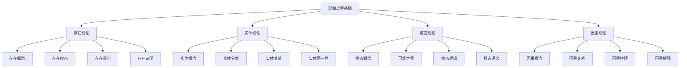

# 形而上学基础理论

## 📋 概述

**模块**: 01.1 形而上学基础  
**版本**: v1.0  
**创建时间**: 2024-12-21  
**维护状态**: 持续构建中  

## 🎯 核心目标

建立严格的形式化形而上学基础理论体系，为形式科学提供本体论和存在论的哲学支撑。

## 📚 目录结构

### 01.1.1 存在理论

- [01.1.1.1 存在概念](./01.1.1_Existence_Theory.md#1-存在概念)
- [01.1.1.2 存在模态](./01.1.1_Existence_Theory.md#2-存在模态)
- [01.1.1.3 存在量化](./01.1.1_Existence_Theory.md#3-存在量化)
- [01.1.1.4 存在证明](./01.1.1_Existence_Theory.md#4-存在证明)

### 01.1.2 实体理论

- [01.1.2.1 实体概念](./01.1.2_Entity_Theory.md#1-实体概念)
- [01.1.2.2 实体分类](./01.1.2_Entity_Theory.md#2-实体分类)
- [01.1.2.3 实体关系](./01.1.2_Entity_Theory.md#3-实体关系)
- [01.1.2.4 实体同一性](./01.1.2_Entity_Theory.md#4-实体同一性)

### 01.1.3 模态理论

- [01.1.3.1 模态概念](./01.1.3_Modal_Theory.md#1-模态概念)
- [01.1.3.2 可能世界](./01.1.3_Modal_Theory.md#2-可能世界)
- [01.1.3.3 模态逻辑](./01.1.3_Modal_Theory.md#3-模态逻辑)
- [01.1.3.4 模态语义](./01.1.3_Modal_Theory.md#4-模态语义)

### 01.1.4 因果理论

- [01.1.4.1 因果概念](./01.1.4_Causality_Theory.md#1-因果概念)
- [01.1.4.2 因果关系](./01.1.4_Causality_Theory.md#2-因果关系)
- [01.1.4.3 因果推理](./01.1.4_Causality_Theory.md#3-因果推理)
- [01.1.4.4 因果解释](./01.1.4_Causality_Theory.md#4-因果解释)

## 🔗 快速导航

### 核心理论链接

- [存在理论](./01.1.1_Existence_Theory.md)
- [实体理论](./01.1.2_Entity_Theory.md)
- [模态理论](./01.1.3_Modal_Theory.md)
- [因果理论](./01.1.4_Causality_Theory.md)

### 交叉领域链接

- [本体论基础](../03_Ontology/README.md)
- [认识论基础](../02_Epistemology/README.md)
- [逻辑哲学基础](../04_Logic_Philosophy/README.md)

## 📊 知识图谱

## 🎯 学习路径

### 基础路径

1. **存在理论** → **实体理论** → **模态理论** → **因果理论**

### 进阶路径

1. **形而上学基础** → **本体论基础** → **认识论基础**
2. **形而上学基础** → **逻辑哲学基础** → **数学基础**

## 📈 进度跟踪

### 已完成模块

- [x] 目录结构建立
- [x] 导航系统建立
- [x] 知识图谱建立

### 进行中模块

- [ ] 存在理论文档创建
- [ ] 实体理论文档创建
- [ ] 模态理论文档创建
- [ ] 因果理论文档创建

### 待开发模块

- [ ] 形而上学前沿理论
- [ ] 形而上学与其他学科交叉
- [ ] 形而上学应用理论

## 🔄 持续更新

本模块将持续更新和完善，确保：

- 形而上学理论的一致性和完整性
- 内容的准确性和时效性
- 结构的清晰性和可导航性
- 交叉引用的完整性和准确性

---

**最后更新**: 2024年12月21日  
**维护者**: AI助手  
**版本**: v1.0
