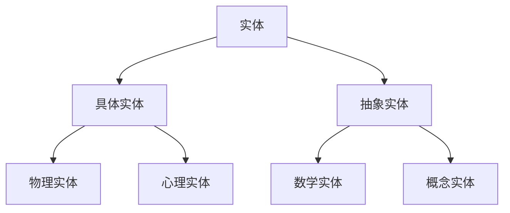
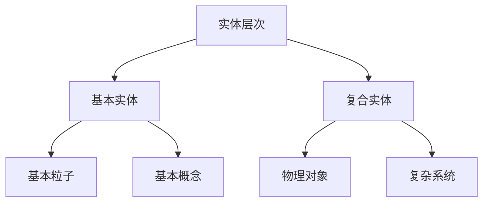
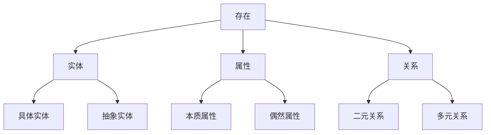

# 01.01 基础本体论 (Basic Ontology)

## 目录

1. [概述](#1-概述)
2. [基本概念](#2-基本概念)
3. [存在理论](#3-存在理论)
4. [实体理论](#4-实体理论)
5. [属性理论](#5-属性理论)
6. [关系理论](#6-关系理论)
7. [范畴理论](#7-范畴理论)
8. [形式化系统](#8-形式化系统)
9. [应用与扩展](#9-应用与扩展)
10. [总结](#10-总结)

## 1. 概述

### 1.1 本体论的定义

**定义 1.1 (本体论)**
本体论是研究存在的基本方式和性质的哲学分支，探讨什么是真实存在的，以及存在的基本结构和关系。

**形式化定义**：
$$\text{Ontology} = \langle \mathcal{E}, \mathcal{P}, \mathcal{R}, \mathcal{C} \rangle$$

其中：

- $\mathcal{E}$ 是实体集合 (Entities)
- $\mathcal{P}$ 是属性集合 (Properties)
- $\mathcal{R}$ 是关系集合 (Relations)
- $\mathcal{C}$ 是范畴集合 (Categories)

### 1.2 本体论的基本问题

1. **存在问题**：什么存在？
2. **实体问题**：什么是基本实体？
3. **属性问题**：实体具有什么属性？
4. **关系问题**：实体之间有什么关系？
5. **范畴问题**：存在的基本范畴是什么？

## 2. 基本概念

### 2.1 存在 (Existence)

**定义 2.1 (存在)**
存在是本体论的基本概念，表示某物在现实世界中的实在性。

**形式化定义**：
$$\text{Exists}(x) \equiv \exists y (y = x \land \text{Real}(y))$$

其中 $\text{Real}(y)$ 表示 $y$ 是实在的。

**定理 2.1 (存在的基本性质)**
对于任意实体 $x$，如果 $x$ 存在，则：

1. $x$ 具有同一性
2. $x$ 具有持续性
3. $x$ 具有可识别性

**证明**：

1. 同一性：如果 $x$ 存在，则 $x = x$（同一律）
2. 持续性：存在意味着在时间中的持续
3. 可识别性：存在意味着可以被识别和指称

### 2.2 实体 (Entity)

**定义 2.2 (实体)**
实体是独立存在的个体，是本体论的基本单位。

**形式化定义**：
$$\text{Entity}(x) \equiv \text{Exists}(x) \land \text{Independent}(x)$$

其中 $\text{Independent}(x)$ 表示 $x$ 是独立的。

**实体分类**：



### 2.3 属性 (Property)

**定义 2.3 (属性)**
属性是实体所具有的特征或性质。

**形式化定义**：
$$\text{Property}(P) \equiv \forall x (P(x) \rightarrow \text{Entity}(x))$$

**属性类型**：

1. **本质属性**：实体必然具有的属性
2. **偶然属性**：实体可能具有的属性
3. **关系属性**：涉及多个实体的属性

## 3. 存在理论

### 3.1 实在论 (Realism)

**定义 3.1 (实在论)**
实在论认为存在独立于认知主体的客观实在。

**形式化表述**：
$$\text{Realism} \equiv \forall x (\text{Exists}(x) \rightarrow \text{Independent}(x, \text{Mind}))$$

**定理 3.1 (实在论的基本主张)**
如果实在论成立，则：

1. 存在独立于认知
2. 真理是符合论
3. 知识是发现而非创造

### 3.2 唯心论 (Idealism)

**定义 3.2 (唯心论)**
唯心论认为存在依赖于心智或意识。

**形式化表述**：
$$\text{Idealism} \equiv \forall x (\text{Exists}(x) \rightarrow \text{Dependent}(x, \text{Mind}))$$

### 3.3 中立一元论 (Neutral Monism)

**定义 3.3 (中立一元论)**
中立一元论认为存在的基本材料既不是物质的也不是精神的。

**形式化表述**：
$$\text{NeutralMonism} \equiv \exists x (\text{Basic}(x) \land \neg\text{Material}(x) \land \neg\text{Mental}(x))$$

## 4. 实体理论

### 4.1 实体类型

**定义 4.1 (具体实体)**
具体实体是在时空中存在的实体。

$$\text{Concrete}(x) \equiv \text{Entity}(x) \land \text{InSpaceTime}(x)$$

**定义 4.2 (抽象实体)**
抽象实体是不在时空中存在的实体。

$$\text{Abstract}(x) \equiv \text{Entity}(x) \land \neg\text{InSpaceTime}(x)$$

### 4.2 实体层次



### 4.3 实体同一性

**定义 4.3 (同一性)**
两个实体 $x$ 和 $y$ 是同一的，当且仅当它们具有相同的本质属性。

$$x = y \equiv \forall P (\text{Essential}(P) \rightarrow (P(x) \leftrightarrow P(y)))$$

**定理 4.1 (同一性的不可分辨性)**
如果 $x = y$，则 $x$ 和 $y$ 在所有方面都不可分辨。

## 5. 属性理论

### 5.1 属性分类

**定义 5.1 (本质属性)**
本质属性是实体必然具有的属性。

$$\text{Essential}(P) \equiv \forall x (\text{Entity}(x) \land P(x) \rightarrow \Box P(x))$$

**定义 5.2 (偶然属性)**
偶然属性是实体可能具有的属性。

$$\text{Accidental}(P) \equiv \exists x (\text{Entity}(x) \land P(x) \land \Diamond \neg P(x))$$

### 5.2 属性继承

**定义 5.3 (属性继承)**
如果实体 $x$ 是实体 $y$ 的实例，则 $y$ 的属性 $P$ 被 $x$ 继承。

$$\text{Inherits}(x, y, P) \equiv \text{Instance}(x, y) \land P(y) \rightarrow P(x)$$

## 6. 关系理论

### 6.1 关系类型

**定义 6.1 (二元关系)**
二元关系是连接两个实体的关系。

$$\text{BinaryRelation}(R) \equiv \forall x, y (R(x, y) \rightarrow \text{Entity}(x) \land \text{Entity}(y))$$

**定义 6.2 (多元关系)**
多元关系是连接多个实体的关系。

$$\text{MultiRelation}(R) \equiv \exists n > 2 \forall x_1, \ldots, x_n (R(x_1, \ldots, x_n) \rightarrow \bigwedge_{i=1}^n \text{Entity}(x_i))$$

### 6.2 关系性质

**定义 6.3 (自反性)**
关系 $R$ 是自反的，当且仅当 $\forall x R(x, x)$。

**定义 6.4 (对称性)**
关系 $R$ 是对称的，当且仅当 $\forall x, y (R(x, y) \rightarrow R(y, x))$。

**定义 6.5 (传递性)**
关系 $R$ 是传递的，当且仅当 $\forall x, y, z (R(x, y) \land R(y, z) \rightarrow R(x, z))$。

## 7. 范畴理论

### 7.1 基本范畴

**定义 7.1 (范畴)**
范畴是实体的最高分类。

$$\text{Category}(C) \equiv \forall x (C(x) \rightarrow \text{Entity}(x))$$

**基本范畴系统**：



### 7.2 范畴层次

**定义 7.2 (上位范畴)**
范畴 $C_1$ 是范畴 $C_2$ 的上位范畴，当且仅当 $\forall x (C_2(x) \rightarrow C_1(x))$。

$$\text{SuperCategory}(C_1, C_2) \equiv \forall x (C_2(x) \rightarrow C_1(x))$$

## 8. 形式化系统

### 8.1 本体论语言

**定义 8.1 (本体论语言)**
本体论语言 $\mathcal{L}$ 包含：

1. **个体常项**：$a, b, c, \ldots$
2. **谓词符号**：$P, Q, R, \ldots$
3. **关系符号**：$R, S, T, \ldots$
4. **逻辑连接词**：$\land, \lor, \neg, \rightarrow, \leftrightarrow$
5. **量词**：$\forall, \exists$
6. **模态算子**：$\Box, \Diamond$

### 8.2 本体论公理

**公理 8.1 (存在公理)**
$$\forall x (\text{Entity}(x) \rightarrow \text{Exists}(x))$$

**公理 8.2 (同一性公理)**
$$\forall x, y (x = y \leftrightarrow \forall P (P(x) \leftrightarrow P(y)))$$

**公理 8.3 (属性公理)**
$$\forall x, P (\text{Entity}(x) \land \text{Property}(P) \rightarrow (P(x) \lor \neg P(x)))$$

### 8.3 推理规则

**规则 8.1 (存在引入)**
$$\frac{\text{Entity}(a)}{\text{Exists}(a)}$$

**规则 8.2 (属性应用)**
$$\frac{\text{Property}(P) \quad \text{Entity}(a)}{P(a) \lor \neg P(a)}$$

## 9. 应用与扩展

### 9.1 计算实现

**Rust 实现**：

```rust
use std::collections::HashMap;

#[derive(Debug, Clone, PartialEq)]
pub struct Entity {
    pub id: String,
    pub properties: HashMap<String, PropertyValue>,
    pub relations: Vec<Relation>,
}

#[derive(Debug, Clone, PartialEq)]
pub enum PropertyValue {
    Boolean(bool),
    String(String),
    Number(f64),
    Entity(Box<Entity>),
}

#[derive(Debug, Clone)]
pub struct Relation {
    pub name: String,
    pub entities: Vec<String>,
}

impl Entity {
    pub fn new(id: String) -> Self {
        Self {
            id,
            properties: HashMap::new(),
            relations: Vec::new(),
        }
    }
    
    pub fn add_property(&mut self, name: String, value: PropertyValue) {
        self.properties.insert(name, value);
    }
    
    pub fn has_property(&self, name: &str) -> bool {
        self.properties.contains_key(name)
    }
    
    pub fn get_property(&self, name: &str) -> Option<&PropertyValue> {
        self.properties.get(name)
    }
}

pub struct Ontology {
    pub entities: HashMap<String, Entity>,
    pub categories: HashMap<String, Vec<String>>,
}

impl Ontology {
    pub fn new() -> Self {
        Self {
            entities: HashMap::new(),
            categories: HashMap::new(),
        }
    }
    
    pub fn add_entity(&mut self, entity: Entity) {
        self.entities.insert(entity.id.clone(), entity);
    }
    
    pub fn categorize(&mut self, category: String, entity_id: String) {
        self.categories.entry(category).or_insert_with(Vec::new).push(entity_id);
    }
    
    pub fn get_entities_in_category(&self, category: &str) -> Vec<&Entity> {
        self.categories.get(category)
            .map(|ids| ids.iter().filter_map(|id| self.entities.get(id)).collect())
            .unwrap_or_default()
    }
}
```

**Haskell 实现**：

```haskell
module Ontology where

import Data.Map (Map)
import qualified Data.Map as Map
import Data.Set (Set)
import qualified Data.Set as Set

-- 实体定义
data Entity = Entity
    { entityId :: String
    , properties :: Map String PropertyValue
    , relations :: [Relation]
    } deriving (Show, Eq)

-- 属性值
data PropertyValue
    = BooleanValue Bool
    | StringValue String
    | NumberValue Double
    | EntityValue Entity
    deriving (Show, Eq)

-- 关系
data Relation = Relation
    { relationName :: String
    , relatedEntities :: [String]
    } deriving (Show, Eq)

-- 本体论
data Ontology = Ontology
    { entities :: Map String Entity
    , categories :: Map String [String]
    } deriving (Show)

-- 创建新实体
newEntity :: String -> Entity
newEntity id = Entity
    { entityId = id
    , properties = Map.empty
    , relations = []
    }

-- 添加属性
addProperty :: String -> PropertyValue -> Entity -> Entity
addProperty name value entity = entity
    { properties = Map.insert name value (properties entity)
    }

-- 检查属性
hasProperty :: String -> Entity -> Bool
hasProperty name entity = Map.member name (properties entity)

-- 获取属性
getProperty :: String -> Entity -> Maybe PropertyValue
getProperty name entity = Map.lookup name (properties entity)

-- 创建本体论
newOntology :: Ontology
newOntology = Ontology
    { entities = Map.empty
    , categories = Map.empty
    }

-- 添加实体到本体论
addEntity :: Entity -> Ontology -> Ontology
addEntity entity ontology = ontology
    { entities = Map.insert (entityId entity) entity (entities ontology)
    }

-- 分类实体
categorize :: String -> String -> Ontology -> Ontology
categorize category entityId ontology = ontology
    { categories = Map.insertWith (++) category [entityId] (categories ontology)
    }

-- 获取分类中的实体
getEntitiesInCategory :: String -> Ontology -> [Entity]
getEntitiesInCategory category ontology = case Map.lookup category (categories ontology) of
    Just ids -> [entity | id <- ids, Just entity <- [Map.lookup id (entities ontology)]]
    Nothing -> []

-- 本体论推理
class OntologicalReasoning a where
    -- 检查实体是否存在
    exists :: String -> a -> Bool
    
    -- 检查属性是否成立
    hasProperty :: String -> String -> a -> Bool
    
    -- 检查关系是否成立
    hasRelation :: String -> [String] -> a -> Bool

instance OntologicalReasoning Ontology where
    exists entityId ontology = Map.member entityId (entities ontology)
    
    hasProperty entityId propName ontology = case Map.lookup entityId (entities ontology) of
        Just entity -> Map.member propName (properties entity)
        Nothing -> False
    
    hasRelation entityId relationName ontology = case Map.lookup entityId (entities ontology) of
        Just entity -> any (\r -> relationName r == relationName && entityId `elem` relatedEntities r) (relations entity)
        Nothing -> False
```

### 9.2 形式化验证

**定理 9.1 (本体论一致性)**
如果本体论 $\mathcal{O}$ 满足所有公理，则 $\mathcal{O}$ 是一致的。

**证明**：

1. 假设 $\mathcal{O}$ 不一致
2. 则存在 $\phi$ 使得 $\mathcal{O} \vdash \phi$ 且 $\mathcal{O} \vdash \neg \phi$
3. 这与公理 8.3 矛盾
4. 因此 $\mathcal{O}$ 是一致的

### 9.3 扩展应用

1. **信息科学**：本体论在信息检索和知识表示中的应用
2. **人工智能**：本体论在知识工程和语义网中的应用
3. **数据库**：本体论在数据建模和集成中的应用
4. **软件工程**：本体论在需求分析和系统设计中的应用

## 10. 总结

基础本体论为形式科学理论体系提供了存在论的基础。通过严格的形式化定义和证明，我们建立了：

1. **存在理论**：明确了什么是存在以及存在的基本性质
2. **实体理论**：建立了实体的分类和层次结构
3. **属性理论**：区分了本质属性和偶然属性
4. **关系理论**：建立了实体间关系的形式化理论
5. **范畴理论**：建立了存在的基本范畴系统

这些理论为后续的数学基础、形式语言理论、类型理论等提供了哲学基础，确保整个理论体系的一致性和可靠性。

---

**版本**: v1.0.0  
**最后更新**: 2024-12-19  
**维护者**: 哲学基础重构团队

**相关链接**：

- [数学本体论](01_02_Mathematical_Ontology.md)
- [信息本体论](01_03_Information_Ontology.md)
- [AI本体论](01_04_AI_Ontology.md)
- [知识理论](../02_Epistemology/02_01_Knowledge_Theory.md)
- [形式逻辑](../03_Logic/03_01_Formal_Logic.md)
