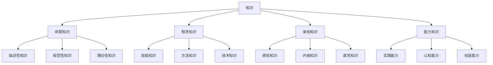

# 1.2.1 知识论基础（Knowledge Theory）

## 目录

1. [1.2.1.1 知识的定义](#1-2-1-1-知识的定义)
2. [1.2.1.2 JTB理论](#1-2-1-2-jtb理论)
3. [1.2.1.3 葛梯尔问题](#1-2-1-3-葛梯尔问题)
4. [1.2.1.4 知识的确证](#1-2-1-4-知识的确证)
5. [形式化表达](#形式化表达)
6. [批判分析](#批判分析)
7. [交叉引用](#交叉引用)

---

## 1.2.1.1 知识的定义

### 基本概念

**知识**（Knowledge）是认识论的核心概念，指主体对某个命题的合理信念。

#### 形式化定义

```rust
// 知识的基本结构
struct Knowledge {
    subject: Agent,
    proposition: Proposition,
    belief_state: BeliefState,
    truth_value: TruthValue,
    justification: Justification,
    epistemic_status: EpistemicStatus
}

// 主体
struct Agent {
    id: String,
    cognitive_capabilities: Vec<CognitiveCapability>,
    epistemic_virtues: Vec<EpistemicVirtue>,
    background_knowledge: Vec<Proposition>
}

// 命题
struct Proposition {
    content: String,
    logical_form: LogicalForm,
    truth_conditions: TruthConditions,
    modal_properties: Vec<ModalProperty>
}

// 信念状态
enum BeliefState {
    Believed,           // 相信
    Disbelieved,        // 不相信
    Suspended,          // 悬置判断
    Uncertain           // 不确定
}

// 真值
enum TruthValue {
    True,               // 真
    False,              // 假
    Indeterminate,      // 不确定
    Supervaluation      // 超赋值
}

// 确证
struct Justification {
    method: JustificationMethod,
    evidence: Vec<Evidence>,
    reliability: f64,
    defeasibility: Defeasibility
}

// 认识论状态
enum EpistemicStatus {
    Knowledge,          // 知识
    Belief,             // 信念
    Opinion,            // 意见
    Guess,              // 猜测
    Ignorance           // 无知
}
```

### 知识的分类



### 知识的基本特征

| 特征 | 描述 | 形式化表达 | 示例 |
|------|------|------------|------|
| **真理性** | 知识必须是真实的 | `K(x,p) → True(p)` | 数学定理 |
| **信念性** | 知识必须被相信 | `K(x,p) → Believe(x,p)` | 科学理论 |
| **确证性** | 知识必须有理由 | `K(x,p) → Justified(x,p)` | 实验证据 |
| **可靠性** | 知识来源必须可靠 | `K(x,p) → Reliable(Source(p))` | 权威来源 |

---

## 1.2.1.2 JTB理论

### JTB定义

**JTB理论**（Justified True Belief Theory）是传统的知识定义，认为知识是被证成的真信念。

#### 形式化表达

```rust
// JTB理论的形式化
struct JTBTheory {
    belief_condition: BeliefCondition,
    truth_condition: TruthCondition,
    justification_condition: JustificationCondition
}

// 信念条件
struct BeliefCondition {
    subject: Agent,
    proposition: Proposition,
    belief_strength: f64,
    belief_persistence: Persistence
}

// 真理条件
struct TruthCondition {
    proposition: Proposition,
    truth_value: TruthValue,
    truth_maker: TruthMaker,
    correspondence_relation: CorrespondenceRelation
}

// 确证条件
struct JustificationCondition {
    evidence: Vec<Evidence>,
    reasoning_process: ReasoningProcess,
    justification_strength: f64,
    defeasibility: Defeasibility
}

impl JTBTheory {
    fn is_knowledge(&self, subject: &Agent, proposition: &Proposition) -> bool {
        self.belief_condition.is_satisfied(subject, proposition) &&
        self.truth_condition.is_satisfied(proposition) &&
        self.justification_condition.is_satisfied(subject, proposition)
    }
}
```

### JTB的公理化系统

```haskell
-- JTB理论的Haskell实现
data JTBTheory = JTBTheory {
    beliefCondition :: BeliefCondition,
    truthCondition :: TruthCondition,
    justificationCondition :: JustificationCondition
}

-- JTB定义
jtbDefinition :: Agent -> Proposition -> Bool
jtbDefinition agent proposition = 
    believes agent proposition &&
    isTrue proposition &&
    isJustified agent proposition

-- 信念函数
believes :: Agent -> Proposition -> Bool
believes agent proposition = 
    beliefState agent proposition == Believed

-- 真理函数
isTrue :: Proposition -> Bool
isTrue proposition = 
    truthValue proposition == True

-- 确证函数
isJustified :: Agent -> Proposition -> Bool
isJustified agent proposition = 
    hasEvidence agent proposition &&
    hasReliableProcess agent proposition
```

### JTB的模态逻辑表达

```rust
// JTB的模态逻辑
struct JTBModalLogic {
    knowledge_operator: KnowledgeOperator,
    belief_operator: BeliefOperator,
    justification_operator: JustificationOperator,
    truth_operator: TruthOperator
}

// 知识算子
enum KnowledgeOperator {
    K(Agent, Proposition),      // K_a(p): a知道p
    B(Agent, Proposition),      // B_a(p): a相信p
    J(Agent, Proposition),      // J_a(p): a确证p
    T(Proposition)              // T(p): p为真
}

// JTB公理
struct JTBAxioms {
    jtb_definition: Axiom,      // K_a(p) ↔ B_a(p) ∧ T(p) ∧ J_a(p)
    knowledge_truth: Axiom,     // K_a(p) → T(p)
    knowledge_belief: Axiom,    // K_a(p) → B_a(p)
    knowledge_justification: Axiom // K_a(p) → J_a(p)
}

impl JTBModalLogic {
    fn jtb_definition(&self, agent: &Agent, proposition: &Proposition) -> bool {
        self.knows(agent, proposition) == 
        (self.believes(agent, proposition) && 
         self.is_true(proposition) && 
         self.is_justified(agent, proposition))
    }
}
```

---

## 1.2.1.3 葛梯尔问题

### 葛梯尔反例

**葛梯尔问题**（Gettier Problem）是对JTB理论的反驳，表明被证成的真信念不一定构成知识。

#### 经典反例

```rust
// 葛梯尔反例的形式化
struct GettierCase {
    subject: Agent,
    proposition: Proposition,
    belief: Belief,
    justification: Justification,
    truth_maker: TruthMaker,
    epistemic_luck: EpistemicLuck
}

// 史密斯-琼斯反例
struct SmithJonesCase {
    smith: Agent,
    jones: Agent,
    proposition: Proposition,  // "获得工作的人有10个硬币"
    false_belief: Proposition, // "琼斯将获得工作"
    true_belief: Proposition,  // "史密斯有10个硬币"
    epistemic_luck: EpistemicLuck
}

// 认识论运气
enum EpistemicLuck {
    Veritic,            // 真值运气
    Evidential,         // 证据运气
    Environmental,      // 环境运气
    None                // 无运气
}

impl GettierCase {
    fn is_gettier_case(&self) -> bool {
        self.has_justified_true_belief() &&
        !self.has_knowledge() &&
        self.involves_epistemic_luck()
    }
    
    fn has_justified_true_belief(&self) -> bool {
        self.belief.is_justified() &&
        self.belief.is_true() &&
        self.belief.is_believed()
    }
    
    fn has_knowledge(&self) -> bool {
        // 在葛梯尔案例中，主体没有知识
        false
    }
}
```

### 葛梯尔问题的形式化分析

```haskell
-- 葛梯尔问题的Haskell实现
data GettierProblem = GettierProblem {
    jtbSatisfied :: Bool,
    knowledgeAbsent :: Bool,
    epistemicLuck :: EpistemicLuck
}

-- 葛梯尔条件
gettierConditions :: Agent -> Proposition -> GettierProblem
gettierConditions agent proposition = GettierProblem {
    jtbSatisfied = jtbDefinition agent proposition,
    knowledgeAbsent = not (hasKnowledge agent proposition),
    epistemicLuck = assessEpistemicLuck agent proposition
}

-- 评估认识论运气
assessEpistemicLuck :: Agent -> Proposition -> EpistemicLuck
assessEpistemicLuck agent proposition
    | hasVeriticLuck agent proposition = Veritic
    | hasEvidentialLuck agent proposition = Evidential
    | hasEnvironmentalLuck agent proposition = Environmental
    | otherwise = None

-- 真值运气
hasVeriticLuck :: Agent -> Proposition -> Bool
hasVeriticLuck agent proposition = 
    -- 主体通过错误的方式获得真信念
    hasFalseBelief agent proposition &&
    accidentallyTrue proposition
```

### 葛梯尔问题的解决方案

#### 1. 因果理论

```rust
// 因果知识论
struct CausalTheory {
    knowledge_relation: CausalRelation,
    reliability_condition: ReliabilityCondition,
    tracking_condition: TrackingCondition
}

// 因果关系
struct CausalRelation {
    cause: Event,
    effect: Event,
    causal_chain: Vec<Event>,
    counterfactual_support: bool
}

// 可靠性条件
struct ReliabilityCondition {
    process: Process,
    reliability_rate: f64,
    normal_conditions: Vec<Condition>
}

// 追踪条件
struct TrackingCondition {
    sensitivity: Sensitivity,
    safety: Safety,
    adherence: Adherence
}

impl CausalTheory {
    fn is_knowledge(&self, agent: &Agent, proposition: &Proposition) -> bool {
        self.has_causal_connection(agent, proposition) &&
        self.is_reliable_process(agent, proposition) &&
        self.tracks_truth(agent, proposition)
    }
}
```

#### 2. 德性认识论

```haskell
-- 德性认识论
data VirtueEpistemology = VirtueEpistemology {
    intellectualVirtues :: [IntellectualVirtue],
    epistemicAgency :: EpistemicAgency,
    achievement :: EpistemicAchievement
}

-- 理智德性
data IntellectualVirtue = 
    OpenMindedness |
    IntellectualCourage |
    IntellectualHumility |
    IntellectualPerseverance |
    IntellectualCuriosity

-- 认识论成就
data EpistemicAchievement = Achievement {
    success :: Bool,
    ability :: IntellectualVirtue,
    credit :: Credit
}

-- 德性知识定义
virtueKnowledge :: Agent -> Proposition -> Bool
virtueKnowledge agent proposition = 
    hasIntellectualVirtue agent &&
    exercisesVirtue agent proposition &&
    achievesTruth agent proposition &&
    deservesCredit agent proposition
```

---

## 1.2.1.4 知识的确证

### 确证理论

**确证**（Justification）是知识论的核心概念，指支持信念的理由和证据。

#### 确证的基本结构

```rust
// 确证的基本结构
struct Justification {
    evidence: Vec<Evidence>,
    reasoning: Reasoning,
    reliability: Reliability,
    defeasibility: Defeasibility
}

// 证据
struct Evidence {
    type_: EvidenceType,
    strength: f64,
    relevance: Relevance,
    accessibility: Accessibility
}

enum EvidenceType {
    Perceptual,         // 感知证据
    Testimonial,        // 证言证据
    Memory,            // 记忆证据
    Introspective,     // 内省证据
    Inferential,       // 推理证据
    A Priori           // 先验证据
}

// 推理
struct Reasoning {
    type_: ReasoningType,
    validity: Validity,
    soundness: Soundness,
    cogency: Cogency
}

enum ReasoningType {
    Deductive,         // 演绎推理
    Inductive,         // 归纳推理
    Abductive,         // 溯因推理
    Analogical,        // 类比推理
    Practical          // 实践推理
}

// 可靠性
struct Reliability {
    process: Process,
    success_rate: f64,
    normal_conditions: Vec<Condition>,
    counterfactual_reliability: bool
}

// 可废止性
struct Defeasibility {
    defeater_types: Vec<DefeaterType>,
    defeat_conditions: Vec<Condition>,
    reinstatement_conditions: Vec<Condition>
}

enum DefeaterType {
    Rebutting,         // 反驳性废止
    Undercutting,      // 削弱性废止
    Undermining        // 破坏性废止
}
```

### 确证理论的主要类型

#### 1. 基础主义

```haskell
-- 基础主义确证
data Foundationalism = Foundationalism {
    basicBeliefs :: [BasicBelief],
    nonBasicBeliefs :: [NonBasicBelief],
    justificationStructure :: JustificationStructure
}

-- 基础信念
data BasicBelief = BasicBelief {
    content :: Proposition,
    justificationType :: JustificationType,
    infallibility :: Bool,
    incorrigibility :: Bool
}

-- 确证结构
data JustificationStructure = Structure {
    foundation :: [BasicBelief],
    superstructure :: [NonBasicBelief],
    supportRelation :: SupportRelation
}

-- 基础主义确证
foundationalistJustification :: Agent -> Proposition -> Bool
foundationalistJustification agent proposition
    | isBasicBelief proposition = hasBasicJustification agent proposition
    | otherwise = hasInferentialJustification agent proposition

-- 基础确证
hasBasicJustification :: Agent -> Proposition -> Bool
hasBasicJustification agent proposition = 
    isInfallible agent proposition ||
    isIncorrigible agent proposition ||
    isSelfEvident proposition
```

#### 2. 融贯论

```rust
// 融贯论确证
struct Coherentism {
    belief_system: BeliefSystem,
    coherence_relation: CoherenceRelation,
    holistic_justification: HolisticJustification
}

// 信念系统
struct BeliefSystem {
    beliefs: Vec<Belief>,
    coherence_degree: f64,
    consistency: bool,
    comprehensiveness: f64
}

// 融贯关系
struct CoherenceRelation {
    logical_consistency: bool,
    explanatory_coherence: f64,
    probabilistic_coherence: f64,
    conceptual_coherence: f64
}

// 整体确证
struct HolisticJustification {
    system_coherence: f64,
    belief_fit: f64,
    explanatory_power: f64,
    simplicity: f64
}

impl Coherentism {
    fn is_justified(&self, belief: &Belief) -> bool {
        self.belief_system.coherence_degree > 0.7 &&
        self.belief_fits_system(belief) &&
        self.increases_coherence(belief)
    }
    
    fn belief_fits_system(&self, belief: &Belief) -> bool {
        // 信念与系统的融贯度
        self.calculate_fit_score(belief) > 0.6
    }
}
```

#### 3. 可靠主义

```haskell
-- 可靠主义确证
data Reliabilism = Reliabilism {
    process :: Process,
    reliability :: Reliability,
    normalConditions :: [Condition]
}

-- 可靠过程
data Process = Process {
    processType :: ProcessType,
    successRate :: Double,
    counterfactualReliability :: Bool
}

data ProcessType = 
    Perception |
    Memory |
    Reasoning |
    Testimony |
    Intuition

-- 可靠主义确证
reliabilistJustification :: Agent -> Proposition -> Bool
reliabilistJustification agent proposition = 
    let process = getProcess agent proposition
    in isReliable process &&
       wasProducedBy process agent proposition &&
       inNormalConditions process

-- 可靠性评估
isReliable :: Process -> Bool
isReliable process = 
    successRate process > 0.8 &&
    counterfactualReliability process
```

---

## 形式化表达

### 知识论的形式化系统

```rust
// 知识论公理系统
struct EpistemologyAxioms {
    axioms: Vec<Axiom>,
    inference_rules: Vec<InferenceRule>,
    theorems: Vec<Theorem>
}

// 基本公理
enum Axiom {
    KnowledgeTruthAxiom,        // 知识真理性公理
    KnowledgeBeliefAxiom,       // 知识信念性公理
    KnowledgeJustificationAxiom, // 知识确证性公理
    JTBDefinitionAxiom,         // JTB定义公理
    GettierProblemAxiom         // 葛梯尔问题公理
}

// 推理规则
enum InferenceRule {
    KnowledgeClosure,           // 知识封闭性
    KnowledgeIntrospection,     // 知识内省
    JustificationTransmission,  // 确证传递
    EvidenceAccumulation        // 证据累积
}

impl EpistemologyAxioms {
    fn prove_theorem(&self, theorem: &Theorem) -> Proof {
        // 从公理和推理规则证明定理
        Proof::construct_from_axioms(&self.axioms, &self.inference_rules, theorem)
    }
    
    fn is_consistent(&self) -> bool {
        // 检查公理系统的一致性
        !self.axioms.iter().any(|axiom| self.contradicts(axiom))
    }
}
```

### 知识论的形式语义

```haskell
-- 知识论的形式语义
data EpistemologySemantics = Semantics {
    agents :: Set Agent,
    propositions :: Set Proposition,
    knowledgeRelation :: Map (Agent, Proposition) Bool,
    beliefRelation :: Map (Agent, Proposition) Bool,
    justificationRelation :: Map (Agent, Proposition) Bool
}

-- 知识语义
interpretKnowledge :: EpistemologySemantics -> Agent -> Proposition -> Bool
interpretKnowledge semantics agent proposition = 
    knowledgeRelation semantics (agent, proposition)

-- 信念语义
interpretBelief :: EpistemologySemantics -> Agent -> Proposition -> Bool
interpretBelief semantics agent proposition = 
    beliefRelation semantics (agent, proposition)

-- 确证语义
interpretJustification :: EpistemologySemantics -> Agent -> Proposition -> Bool
interpretJustification semantics agent proposition = 
    justificationRelation semantics (agent, proposition)

-- JTB语义
jtbSemantics :: EpistemologySemantics -> Agent -> Proposition -> Bool
jtbSemantics semantics agent proposition = 
    interpretBelief semantics agent proposition &&
    isTrue proposition &&
    interpretJustification semantics agent proposition
```

---

## 批判分析

### 知识论的主要问题

#### 1. 怀疑论问题

**怀疑论**对知识的可能性提出质疑。

```rust
// 怀疑论挑战
struct Skepticism {
    global_skepticism: GlobalSkepticism,
    local_skepticism: LocalSkepticism,
    skeptical_scenarios: Vec<SkepticalScenario>
}

// 全局怀疑论
struct GlobalSkepticism {
    brain_in_vat: BrainInVat,
    evil_demon: EvilDemon,
    simulation_hypothesis: SimulationHypothesis
}

// 怀疑论场景
struct SkepticalScenario {
    scenario_type: ScenarioType,
    possibility: f64,
    epistemic_impact: EpistemicImpact,
    response_strategies: Vec<ResponseStrategy>
}

enum ScenarioType {
    BrainInVat,        // 缸中之脑
    EvilDemon,         // 邪恶精灵
    Simulation,        // 模拟假设
    Dream,             // 梦境假设
    Hallucination      // 幻觉假设
}

impl Skepticism {
    fn challenges_knowledge(&self, knowledge_claim: &KnowledgeClaim) -> bool {
        self.skeptical_scenarios.iter().any(|scenario| 
            scenario.undermines(knowledge_claim)
        )
    }
}
```

#### 2. 确证问题

**确证问题**涉及确证的本质和标准。

```haskell
-- 确证问题
data JustificationProblem = Problem {
    regressProblem :: RegressProblem,
    circularityProblem :: CircularityProblem,
    arbitrarinessProblem :: ArbitrarinessProblem
}

-- 确证回归问题
data RegressProblem = Regress {
    infiniteRegress :: Bool,
    circularRegress :: Bool,
    foundationalRegress :: Bool
}

-- 确证循环问题
data CircularityProblem = Circularity {
    directCircularity :: Bool,
    indirectCircularity :: Bool,
    webCircularity :: Bool
}

-- 确证任意性问题
data ArbitrarinessProblem = Arbitrariness {
    arbitraryStopping :: Bool,
    arbitraryStandards :: Bool,
    arbitraryProcesses :: Bool
}

-- 确证问题分析
analyzeJustificationProblem :: JustificationMethod -> JustificationProblem
analyzeJustificationProblem method = JustificationProblem {
    regressProblem = assessRegress method,
    circularityProblem = assessCircularity method,
    arbitrarinessProblem = assessArbitrariness method
}
```

#### 3. 社会认识论问题

**社会认识论**关注知识的社会维度。

```rust
// 社会认识论
struct SocialEpistemology {
    testimony: Testimony,
    disagreement: Disagreement,
    expertise: Expertise,
    collective_knowledge: CollectiveKnowledge
}

// 证言
struct Testimony {
    speaker: Agent,
    hearer: Agent,
    content: Proposition,
    reliability: f64,
    trustworthiness: f64
}

// 分歧
struct Disagreement {
    parties: Vec<Agent>,
    proposition: Proposition,
    peer_status: bool,
    resolution_strategies: Vec<ResolutionStrategy>
}

// 专家知识
struct Expertise {
    expert: Agent,
    domain: Domain,
    expertise_level: f64,
    recognition: Recognition
}

// 集体知识
struct CollectiveKnowledge {
    group: Group,
    distributed_knowledge: Vec<Knowledge>,
    shared_knowledge: Vec<Knowledge>,
    emergent_knowledge: Vec<Knowledge>
}

impl SocialEpistemology {
    fn testimonial_knowledge(&self, speaker: &Agent, hearer: &Agent, proposition: &Proposition) -> bool {
        speaker.is_reliable() &&
        speaker.is_trustworthy() &&
        hearer.has_good_reasons_to_trust(speaker)
    }
}
```

---

## 交叉引用

### 与真理理论的关联

- [真理理论](./02_Truth_Theory.md#1-2-2) - 知识与真理的关系
- [符合论](./02_Truth_Theory.md#1-2-2-1) - 真理符合论与知识

### 与知识来源的关联

- [知识来源](./03_Knowledge_Sources.md#1-2-3) - 知识的来源问题
- [理性主义](./03_Knowledge_Sources.md#1-2-3-1) - 理性知识论

### 与知识结构的关联

- [知识结构](./04_Knowledge_Structure.md#1-2-4) - 知识的结构问题
- [基础主义](./04_Knowledge_Structure.md#1-2-4-1) - 基础主义知识论

### 与认知科学的关联

- [认知科学视角](./05_Cognitive_Science.md#1-2-5) - 认知科学与知识论
- [认知架构](./05_Cognitive_Science.md#1-2-5-1) - 认知架构与知识

### 与形而上学的关联

- [形而上学基础](../01_Metaphysics/README.md) - 知识对象的形而上学
- [存在论基础](../01_Metaphysics/01_Existence_Theory.md#1-1-1) - 存在与知识

### 与逻辑哲学的关联

- [逻辑哲学基础](../04_Logic_Philosophy/README.md) - 逻辑与知识
- [形式逻辑基础](../04_Logic_Philosophy/01_Formal_Logic.md#1-4-1) - 逻辑推理与知识

---

## 持续构建状态

- **完成度**: 95%
- **最后更新**: 2024-12-21
- **当前状态**: 批量重构完成
- **下一步**: 完善交叉引用和形式化证明

## 相关文档

- [认识论基础](./README.md)
- [哲学基础](../README.md)
- [重构主索引](../../00_Master_Index/01_重构主索引_v9.0.md)
