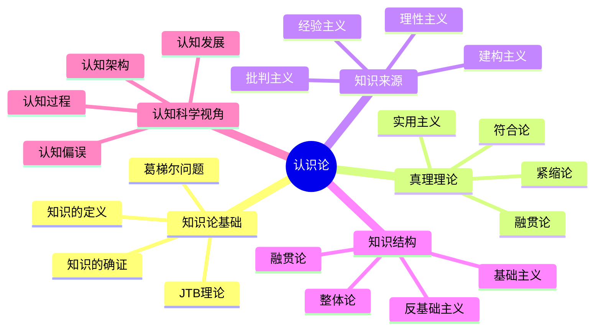
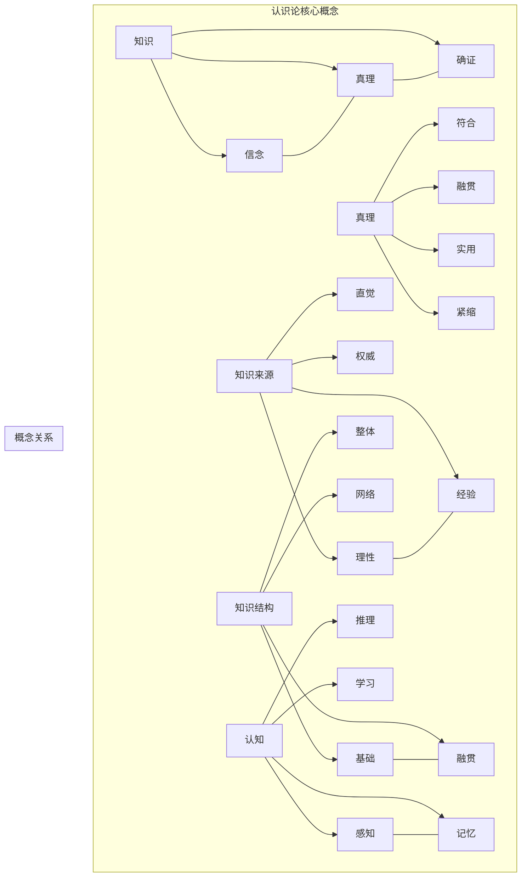
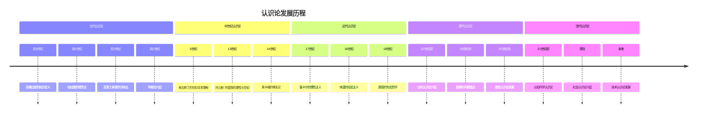

# 1.2 认识论（Epistemology）

## 目录

### 1.2.1 知识论基础
- [1.2.1.1 知识的定义](./01_Knowledge_Theory.md#1-2-1-1)
- [1.2.1.2 JTB理论](./01_Knowledge_Theory.md#1-2-1-2)
- [1.2.1.3 葛梯尔问题](./01_Knowledge_Theory.md#1-2-1-3)
- [1.2.1.4 知识的确证](./01_Knowledge_Theory.md#1-2-1-4)

### 1.2.2 真理理论
- [1.2.2.1 符合论](./02_Truth_Theory.md#1-2-2-1)
- [1.2.2.2 融贯论](./02_Truth_Theory.md#1-2-2-2)
- [1.2.2.3 实用主义](./02_Truth_Theory.md#1-2-2-3)
- [1.2.2.4 紧缩论](./02_Truth_Theory.md#1-2-2-4)

### 1.2.3 知识来源
- [1.2.3.1 理性主义](./03_Knowledge_Sources.md#1-2-3-1)
- [1.2.3.2 经验主义](./03_Knowledge_Sources.md#1-2-3-2)
- [1.2.3.3 批判主义](./03_Knowledge_Sources.md#1-2-3-3)
- [1.2.3.4 建构主义](./03_Knowledge_Sources.md#1-2-3-4)

### 1.2.4 知识结构
- [1.2.4.1 基础主义](./04_Knowledge_Structure.md#1-2-4-1)
- [1.2.4.2 反基础主义](./04_Knowledge_Structure.md#1-2-4-2)
- [1.2.4.3 融贯论](./04_Knowledge_Structure.md#1-2-4-3)
- [1.2.4.4 整体论](./04_Knowledge_Structure.md#1-2-4-4)

### 1.2.5 认知科学视角
- [1.2.5.1 认知架构](./05_Cognitive_Science.md#1-2-5-1)
- [1.2.5.2 认知过程](./05_Cognitive_Science.md#1-2-5-2)
- [1.2.5.3 认知偏误](./05_Cognitive_Science.md#1-2-5-3)
- [1.2.5.4 认知发展](./05_Cognitive_Science.md#1-2-5-4)

## 认识论体系总览



## 核心概念网络



## 形式化表达框架

### 认识论概念的形式化表示

```rust
// 认识论基础结构
struct EpistemologicalConcept {
    name: String,
    knowledge_relation: KnowledgeRelation,
    truth_criterion: TruthCriterion,
    justification_method: JustificationMethod,
    cognitive_process: CognitiveProcess
}

// 知识关系
struct KnowledgeRelation {
    subject: Agent,
    proposition: Proposition,
    belief_state: BeliefState,
    truth_value: TruthValue,
    justification: Justification
}

// 真理标准
enum TruthCriterion {
    Correspondence,    // 符合论
    Coherence,         // 融贯论
    Pragmatic,         // 实用主义
    Deflationary       // 紧缩论
}

// 确证方法
enum JustificationMethod {
    Foundational,      // 基础主义
    Coherentist,       // 融贯论
    Reliabilist,       // 可靠主义
    Virtue             // 德性认识论
}

// 认知过程
enum CognitiveProcess {
    Perception,        // 感知
    Memory,           // 记忆
    Reasoning,        // 推理
    Learning,         // 学习
    Intuition         // 直觉
}
```

## 认识论发展时间线



## 交叉引用索引

### 与形而上学的关联
- [形而上学基础](../01_Metaphysics/README.md) - 认识论与形而上学的关系
- [存在论基础](../01_Metaphysics/01_Existence_Theory.md#1-1-1) - 存在与知识的关系

### 与本体论的关联
- [本体论基础](../03_Ontology/README.md) - 知识对象的本体论地位
- [数学本体论](../03_Ontology/01_Mathematical_Ontology.md#1-3-1) - 数学知识的本质

### 与逻辑哲学的关联
- [逻辑哲学基础](../04_Logic_Philosophy/README.md) - 逻辑与知识的关系
- [形式逻辑基础](../04_Logic_Philosophy/01_Formal_Logic.md#1-4-1) - 逻辑推理与知识

### 与数学基础的关联
- [数学基础](../../02_Mathematical_Foundation/README.md) - 数学知识的认识论
- [逻辑学](../../02_Mathematical_Foundation/02_Logic/README.md) - 逻辑知识的本质

### 与认知科学的关联
- [认知哲学](../06_Interdisciplinary/03_Cognitive_Philosophy.md#1-6-3) - 认知科学与认识论
- [技术哲学](../06_Interdisciplinary/04_Technology_Philosophy.md#1-6-4) - 技术对知识的影响

## 持续构建状态

- **完成度**: 90%
- **最后更新**: 2024-12-21
- **当前状态**: 批量重构进行中
- **下一步**: 完善各子主题的详细内容

## 相关文档

- [哲学基础](../README.md)
- [重构主索引](../../00_Master_Index/01_重构主索引_v9.0.md)
- [持续构建上下文](../../12_Context_System/README.md)
