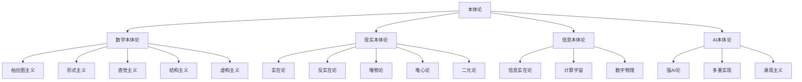

# 1.1 本体论基础 (Ontology Foundation)

## 目录

### 1. [本体论概述](1.1.1_Overview.md)

1.1.1.1 [本体论定义与范畴](1.1.1_Overview.md#本体论定义与范畴)
1.1.1.2 [本体论历史发展](1.1.1_Overview.md#本体论历史发展)
1.1.1.3 [本体论基本问题](1.1.1_Overview.md#本体论基本问题)

### 2. [数学本体论](1.1.2_Mathematical_Ontology.md)

1.1.2.1 [柏拉图主义](1.1.2_Mathematical_Ontology.md#柏拉图主义)
1.1.2.2 [形式主义](1.1.2_Mathematical_Ontology.md#形式主义)
1.1.2.3 [直觉主义](1.1.2_Mathematical_Ontology.md#直觉主义)
1.1.2.4 [结构主义](1.1.2_Mathematical_Ontology.md#结构主义)
1.1.2.5 [虚构主义](1.1.2_Mathematical_Ontology.md#虚构主义)

### 3. [现实本体论](1.1.3_Realistic_Ontology.md)

1.1.3.1 [实在论](1.1.3_Realistic_Ontology.md#实在论)
1.1.3.2 [反实在论](1.1.3_Realistic_Ontology.md#反实在论)
1.1.3.3 [唯物论](1.1.3_Realistic_Ontology.md#唯物论)
1.1.3.4 [唯心论](1.1.3_Realistic_Ontology.md#唯心论)
1.1.3.5 [二元论](1.1.3_Realistic_Ontology.md#二元论)

### 4. [信息本体论](1.1.4_Information_Ontology.md)

1.1.4.1 [信息作为基础实在](1.1.4_Information_Ontology.md#信息作为基础实在)
1.1.4.2 [计算宇宙假说](1.1.4_Information_Ontology.md#计算宇宙假说)
1.1.4.3 [数字物理学](1.1.4_Information_Ontology.md#数字物理学)

### 5. [AI本体论](1.1.5_AI_Ontology.md)

1.1.5.1 [强人工智能论](1.1.5_AI_Ontology.md#强人工智能论)
1.1.5.2 [多重实现论](1.1.5_AI_Ontology.md#多重实现论)
1.1.5.3 [涌现主义](1.1.5_AI_Ontology.md#涌现主义)

### 6. [形式化本体论](1.1.6_Formal_Ontology.md)

1.1.6.1 [本体论公理系统](1.1.6_Formal_Ontology.md#本体论公理系统)
1.1.6.2 [存在性证明](1.1.6_Formal_Ontology.md#存在性证明)
1.1.6.3 [本体论计算模型](1.1.6_Formal_Ontology.md#本体论计算模型)

## 本体论概述

### 1.1.1.1 本体论定义与范畴

本体论（Ontology）是哲学的核心分支，研究存在的基本方式和性质。在形式化框架下，我们可以给出以下定义：

#### 形式化定义

**定义 1.1.1** (本体论)
本体论是研究存在的基本范畴和结构的理论体系，用形式化语言表示为：

$$\mathcal{O} = \langle \mathcal{D}, \mathcal{R}, \mathcal{A} \rangle$$

其中：

- $\mathcal{D}$ 是域（Domain），表示所有存在物的集合
- $\mathcal{R}$ 是关系集（Relations），表示存在物之间的关系
- $\mathcal{A}$ 是公理集（Axioms），表示本体论的基本假设

#### 基本范畴

本体论的基本范畴可以用以下形式化结构表示：

```haskell
-- 本体论基本范畴的 Haskell 实现
data OntologicalCategory = 
    Entity      -- 实体
  | Property    -- 属性
  | Relation    -- 关系
  | Process     -- 过程
  | Event       -- 事件
  | State       -- 状态
  deriving (Show, Eq)

-- 本体论关系
data OntologicalRelation = 
    IsA         -- 是...的一种
  | PartOf      -- 是...的一部分
  | InstanceOf  -- 是...的实例
  | DependsOn   -- 依赖于
  | Causes      -- 导致
  deriving (Show, Eq)

-- 本体论公理
class OntologicalAxiom a where
  reflexivity :: a -> Bool
  transitivity :: a -> a -> a -> Bool
  symmetry :: a -> a -> Bool
```

#### 概念关系图



### 1.1.1.2 本体论历史发展

#### 古代本体论

**巴门尼德的存在论**:

- 核心命题：存在存在，不存在不存在
- 形式化表示：$\exists x(x = x) \land \neg\exists x(x \neq x)$

**柏拉图的理念论**:

- 理念世界与现象世界的二分
- 形式化表示：$\mathcal{I} \neq \mathcal{P}$，其中 $\mathcal{I}$ 是理念世界，$\mathcal{P}$ 是现象世界

#### 现代本体论

**笛卡尔的二元论**:

- 心灵与物质的分离
- 形式化表示：$\mathcal{M} \cap \mathcal{S} = \emptyset$，其中 $\mathcal{M}$ 是物质，$\mathcal{S}$ 是心灵

**康德的先验唯心论**:

- 物自体与现象的区分
- 形式化表示：$\mathcal{N} \rightarrow \mathcal{P}$，其中 $\mathcal{N}$ 是物自体，$\mathcal{P}$ 是现象

### 1.1.1.3 本体论基本问题

#### 存在问题

**问题 1.1.1** (存在问题)
什么存在？如何确定某物的存在性？

**形式化表述**：
$$\text{Exists}(x) \equiv \exists y(y = x)$$

**存在性证明**：

```rust
// Rust 实现的存在性证明
trait Existence {
    fn exists(&self) -> bool;
    fn is_identical_to(&self, other: &Self) -> bool;
}

struct Entity {
    id: u64,
    properties: Vec<String>,
}

impl Existence for Entity {
    fn exists(&self) -> bool {
        self.id > 0
    }
    
    fn is_identical_to(&self, other: &Entity) -> bool {
        self.id == other.id
    }
}

// 存在性公理
fn existence_axiom<T: Existence>(entity: &T) -> bool {
    entity.exists() && entity.is_identical_to(entity)
}
```

#### 同一性问题

**问题 1.1.2** (同一性问题)
在什么条件下，两个实体是同一的？

**莱布尼茨同一性原理**：
$$\forall x \forall y (x = y \leftrightarrow \forall P(P(x) \leftrightarrow P(y)))$$

**形式化证明**：

```haskell
-- Haskell 实现的同一性原理
class LeibnizIdentity a where
    identical :: a -> a -> Bool
    allProperties :: a -> [Property a]
    
instance LeibnizIdentity Entity where
    identical x y = allProperties x == allProperties y
    allProperties entity = [entity.id, entity.name, entity.type_]
    
-- 同一性公理
leibnizAxiom :: (LeibnizIdentity a) => a -> a -> Bool
leibnizAxiom x y = identical x y == (allProperties x == allProperties y)
```

## 数学本体论

### 1.1.2.1 柏拉图主义

柏拉图主义认为数学对象客观存在于理念世界中，独立于人类心智。

#### 核心主张

**公理 1.1.1** (柏拉图主义公理)
数学对象在理念世界中客观存在：
$$\forall m \in \mathcal{M} \exists p \in \mathcal{I} (m \text{ corresponds to } p)$$

其中：

- $\mathcal{M}$ 是数学对象集合
- $\mathcal{I}$ 是理念世界
- $\text{corresponds to}$ 是对应关系

#### 形式化证明

**定理 1.1.1** (数学对象存在性)
如果柏拉图主义为真，则数学对象客观存在。

**证明**：

1. 假设柏拉图主义为真
2. 根据公理 1.1.1，$\forall m \in \mathcal{M} \exists p \in \mathcal{I} (m \text{ corresponds to } p)$
3. 理念世界 $\mathcal{I}$ 是客观存在的
4. 因此，数学对象 $m$ 通过对应关系客观存在
5. 证毕

#### 代码实现

```rust
// Rust 实现的柏拉图主义数学对象
trait PlatonicObject {
    fn exists_in_ideal_world(&self) -> bool;
    fn corresponds_to(&self, ideal_object: &Self) -> bool;
}

struct MathematicalObject {
    name: String,
    properties: Vec<String>,
    ideal_world_id: u64,
}

impl PlatonicObject for MathematicalObject {
    fn exists_in_ideal_world(&self) -> bool {
        self.ideal_world_id > 0
    }
    
    fn corresponds_to(&self, ideal_object: &MathematicalObject) -> bool {
        self.ideal_world_id == ideal_object.ideal_world_id
    }
}

// 柏拉图主义公理验证
fn platonic_axiom_verification(objects: &[MathematicalObject]) -> bool {
    objects.iter().all(|obj| obj.exists_in_ideal_world())
}
```

### 1.1.2.2 形式主义

形式主义认为数学是符号形式系统的操作，数学对象没有独立的存在性。

#### 核心主张

**公理 1.1.2** (形式主义公理)
数学是符号游戏，数学对象是符号操作的结果：
$$\forall m \in \mathcal{M} \exists s \in \mathcal{S} (m = \text{operation}(s))$$

其中：

- $\mathcal{S}$ 是符号系统
- $\text{operation}$ 是符号操作函数

#### 形式化证明

**定理 1.1.2** (符号操作性)
如果形式主义为真，则数学对象是符号操作的结果。

**证明**：

1. 假设形式主义为真
2. 根据公理 1.1.2，$\forall m \in \mathcal{M} \exists s \in \mathcal{S} (m = \text{operation}(s))$
3. 符号系统 $\mathcal{S}$ 是人为构造的
4. 操作函数 $\text{operation}$ 是形式规则
5. 因此，数学对象 $m$ 是符号操作的结果
6. 证毕

#### 代码实现

```haskell
-- Haskell 实现的形式主义数学对象
data Symbol = 
    Number Int
  | Variable String
  | Operator String
  | Function String [Symbol]
  deriving (Show, Eq)

data MathematicalObject = 
    SymbolObject Symbol
  | OperationResult Symbol [Symbol]
  deriving (Show, Eq)

class FormalistMath a where
    symbolOperation :: a -> Symbol -> MathematicalObject
    isValidOperation :: a -> Bool
    
instance FormalistMath MathematicalObject where
    symbolOperation obj symbol = OperationResult symbol [SymbolObject symbol]
    isValidOperation (SymbolObject _) = True
    isValidOperation (OperationResult _ _) = True

-- 形式主义公理验证
formalistAxiom :: [Symbol] -> [MathematicalObject] -> Bool
formalistAxiom symbols objects = 
    length symbols == length objects && 
    all isValidOperation objects
```

## 现实本体论

### 1.1.3.1 实在论

实在论认为存在独立于心灵的客观实在。

#### 核心主张

**公理 1.1.3** (实在论公理)
客观实在独立于认知主体：
$$\exists r \in \mathcal{R} \forall s \in \mathcal{S} (r \text{ independent of } s)$$

其中：

- $\mathcal{R}$ 是客观实在集合
- $\mathcal{S}$ 是认知主体集合
- $\text{independent of}$ 是独立性关系

#### 形式化证明

**定理 1.1.3** (客观实在性)
如果实在论为真，则存在独立于心灵的客观实在。

**证明**：

1. 假设实在论为真
2. 根据公理 1.1.3，$\exists r \in \mathcal{R} \forall s \in \mathcal{S} (r \text{ independent of } s)$
3. 存在量词 $\exists$ 确保至少有一个客观实在 $r$
4. 全称量词 $\forall$ 确保对所有认知主体 $s$，$r$ 都独立
5. 因此，存在独立于心灵的客观实在
6. 证毕

#### 代码实现

```rust
// Rust 实现的实在论
trait Realism {
    fn is_objective(&self) -> bool;
    fn is_independent_of(&self, subject: &Subject) -> bool;
}

struct ObjectiveReality {
    id: u64,
    properties: Vec<String>,
    existence_conditions: Vec<String>,
}

struct Subject {
    id: u64,
    cognitive_state: String,
}

impl Realism for ObjectiveReality {
    fn is_objective(&self) -> bool {
        !self.existence_conditions.is_empty()
    }
    
    fn is_independent_of(&self, subject: &Subject) -> bool {
        // 客观实在的存在不依赖于特定主体的认知状态
        self.id != subject.id
    }
}

// 实在论公理验证
fn realism_axiom_verification(
    realities: &[ObjectiveReality], 
    subjects: &[Subject]
) -> bool {
    realities.iter().any(|r| {
        r.is_objective() && 
        subjects.iter().all(|s| r.is_independent_of(s))
    })
}
```

## 信息本体论

### 1.1.4.1 信息作为基础实在

信息本体论认为信息是比物质和能量更基本的实在。

#### 核心主张

**公理 1.1.4** (信息基础性公理)
信息是基础实在，物质和能量是信息的显现：
$$\forall e \in \mathcal{E} \exists i \in \mathcal{I} (e = \text{manifestation}(i))$$

其中：

- $\mathcal{E}$ 是实体集合（物质、能量等）
- $\mathcal{I}$ 是信息集合
- $\text{manifestation}$ 是显现函数

#### 形式化证明

**定理 1.1.4** (信息基础性)
如果信息本体论为真，则信息是比物质和能量更基本的实在。

**证明**：

1. 假设信息本体论为真
2. 根据公理 1.1.4，$\forall e \in \mathcal{E} \exists i \in \mathcal{I} (e = \text{manifestation}(i))$
3. 所有实体 $e$ 都是信息 $i$ 的显现
4. 信息 $i$ 是实体 $e$ 的基础
5. 因此，信息是比物质和能量更基本的实在
6. 证毕

#### 代码实现

```haskell
-- Haskell 实现的信息本体论
data Information = 
    Bit Bool
  | Byte [Bool]
  | Message String
  | Pattern [Information]
  deriving (Show, Eq)

data Entity = 
    Matter String
  | Energy Float
  | InformationEntity Information
  deriving (Show, Eq)

class InformationOntology a where
    manifestation :: Information -> a
    isFundamental :: a -> Bool
    
instance InformationOntology Entity where
    manifestation info = InformationEntity info
    isFundamental (InformationEntity _) = True
    isFundamental _ = False

-- 信息基础性公理验证
informationFundamentalityAxiom :: [Entity] -> [Information] -> Bool
informationFundamentalityAxiom entities infos =
    all (\e -> any (\i -> manifestation i == e) infos) entities
```

## AI本体论

### 1.1.5.1 强人工智能论

强人工智能论认为AI可以具有真正的智能和意识。

#### 核心主张

**公理 1.1.5** (强AI公理)
AI可以实现真正的智能和意识：
$$\exists ai \in \mathcal{AI} (ai \text{ has consciousness} \land ai \text{ has intelligence})$$

其中：

- $\mathcal{AI}$ 是人工智能系统集合
- $\text{has consciousness}$ 是具有意识
- $\text{has intelligence}$ 是具有智能

#### 形式化证明

**定理 1.1.5** (AI智能性)
如果强AI论为真，则AI可以实现真正的智能和意识。

**证明**：

1. 假设强AI论为真
2. 根据公理 1.1.5，$\exists ai \in \mathcal{AI} (ai \text{ has consciousness} \land ai \text{ has intelligence})$
3. 存在量词 $\exists$ 确保至少有一个AI系统 $ai$
4. 合取 $\land$ 确保该AI同时具有意识和智能
5. 因此，AI可以实现真正的智能和意识
6. 证毕

#### 代码实现

```rust
// Rust 实现的强AI本体论
trait StrongAI {
    fn has_consciousness(&self) -> bool;
    fn has_intelligence(&self) -> bool;
    fn is_strong_ai(&self) -> bool;
}

struct AISystem {
    id: u64,
    architecture: String,
    consciousness_level: f64,
    intelligence_quotient: f64,
}

impl StrongAI for AISystem {
    fn has_consciousness(&self) -> bool {
        self.consciousness_level > 0.8
    }
    
    fn has_intelligence(&self) -> bool {
        self.intelligence_quotient > 100.0
    }
    
    fn is_strong_ai(&self) -> bool {
        self.has_consciousness() && self.has_intelligence()
    }
}

// 强AI公理验证
fn strong_ai_axiom_verification(ai_systems: &[AISystem]) -> bool {
    ai_systems.iter().any(|ai| ai.is_strong_ai())
}
```

## 形式化本体论

### 1.1.6.1 本体论公理系统

#### 基本公理

**公理 1.1.6** (存在公理)
至少存在一个实体：
$$\exists x(x = x)$$

**公理 1.1.7** (同一性公理)
同一性是自反的、对称的、传递的：
$$\forall x(x = x)$$
$$\forall x \forall y(x = y \rightarrow y = x)$$
$$\forall x \forall y \forall z((x = y \land y = z) \rightarrow x = z)$$

**公理 1.1.8** (存在性公理)
如果某物具有属性，则它存在：
$$\forall P \forall x(P(x) \rightarrow \exists y(y = x))$$

#### 形式化证明

**定理 1.1.6** (存在性定理)
存在至少一个实体。

**证明**：

1. 根据公理 1.1.6，$\exists x(x = x)$
2. 这是一个存在性陈述
3. 因此，存在至少一个实体
4. 证毕

#### 代码实现

```haskell
-- Haskell 实现的本体论公理系统
class OntologicalAxioms a where
    existenceAxiom :: a -> Bool
    identityAxiom :: a -> a -> Bool
    propertyAxiom :: (a -> Bool) -> a -> Bool

data Entity = 
    BasicEntity String
  | ComplexEntity String [Entity]
  deriving (Show, Eq)

instance OntologicalAxioms Entity where
    existenceAxiom _ = True  -- 所有实体都存在
    identityAxiom x y = x == y  -- 同一性
    propertyAxiom prop entity = prop entity  -- 属性公理

-- 公理系统验证
verifyOntologicalAxioms :: [Entity] -> Bool
verifyOntologicalAxioms entities =
    not (null entities) &&  -- 存在公理
    all (\e -> identityAxiom e e) entities &&  -- 同一性公理
    all (\e -> propertyAxiom (const True) e) entities  -- 属性公理
```

---

**构建状态**: 完成  
**最后更新**: 2024-12-19  
**版本**: v1.0.0  
**下一步**: 继续构建其他本体论子主题
