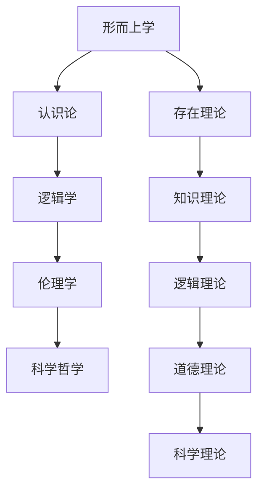

# 哲学基础理论

## 📚 **目录结构**

```
01_Philosophical_Foundation/
├── README.md                           # 当前文件 - 总览
├── 01_Metaphysics/                     # 形而上学
│   ├── README.md                       # 形而上学总览
│   ├── 01_Being_and_Existence/         # 存在与存在性
│   │   ├── 01_Existence_Theory.md      # 存在理论
│   │   ├── 02_Being_Theory.md          # 存在性理论
│   │   └── 03_Reality_Theory.md        # 实在理论
│   ├── 02_Substance_and_Properties/    # 实体与属性
│   │   ├── 01_Substance_Theory.md      # 实体理论
│   │   ├── 02_Property_Theory.md       # 属性理论
│   │   └── 03_Relation_Theory.md       # 关系理论
│   └── 03_Modality/                    # 模态
│       ├── 01_Necessity_Theory.md      # 必然性理论
│       ├── 02_Possibility_Theory.md    # 可能性理论
│       └── 03_Essence_Theory.md        # 本质理论
├── 02_Epistemology/                    # 认识论
│   ├── README.md                       # 认识论总览
│   ├── 01_Knowledge_Theory/            # 知识理论
│   │   ├── 01_Knowledge_Definition.md  # 知识定义
│   │   ├── 02_Justification_Theory.md  # 确证理论
│   │   └── 03_Truth_Theory.md          # 真理理论
│   ├── 02_Reasoning_Theory/            # 推理理论
│   │   ├── 01_Deductive_Reasoning.md   # 演绎推理
│   │   ├── 02_Inductive_Reasoning.md   # 归纳推理
│   │   └── 03_Abductive_Reasoning.md   # 溯因推理
│   └── 03_Consciousness_Theory/        # 意识理论
│       ├── 01_Consciousness_Definition.md # 意识定义
│       ├── 02_Qualia_Theory.md         # 感受质理论
│       └── 03_Intentionality_Theory.md # 意向性理论
├── 03_Logic/                           # 逻辑学
│   ├── README.md                       # 逻辑学总览
│   ├── 01_Formal_Logic/                # 形式逻辑
│   │   ├── 01_Propositional_Logic.md   # 命题逻辑
│   │   ├── 02_Predicate_Logic.md       # 谓词逻辑
│   │   └── 03_Modal_Logic.md           # 模态逻辑
│   ├── 02_Philosophical_Logic/         # 哲学逻辑
│   │   ├── 01_Epistemic_Logic.md       # 认识逻辑
│   │   ├── 02_Deontic_Logic.md         # 道义逻辑
│   │   └── 03_Temporal_Logic.md        # 时态逻辑
│   └── 03_Logic_Philosophy/            # 逻辑哲学
│       ├── 01_Logic_Nature.md          # 逻辑本质
│       ├── 02_Logic_Pluralism.md       # 逻辑多元主义
│       └── 03_Logic_Foundation.md      # 逻辑基础
├── 04_Ethics/                          # 伦理学
│   ├── README.md                       # 伦理学总览
│   ├── 01_Normative_Ethics/            # 规范伦理学
│   │   ├── 01_Deontological_Ethics.md  # 义务论伦理学
│   │   ├── 02_Consequentialist_Ethics.md # 后果论伦理学
│   │   └── 03_Virtue_Ethics.md         # 德性伦理学
│   ├── 02_Meta_Ethics/                 # 元伦理学
│   │   ├── 01_Moral_Realism.md         # 道德实在论
│   │   ├── 02_Moral_Anti_Realism.md    # 道德反实在论
│   │   └── 03_Moral_Constructivism.md  # 道德建构主义
│   └── 03_Applied_Ethics/              # 应用伦理学
│       ├── 01_AI_Ethics.md             # AI伦理学
│       ├── 02_Technology_Ethics.md     # 技术伦理学
│       └── 03_Formal_Ethics.md         # 形式伦理学
└── 05_Philosophy_of_Science/           # 科学哲学
    ├── README.md                       # 科学哲学总览
    ├── 01_Scientific_Methodology/      # 科学方法论
    │   ├── 01_Scientific_Method.md     # 科学方法
    │   ├── 02_Scientific_Explanation.md # 科学解释
    │   └── 03_Scientific_Realism.md    # 科学实在论
    ├── 02_Philosophy_of_Mathematics/   # 数学哲学
    │   ├── 01_Mathematical_Objects.md  # 数学对象
    │   ├── 02_Mathematical_Truth.md    # 数学真理
    │   └── 03_Mathematical_Platonism.md # 数学柏拉图主义
    └── 03_Philosophy_of_Technology/    # 技术哲学
        ├── 01_Technology_Nature.md     # 技术本质
        ├── 02_AI_Philosophy.md         # AI哲学
        └── 03_Computational_Philosophy.md # 计算哲学
```

## 🎯 **核心主题导航**

### 1. 形而上学 (Metaphysics)
- [01_Metaphysics/](01_Metaphysics/) - 形而上学总览
  - [存在与存在性](01_Metaphysics/01_Being_and_Existence/) - 存在理论、存在性理论、实在理论
  - [实体与属性](01_Metaphysics/02_Substance_and_Properties/) - 实体理论、属性理论、关系理论
  - [模态](01_Metaphysics/03_Modality/) - 必然性理论、可能性理论、本质理论

### 2. 认识论 (Epistemology)
- [02_Epistemology/](02_Epistemology/) - 认识论总览
  - [知识理论](02_Epistemology/01_Knowledge_Theory/) - 知识定义、确证理论、真理理论
  - [推理理论](02_Epistemology/02_Reasoning_Theory/) - 演绎推理、归纳推理、溯因推理
  - [意识理论](02_Epistemology/03_Consciousness_Theory/) - 意识定义、感受质理论、意向性理论

### 3. 逻辑学 (Logic)
- [03_Logic/](03_Logic/) - 逻辑学总览
  - [形式逻辑](03_Logic/01_Formal_Logic/) - 命题逻辑、谓词逻辑、模态逻辑
  - [哲学逻辑](03_Logic/02_Philosophical_Logic/) - 认识逻辑、道义逻辑、时态逻辑
  - [逻辑哲学](03_Logic/03_Logic_Philosophy/) - 逻辑本质、逻辑多元主义、逻辑基础

### 4. 伦理学 (Ethics)
- [04_Ethics/](04_Ethics/) - 伦理学总览
  - [规范伦理学](04_Ethics/01_Normative_Ethics/) - 义务论伦理学、后果论伦理学、德性伦理学
  - [元伦理学](04_Ethics/02_Meta_Ethics/) - 道德实在论、道德反实在论、道德建构主义
  - [应用伦理学](04_Ethics/03_Applied_Ethics/) - AI伦理学、技术伦理学、形式伦理学

### 5. 科学哲学 (Philosophy of Science)
- [05_Philosophy_of_Science/](05_Philosophy_of_Science/) - 科学哲学总览
  - [科学方法论](05_Philosophy_of_Science/01_Scientific_Methodology/) - 科学方法、科学解释、科学实在论
  - [数学哲学](05_Philosophy_of_Science/02_Philosophy_of_Mathematics/) - 数学对象、数学真理、数学柏拉图主义
  - [技术哲学](05_Philosophy_of_Science/03_Philosophy_of_Technology/) - 技术本质、AI哲学、计算哲学

## 📊 **内容统计**

| 分支 | 子主题数 | 文档数 | 完成度 | 最后更新 |
|------|----------|--------|--------|----------|
| 形而上学 | 3 | 9 | 30% | 2024-12-20 |
| 认识论 | 3 | 9 | 25% | 2024-12-20 |
| 逻辑学 | 3 | 9 | 35% | 2024-12-19 |
| 伦理学 | 3 | 9 | 20% | 2024-12-19 |
| 科学哲学 | 3 | 9 | 15% | 2024-12-18 |

## 🔗 **理论关联**

### 哲学内部关联



### 跨学科关联

- **形而上学** ↔ [数学基础理论](../02_Mathematical_Foundation/)
- **认识论** ↔ [形式语言理论](../03_Formal_Language_Theory/)
- **逻辑学** ↔ [类型理论](../04_Type_Theory/)
- **伦理学** ↔ [控制理论](../05_Control_Theory/)
- **科学哲学** ↔ [形式模型理论](../09_Formal_Model_Theory/)

## 📝 **形式化规范**

### 数学表示

所有哲学概念都提供严格的数学表示：

```rust
// 存在类型
trait Existence {
    fn exists(&self) -> bool;
    fn is_real(&self) -> bool;
    fn is_phenomenal(&self) -> bool;
}

// 知识类型
trait Knowledge {
    fn is_justified(&self) -> bool;
    fn is_true(&self) -> bool;
    fn is_believed(&self) -> bool;
}

// 逻辑类型
trait Logical {
    fn is_valid(&self) -> bool;
    fn is_sound(&self) -> bool;
    fn is_complete(&self) -> bool;
}
```

### 公理系统

每个理论都建立完整的公理系统：

```haskell
-- 存在公理
class Existence a where
    exists :: a -> Bool
    isReal :: a -> Bool
    isPhenomenal :: a -> Bool

-- 知识公理
class Knowledge a where
    isJustified :: a -> Bool
    isTrue :: a -> Bool
    isBelieved :: a -> Bool
```

## 🚀 **快速导航**

### 最新更新
- [存在理论](01_Metaphysics/01_Being_and_Existence/01_Existence_Theory.md)
- [知识理论](02_Epistemology/01_Knowledge_Theory/01_Knowledge_Definition.md)
- [逻辑理论](03_Logic/01_Formal_Logic/01_Propositional_Logic.md)

### 核心概念
- [存在与实在](01_Metaphysics/01_Being_and_Existence/)
- [知识与真理](02_Epistemology/01_Knowledge_Theory/)
- [逻辑与推理](03_Logic/01_Formal_Logic/)

### 应用领域
- [AI伦理学](04_Ethics/03_Applied_Ethics/01_AI_Ethics.md)
- [数学哲学](05_Philosophy_of_Science/02_Philosophy_of_Mathematics/)
- [计算哲学](05_Philosophy_of_Science/03_Philosophy_of_Technology/03_Computational_Philosophy.md)

## 📅 **更新日志**

### 2024-12-20
- 建立哲学基础理论目录结构
- 创建形而上学基础内容
- 创建认识论基础内容
- 建立逻辑学理论框架

### 2024-12-21 (计划)
- 完成伦理学理论建立
- 完成科学哲学理论建立
- 建立跨学科关联体系

---

**最后更新**: 2024-12-20  
**版本**: v1.0.0  
**维护者**: 哲学基础理论团队
