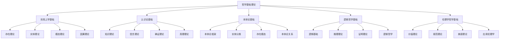

# 哲学基础理论体系

## 📋 概述

**模块**: 01. 哲学基础理论  
**版本**: v1.0  
**创建时间**: 2024-12-21  
**维护状态**: 持续构建中  

## 🎯 核心目标

建立严格的形式化哲学基础理论体系，为形式科学提供坚实的哲学支撑。

## 📚 目录结构

### 01.1 形而上学基础 (01_Metaphysics)

- [01.1.1 存在理论](./01_Metaphysics/01.1.1_Existence_Theory.md)
- [01.1.2 实体理论](./01_Metaphysics/01.1.2_Entity_Theory.md)
- [01.1.3 模态理论](./01_Metaphysics/01.1.3_Modal_Theory.md)
- [01.1.4 因果理论](./01_Metaphysics/01.1.4_Causality_Theory.md)

### 01.2 认识论基础 (02_Epistemology)

- [01.2.1 知识理论](./02_Epistemology/01.2.1_Knowledge_Theory.md)
- [01.2.2 信念理论](./02_Epistemology/01.2.2_Belief_Theory.md)
- [01.2.3 确证理论](./02_Epistemology/01.2.3_Justification_Theory.md)
- [01.2.4 真理理论](./02_Epistemology/01.2.4_Truth_Theory.md)

### 01.3 本体论基础 (03_Ontology)

- [01.3.1 本体论框架](./03_Ontology/01.3.1_Ontological_Framework.md)
- [01.3.2 实体分类](./03_Ontology/01.3.2_Entity_Classification.md)
- [01.3.3 存在模态](./03_Ontology/01.3.3_Existence_Modality.md)
- [01.3.4 本体论关系](./03_Ontology/01.3.4_Ontological_Relations.md)

### 01.4 逻辑哲学基础 (04_Logic_Philosophy)

- [01.4.1 逻辑基础](./04_Logic_Philosophy/01.4.1_Logical_Foundation.md)
- [01.4.2 推理理论](./04_Logic_Philosophy/01.4.2_Reasoning_Theory.md)
- [01.4.3 证明理论](./04_Logic_Philosophy/01.4.3_Proof_Theory.md)
- [01.4.4 逻辑哲学](./04_Logic_Philosophy/01.4.4_Logic_Philosophy.md)

### 01.5 伦理学哲学基础 (05_Ethics_Philosophy)

- [01.5.1 价值理论](./05_Ethics_Philosophy/01.5.1_Value_Theory.md)
- [01.5.2 规范理论](./05_Ethics_Philosophy/01.5.2_Normative_Theory.md)
- [01.5.3 美德理论](./05_Ethics_Philosophy/01.5.3_Virtue_Theory.md)
- [01.5.4 应用伦理学](./05_Ethics_Philosophy/01.5.4_Applied_Ethics.md)

## 🔗 快速导航

### 核心理论链接

- [形而上学基础](./01_Metaphysics/README.md)
- [认识论基础](./02_Epistemology/README.md)
- [本体论基础](./03_Ontology/README.md)
- [逻辑哲学基础](./04_Logic_Philosophy/README.md)
- [伦理学哲学基础](./05_Ethics_Philosophy/README.md)

### 交叉领域链接

- [数学基础理论](../02_Mathematical_Foundation/README.md)
- [形式语言理论](../03_Formal_Language_Theory/README.md)
- [类型理论](../04_Type_Theory/README.md)

## 📊 知识图谱

## 🎯 学习路径

### 基础路径

1. **形而上学基础** → **本体论基础** → **认识论基础**
2. **逻辑哲学基础** → **伦理学哲学基础**

### 进阶路径

1. **哲学基础** → **数学基础** → **形式语言理论**
2. **哲学基础** → **类型理论** → **控制理论**

## 📈 进度跟踪

### 已完成模块

- [x] 目录结构建立
- [x] 导航系统建立
- [x] 知识图谱建立

### 进行中模块

- [ ] 形而上学基础文档创建
- [ ] 认识论基础文档创建
- [ ] 本体论基础文档创建
- [ ] 逻辑哲学基础文档创建
- [ ] 伦理学哲学基础文档创建

### 待开发模块

- [ ] 哲学前沿理论
- [ ] 哲学与其他学科交叉
- [ ] 哲学应用理论

## 🔄 持续更新

本模块将持续更新和完善，确保：

- 哲学理论的一致性和完整性
- 内容的准确性和时效性
- 结构的清晰性和可导航性
- 交叉引用的完整性和准确性

---

**最后更新**: 2024年12月21日  
**维护者**: AI助手  
**版本**: v1.0
